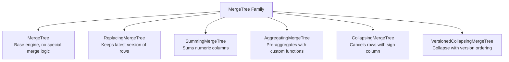
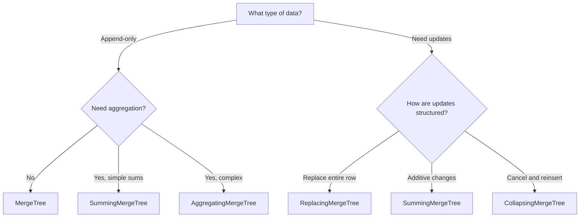

# How to Choose the Right ClickHouse Table Engine

Author: [nawazdhandala](https://www.github.com/nawazdhandala)

Tags: ClickHouse, MergeTree, Database, Table Engines, ReplacingMergeTree, AggregatingMergeTree, SummingMergeTree, Analytics

Description: A comprehensive comparison of ClickHouse table engines including MergeTree, ReplacingMergeTree, SummingMergeTree, AggregatingMergeTree, and CollapsingMergeTree, with guidance on when to use each.

---

ClickHouse offers multiple table engines, each optimized for different use cases. Choosing the right engine affects storage efficiency, query performance, and how you model your data. This guide breaks down the MergeTree family and helps you pick the right one.

## The MergeTree Family

All production ClickHouse tables should use a MergeTree variant. These engines share core functionality but differ in how they handle data during background merges.



## MergeTree: The Foundation

Standard MergeTree is the default choice. It stores data as-is and merges parts in the background for efficiency.

```sql
CREATE TABLE events
(
    timestamp DateTime,
    event_type String,
    user_id UInt64,
    value Float64
)
ENGINE = MergeTree()
PARTITION BY toYYYYMM(timestamp)
ORDER BY (event_type, user_id, timestamp);
```

### When to Use MergeTree

- **Append-only data**: Logs, events, metrics where you never update
- **Simple analytics**: COUNT, SUM, AVG queries across raw data
- **Full data retention**: When you need access to every individual record

### Characteristics

- Every INSERT creates a new part
- Parts merge in the background
- No deduplication or aggregation during merge
- Fastest insert performance

## ReplacingMergeTree: Keeping Latest Versions

ReplacingMergeTree removes duplicate rows during merges, keeping only the latest version based on a version column.

```sql
CREATE TABLE users
(
    user_id UInt64,
    name String,
    email String,
    updated_at DateTime
)
ENGINE = ReplacingMergeTree(updated_at)
ORDER BY user_id;
```

### How It Works

During background merges, ClickHouse:
1. Groups rows by the ORDER BY columns
2. Keeps only the row with the highest version column
3. Discards older versions

```sql
-- Insert initial record
INSERT INTO users VALUES (1, 'Alice', 'alice@example.com', '2024-01-01 00:00:00');

-- Update the record (insert new version)
INSERT INTO users VALUES (1, 'Alice Smith', 'alice.smith@example.com', '2024-01-15 00:00:00');

-- Before merge: both rows exist
SELECT * FROM users WHERE user_id = 1;
-- Returns 2 rows

-- After merge: only latest remains
-- To force seeing deduplicated view:
SELECT * FROM users FINAL WHERE user_id = 1;
-- Returns 1 row with updated data
```

### The FINAL Modifier

`FINAL` forces deduplication at query time:

```sql
-- Without FINAL: may return duplicates from unmerged parts
SELECT * FROM users WHERE user_id = 1;

-- With FINAL: always returns deduplicated results
SELECT * FROM users FINAL WHERE user_id = 1;
```

FINAL has performance overhead. For better performance, use subqueries:

```sql
-- More efficient than FINAL for aggregations
SELECT
    user_id,
    argMax(name, updated_at) AS name,
    argMax(email, updated_at) AS email
FROM users
GROUP BY user_id;
```

### When to Use ReplacingMergeTree

- **Dimension tables**: User profiles, product catalogs
- **State tracking**: Current status of entities
- **CDC data**: When receiving change data capture events

## SummingMergeTree: Automatic Aggregation

SummingMergeTree automatically sums numeric columns during merges. Perfect for pre-aggregated counters.

```sql
CREATE TABLE daily_stats
(
    date Date,
    page String,
    views UInt64,
    unique_visitors UInt64,
    total_time_ms UInt64
)
ENGINE = SummingMergeTree()
PARTITION BY toYYYYMM(date)
ORDER BY (date, page);
```

### How It Works

During merges, rows with identical ORDER BY values are combined:

```sql
-- Insert multiple incremental updates
INSERT INTO daily_stats VALUES ('2024-01-15', '/home', 100, 80, 50000);
INSERT INTO daily_stats VALUES ('2024-01-15', '/home', 150, 120, 75000);
INSERT INTO daily_stats VALUES ('2024-01-15', '/home', 50, 40, 25000);

-- Before merge: 3 rows
-- After merge: 1 row with views=300, unique_visitors=240, total_time_ms=150000
```

### Specifying Columns to Sum

By default, all numeric columns except ORDER BY columns are summed. You can specify which columns:

```sql
-- Only sum views and total_time_ms, not unique_visitors
ENGINE = SummingMergeTree((views, total_time_ms))
```

### When to Use SummingMergeTree

- **Counters and metrics**: Page views, API calls, event counts
- **Pre-aggregated rollups**: Hourly/daily summaries
- **Storage optimization**: When you only need totals, not individual events

### Caveats

- Non-numeric columns take the first encountered value
- Doesn't handle averages (sum count + sum total separately)
- Empty sums (all zeros) may be deleted

## AggregatingMergeTree: Complex Pre-Aggregation

AggregatingMergeTree stores intermediate aggregation states, enabling complex aggregations like averages, percentiles, and uniques.

```sql
CREATE TABLE hourly_metrics
(
    hour DateTime,
    service String,

    -- Aggregate state columns
    request_count AggregateFunction(count, UInt64),
    avg_latency AggregateFunction(avg, Float64),
    p99_latency AggregateFunction(quantile(0.99), Float64),
    unique_users AggregateFunction(uniq, UInt64)
)
ENGINE = AggregatingMergeTree()
PARTITION BY toYYYYMM(hour)
ORDER BY (hour, service);
```

### How to Insert

Use `-State` functions to create aggregate states:

```sql
INSERT INTO hourly_metrics
SELECT
    toStartOfHour(timestamp) AS hour,
    service,
    countState() AS request_count,
    avgState(latency_ms) AS avg_latency,
    quantileState(0.99)(latency_ms) AS p99_latency,
    uniqState(user_id) AS unique_users
FROM raw_requests
WHERE timestamp >= now() - INTERVAL 1 HOUR
GROUP BY hour, service;
```

### How to Query

Use `-Merge` functions to finalize aggregates:

```sql
SELECT
    hour,
    service,
    countMerge(request_count) AS total_requests,
    avgMerge(avg_latency) AS avg_latency_ms,
    quantileMerge(0.99)(p99_latency) AS p99_latency_ms,
    uniqMerge(unique_users) AS unique_users
FROM hourly_metrics
WHERE hour >= today()
GROUP BY hour, service
ORDER BY hour;
```

### Combining with Materialized Views

The real power comes from automatic aggregation:

```sql
-- Raw data table
CREATE TABLE requests
(
    timestamp DateTime,
    service String,
    latency_ms Float64,
    user_id UInt64
)
ENGINE = MergeTree()
ORDER BY (service, timestamp);

-- Materialized view that auto-aggregates
CREATE MATERIALIZED VIEW hourly_metrics_mv TO hourly_metrics AS
SELECT
    toStartOfHour(timestamp) AS hour,
    service,
    countState() AS request_count,
    avgState(latency_ms) AS avg_latency,
    quantileState(0.99)(latency_ms) AS p99_latency,
    uniqState(user_id) AS unique_users
FROM requests
GROUP BY hour, service;
```

Every insert to `requests` automatically updates `hourly_metrics`.

### When to Use AggregatingMergeTree

- **Complex aggregations**: Averages, percentiles, HyperLogLog counts
- **Dashboard queries**: Pre-computed metrics for fast dashboards
- **Massive scale**: When raw data is too large to query directly

## CollapsingMergeTree: Row Cancellation

CollapsingMergeTree uses a sign column to cancel out rows, enabling updates and deletes.

```sql
CREATE TABLE user_balances
(
    user_id UInt64,
    balance Decimal64(2),
    sign Int8  -- 1 for insert, -1 for cancel
)
ENGINE = CollapsingMergeTree(sign)
ORDER BY user_id;
```

### How It Works

To update a row, insert two rows: one canceling the old value, one with the new:

```sql
-- Initial balance
INSERT INTO user_balances VALUES (1, 100.00, 1);

-- Update balance from 100 to 150
INSERT INTO user_balances VALUES
    (1, 100.00, -1),  -- Cancel old
    (1, 150.00, 1);   -- Insert new
```

During merge, rows with opposite signs cancel out.

### Querying Collapsed Tables

Use SUM with sign to get correct results:

```sql
SELECT
    user_id,
    sum(balance * sign) AS current_balance
FROM user_balances
GROUP BY user_id
HAVING sum(sign) > 0;
```

### VersionedCollapsingMergeTree

When rows might arrive out of order, use the versioned variant:

```sql
CREATE TABLE user_balances
(
    user_id UInt64,
    balance Decimal64(2),
    sign Int8,
    version UInt64  -- Ensures correct ordering
)
ENGINE = VersionedCollapsingMergeTree(sign, version)
ORDER BY user_id;
```

### When to Use CollapsingMergeTree

- **Mutable data with history**: When you need to track changes
- **Financial transactions**: Debits and credits that sum to balances
- **Eventually consistent updates**: When exact point-in-time queries aren't needed

## Engine Comparison Table

| Engine | Deduplication | Aggregation | Updates | Best For |
|--------|--------------|-------------|---------|----------|
| MergeTree | None | None | Append only | Logs, events, raw data |
| ReplacingMergeTree | By ORDER BY, keeps latest | None | Via re-insert | Dimension tables, state |
| SummingMergeTree | By ORDER BY | SUM of numerics | Additive updates | Counters, totals |
| AggregatingMergeTree | By ORDER BY | Custom aggregates | Additive updates | Complex rollups |
| CollapsingMergeTree | By sign pairs | None | Via cancel+insert | Mutable data |

## Decision Flowchart



## Practical Examples

### Example 1: User Activity Tracking

Raw events (append-only) + aggregated summaries:

```sql
-- Raw events with MergeTree
CREATE TABLE user_events
(
    timestamp DateTime,
    user_id UInt64,
    event_type LowCardinality(String),
    properties Map(String, String)
)
ENGINE = MergeTree()
PARTITION BY toYYYYMM(timestamp)
ORDER BY (user_id, timestamp);

-- Daily aggregates with AggregatingMergeTree
CREATE TABLE user_daily_stats
(
    date Date,
    user_id UInt64,
    event_count AggregateFunction(count, UInt64),
    unique_events AggregateFunction(uniq, String)
)
ENGINE = AggregatingMergeTree()
ORDER BY (date, user_id);
```

### Example 2: Product Inventory

Mutable state with ReplacingMergeTree:

```sql
CREATE TABLE products
(
    product_id UInt64,
    name String,
    price Decimal64(2),
    stock_quantity UInt32,
    updated_at DateTime
)
ENGINE = ReplacingMergeTree(updated_at)
ORDER BY product_id;

-- Query with guaranteed latest data
SELECT
    product_id,
    argMax(name, updated_at) AS name,
    argMax(price, updated_at) AS price,
    argMax(stock_quantity, updated_at) AS stock
FROM products
GROUP BY product_id;
```

### Example 3: API Metrics Dashboard

Pre-aggregated metrics for fast dashboards:

```sql
CREATE TABLE api_metrics_hourly
(
    hour DateTime,
    endpoint LowCardinality(String),
    method LowCardinality(String),

    request_count AggregateFunction(count, UInt64),
    error_count AggregateFunction(countIf, UInt8),
    avg_latency AggregateFunction(avg, Float64),
    p50_latency AggregateFunction(quantile(0.5), Float64),
    p95_latency AggregateFunction(quantile(0.95), Float64),
    p99_latency AggregateFunction(quantile(0.99), Float64)
)
ENGINE = AggregatingMergeTree()
PARTITION BY toYYYYMM(hour)
ORDER BY (hour, endpoint, method);
```

## Common Mistakes

### Using ReplacingMergeTree Without FINAL

```sql
-- Wrong: May return duplicates
SELECT * FROM users WHERE user_id = 1;

-- Right: Use FINAL or argMax
SELECT * FROM users FINAL WHERE user_id = 1;

SELECT
    user_id,
    argMax(name, updated_at) AS name
FROM users
WHERE user_id = 1
GROUP BY user_id;
```

### SummingMergeTree for Averages

```sql
-- Wrong: Can't average directly
ENGINE = SummingMergeTree()
-- columns: avg_latency Float64

-- Right: Store sum and count, calculate average at query time
ENGINE = SummingMergeTree()
-- columns: latency_sum Float64, latency_count UInt64

SELECT latency_sum / latency_count AS avg_latency FROM table;
```

### AggregatingMergeTree with Wrong Functions

```sql
-- Wrong: Regular functions in aggregate columns
INSERT INTO metrics SELECT count() AS cnt ...

-- Right: State functions
INSERT INTO metrics SELECT countState() AS cnt ...
```

---

Start with MergeTree for most workloads. Move to specialized engines when you have specific needs: ReplacingMergeTree for mutable dimension data, SummingMergeTree for simple counters, and AggregatingMergeTree for complex pre-computed metrics. Match the engine to your query patterns, and ClickHouse will handle the rest.
