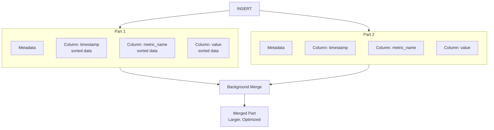

# How to Design ClickHouse Table Schemas for Time-Series Data

Author: [nawazdhandala](https://www.github.com/nawazdhandala)

Tags: ClickHouse, Time-Series, Schema Design, Database, MergeTree, Partitioning, Analytics, Performance

Description: A detailed guide to designing optimal ClickHouse table schemas for time-series workloads, covering MergeTree engines, partitioning strategies, ordering keys, and compression techniques for maximum query performance.

---

Time-series data is what ClickHouse does best. Metrics, logs, events, sensor readings - any data with a timestamp fits naturally into ClickHouse's columnar storage. But getting the schema right makes the difference between queries that take milliseconds and queries that take minutes. This guide covers the patterns that work.

## Understanding MergeTree Fundamentals

All ClickHouse time-series tables should use a MergeTree family engine. MergeTree stores data in sorted order within parts, enabling efficient range queries and aggregations.



### Basic Time-Series Table

Here's a starting point for metrics storage:

```sql
CREATE TABLE metrics
(
    timestamp DateTime,
    metric_name LowCardinality(String),
    tags Map(String, String),
    value Float64
)
ENGINE = MergeTree()
PARTITION BY toYYYYMM(timestamp)
ORDER BY (metric_name, timestamp);
```

This works, but let's understand why each choice matters and how to optimize further.

## Choosing the Right Data Types

### Timestamps

Use the most precise timestamp type you need, but no more:

```sql
-- Second precision (most common for metrics)
timestamp DateTime

-- Millisecond precision
timestamp DateTime64(3)

-- Microsecond precision (rare, uses more storage)
timestamp DateTime64(6)

-- With explicit timezone
timestamp DateTime('UTC')
```

For most time-series workloads, `DateTime` (second precision) is sufficient and uses 4 bytes per value. `DateTime64(3)` uses 8 bytes.

### Dimension Columns

Use `LowCardinality` for columns with fewer than 10,000 unique values:

```sql
-- Without LowCardinality: stores full string each time
metric_name String

-- With LowCardinality: stores dictionary + integer references
metric_name LowCardinality(String)

-- Huge compression improvement for repeated values
region LowCardinality(String)
host LowCardinality(String)
service LowCardinality(String)
```

LowCardinality dramatically reduces storage and improves query speed for dimension columns.

### Numeric Values

Choose the smallest type that fits your data:

```sql
-- For counters (always positive, large range)
value UInt64

-- For gauges (can be negative, needs decimals)
value Float64

-- For percentages (0-100, limited precision)
value Float32

-- For known small ranges
http_status UInt16
```

### Tags and Labels

For variable key-value pairs, use Maps:

```sql
-- Flexible tag storage
tags Map(String, String)

-- Query tags
WHERE tags['environment'] = 'production'
```

Maps add flexibility but can impact query performance. For frequently-queried tags, promote them to dedicated columns.

## Partitioning Strategy

Partitioning determines how ClickHouse physically organizes data on disk. Each partition becomes a separate directory.

### Time-Based Partitioning

The most common pattern for time-series:

```sql
-- Monthly partitions (good default for most workloads)
PARTITION BY toYYYYMM(timestamp)

-- Daily partitions (for high-volume, shorter retention)
PARTITION BY toYYYYMMDD(timestamp)

-- Weekly partitions
PARTITION BY toMonday(timestamp)

-- Hourly partitions (very high volume only)
PARTITION BY toStartOfHour(timestamp)
```

Choose based on:
- **Query patterns**: If you always query within a single day, daily partitions let ClickHouse skip irrelevant data faster
- **Data volume**: Aim for partitions between 10GB and 1TB each
- **Retention**: Partition by the granularity of your retention policy for easy drops

### Composite Partitioning

Sometimes you need multiple dimensions:

```sql
-- Partition by month and region
PARTITION BY (toYYYYMM(timestamp), region)

-- Partition by date and customer (multi-tenant)
PARTITION BY (toYYYYMMDD(timestamp), tenant_id)
```

Be careful with composite partitions - too many partitions degrades performance.

## ORDER BY: The Most Critical Decision

The `ORDER BY` clause defines the primary key and determines how data is sorted within each part. This is the single most important performance decision.

### Principles

1. **Put most-filtered columns first**: Columns you filter on most frequently should come first
2. **Put lower-cardinality columns before higher-cardinality**: This improves compression
3. **Put timestamp appropriately**: Usually after the primary filter columns

### Example: Metrics Table

```sql
-- Bad: Timestamp first
ORDER BY (timestamp, metric_name, host)

-- Good: Filter columns first, then timestamp
ORDER BY (metric_name, host, timestamp)
```

When you query `WHERE metric_name = 'cpu_usage' AND host = 'server-1'`, ClickHouse can locate the exact data range instantly.

### Example: Event Tracking

```sql
-- For queries filtered by user, then time
ORDER BY (user_id, event_type, timestamp)

-- For queries filtered by event type across all users
ORDER BY (event_type, timestamp, user_id)
```

### Verifying ORDER BY Effectiveness

Check if your ORDER BY works well:

```sql
-- See how many granules are read
SELECT *
FROM metrics
WHERE metric_name = 'cpu_usage'
  AND timestamp > now() - INTERVAL 1 HOUR
FORMAT Null
SETTINGS send_logs_level = 'trace';

-- Look for "Selected N/M parts" and "Selected N/M granules"
```

## Complete Schema Examples

### Metrics Storage

This schema handles standard time-series metrics:

```sql
CREATE TABLE metrics
(
    -- Time column
    timestamp DateTime CODEC(DoubleDelta, LZ4),

    -- Dimensions (what the metric describes)
    metric_name LowCardinality(String),
    host LowCardinality(String),
    region LowCardinality(String),
    service LowCardinality(String),

    -- Flexible tags
    tags Map(LowCardinality(String), String),

    -- Value
    value Float64 CODEC(Gorilla, LZ4)
)
ENGINE = MergeTree()
PARTITION BY toYYYYMM(timestamp)
ORDER BY (metric_name, host, timestamp)
TTL timestamp + INTERVAL 90 DAY
SETTINGS index_granularity = 8192;
```

Key choices:
- `DoubleDelta` codec for timestamps (stores differences of differences)
- `Gorilla` codec for float values (optimized for slowly-changing values)
- ORDER BY puts the most common filter (metric_name) first
- TTL automatically deletes old data

### Event/Log Storage

For application events or logs:

```sql
CREATE TABLE events
(
    -- Time and identification
    timestamp DateTime64(3) CODEC(DoubleDelta, LZ4),
    event_id UUID,

    -- Event classification
    event_type LowCardinality(String),
    severity LowCardinality(String),

    -- Context
    service LowCardinality(String),
    host LowCardinality(String),
    trace_id String CODEC(ZSTD(1)),

    -- Payload
    message String CODEC(ZSTD(3)),
    attributes Map(String, String) CODEC(ZSTD(1))
)
ENGINE = MergeTree()
PARTITION BY toYYYYMMDD(timestamp)
ORDER BY (service, event_type, timestamp)
TTL timestamp + INTERVAL 30 DAY
SETTINGS index_granularity = 8192;
```

### IoT Sensor Data

For high-frequency sensor readings:

```sql
CREATE TABLE sensor_readings
(
    timestamp DateTime64(3) CODEC(DoubleDelta, LZ4),
    device_id LowCardinality(String),
    sensor_type LowCardinality(String),
    location LowCardinality(String),

    -- Readings (using appropriate precision)
    temperature Float32 CODEC(Gorilla, LZ4),
    humidity Float32 CODEC(Gorilla, LZ4),
    pressure Float32 CODEC(Gorilla, LZ4),

    -- Quality indicators
    battery_level UInt8,
    signal_strength Int8
)
ENGINE = MergeTree()
PARTITION BY (toYYYYMM(timestamp), location)
ORDER BY (device_id, sensor_type, timestamp)
TTL timestamp + INTERVAL 1 YEAR
SETTINGS index_granularity = 4096;
```

Smaller `index_granularity` (4096 instead of 8192) helps with frequent point queries on specific devices.

### Financial Tick Data

For market data requiring high precision:

```sql
CREATE TABLE ticks
(
    timestamp DateTime64(6) CODEC(DoubleDelta, LZ4),
    symbol LowCardinality(String),
    exchange LowCardinality(String),

    price Decimal64(4),
    volume UInt64 CODEC(T64, LZ4),
    bid Decimal64(4),
    ask Decimal64(4),

    -- Flags
    trade_type Enum8('trade' = 1, 'quote' = 2, 'correction' = 3)
)
ENGINE = MergeTree()
PARTITION BY (toYYYYMMDD(timestamp), exchange)
ORDER BY (symbol, timestamp)
SETTINGS index_granularity = 8192;
```

## Compression Codecs

ClickHouse supports specialized codecs that dramatically reduce storage:

```sql
-- General purpose
column String CODEC(ZSTD(1))  -- Good compression, fast
column String CODEC(LZ4)      -- Faster, less compression

-- Time-series specific
timestamp DateTime CODEC(DoubleDelta)  -- For timestamps
value Float64 CODEC(Gorilla)           -- For slowly-changing floats
count UInt64 CODEC(T64)                -- For integers

-- Chained codecs (apply in order)
timestamp DateTime CODEC(DoubleDelta, LZ4)
```

### Codec Recommendations by Data Type

| Data Type | Best Codec | Use Case |
|-----------|------------|----------|
| Timestamps | DoubleDelta, LZ4 | Sequential time values |
| Counters | Delta, LZ4 | Monotonically increasing |
| Gauges (float) | Gorilla, LZ4 | Slowly changing values |
| Integers | T64, LZ4 | General integers |
| Strings | ZSTD(1) | Variable text |
| JSON/Large text | ZSTD(3) | High compression needed |

## Skip Indexes

Skip indexes help ClickHouse skip granules that don't match your query:

```sql
CREATE TABLE events
(
    timestamp DateTime,
    trace_id String,
    message String,

    -- Skip index on trace_id for point lookups
    INDEX idx_trace_id trace_id TYPE bloom_filter GRANULARITY 4,

    -- Skip index for text search
    INDEX idx_message message TYPE tokenbf_v1(32768, 3, 0) GRANULARITY 4
)
ENGINE = MergeTree()
ORDER BY timestamp;
```

Common skip index types:
- `minmax`: Stores min/max values per granule (good for ranges)
- `set(N)`: Stores unique values up to N (good for low-cardinality lookups)
- `bloom_filter`: Probabilistic membership test (good for equality checks)
- `tokenbf_v1`: Token-based bloom filter (good for text search)

## TTL for Data Lifecycle

Automatically manage data retention and tiering:

```sql
CREATE TABLE metrics
(
    timestamp DateTime,
    metric_name LowCardinality(String),
    value Float64
)
ENGINE = MergeTree()
PARTITION BY toYYYYMM(timestamp)
ORDER BY (metric_name, timestamp)

-- Delete data older than 90 days
TTL timestamp + INTERVAL 90 DAY DELETE

-- Or move to cold storage after 30 days, delete after 90
TTL timestamp + INTERVAL 30 DAY TO VOLUME 'cold',
    timestamp + INTERVAL 90 DAY DELETE;
```

## Common Mistakes

### Too Many Columns in ORDER BY

```sql
-- Bad: Too specific, poor compression
ORDER BY (timestamp, host, region, service, metric_name, user_id)

-- Good: Just the columns you filter on
ORDER BY (metric_name, host, timestamp)
```

### Wrong Column Order

```sql
-- Bad: Timestamp first (can't skip data by metric_name)
ORDER BY (timestamp, metric_name)

-- Good: Filter columns first
ORDER BY (metric_name, timestamp)
```

### Too Many Partitions

```sql
-- Bad: Creates partition per hour per host
PARTITION BY (toStartOfHour(timestamp), host)

-- Good: Simple time-based partitioning
PARTITION BY toYYYYMM(timestamp)
```

### Missing LowCardinality

```sql
-- Bad: Full string storage
host String
region String

-- Good: Dictionary encoding
host LowCardinality(String)
region LowCardinality(String)
```

## Measuring Schema Effectiveness

Check compression ratios:

```sql
SELECT
    table,
    formatReadableSize(sum(bytes_on_disk)) AS compressed,
    formatReadableSize(sum(data_uncompressed_bytes)) AS uncompressed,
    round(sum(data_uncompressed_bytes) / sum(bytes_on_disk), 2) AS ratio
FROM system.parts
WHERE active AND table = 'metrics'
GROUP BY table;
```

Check query performance:

```sql
SELECT *
FROM metrics
WHERE metric_name = 'cpu_usage'
  AND timestamp > now() - INTERVAL 1 HOUR
FORMAT Null
SETTINGS log_queries = 1;

-- Then check the query log
SELECT
    query,
    read_rows,
    read_bytes,
    result_rows,
    query_duration_ms
FROM system.query_log
WHERE query_kind = 'Select'
  AND type = 'QueryFinish'
ORDER BY event_time DESC
LIMIT 10;
```

---

Good schema design in ClickHouse is about understanding your query patterns and optimizing for them. Put your most common filter columns first in ORDER BY, use LowCardinality for dimensions, choose appropriate codecs, and partition by time at a granularity that matches your retention policy. Get these right, and ClickHouse will handle billions of rows with ease.
