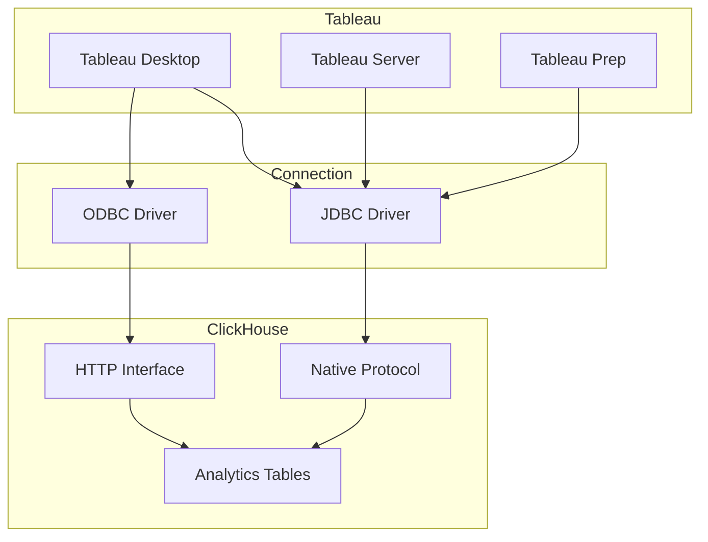

# How to Connect Tableau to ClickHouse for Enterprise Analytics

Author: [nawazdhandala](https://www.github.com/nawazdhandala)

Tags: ClickHouse, Tableau, Business Intelligence, Data Visualization, Enterprise Analytics, Dashboards

Description: A comprehensive guide to connecting Tableau to ClickHouse for enterprise-grade analytics, covering JDBC/ODBC setup, performance optimization, and dashboard best practices.

---

Tableau is the leading enterprise business intelligence platform. This guide covers integrating Tableau with ClickHouse for powerful, interactive analytics on large datasets.

## Architecture Overview



## JDBC Driver Setup

### Download and Install

```bash
# Download ClickHouse JDBC driver
wget https://github.com/ClickHouse/clickhouse-java/releases/download/v0.6.0/clickhouse-jdbc-0.6.0-all.jar

# For Tableau Desktop (macOS)
cp clickhouse-jdbc-0.6.0-all.jar ~/Library/Tableau/Drivers/

# For Tableau Desktop (Windows)
copy clickhouse-jdbc-0.6.0-all.jar "C:\Program Files\Tableau\Drivers\"

# For Tableau Server (Linux)
cp clickhouse-jdbc-0.6.0-all.jar /opt/tableau/tableau_driver/jdbc/
```

### Tableau Properties File

```properties
# clickhouse.properties
# Place in Tableau Datasources folder

[ClickHouse]
vendor = ClickHouse
driver = com.clickhouse.jdbc.ClickHouseDriver
port = 8123
protocol = http
```

### Connection String

```
jdbc:clickhouse://clickhouse.example.com:8443/analytics?ssl=true&sslmode=strict
```

## ODBC Driver Setup

### Install ODBC Driver

```bash
# macOS
brew install clickhouse-odbc

# Ubuntu/Debian
apt-get install clickhouse-odbc

# Windows - download from ClickHouse website
```

### Configure ODBC Data Source

```ini
# /etc/odbc.ini (Linux/macOS)
[ClickHouse]
Description = ClickHouse ODBC
Driver = /usr/lib/libclickhouseodbc.so
Server = clickhouse.example.com
Port = 8443
Database = analytics
Username = tableau_user
Password = secure_password
SSLMode = require
```

### Windows DSN Configuration

```
1. Open ODBC Data Sources (64-bit)
2. Add new System DSN
3. Select "ClickHouse ODBC Driver"
4. Configure:
   - Data Source Name: ClickHouse_Analytics
   - Host: clickhouse.example.com
   - Port: 8443
   - Database: analytics
   - User: tableau_user
   - SSL Mode: require
```

## ClickHouse User Configuration

```sql
-- Create Tableau user with appropriate settings
CREATE USER tableau_user
IDENTIFIED BY 'secure_password'
SETTINGS
    max_execution_time = 600,
    max_memory_usage = 20000000000,
    max_rows_to_read = 1000000000,
    readonly = 1,
    max_result_rows = 1000000;

-- Grant read access
GRANT SELECT ON analytics.* TO tableau_user;

-- Grant access to system tables for metadata
GRANT SELECT ON system.tables TO tableau_user;
GRANT SELECT ON system.columns TO tableau_user;
GRANT SELECT ON system.databases TO tableau_user;
```

## Optimizing for Tableau Queries

### Create Summary Tables

```sql
-- Pre-aggregated table for faster Tableau queries
CREATE TABLE analytics.sales_summary
ENGINE = SummingMergeTree()
ORDER BY (date, region, product_category)
AS SELECT
    toDate(order_date) AS date,
    region,
    product_category,
    count() AS order_count,
    sum(quantity) AS total_quantity,
    sum(amount) AS total_revenue,
    uniq(customer_id) AS unique_customers
FROM analytics.orders
GROUP BY date, region, product_category;

-- Materialized view for continuous updates
CREATE MATERIALIZED VIEW analytics.sales_summary_mv
TO analytics.sales_summary
AS SELECT
    toDate(order_date) AS date,
    region,
    product_category,
    count() AS order_count,
    sum(quantity) AS total_quantity,
    sum(amount) AS total_revenue,
    uniq(customer_id) AS unique_customers
FROM analytics.orders
WHERE order_date > now() - INTERVAL 1 DAY
GROUP BY date, region, product_category;
```

### Denormalized Views

```sql
-- Create view optimized for Tableau exploration
CREATE VIEW analytics.orders_tableau AS
SELECT
    o.order_id,
    o.order_date,
    o.amount,
    o.quantity,
    o.status,
    c.customer_name,
    c.customer_segment,
    c.city,
    c.region,
    c.country,
    p.product_name,
    p.category AS product_category,
    p.subcategory AS product_subcategory,
    p.brand
FROM analytics.orders o
LEFT JOIN analytics.customers c ON o.customer_id = c.customer_id
LEFT JOIN analytics.products p ON o.product_id = p.product_id;
```

## Tableau Workbook Best Practices

### Custom SQL for Complex Queries

```sql
-- Use in Tableau's Custom SQL option
SELECT
    toDate(order_date) AS "Order Date",
    region AS "Region",
    product_category AS "Category",
    sum(amount) AS "Revenue",
    count() AS "Orders",
    uniq(customer_id) AS "Customers"
FROM analytics.orders_tableau
WHERE order_date >= <Parameters.Start Date>
  AND order_date <= <Parameters.End Date>
  AND region IN (<Parameters.Selected Regions>)
GROUP BY "Order Date", "Region", "Category"
```

### Initial SQL for Session Settings

```sql
-- Set in Tableau connection's Initial SQL
SET max_execution_time = 300;
SET max_memory_usage = 10000000000;
SET optimize_read_in_order = 1;
```

### Extract vs Live Connection

```
Live Connection:
- Use for real-time dashboards
- Best for summary tables
- Requires ClickHouse optimization

Extract:
- Use for complex calculations
- Better for ad-hoc exploration
- Schedule regular refreshes
```

## Performance Optimization

### Tableau Performance Recording

```sql
-- Monitor Tableau queries in ClickHouse
SELECT
    query_id,
    user,
    query,
    query_duration_ms,
    read_rows,
    formatReadableSize(read_bytes) AS data_read,
    result_rows
FROM system.query_log
WHERE user = 'tableau_user'
  AND type = 'QueryFinish'
  AND event_time >= now() - INTERVAL 1 HOUR
ORDER BY query_duration_ms DESC
LIMIT 20;
```

### Index Optimization

```sql
-- Add indexes for common Tableau filters
ALTER TABLE analytics.orders
ADD INDEX idx_region region TYPE set(100) GRANULARITY 4;

ALTER TABLE analytics.orders
ADD INDEX idx_category product_category TYPE set(100) GRANULARITY 4;

ALTER TABLE analytics.orders
ADD INDEX idx_date order_date TYPE minmax GRANULARITY 4;
```

### Query Caching

```sql
-- Enable query cache for Tableau
SET use_query_cache = 1;
SET query_cache_ttl = 300;
SET query_cache_min_query_runs = 2;

-- Check cache performance
SELECT
    metric,
    value
FROM system.metrics
WHERE metric LIKE '%QueryCache%';
```

## Tableau Server Configuration

### Data Source Publishing

```yaml
# tableau-server-config.yml
datasources:
  clickhouse_analytics:
    connection_type: jdbc
    server: clickhouse.example.com
    port: 8443
    database: analytics
    ssl: true
    extract_refresh_schedule: "0 */4 * * *"  # Every 4 hours
```

### User Filters for Row-Level Security

```sql
-- Create user mapping table
CREATE TABLE analytics.tableau_user_filters (
    tableau_username String,
    allowed_regions Array(String),
    allowed_segments Array(String)
) ENGINE = MergeTree()
ORDER BY tableau_username;

INSERT INTO analytics.tableau_user_filters VALUES
    ('john@company.com', ['North America', 'EMEA'], ['Enterprise', 'SMB']),
    ('jane@company.com', ['APAC'], ['Enterprise']);

-- Create filtered view
CREATE VIEW analytics.orders_filtered AS
SELECT o.*
FROM analytics.orders_tableau o
WHERE region IN (
    SELECT arrayJoin(allowed_regions)
    FROM analytics.tableau_user_filters
    WHERE tableau_username = currentUser()
);
```

## Dashboard Design Patterns

### KPI Dashboard Query

```sql
-- Top-level KPIs
SELECT
    sum(amount) AS total_revenue,
    count() AS total_orders,
    uniq(customer_id) AS total_customers,
    sum(amount) / count() AS avg_order_value,
    sum(amount) - sumIf(amount, order_date < today() - 30) AS revenue_change
FROM analytics.orders_tableau
WHERE order_date >= today() - 30;
```

### Time Series with Comparison

```sql
-- Revenue comparison with previous period
SELECT
    toDate(order_date) AS date,
    sum(amount) AS current_revenue,
    sumIf(amount, order_date BETWEEN today() - 60 AND today() - 31) AS previous_revenue
FROM analytics.orders_tableau
WHERE order_date >= today() - 60
GROUP BY date
ORDER BY date;
```

### Top N Analysis

```sql
-- Top products by region
SELECT
    region,
    product_name,
    sum(amount) AS revenue,
    row_number() OVER (PARTITION BY region ORDER BY sum(amount) DESC) AS rank
FROM analytics.orders_tableau
WHERE order_date >= today() - 30
GROUP BY region, product_name
HAVING rank <= 10
ORDER BY region, rank;
```

## Troubleshooting

### Common Connection Issues

```sql
-- Test connection from ClickHouse
SELECT 1;

-- Verify user permissions
SHOW GRANTS FOR tableau_user;

-- Check active connections
SELECT
    user,
    count() AS connections,
    sum(read_rows) AS total_rows_read
FROM system.processes
WHERE user = 'tableau_user'
GROUP BY user;
```

### Query Performance Issues

```sql
-- Kill long-running Tableau queries
KILL QUERY WHERE user = 'tableau_user' AND elapsed > 300;

-- Identify slow filters
EXPLAIN PLAN
SELECT * FROM analytics.orders_tableau
WHERE product_category = 'Electronics';
```

## Conclusion

Tableau with ClickHouse provides:

1. **Enterprise BI** on massive datasets
2. **Interactive exploration** with sub-second response
3. **Self-service analytics** for business users
4. **Scalable architecture** for growing data
5. **Rich visualizations** with Tableau's features

Deploy Tableau with ClickHouse to bring powerful analytics to your entire organization.
