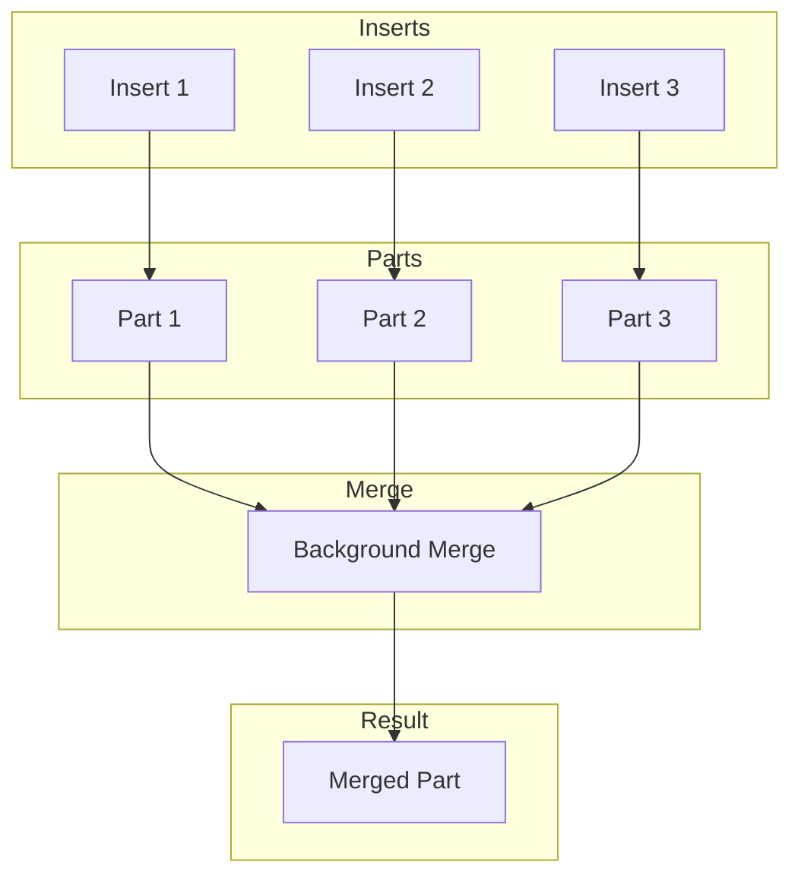

# How to Handle Too Many Parts Errors in ClickHouse

Author: [nawazdhandala](https://www.github.com/nawazdhandala)

Tags: ClickHouse, Troubleshooting, MergeTree, Parts, Performance, Merges, Insert Optimization, Database

Description: A practical guide to diagnosing and fixing Too Many Parts errors in ClickHouse, covering merge optimization, insert batching strategies, and table configuration for high-throughput workloads.

---

The "Too many parts" error is one of the most common issues in ClickHouse, especially with high-frequency inserts. This guide explains why it happens and how to fix it.

## Understanding Parts in ClickHouse

### How Parts Work



Each INSERT creates a new part. ClickHouse merges parts in the background. If inserts are faster than merges, parts accumulate.

### Error Messages

```
DB::Exception: Too many parts (600). Merges are processing significantly slower than inserts.

DB::Exception: Too many parts (305) in all partitions in total.
Parts cleaning is slow, possibly due to a large number of parts.
```

## Diagnosing the Problem

### Check Parts Count

```sql
-- Parts per table
SELECT
    database,
    table,
    count() AS parts,
    sum(rows) AS total_rows,
    formatReadableSize(sum(bytes_on_disk)) AS total_size
FROM system.parts
WHERE active
GROUP BY database, table
ORDER BY parts DESC;

-- Parts per partition
SELECT
    database,
    table,
    partition,
    count() AS parts
FROM system.parts
WHERE active
GROUP BY database, table, partition
HAVING parts > 50
ORDER BY parts DESC;
```

### Monitor Merge Progress

```sql
-- Current merges
SELECT
    database,
    table,
    elapsed,
    progress,
    num_parts,
    formatReadableSize(total_size_bytes_compressed) AS size,
    formatReadableSize(memory_usage) AS memory
FROM system.merges
ORDER BY elapsed DESC;

-- Merge history
SELECT
    event_date,
    table,
    count() AS merges,
    avg(duration_ms) AS avg_duration_ms,
    sum(read_rows) AS total_rows_merged
FROM system.part_log
WHERE event_type = 'MergeParts'
  AND event_date >= today() - 7
GROUP BY event_date, table
ORDER BY event_date, table;
```

### Identify Root Cause

```sql
-- Insert frequency analysis
SELECT
    toStartOfMinute(event_time) AS minute,
    count() AS inserts,
    sum(written_rows) AS rows
FROM system.query_log
WHERE type = 'QueryFinish'
  AND query_kind = 'Insert'
  AND event_date = today()
GROUP BY minute
ORDER BY minute DESC
LIMIT 60;

-- Small inserts (problematic)
SELECT
    query_start_time,
    written_rows,
    query
FROM system.query_log
WHERE type = 'QueryFinish'
  AND query_kind = 'Insert'
  AND written_rows < 1000  -- Very small inserts
  AND event_date = today()
ORDER BY query_start_time DESC
LIMIT 50;
```

## Immediate Fixes

### Force Merges

```sql
-- Trigger merge for specific table
OPTIMIZE TABLE events;

-- Force final merge (expensive, blocks inserts)
OPTIMIZE TABLE events FINAL;

-- Merge specific partition
OPTIMIZE TABLE events PARTITION '202401' FINAL;
```

### Increase Merge Resources

```xml
<!-- /etc/clickhouse-server/config.d/merges.xml -->
<clickhouse>
    <!-- More background threads for merges -->
    <background_pool_size>32</background_pool_size>

    <!-- Allow more concurrent merges -->
    <background_merges_mutations_concurrency_ratio>4</background_merges_mutations_concurrency_ratio>

    <!-- Increase merge memory -->
    <max_bytes_to_merge_at_max_space_in_pool>161061273600</max_bytes_to_merge_at_max_space_in_pool>
</clickhouse>
```

```sql
-- Apply without restart
SYSTEM RELOAD CONFIG;
```

### Temporarily Increase Parts Limit

```sql
-- Increase limit (use with caution)
ALTER TABLE events MODIFY SETTING parts_to_throw_insert = 1000;

-- Or set at query level
INSERT INTO events
SELECT * FROM source_data
SETTINGS parts_to_throw_insert = 1000;
```

## Long-Term Solutions

### Batch Inserts

```python
# Bad: Many small inserts
for event in events:
    client.execute("INSERT INTO events VALUES (...)", [event])

# Good: Batch inserts
batch_size = 10000
for i in range(0, len(events), batch_size):
    batch = events[i:i + batch_size]
    client.execute("INSERT INTO events VALUES", batch)
```

### Use Async Inserts

```sql
-- Enable async inserts
ALTER USER app_user SETTINGS
    async_insert = 1,
    async_insert_busy_timeout_ms = 200,  -- Wait up to 200ms to batch
    async_insert_max_data_size = 10000000,  -- Or 10MB of data
    async_insert_stale_timeout_ms = 1000;  -- Flush after 1s max

-- For specific inserts
INSERT INTO events VALUES (...)
SETTINGS async_insert = 1;
```

### Use Buffer Tables

```sql
-- Create buffer table
CREATE TABLE events_buffer AS events
ENGINE = Buffer(
    currentDatabase(),
    events,
    16,      -- Num buffers
    10,      -- Min time (seconds)
    100,     -- Max time
    10000,   -- Min rows
    1000000, -- Max rows
    10000000,-- Min bytes
    100000000-- Max bytes
);

-- Write to buffer instead of main table
INSERT INTO events_buffer VALUES (...);
```

### Optimize Partition Strategy

```sql
-- Problem: Too granular partitioning
CREATE TABLE events_bad (...)
ENGINE = MergeTree()
PARTITION BY toDate(event_time)  -- Daily = 365 partitions/year
ORDER BY (...);

-- Better: Monthly partitioning
CREATE TABLE events_good (...)
ENGINE = MergeTree()
PARTITION BY toYYYYMM(event_time)  -- Monthly = 12 partitions/year
ORDER BY (...);

-- For very high volume: No partition or yearly
CREATE TABLE events_high_volume (...)
ENGINE = MergeTree()
PARTITION BY toYear(event_time)  -- Yearly
ORDER BY (...);
```

## Table Settings

### Merge Settings

```sql
-- Adjust merge behavior per table
ALTER TABLE events MODIFY SETTING
    -- Merge more aggressively
    merge_with_ttl_timeout = 3600,
    merge_with_recompression_ttl_timeout = 3600,

    -- Allow larger merges
    max_bytes_to_merge_at_max_space_in_pool = 161061273600,

    -- Parts limits
    parts_to_delay_insert = 150,  -- Start slowing inserts
    parts_to_throw_insert = 300,  -- Reject inserts

    -- Merge priority
    max_replicated_merges_in_queue = 16;
```

### Insert Limits

```sql
-- Configure insert behavior
ALTER TABLE events MODIFY SETTING
    -- Minimum rows per insert (prevents tiny parts)
    min_insert_block_size_rows = 1000000,

    -- Minimum bytes per insert
    min_insert_block_size_bytes = 268435456,  -- 256MB

    -- Max parts per insert
    max_parts_in_total = 100000;
```

## Monitoring

### Parts Alert Query

```sql
-- Alert when parts exceed threshold
SELECT
    database,
    table,
    count() AS parts,
    'critical' AS severity
FROM system.parts
WHERE active
GROUP BY database, table
HAVING parts > 200
ORDER BY parts DESC;
```

### Merge Rate Monitor

```sql
-- Ensure merges keep up with inserts
WITH
    inserts AS (
        SELECT count() AS insert_count
        FROM system.query_log
        WHERE type = 'QueryFinish'
          AND query_kind = 'Insert'
          AND event_time >= now() - INTERVAL 1 HOUR
    ),
    merges AS (
        SELECT count() AS merge_count
        FROM system.part_log
        WHERE event_type = 'MergeParts'
          AND event_time >= now() - INTERVAL 1 HOUR
    )
SELECT
    insert_count,
    merge_count,
    if(merge_count > 0, insert_count / merge_count, 999) AS insert_to_merge_ratio
FROM inserts, merges;
```

### Prometheus Metrics

```yaml
# Alert when parts accumulate
- alert: ClickHouseTooManyParts
  expr: clickhouse_parts_count > 200
  for: 10m
  labels:
    severity: warning
  annotations:
    summary: "Table {{ $labels.table }} has {{ $value }} parts"

- alert: ClickHouseMergesStuck
  expr: rate(clickhouse_merges_total[1h]) == 0
  for: 30m
  labels:
    severity: critical
  annotations:
    summary: "No merges happening on ClickHouse"
```

## Recovery Procedure

### When Inserts Are Blocked

```bash
# 1. Stop insert traffic (application level)

# 2. Check current state
clickhouse-client -q "
SELECT database, table, count() AS parts
FROM system.parts
WHERE active
GROUP BY database, table
ORDER BY parts DESC"

# 3. Force merges
clickhouse-client -q "OPTIMIZE TABLE events"

# 4. Wait for merges to complete
clickhouse-client -q "
SELECT count() FROM system.merges WHERE table = 'events'"

# 5. Verify parts reduced
clickhouse-client -q "
SELECT count() FROM system.parts WHERE table = 'events' AND active"

# 6. Resume inserts with batching enabled
```

### Migration to Better Schema

```sql
-- Create new table with better settings
CREATE TABLE events_new (...)
ENGINE = MergeTree()
PARTITION BY toYYYYMM(event_time)
ORDER BY (user_id, event_time)
SETTINGS
    parts_to_delay_insert = 200,
    parts_to_throw_insert = 500,
    max_bytes_to_merge_at_max_space_in_pool = 161061273600;

-- Copy data in batches
INSERT INTO events_new
SELECT * FROM events
WHERE event_time >= '2024-01-01' AND event_time < '2024-02-01';

-- Repeat for other months...

-- Rename tables
RENAME TABLE events TO events_old, events_new TO events;
```

---

Too many parts errors occur when inserts outpace merges. The immediate fix is to increase merge resources and force merges. Long-term, batch your inserts using async inserts or buffer tables, and configure appropriate partition strategies. Monitor parts count and merge rates to catch problems before they cause insert failures.
