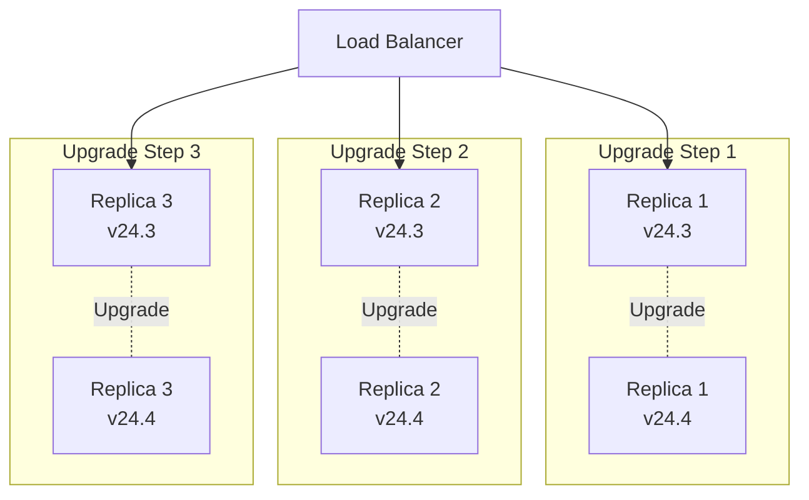

# How to Upgrade ClickHouse Without Downtime

Author: [nawazdhandala](https://www.github.com/nawazdhandala)

Tags: ClickHouse, Upgrade, Zero Downtime, Database, DevOps, Rolling Upgrade, Operations, High Availability

Description: A step-by-step guide to upgrading ClickHouse clusters with zero downtime using rolling upgrades, covering version compatibility, pre-upgrade checks, rollback procedures, and best practices for production deployments.

---

Upgrading ClickHouse in production requires careful planning. A failed upgrade can mean downtime, data loss, or corrupted tables. This guide covers how to perform zero-downtime rolling upgrades while minimizing risk.

## Pre-Upgrade Planning

### Check Version Compatibility

```sql
-- Current version
SELECT version();

-- Check compatibility notes for your target version
-- https://clickhouse.com/docs/en/whats-new/changelog
```

Version jump rules:
- **Patch versions** (24.3.1 to 24.3.2): Generally safe, bug fixes only
- **Minor versions** (24.3 to 24.4): New features, review changelog
- **Major versions** (23.x to 24.x): Breaking changes possible, test thoroughly
- Never skip more than two minor versions in one upgrade

### Review Deprecation Warnings

```sql
-- Check for deprecated features in use
SELECT DISTINCT
    message
FROM system.warnings
WHERE message LIKE '%deprecated%';

-- Review query log for deprecated syntax
SELECT
    query,
    exception
FROM system.query_log
WHERE exception LIKE '%deprecated%'
  AND event_date >= today() - 7
LIMIT 100;
```

### Verify Cluster Health

```sql
-- Check all replicas are healthy
SELECT
    database,
    table,
    replica_name,
    is_leader,
    is_readonly,
    absolute_delay,
    queue_size
FROM system.replicas
WHERE is_readonly = 1
   OR absolute_delay > 60
   OR queue_size > 100;

-- Check for stuck merges
SELECT
    database,
    table,
    elapsed,
    progress,
    num_parts
FROM system.merges
WHERE elapsed > 3600;

-- Check for pending mutations
SELECT
    database,
    table,
    mutation_id,
    is_done,
    parts_to_do
FROM system.mutations
WHERE NOT is_done;
```

### Create Backup

```bash
# Full backup before upgrade
clickhouse-backup create pre_upgrade_$(date +%Y%m%d)

# Upload to remote storage
clickhouse-backup upload pre_upgrade_$(date +%Y%m%d)
```

## Rolling Upgrade Process

### Architecture Overview



### Step 1: Prepare the First Node

```bash
# On the first replica node

# 1. Stop accepting new connections (in load balancer)
# Remove node from load balancer pool

# 2. Wait for active queries to complete
clickhouse-client --query "
    SELECT count() FROM system.processes
    WHERE elapsed < 300
"

# 3. Wait for replication queue to empty
clickhouse-client --query "
    SELECT sum(queue_size) FROM system.replicas
"

# 4. Stop ClickHouse
sudo systemctl stop clickhouse-server
```

### Step 2: Upgrade the First Node

```bash
# Download and install new version

# For Debian/Ubuntu
sudo apt update
sudo apt install clickhouse-server=24.4.1

# For RHEL/CentOS
sudo yum install clickhouse-server-24.4.1

# Or using packages directly
wget https://packages.clickhouse.com/deb/pool/main/c/clickhouse-server/clickhouse-server_24.4.1_amd64.deb
sudo dpkg -i clickhouse-server_24.4.1_amd64.deb
```

### Step 3: Start and Verify

```bash
# 1. Start ClickHouse
sudo systemctl start clickhouse-server

# 2. Wait for startup
sleep 30

# 3. Verify version
clickhouse-client --query "SELECT version()"

# 4. Check for errors
sudo tail -100 /var/log/clickhouse-server/clickhouse-server.err.log

# 5. Verify replication is working
clickhouse-client --query "
    SELECT
        database,
        table,
        is_readonly,
        absolute_delay,
        queue_size
    FROM system.replicas
    WHERE is_readonly = 1 OR absolute_delay > 60
"
```

### Step 4: Validate Before Proceeding

```bash
# Run smoke tests
clickhouse-client --query "SELECT count() FROM system.tables"
clickhouse-client --query "SELECT 1+1"

# Test critical queries
clickhouse-client --query "
    SELECT count() FROM your_important_table
    WHERE date >= today() - 1
"

# Check query performance hasn't degraded
clickhouse-client --query "
    SELECT
        avg(query_duration_ms) as avg_duration
    FROM system.query_log
    WHERE type = 'QueryFinish'
      AND event_date = today()
      AND event_time >= now() - INTERVAL 10 MINUTE
"
```

### Step 5: Add Node Back and Proceed

```bash
# Add node back to load balancer

# Wait 5-10 minutes to verify stability

# Proceed to next node
# Repeat steps 1-4 for each remaining replica
```

## Handling Sharded Clusters

### Upgrade Order

For sharded clusters, upgrade one shard at a time:

```
Cluster with 3 shards, 2 replicas each:

Round 1: Upgrade replica 1 of each shard
  - shard1_replica1
  - shard2_replica1
  - shard3_replica1

Round 2: Upgrade replica 2 of each shard
  - shard1_replica2
  - shard2_replica2
  - shard3_replica2
```

### Distributed Query Compatibility

During upgrade, avoid distributed queries that span mixed versions:

```sql
-- Temporarily route queries to upgraded nodes only
-- Update your load balancer or application routing

-- Or use settings to control distributed behavior
SET prefer_localhost_replica = 1;
SET max_parallel_replicas = 1;
```

## Kubernetes/Docker Upgrades

### StatefulSet Rolling Update

```yaml
# Update the image tag
apiVersion: apps/v1
kind: StatefulSet
metadata:
  name: clickhouse
spec:
  updateStrategy:
    type: RollingUpdate
  template:
    spec:
      containers:
      - name: clickhouse
        image: clickhouse/clickhouse-server:24.4.1  # New version
```

```bash
# Apply update (Kubernetes handles rolling update)
kubectl apply -f clickhouse-statefulset.yaml

# Monitor rollout
kubectl rollout status statefulset/clickhouse

# Watch pods
kubectl get pods -l app=clickhouse -w
```

### Pod Disruption Budget

```yaml
# Ensure minimum availability during upgrade
apiVersion: policy/v1
kind: PodDisruptionBudget
metadata:
  name: clickhouse-pdb
spec:
  minAvailable: 2  # Keep at least 2 replicas available
  selector:
    matchLabels:
      app: clickhouse
```

### Helm Upgrade

```bash
# Update values.yaml with new version
# image:
#   tag: "24.4.1"

# Perform upgrade
helm upgrade clickhouse ./clickhouse-chart -f values.yaml

# Or specify version directly
helm upgrade clickhouse ./clickhouse-chart \
  --set image.tag=24.4.1
```

## Rollback Procedures

### Immediate Rollback

```bash
# If issues found immediately after starting new version

# 1. Stop ClickHouse
sudo systemctl stop clickhouse-server

# 2. Downgrade package
sudo apt install clickhouse-server=24.3.2  # Previous version

# 3. Start ClickHouse
sudo systemctl start clickhouse-server

# 4. Verify
clickhouse-client --query "SELECT version()"
```

### Rollback After Data Changes

If the new version made schema or data changes:

```bash
# 1. Stop ClickHouse
sudo systemctl stop clickhouse-server

# 2. Restore from backup
clickhouse-backup restore pre_upgrade_20240115

# 3. Downgrade package
sudo apt install clickhouse-server=24.3.2

# 4. Start ClickHouse
sudo systemctl start clickhouse-server
```

### Kubernetes Rollback

```bash
# Rollback to previous revision
kubectl rollout undo statefulset/clickhouse

# Or to specific revision
kubectl rollout undo statefulset/clickhouse --to-revision=2

# Monitor rollback
kubectl rollout status statefulset/clickhouse
```

## Handling Breaking Changes

### Compatibility Settings

ClickHouse provides compatibility settings for gradual migration:

```sql
-- Enable backward compatibility mode
SET compatibility = '24.3';

-- Or in server config
<clickhouse>
    <profiles>
        <default>
            <compatibility>24.3</compatibility>
        </default>
    </profiles>
</clickhouse>
```

### Schema Migration

Some upgrades require schema changes:

```sql
-- Check if tables need migration
SELECT
    database,
    table,
    engine_full
FROM system.tables
WHERE engine LIKE '%MergeTree%';

-- Convert deprecated table engines
ALTER TABLE events
MODIFY ENGINE = ReplicatedMergeTree('/clickhouse/tables/{shard}/events', '{replica}')
ORDER BY (event_type, event_time);
```

### Function Migration

```sql
-- Check for deprecated functions
SELECT DISTINCT
    query
FROM system.query_log
WHERE query LIKE '%old_function_name%'
  AND event_date >= today() - 30;

-- Update queries to use new functions
-- Example: arrayElement -> array[index]
```

## Monitoring During Upgrade

### Health Check Script

```bash
#!/bin/bash
# health_check.sh

# Check if server responds
if ! clickhouse-client --query "SELECT 1" > /dev/null 2>&1; then
    echo "ERROR: Server not responding"
    exit 1
fi

# Check version
VERSION=$(clickhouse-client --query "SELECT version()")
echo "Version: $VERSION"

# Check replication lag
LAG=$(clickhouse-client --query "
    SELECT max(absolute_delay)
    FROM system.replicas
")
if [ "$LAG" -gt 60 ]; then
    echo "WARNING: Replication lag: ${LAG}s"
fi

# Check for readonly replicas
READONLY=$(clickhouse-client --query "
    SELECT count()
    FROM system.replicas
    WHERE is_readonly = 1
")
if [ "$READONLY" -gt 0 ]; then
    echo "ERROR: $READONLY readonly replicas"
    exit 1
fi

# Check error log
ERRORS=$(sudo tail -100 /var/log/clickhouse-server/clickhouse-server.err.log | grep -c "Exception")
if [ "$ERRORS" -gt 0 ]; then
    echo "WARNING: $ERRORS exceptions in error log"
fi

echo "Health check passed"
```

### Prometheus Alerts

```yaml
# Alert on upgrade issues
groups:
- name: clickhouse_upgrade
  rules:
  - alert: ClickHouseVersionMismatch
    expr: count(count by (version) (clickhouse_build_info)) > 1
    for: 30m
    labels:
      severity: warning
    annotations:
      summary: "Multiple ClickHouse versions in cluster"

  - alert: ClickHouseReplicaLagDuringUpgrade
    expr: clickhouse_replicas_absolute_delay > 300
    for: 5m
    labels:
      severity: critical
    annotations:
      summary: "High replication lag during upgrade"
```

## Best Practices

### Pre-Upgrade Checklist

```markdown
- [ ] Read release notes and changelog
- [ ] Test upgrade in staging environment
- [ ] Verify all replicas are healthy
- [ ] Complete pending mutations
- [ ] Create and verify backup
- [ ] Notify stakeholders of maintenance window
- [ ] Prepare rollback plan
- [ ] Have monitoring dashboards ready
```

### Upgrade Schedule

```markdown
Recommended upgrade schedule:

1. Test environment: Day 1
   - Full upgrade
   - Run test suite
   - Performance benchmarks

2. Staging environment: Day 3
   - Rolling upgrade
   - Integration tests
   - Monitor for 24 hours

3. Production: Day 7
   - Rolling upgrade during low-traffic period
   - Node-by-node with validation
   - Monitor for 48 hours before declaring success
```

### Version Policy

```markdown
Version management recommendations:

1. Stay within 2 minor versions of latest stable
   - Current stable: 24.4
   - Acceptable: 24.2, 24.3, 24.4
   - Needs upgrade: 24.1 and older

2. Apply security patches immediately
   - Subscribe to security announcements
   - Test and deploy within 48 hours

3. Schedule quarterly upgrade reviews
   - Evaluate new features
   - Plan upgrade path
   - Update staging environment
```

---

Zero-downtime ClickHouse upgrades are achievable with proper planning and execution. Always upgrade one node at a time, validate before proceeding, and keep rollback procedures ready. Test upgrades in staging first, and monitor closely during and after production upgrades. The extra time spent on careful upgrades prevents costly emergency recovery situations.
