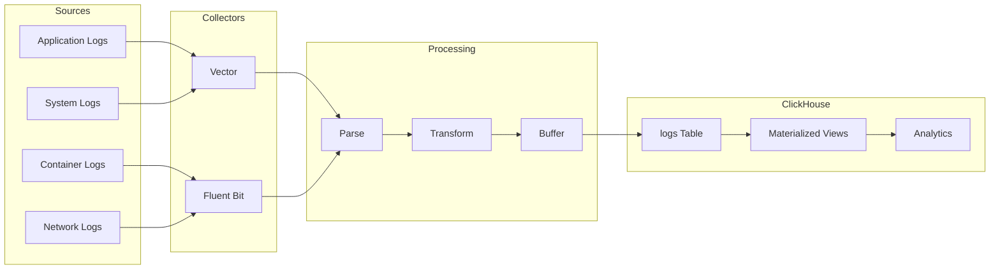

# How to Stream Logs to ClickHouse with Vector and Fluent Bit

Author: [nawazdhandala](https://www.github.com/nawazdhandala)

Tags: ClickHouse, Vector, Fluent Bit, Log Streaming, Observability, Data Pipeline

Description: A comprehensive guide to streaming logs to ClickHouse using Vector and Fluent Bit for high-performance log analytics and observability.

---

Vector and Fluent Bit are high-performance log collectors that efficiently stream data to ClickHouse. This guide covers setup, configuration, and optimization for log analytics.

## Architecture Overview



## Vector Configuration

### Installation

```bash
# Install Vector
curl -fsSL https://vector.dev/install.sh | bash

# Or via package manager
apt-get install vector  # Debian/Ubuntu
yum install vector      # RHEL/CentOS
```

### Basic Configuration

```toml
# /etc/vector/vector.toml

[sources.app_logs]
type = "file"
include = ["/var/log/app/*.log"]
read_from = "beginning"

[sources.docker_logs]
type = "docker_logs"
docker_host = "unix:///var/run/docker.sock"

[transforms.parse_json]
type = "remap"
inputs = ["app_logs"]
source = '''
. = parse_json!(.message)
.timestamp = parse_timestamp!(.timestamp, "%Y-%m-%dT%H:%M:%S%.fZ")
'''

[transforms.enrich]
type = "remap"
inputs = ["parse_json"]
source = '''
.host = get_hostname!()
.environment = get_env_var!("ENVIRONMENT") ?? "production"
.source = "vector"
'''

[sinks.clickhouse]
type = "clickhouse"
inputs = ["enrich", "docker_logs"]
endpoint = "https://clickhouse.example.com:8443"
database = "logs"
table = "application_logs"
auth.strategy = "basic"
auth.user = "vector_user"
auth.password = "${CLICKHOUSE_PASSWORD}"

[sinks.clickhouse.batch]
max_bytes = 10485760  # 10MB
max_events = 100000
timeout_secs = 10

[sinks.clickhouse.buffer]
type = "disk"
max_size = 1073741824  # 1GB
when_full = "block"
```

### Advanced Vector Pipeline

```toml
# /etc/vector/vector.toml

# Multiple sources
[sources.kubernetes_logs]
type = "kubernetes_logs"
auto_partial_merge = true

[sources.syslog]
type = "syslog"
address = "0.0.0.0:514"
mode = "tcp"

[sources.http]
type = "http_server"
address = "0.0.0.0:8080"
encoding = "json"

# Routing based on log type
[transforms.route]
type = "route"
inputs = ["kubernetes_logs", "syslog", "http"]

[transforms.route.route]
error_logs = '.level == "error" || .level == "ERROR"'
access_logs = 'exists(.request_method)'
metric_logs = 'exists(.metric_name)'
default = true

# Parse error logs
[transforms.parse_errors]
type = "remap"
inputs = ["route.error_logs"]
source = '''
.severity = "error"
.parsed_at = now()
if exists(.stack_trace) {
    .has_stacktrace = true
    .error_type = match!(.stack_trace, r'^(?P<type>\w+Error)')?.type ?? "Unknown"
}
'''

# Parse access logs
[transforms.parse_access]
type = "remap"
inputs = ["route.access_logs"]
source = '''
.response_time_ms = to_int!(.response_time) * 1000
.status_category = to_string(floor(to_int!(.status) / 100)) + "xx"
'''

# Aggregate metrics
[transforms.aggregate_metrics]
type = "aggregate"
inputs = ["parse_access"]
interval_ms = 60000
group_by = ["host", "status_category"]

[transforms.aggregate_metrics.metric]
namespace = "access_logs"
kind = "incremental"
counter.value = "1"

# Multiple ClickHouse sinks
[sinks.clickhouse_errors]
type = "clickhouse"
inputs = ["parse_errors"]
endpoint = "https://clickhouse.example.com:8443"
database = "logs"
table = "error_logs"

[sinks.clickhouse_access]
type = "clickhouse"
inputs = ["parse_access"]
endpoint = "https://clickhouse.example.com:8443"
database = "logs"
table = "access_logs"

[sinks.clickhouse_metrics]
type = "clickhouse"
inputs = ["aggregate_metrics"]
endpoint = "https://clickhouse.example.com:8443"
database = "logs"
table = "access_metrics"
```

## Fluent Bit Configuration

### Installation

```bash
# Install Fluent Bit
curl https://raw.githubusercontent.com/fluent/fluent-bit/master/install.sh | sh

# Or via package manager
apt-get install fluent-bit  # Debian/Ubuntu
```

### Basic Configuration

```ini
# /etc/fluent-bit/fluent-bit.conf

[SERVICE]
    Flush         5
    Daemon        Off
    Log_Level     info
    Parsers_File  parsers.conf
    HTTP_Server   On
    HTTP_Listen   0.0.0.0
    HTTP_Port     2020

[INPUT]
    Name              tail
    Path              /var/log/app/*.log
    Parser            json
    Tag               app.*
    Refresh_Interval  5
    Mem_Buf_Limit     50MB
    Skip_Long_Lines   On

[INPUT]
    Name          systemd
    Tag           systemd.*
    Read_From_Tail On

[FILTER]
    Name          record_modifier
    Match         *
    Record        hostname ${HOSTNAME}
    Record        environment production

[FILTER]
    Name          lua
    Match         app.*
    script        /etc/fluent-bit/scripts/transform.lua
    call          transform

[OUTPUT]
    Name          http
    Match         *
    Host          clickhouse.example.com
    Port          8123
    URI           /?query=INSERT+INTO+logs.application_logs+FORMAT+JSONEachRow
    Format        json_lines
    Json_date_key timestamp
    Json_date_format iso8601
    tls           On
    tls.verify    On
    HTTP_User     fluent_user
    HTTP_Passwd   ${CLICKHOUSE_PASSWORD}
```

### Parsers Configuration

```ini
# /etc/fluent-bit/parsers.conf

[PARSER]
    Name        json
    Format      json
    Time_Key    timestamp
    Time_Format %Y-%m-%dT%H:%M:%S.%L%z

[PARSER]
    Name        nginx
    Format      regex
    Regex       ^(?<remote>[^ ]*) (?<host>[^ ]*) (?<user>[^ ]*) \[(?<time>[^\]]*)\] "(?<method>\S+)(?: +(?<path>[^\"]*?)(?: +\S*)?)?" (?<code>[^ ]*) (?<size>[^ ]*)(?: "(?<referer>[^\"]*)" "(?<agent>[^\"]*)")?$
    Time_Key    time
    Time_Format %d/%b/%Y:%H:%M:%S %z

[PARSER]
    Name        syslog
    Format      regex
    Regex       ^\<(?<pri>[0-9]+)\>(?<time>[^ ]* {1,2}[^ ]* [^ ]*) (?<host>[^ ]*) (?<ident>[a-zA-Z0-9_\/\.\-]*)(?:\[(?<pid>[0-9]+)\])?(?:[^\:]*\:)? *(?<message>.*)$
    Time_Key    time
    Time_Format %b %d %H:%M:%S
```

### Lua Transform Script

```lua
-- /etc/fluent-bit/scripts/transform.lua

function transform(tag, timestamp, record)
    -- Parse JSON if message is string
    if type(record["message"]) == "string" then
        local ok, parsed = pcall(function()
            return cjson.decode(record["message"])
        end)
        if ok then
            for k, v in pairs(parsed) do
                record[k] = v
            end
        end
    end

    -- Add derived fields
    if record["level"] then
        record["severity"] = string.upper(record["level"])
    end

    -- Extract error info
    if record["error"] then
        record["has_error"] = true
        record["error_message"] = string.sub(record["error"], 1, 500)
    end

    return 1, timestamp, record
end
```

## ClickHouse Table Schema

```sql
-- Optimized log table for high-volume ingestion
CREATE TABLE logs.application_logs (
    timestamp DateTime64(3),
    hostname LowCardinality(String),
    environment LowCardinality(String),
    service LowCardinality(String),
    level LowCardinality(String),
    message String,
    trace_id String,
    span_id String,
    user_id UInt64,
    request_id String,
    error_type LowCardinality(String),
    error_message String,
    extra Map(String, String),

    INDEX idx_trace_id trace_id TYPE bloom_filter GRANULARITY 4,
    INDEX idx_request_id request_id TYPE bloom_filter GRANULARITY 4,
    INDEX idx_message message TYPE tokenbf_v1(10240, 3, 0) GRANULARITY 4
)
ENGINE = MergeTree()
PARTITION BY toYYYYMMDD(timestamp)
ORDER BY (hostname, service, timestamp)
TTL timestamp + INTERVAL 30 DAY
SETTINGS index_granularity = 8192;

-- Access logs table
CREATE TABLE logs.access_logs (
    timestamp DateTime64(3),
    hostname LowCardinality(String),
    method LowCardinality(String),
    path String,
    status UInt16,
    response_time_ms UInt32,
    bytes_sent UInt64,
    user_agent String,
    remote_addr IPv4,
    referer String,

    INDEX idx_status status TYPE set(0) GRANULARITY 4,
    INDEX idx_path path TYPE tokenbf_v1(10240, 3, 0) GRANULARITY 4
)
ENGINE = MergeTree()
PARTITION BY toYYYYMMDD(timestamp)
ORDER BY (hostname, timestamp)
TTL timestamp + INTERVAL 7 DAY;
```

## Materialized Views for Analytics

```sql
-- Real-time error aggregation
CREATE MATERIALIZED VIEW logs.error_counts_mv
ENGINE = SummingMergeTree()
ORDER BY (timestamp_hour, hostname, service, error_type)
AS SELECT
    toStartOfHour(timestamp) AS timestamp_hour,
    hostname,
    service,
    error_type,
    count() AS error_count
FROM logs.application_logs
WHERE level IN ('ERROR', 'FATAL')
GROUP BY timestamp_hour, hostname, service, error_type;

-- Request rate by endpoint
CREATE MATERIALIZED VIEW logs.request_rates_mv
ENGINE = SummingMergeTree()
ORDER BY (timestamp_minute, hostname, method, path)
AS SELECT
    toStartOfMinute(timestamp) AS timestamp_minute,
    hostname,
    method,
    path,
    count() AS request_count,
    sum(response_time_ms) AS total_response_time,
    countIf(status >= 500) AS error_count
FROM logs.access_logs
GROUP BY timestamp_minute, hostname, method, path;
```

## Kubernetes Deployment

### Vector DaemonSet

```yaml
apiVersion: apps/v1
kind: DaemonSet
metadata:
  name: vector
  namespace: logging
spec:
  selector:
    matchLabels:
      app: vector
  template:
    metadata:
      labels:
        app: vector
    spec:
      containers:
        - name: vector
          image: timberio/vector:latest-alpine
          args: ["--config", "/etc/vector/vector.toml"]
          env:
            - name: CLICKHOUSE_PASSWORD
              valueFrom:
                secretKeyRef:
                  name: clickhouse-credentials
                  key: password
          volumeMounts:
            - name: config
              mountPath: /etc/vector
            - name: varlog
              mountPath: /var/log
              readOnly: true
            - name: data
              mountPath: /var/lib/vector
          resources:
            requests:
              memory: "256Mi"
              cpu: "200m"
            limits:
              memory: "512Mi"
              cpu: "500m"
      volumes:
        - name: config
          configMap:
            name: vector-config
        - name: varlog
          hostPath:
            path: /var/log
        - name: data
          hostPath:
            path: /var/lib/vector
```

### Fluent Bit DaemonSet

```yaml
apiVersion: apps/v1
kind: DaemonSet
metadata:
  name: fluent-bit
  namespace: logging
spec:
  selector:
    matchLabels:
      app: fluent-bit
  template:
    metadata:
      labels:
        app: fluent-bit
    spec:
      containers:
        - name: fluent-bit
          image: fluent/fluent-bit:latest
          volumeMounts:
            - name: config
              mountPath: /fluent-bit/etc/
            - name: varlog
              mountPath: /var/log
              readOnly: true
            - name: containers
              mountPath: /var/lib/docker/containers
              readOnly: true
          resources:
            requests:
              memory: "100Mi"
              cpu: "100m"
            limits:
              memory: "200Mi"
              cpu: "200m"
      volumes:
        - name: config
          configMap:
            name: fluent-bit-config
        - name: varlog
          hostPath:
            path: /var/log
        - name: containers
          hostPath:
            path: /var/lib/docker/containers
```

## Performance Tuning

### Vector Tuning

```toml
# Optimize batch settings
[sinks.clickhouse.batch]
max_bytes = 52428800    # 50MB batches
max_events = 500000
timeout_secs = 30

# Use disk buffer for reliability
[sinks.clickhouse.buffer]
type = "disk"
max_size = 5368709120   # 5GB
when_full = "block"

# Enable compression
[sinks.clickhouse.encoding]
codec = "json"

[sinks.clickhouse.request]
compression = "gzip"
concurrency = "adaptive"
```

### Fluent Bit Tuning

```ini
[SERVICE]
    Flush         10
    Buffer_Chunk_Size 1M
    Buffer_Max_Size   5M

[OUTPUT]
    Name          http
    Match         *
    # ... other settings
    Workers       4
    Retry_Limit   5
```

## Conclusion

Vector and Fluent Bit with ClickHouse provide:

1. **High throughput** log collection and ingestion
2. **Flexible parsing** for any log format
3. **Real-time processing** with transforms
4. **Reliable delivery** with buffering
5. **Low resource usage** for edge deployment

Choose Vector for complex pipelines or Fluent Bit for lightweight collection in your ClickHouse logging stack.
