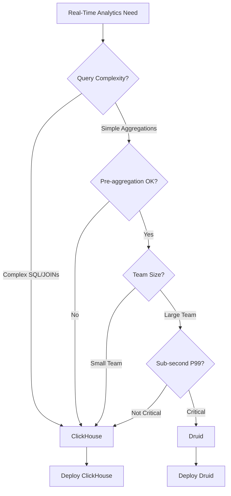

# ClickHouse vs Apache Druid: Real-Time Analytics Comparison

Author: [nawazdhandala](https://www.github.com/nawazdhandala)

Tags: ClickHouse, Apache Druid, Comparison, Real-Time Analytics, OLAP, Database Selection

Description: A comprehensive comparison of ClickHouse and Apache Druid for real-time analytics, covering architecture differences, query performance, data ingestion, operational complexity, and guidance on choosing the right system.

---

ClickHouse and Apache Druid are both powerful OLAP databases designed for real-time analytics. While they share similar use cases, their architectures and operational characteristics differ significantly. This guide provides a detailed comparison to help you choose the right solution.

## Architecture Overview

### ClickHouse Architecture

```
ClickHouse Components:
+------------------+
|   ClickHouse     |
|     Server       |
|  +------------+  |
|  | Query      |  |
|  | Processor  |  |
|  +------------+  |
|  | MergeTree  |  |
|  | Storage    |  |
|  +------------+  |
+------------------+
        |
+------------------+
|   ClickHouse     |
|    Keeper        |
|  (Coordination)  |
+------------------+
```

Key characteristics:
- Monolithic server design
- MergeTree engine family
- ClickHouse Keeper for coordination
- Native SQL interface
- Column-oriented storage

### Apache Druid Architecture

```
Druid Components:
+----------+  +----------+  +----------+
|  Router  |  | Broker   |  |Coordinator|
+----------+  +----------+  +----------+
                  |
    +-------------+-------------+
    |             |             |
+--------+  +----------+  +-----------+
|Historical| | Middle   |  | Overlord  |
| Nodes   |  | Managers |  |           |
+--------+  +----------+  +-----------+
    |             |
+--------+  +----------+
| Deep   |  | ZooKeeper|
| Storage|  |          |
+--------+  +----------+
```

Key characteristics:
- Microservices architecture
- Separate historical and real-time nodes
- Deep storage (S3/HDFS) for persistence
- Segment-based data organization
- Custom query language (Druid SQL or native JSON)

## Feature Comparison

| Feature | ClickHouse | Apache Druid |
|---------|------------|--------------|
| Query Language | Full SQL | Druid SQL (limited), JSON |
| Storage Format | Columnar (MergeTree) | Columnar (Segments) |
| Real-time Ingestion | Async inserts, Kafka engine | Native streaming ingestion |
| Batch Ingestion | INSERT, file imports | Hadoop, Spark, native batch |
| JOINs | Supported (with limitations) | Very limited |
| Subqueries | Full support | Limited support |
| Exact COUNT DISTINCT | Native | Approximate (HyperLogLog) |
| Approximate Queries | Optional | Native (datasketches) |
| Update/Delete | Mutations (async) | Not supported |
| Pre-aggregation | Materialized views | Roll-up at ingestion |

## Query Performance Comparison

### Simple Aggregations

Both systems excel at aggregation queries:

```sql
-- ClickHouse
SELECT
    toStartOfHour(timestamp) AS hour,
    country,
    count() AS events,
    sum(revenue) AS total_revenue
FROM events
WHERE timestamp >= now() - INTERVAL 7 DAY
GROUP BY hour, country
ORDER BY hour, total_revenue DESC;

-- Druid SQL equivalent
SELECT
    TIME_FLOOR(__time, 'PT1H') AS hour,
    country,
    COUNT(*) AS events,
    SUM(revenue) AS total_revenue
FROM events
WHERE __time >= CURRENT_TIMESTAMP - INTERVAL '7' DAY
GROUP BY 1, 2
ORDER BY 1, 4 DESC;
```

Performance is comparable for simple aggregations - both return in milliseconds for billion-row datasets.

### Complex Queries

ClickHouse handles complexity better:

```sql
-- ClickHouse: Complex query with subqueries
WITH daily_stats AS (
    SELECT
        toDate(timestamp) AS date,
        user_id,
        count() AS daily_events,
        sum(revenue) AS daily_revenue
    FROM events
    WHERE timestamp >= now() - INTERVAL 30 DAY
    GROUP BY date, user_id
)
SELECT
    user_id,
    avg(daily_events) AS avg_daily_events,
    percentile(0.95)(daily_revenue) AS p95_revenue
FROM daily_stats
GROUP BY user_id
HAVING avg_daily_events > 10;

-- Druid: Would require multiple queries or Druid SQL limitations
-- Often solved with pre-aggregation at ingestion time
```

### Exact vs Approximate COUNT DISTINCT

```sql
-- ClickHouse: Exact count
SELECT uniqExact(user_id) AS exact_users FROM events;

-- ClickHouse: Approximate (faster)
SELECT uniq(user_id) AS approx_users FROM events;

-- Druid: Always approximate by default
SELECT APPROX_COUNT_DISTINCT(user_id) AS users FROM events;

-- Druid: Theta sketches for set operations
SELECT
    THETA_SKETCH_ESTIMATE(
        THETA_SKETCH_INTERSECT(
            DS_THETA(user_id) FILTER(WHERE country = 'US'),
            DS_THETA(user_id) FILTER(WHERE platform = 'mobile')
        )
    ) AS us_mobile_users
FROM events;
```

## Data Ingestion Comparison

### Real-Time Streaming

ClickHouse streaming:

```sql
-- Kafka engine for streaming
CREATE TABLE events_kafka (
    timestamp DateTime,
    user_id UInt64,
    event_type String,
    revenue Float64
) ENGINE = Kafka
SETTINGS
    kafka_broker_list = 'kafka:9092',
    kafka_topic_list = 'events',
    kafka_group_name = 'clickhouse_consumer',
    kafka_format = 'JSONEachRow';

-- Materialized view for continuous ingestion
CREATE MATERIALIZED VIEW events_mv TO events AS
SELECT * FROM events_kafka;
```

Druid streaming:

```json
// Kafka ingestion spec
{
  "type": "kafka",
  "dataSchema": {
    "dataSource": "events",
    "timestampSpec": {
      "column": "timestamp",
      "format": "auto"
    },
    "dimensionsSpec": {
      "dimensions": ["user_id", "event_type"]
    },
    "metricsSpec": [
      {"type": "count", "name": "count"},
      {"type": "doubleSum", "name": "revenue", "fieldName": "revenue"}
    ],
    "granularitySpec": {
      "type": "uniform",
      "segmentGranularity": "HOUR",
      "queryGranularity": "MINUTE"
    }
  },
  "ioConfig": {
    "topic": "events",
    "consumerProperties": {
      "bootstrap.servers": "kafka:9092"
    }
  }
}
```

### Batch Ingestion

ClickHouse batch:

```sql
-- Simple INSERT from files
INSERT INTO events
SELECT * FROM file('events.parquet', Parquet);

-- From S3
INSERT INTO events
SELECT * FROM s3(
    'https://bucket.s3.amazonaws.com/events/*.parquet',
    'access_key', 'secret_key',
    'Parquet'
);
```

Druid batch:

```json
// Batch ingestion task
{
  "type": "index_parallel",
  "spec": {
    "dataSchema": {
      "dataSource": "events",
      "timestampSpec": {"column": "timestamp"},
      "dimensionsSpec": {"dimensions": ["user_id", "event_type"]},
      "metricsSpec": [{"type": "count", "name": "count"}]
    },
    "ioConfig": {
      "type": "index_parallel",
      "inputSource": {
        "type": "s3",
        "prefixes": ["s3://bucket/events/"]
      },
      "inputFormat": {"type": "parquet"}
    }
  }
}
```

## Roll-Up and Pre-Aggregation

### Druid Roll-Up (Native)

```json
// Roll-up at ingestion reduces storage
{
  "granularitySpec": {
    "segmentGranularity": "DAY",
    "queryGranularity": "HOUR",  // Data rolled up to hourly
    "rollup": true
  },
  "metricsSpec": [
    {"type": "count", "name": "event_count"},
    {"type": "longSum", "name": "total_revenue", "fieldName": "revenue"},
    {"type": "hyperUnique", "name": "unique_users", "fieldName": "user_id"}
  ]
}
```

### ClickHouse Equivalent (Materialized Views)

```sql
-- SummingMergeTree for roll-up
CREATE TABLE events_hourly (
    hour DateTime,
    country String,
    event_count UInt64,
    total_revenue Float64,
    unique_users AggregateFunction(uniq, UInt64)
) ENGINE = SummingMergeTree()
ORDER BY (hour, country);

-- Continuous aggregation
CREATE MATERIALIZED VIEW events_hourly_mv TO events_hourly AS
SELECT
    toStartOfHour(timestamp) AS hour,
    country,
    count() AS event_count,
    sum(revenue) AS total_revenue,
    uniqState(user_id) AS unique_users
FROM events
GROUP BY hour, country;
```

## Operational Complexity

### ClickHouse Operations

Simpler deployment:

```yaml
# Docker Compose - minimal setup
services:
  clickhouse:
    image: clickhouse/clickhouse-server:latest
    volumes:
      - ./data:/var/lib/clickhouse
    ports:
      - "8123:8123"
      - "9000:9000"
```

Management:
- Single binary deployment
- ClickHouse Keeper or ZooKeeper for clustering
- Straightforward configuration
- Built-in replication

### Druid Operations

More complex deployment:

```yaml
# Druid requires multiple services
services:
  coordinator:
    image: apache/druid:latest
    command: coordinator
  broker:
    image: apache/druid:latest
    command: broker
  historical:
    image: apache/druid:latest
    command: historical
  middlemanager:
    image: apache/druid:latest
    command: middleManager
  router:
    image: apache/druid:latest
    command: router
  zookeeper:
    image: zookeeper:latest
  postgres:  # Metadata storage
    image: postgres:latest
```

Management:
- Multiple service types to manage
- Requires ZooKeeper
- Requires metadata database (PostgreSQL/MySQL)
- Deep storage configuration (S3/HDFS)
- More tuning parameters

## Scaling Comparison

### ClickHouse Scaling

```xml
<!-- Distributed table configuration -->
<remote_servers>
    <analytics_cluster>
        <shard>
            <replica>
                <host>clickhouse-1</host>
                <port>9000</port>
            </replica>
            <replica>
                <host>clickhouse-2</host>
                <port>9000</port>
            </replica>
        </shard>
        <shard>
            <replica>
                <host>clickhouse-3</host>
                <port>9000</port>
            </replica>
            <replica>
                <host>clickhouse-4</host>
                <port>9000</port>
            </replica>
        </shard>
    </analytics_cluster>
</remote_servers>
```

### Druid Scaling

```
Druid scales by component:
- Historical: Add nodes for more query capacity
- MiddleManager: Add nodes for more ingestion capacity
- Broker: Add nodes for more concurrent queries
- Each component scales independently
```

## Use Case Recommendations

### Choose ClickHouse When:

1. **Full SQL needed** - Complex queries with JOINs, subqueries
2. **Exact counts required** - Precise COUNT DISTINCT
3. **Operational simplicity** - Smaller team, simpler deployment
4. **Update/Delete needs** - Even if async mutations
5. **Ad-hoc exploration** - Data analysts using SQL
6. **Cost-sensitive** - Lower operational overhead

### Choose Apache Druid When:

1. **Sub-second at scale** - Extreme low-latency requirements
2. **Pre-aggregation fits** - Roll-up reduces data volume significantly
3. **Streaming-first** - Native Kafka integration
4. **Approximate is OK** - HyperLogLog, sketches acceptable
5. **Large team** - Resources to manage complexity
6. **Multi-tenant SaaS** - Query isolation patterns

## Benchmark Summary

| Metric | ClickHouse | Apache Druid |
|--------|------------|--------------|
| Simple aggregation (1B rows) | 50-200ms | 50-200ms |
| Complex query with JOINs | 200-500ms | Not recommended |
| Exact COUNT DISTINCT (100M) | 500ms-2s | N/A (approximate only) |
| Ingestion rate | 1-2M rows/s | 500K-1M rows/s |
| Query concurrency | 100s | 1000s |
| Storage efficiency | Higher | Lower (segments) |
| Operational complexity | Lower | Higher |

## Decision Matrix



## Conclusion

Both ClickHouse and Apache Druid are excellent choices for real-time analytics, but they serve different needs:

**Choose ClickHouse for:**
- SQL-heavy workloads
- Operational simplicity
- Exact analytics
- Cost efficiency
- Smaller teams

**Choose Apache Druid for:**
- Sub-second latency at extreme scale
- Pre-aggregation-friendly data
- Native streaming ingestion
- Very high concurrency
- Larger operations teams

Most organizations find ClickHouse provides the better balance of performance, features, and operational simplicity, unless they have specific requirements that align with Druid's architecture.
