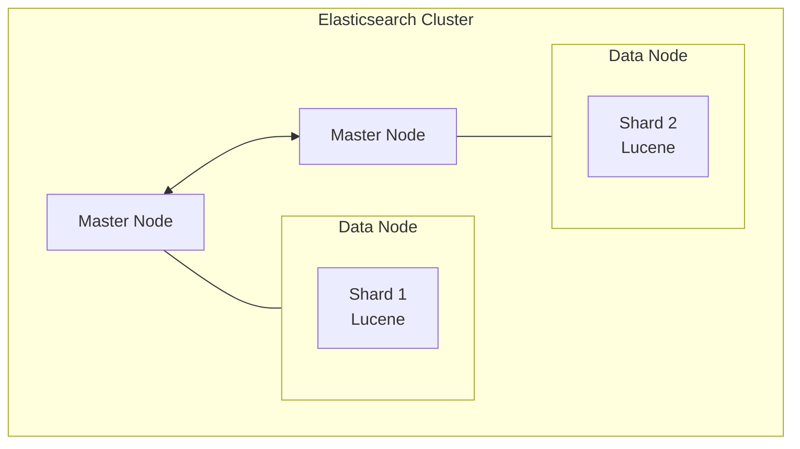
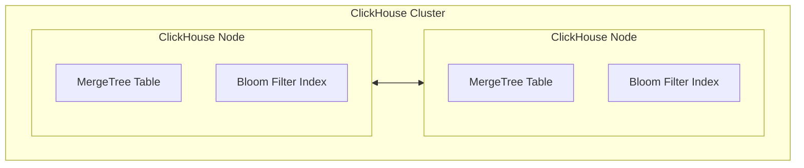
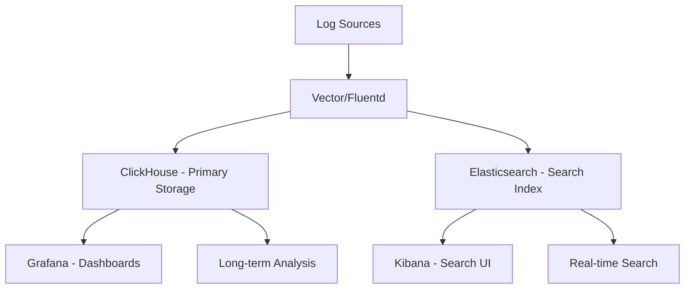

# ClickHouse vs Elasticsearch for Log Analytics

Author: [nawazdhandala](https://www.github.com/nawazdhandala)

Tags: ClickHouse, Elasticsearch, Comparison, Log Analytics, Search, Cost Analysis

Description: A comprehensive comparison of ClickHouse and Elasticsearch for log analytics, covering search capabilities, aggregation performance, storage costs, and guidance on choosing the right solution for your logging needs.

---

Log analytics is one of the most common use cases for both ClickHouse and Elasticsearch. While Elasticsearch has been the traditional choice with the ELK stack, ClickHouse offers compelling advantages in cost and performance. This guide provides a detailed comparison to help you choose the right solution.

## Architecture Comparison

### Elasticsearch Architecture



Key characteristics:
- Document-oriented (JSON)
- Inverted index for full-text search
- Lucene-based storage
- REST API interface
- Near real-time search

### ClickHouse Architecture



Key characteristics:
- Column-oriented storage
- MergeTree engine family
- Bloom filter indexes for text
- SQL interface
- Batch-oriented ingestion

## Feature Comparison

| Feature | ClickHouse | Elasticsearch |
|---------|------------|---------------|
| Query Language | SQL | Query DSL, EQL, SQL |
| Full-Text Search | Basic (tokenbf_v1) | Advanced (BM25, fuzzy) |
| Aggregations | Excellent | Good |
| Storage Efficiency | 10-30x compression | 1.5-3x compression |
| Relevance Scoring | Manual | Built-in (TF-IDF, BM25) |
| Schema | Strict | Dynamic |
| Nested Objects | Arrays, Maps | Full nested support |
| Joins | Supported | Limited |
| Alerting | External | Built-in (X-Pack) |
| Visualization | Grafana | Kibana (native) |

## Search Capabilities

### Elasticsearch Full-Text Search

```json
// Advanced full-text search
{
  "query": {
    "bool": {
      "must": [
        {
          "match": {
            "message": {
              "query": "connection timeout error",
              "operator": "and"
            }
          }
        }
      ],
      "filter": [
        {"term": {"level": "error"}},
        {"range": {"@timestamp": {"gte": "now-1h"}}}
      ]
    }
  },
  "highlight": {
    "fields": {"message": {}}
  },
  "aggs": {
    "by_service": {
      "terms": {"field": "service.keyword"}
    }
  }
}
```

Features:
- BM25 relevance scoring
- Fuzzy matching
- Phrase queries
- Highlighting
- Synonyms
- Stemming

### ClickHouse Text Search

```sql
-- Token-based search with bloom filter
SELECT
    timestamp,
    level,
    service,
    message
FROM logs
WHERE timestamp >= now() - INTERVAL 1 HOUR
  AND level = 'error'
  AND hasToken(lower(message), 'timeout')
  AND hasToken(lower(message), 'connection')
ORDER BY timestamp DESC
LIMIT 100;

-- Multi-pattern search
SELECT
    timestamp,
    message
FROM logs
WHERE multiSearchAnyCaseInsensitive(message, ['timeout', 'error', 'failed'])
  AND timestamp >= now() - INTERVAL 1 HOUR
ORDER BY timestamp DESC;

-- Regular expression search
SELECT *
FROM logs
WHERE match(message, 'error.*timeout|timeout.*error')
  AND timestamp >= now() - INTERVAL 1 HOUR;
```

Features:
- Token-based search
- Bloom filter acceleration
- Regular expressions
- Multi-pattern matching
- Case-insensitive options

## Aggregation Performance

### ClickHouse Aggregations

```sql
-- Complex aggregation query (extremely fast)
SELECT
    toStartOfMinute(timestamp) AS minute,
    service,
    level,
    count() AS log_count,
    uniqExact(trace_id) AS unique_traces,
    quantile(0.95)(response_time) AS p95_response
FROM logs
WHERE timestamp >= now() - INTERVAL 24 HOUR
GROUP BY minute, service, level
ORDER BY minute DESC, log_count DESC;

-- Typical: 100ms-500ms for billions of logs
```

### Elasticsearch Aggregations

```json
{
  "size": 0,
  "query": {
    "range": {
      "@timestamp": {"gte": "now-24h"}
    }
  },
  "aggs": {
    "by_minute": {
      "date_histogram": {
        "field": "@timestamp",
        "fixed_interval": "1m"
      },
      "aggs": {
        "by_service": {
          "terms": {"field": "service.keyword"},
          "aggs": {
            "by_level": {
              "terms": {"field": "level.keyword"},
              "aggs": {
                "unique_traces": {
                  "cardinality": {"field": "trace_id"}
                },
                "p95_response": {
                  "percentiles": {
                    "field": "response_time",
                    "percents": [95]
                  }
                }
              }
            }
          }
        }
      }
    }
  }
}

// Typical: 1-5 seconds for billions of logs
```

## Storage and Cost Comparison

### Storage Efficiency

```sql
-- ClickHouse: Check compression ratio
SELECT
    table,
    formatReadableSize(sum(data_compressed_bytes)) AS compressed,
    formatReadableSize(sum(data_uncompressed_bytes)) AS uncompressed,
    round(sum(data_uncompressed_bytes) / sum(data_compressed_bytes), 1) AS ratio
FROM system.columns
WHERE database = 'default' AND table = 'logs'
GROUP BY table;

-- Typical result:
-- | table | compressed | uncompressed | ratio |
-- | logs  | 45 GB      | 890 GB       | 19.8  |
```

### Cost Analysis (100TB/month raw logs)

| Metric | ClickHouse | Elasticsearch |
|--------|------------|---------------|
| Compressed Storage | ~5-10 TB | ~30-50 TB |
| Storage Cost (S3-based) | ~$150/mo | ~$1,000/mo |
| Compute (equivalent perf) | 4-8 nodes | 15-30 nodes |
| Compute Cost | ~$2,000/mo | ~$6,000/mo |
| **Total Estimated** | **~$2,500/mo** | **~$8,000/mo** |

## Schema Design Comparison

### Elasticsearch Mapping

```json
{
  "mappings": {
    "properties": {
      "@timestamp": {"type": "date"},
      "level": {"type": "keyword"},
      "service": {"type": "keyword"},
      "host": {"type": "keyword"},
      "message": {
        "type": "text",
        "fields": {
          "keyword": {"type": "keyword", "ignore_above": 256}
        }
      },
      "trace_id": {"type": "keyword"},
      "labels": {"type": "object", "dynamic": true},
      "response_time": {"type": "float"}
    }
  }
}
```

### ClickHouse Schema

```sql
CREATE TABLE logs (
    timestamp DateTime64(3),
    date Date MATERIALIZED toDate(timestamp),
    level LowCardinality(String),
    service LowCardinality(String),
    host LowCardinality(String),
    message String,
    message_lower String MATERIALIZED lower(message),
    trace_id String,
    labels Map(String, String),
    response_time Float32,
    -- Indexes for search
    INDEX msg_token message_lower TYPE tokenbf_v1(32768, 3, 0) GRANULARITY 4,
    INDEX trace_bf trace_id TYPE bloom_filter GRANULARITY 4
) ENGINE = MergeTree()
PARTITION BY date
ORDER BY (service, level, timestamp)
TTL date + INTERVAL 30 DAY
SETTINGS index_granularity = 8192;
```

## Data Ingestion Comparison

### Elasticsearch Ingestion

```bash
# Bulk API
curl -X POST "localhost:9200/_bulk" -H 'Content-Type: application/json' --data-binary @logs.ndjson

# Logstash pipeline
input {
  beats { port => 5044 }
}
filter {
  grok {
    match => { "message" => "%{TIMESTAMP_ISO8601:timestamp} %{LOGLEVEL:level} %{GREEDYDATA:message}" }
  }
}
output {
  elasticsearch {
    hosts => ["elasticsearch:9200"]
    index => "logs-%{+YYYY.MM.dd}"
  }
}
```

### ClickHouse Ingestion

```sql
-- Direct insert with async
INSERT INTO logs
SETTINGS async_insert = 1, wait_for_async_insert = 0
FORMAT JSONEachRow
{"timestamp": "2024-01-15 10:00:00", "level": "error", "message": "..."}

-- Kafka integration
CREATE TABLE logs_kafka AS logs
ENGINE = Kafka
SETTINGS
    kafka_broker_list = 'kafka:9092',
    kafka_topic_list = 'logs',
    kafka_group_name = 'clickhouse',
    kafka_format = 'JSONEachRow';

CREATE MATERIALIZED VIEW logs_mv TO logs AS
SELECT * FROM logs_kafka;

-- Vector integration (recommended)
# vector.toml
[sinks.clickhouse]
type = "clickhouse"
endpoint = "http://clickhouse:8123"
table = "logs"
database = "default"
```

## Use Case Recommendations

### Choose ClickHouse When:

1. **Cost is important** - 3-5x lower TCO
2. **Aggregations dominate** - Dashboards, metrics from logs
3. **High volume** - Billions of logs per day
4. **SQL preferred** - Team knows SQL
5. **Structured logs** - JSON with known schema
6. **Long retention** - Cost-effective storage

```sql
-- ClickHouse excels here
SELECT
    service,
    toStartOfHour(timestamp) AS hour,
    countIf(level = 'error') AS errors,
    countIf(level = 'error') / count() * 100 AS error_rate,
    quantile(0.99)(response_time) AS p99_latency
FROM logs
WHERE timestamp >= now() - INTERVAL 7 DAY
GROUP BY service, hour
ORDER BY hour DESC, errors DESC;
```

### Choose Elasticsearch When:

1. **Full-text search critical** - Complex search queries
2. **Fuzzy matching needed** - Typo tolerance, synonyms
3. **Kibana required** - Team depends on Kibana
4. **Relevance scoring** - Search result ranking
5. **Real-time search** - Sub-second search after ingest
6. **Existing ELK stack** - Migration cost too high

```json
// Elasticsearch excels here
{
  "query": {
    "bool": {
      "should": [
        {"match_phrase": {"message": "connection refused"}},
        {"fuzzy": {"message": {"value": "conection", "fuzziness": "AUTO"}}},
        {"match": {"message": {"query": "network timeout", "boost": 2}}}
      ],
      "minimum_should_match": 1
    }
  },
  "highlight": {"fields": {"message": {}}}
}
```

## Migration Path

### Elasticsearch to ClickHouse

```python
# Export from Elasticsearch
from elasticsearch import Elasticsearch
from elasticsearch.helpers import scan

es = Elasticsearch(['localhost:9200'])

# Scroll through documents
docs = scan(es, index='logs-*', query={'match_all': {}})

# Write to ClickHouse
import clickhouse_driver

client = clickhouse_driver.Client('localhost')

batch = []
for doc in docs:
    source = doc['_source']
    batch.append({
        'timestamp': source['@timestamp'],
        'level': source.get('level', ''),
        'service': source.get('service', ''),
        'message': source.get('message', '')
    })

    if len(batch) >= 10000:
        client.execute('INSERT INTO logs VALUES', batch)
        batch = []
```

### Running Both (Hybrid)



## Performance Benchmarks

| Query Type | ClickHouse | Elasticsearch |
|------------|------------|---------------|
| Count last hour | 50ms | 200ms |
| Aggregation (1B rows) | 200ms | 2-5s |
| Full-text search | 100-500ms | 50-200ms |
| Fuzzy search | N/A | 100-500ms |
| Ingest rate | 1M+ rows/s | 100-300K docs/s |
| Storage (1TB raw) | 50-100GB | 300-500GB |

## Conclusion

The choice between ClickHouse and Elasticsearch for log analytics depends on your priorities:

**Choose ClickHouse for:**
- Cost optimization (3-5x savings)
- Aggregation-heavy workloads
- SQL-based analysis
- High-volume logging
- Long retention requirements

**Choose Elasticsearch for:**
- Advanced full-text search
- Fuzzy matching and relevance
- Kibana dependency
- Real-time search requirements
- Existing ELK investment

Many organizations are migrating from Elasticsearch to ClickHouse for log storage while keeping Elasticsearch for search-specific use cases, achieving significant cost savings while maintaining search capabilities where needed.
