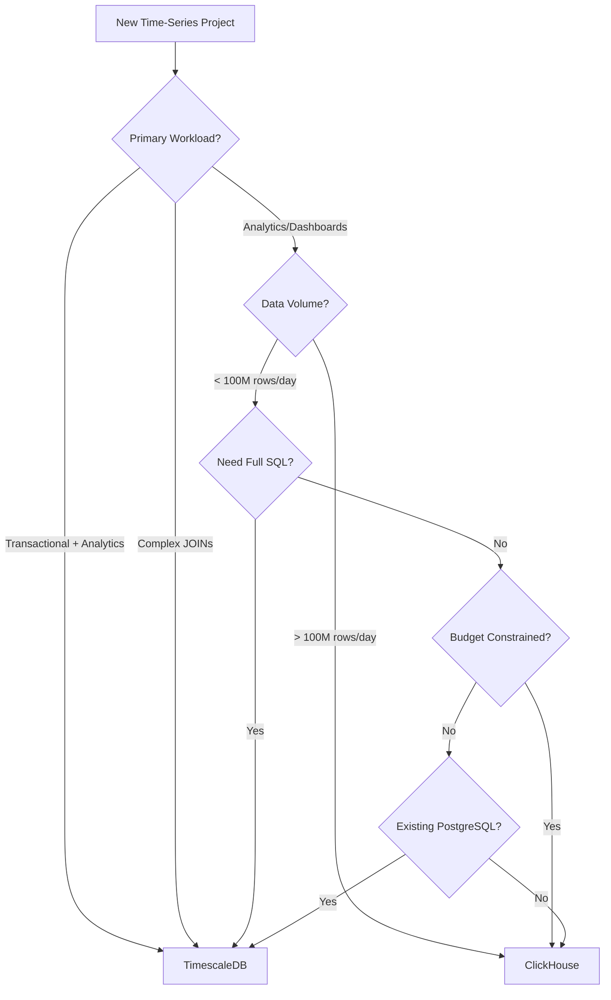

# ClickHouse vs TimescaleDB: Which to Choose for Time-Series Data

Author: [nawazdhandala](https://www.github.com/nawazdhandala)

Tags: ClickHouse, TimescaleDB, Comparison, Time-Series, Database Selection, Performance

Description: A comprehensive comparison of ClickHouse and TimescaleDB for time-series data, covering architecture differences, performance benchmarks, feature comparison, and guidance on choosing the right database for your use case.

---

When building time-series applications, choosing the right database is crucial. ClickHouse and TimescaleDB are both excellent choices, but they have fundamentally different architectures and excel in different scenarios. This guide provides a detailed comparison to help you make an informed decision.

## Architecture Overview

### ClickHouse Architecture

ClickHouse is a column-oriented OLAP database built from the ground up for analytical queries:

```
ClickHouse Architecture:
- Columnar storage format
- MergeTree engine family
- Vectorized query execution
- Shared-nothing distributed architecture
- Custom compression per column
```

Key characteristics:
- Designed for high-throughput analytical queries
- Processes billions of rows in seconds
- Optimized for wide tables with many columns
- Native distributed query execution

### TimescaleDB Architecture

TimescaleDB is a time-series extension built on PostgreSQL:

```
TimescaleDB Architecture:
- Row-oriented storage (PostgreSQL)
- Hypertables with automatic partitioning
- Chunk-based storage
- PostgreSQL-compatible
- Shared-disk or shared-nothing deployment
```

Key characteristics:
- Full SQL and PostgreSQL compatibility
- Automatic time-based partitioning (chunks)
- Built-in compression with type-specific algorithms
- Leverages PostgreSQL ecosystem

## Feature Comparison

| Feature | ClickHouse | TimescaleDB |
|---------|------------|-------------|
| Storage Model | Columnar | Row-based (with columnar compression) |
| SQL Compatibility | ANSI SQL subset | Full PostgreSQL SQL |
| JOINs | Limited optimization | Full PostgreSQL JOINs |
| Transactions | Limited (async inserts) | Full ACID |
| Updates/Deletes | Async mutations | Real-time |
| Compression | 10-40x | 10-20x |
| Clustering | Native sharding | Multi-node (Enterprise) |
| Replication | Native | PostgreSQL streaming |

## Query Performance Comparison

### Aggregation Queries

ClickHouse excels at aggregation:

```sql
-- ClickHouse: Highly optimized for this pattern
SELECT
    toStartOfHour(timestamp) AS hour,
    avg(value),
    max(value),
    count()
FROM metrics
WHERE timestamp >= now() - INTERVAL 7 DAY
GROUP BY hour
ORDER BY hour;

-- TimescaleDB equivalent
SELECT
    time_bucket('1 hour', timestamp) AS hour,
    avg(value),
    max(value),
    count(*)
FROM metrics
WHERE timestamp >= NOW() - INTERVAL '7 days'
GROUP BY hour
ORDER BY hour;
```

Typical performance:
- ClickHouse: ~100ms for 1B rows
- TimescaleDB: ~500ms-2s for 1B rows (with continuous aggregates: ~100ms)

### Point Queries

TimescaleDB performs better for point lookups:

```sql
-- TimescaleDB: Efficient with proper indexes
SELECT * FROM metrics
WHERE device_id = 12345
  AND timestamp = '2024-01-15 10:30:00';

-- ClickHouse: Requires full granule scan
SELECT * FROM metrics
WHERE device_id = 12345
  AND timestamp = '2024-01-15 10:30:00.000';
```

### Complex Joins

TimescaleDB has better JOIN performance:

```sql
-- TimescaleDB: Leverages PostgreSQL query planner
SELECT m.*, d.device_name, l.location_name
FROM metrics m
JOIN devices d ON m.device_id = d.id
JOIN locations l ON d.location_id = l.id
WHERE m.timestamp >= NOW() - INTERVAL '1 hour';

-- ClickHouse: JOINs can be memory-intensive
SELECT m.*, d.device_name, l.location_name
FROM metrics m
LEFT JOIN devices d ON m.device_id = d.id
LEFT JOIN locations l ON d.location_id = l.id
WHERE m.timestamp >= now() - INTERVAL 1 HOUR;
```

## Data Ingestion Comparison

### ClickHouse Ingestion

```sql
-- Optimized for batch inserts
INSERT INTO metrics
SELECT
    rand() % 10000 AS device_id,
    now() + number AS timestamp,
    rand() / 1000000000.0 AS value
FROM numbers(1000000);

-- Async inserts for high-frequency single rows
INSERT INTO metrics
SETTINGS async_insert = 1
VALUES (1, now(), 25.5);
```

Ingestion rates:
- Batch inserts: 1-2M rows/second per node
- Async inserts: 100K+ rows/second per node

### TimescaleDB Ingestion

```sql
-- Standard PostgreSQL inserts
INSERT INTO metrics (device_id, timestamp, value)
VALUES (1, NOW(), 25.5);

-- Batch with COPY (fastest)
COPY metrics FROM '/path/to/data.csv' WITH (FORMAT csv);

-- Multi-row VALUES
INSERT INTO metrics (device_id, timestamp, value)
VALUES
    (1, NOW(), 25.5),
    (2, NOW(), 26.3),
    (3, NOW(), 24.8);
```

Ingestion rates:
- COPY: 200-500K rows/second
- Multi-row INSERT: 50-100K rows/second
- Single INSERT: 10-30K rows/second

## Compression Comparison

### ClickHouse Compression

```sql
-- Column-specific codecs for optimal compression
CREATE TABLE metrics (
    timestamp DateTime64(3) CODEC(Delta, ZSTD(1)),
    device_id UInt32 CODEC(Delta, LZ4),
    value Float64 CODEC(Gorilla, ZSTD(1))
) ENGINE = MergeTree()
ORDER BY (device_id, timestamp);

-- Check compression ratio
SELECT
    column,
    formatReadableSize(sum(data_compressed_bytes)) AS compressed,
    formatReadableSize(sum(data_uncompressed_bytes)) AS uncompressed,
    round(sum(data_uncompressed_bytes) / sum(data_compressed_bytes), 1) AS ratio
FROM system.columns
WHERE table = 'metrics'
GROUP BY column;
```

Typical compression: 10-40x depending on data patterns

### TimescaleDB Compression

```sql
-- Enable native compression
ALTER TABLE metrics SET (
    timescaledb.compress,
    timescaledb.compress_segmentby = 'device_id',
    timescaledb.compress_orderby = 'timestamp DESC'
);

-- Set compression policy
SELECT add_compression_policy('metrics', INTERVAL '7 days');

-- Check compression
SELECT
    pg_size_pretty(before_compression_total_bytes) AS before,
    pg_size_pretty(after_compression_total_bytes) AS after,
    round(before_compression_total_bytes::numeric /
          after_compression_total_bytes, 1) AS ratio
FROM hypertable_compression_stats('metrics');
```

Typical compression: 10-20x

## Scaling Comparison

### ClickHouse Scaling

```sql
-- Native distributed tables
CREATE TABLE metrics_distributed AS metrics
ENGINE = Distributed(
    'cluster_name',
    'default',
    'metrics',
    sipHash64(device_id)  -- Sharding key
);

-- Query transparently distributed
SELECT avg(value)
FROM metrics_distributed
WHERE timestamp >= now() - INTERVAL 1 DAY;
```

Scaling characteristics:
- Linear horizontal scaling
- No single point of failure
- Automatic query distribution
- Built-in replication

### TimescaleDB Scaling

```sql
-- TimescaleDB multi-node (Enterprise feature)
SELECT add_data_node('node1', host => 'host1');
SELECT add_data_node('node2', host => 'host2');

-- Create distributed hypertable
SELECT create_distributed_hypertable(
    'metrics',
    'timestamp',
    'device_id',  -- Partition key
    data_nodes => ARRAY['node1', 'node2']
);
```

Scaling characteristics:
- Multi-node requires Enterprise license
- PostgreSQL streaming replication (free)
- Read replicas for scaling reads
- Connection pooling (PgBouncer)

## Use Case Recommendations

### Choose ClickHouse When:

1. **High-volume analytics** - Processing billions of rows for dashboards
2. **Log analytics** - Storing and searching large volumes of logs
3. **Real-time aggregations** - Sub-second GROUP BY queries
4. **Wide tables** - Many columns with sparse data
5. **Cost-sensitive** - Need maximum compression
6. **Simple data model** - Limited JOIN requirements

```sql
-- ClickHouse shines here
SELECT
    toStartOfMinute(timestamp) AS minute,
    service,
    quantile(0.99)(duration) AS p99,
    count() AS requests
FROM traces
WHERE timestamp >= now() - INTERVAL 1 HOUR
GROUP BY minute, service
ORDER BY minute;
```

### Choose TimescaleDB When:

1. **Complex queries** - Need full SQL and JOINs
2. **Transactional + analytical** - HTAP workloads
3. **PostgreSQL ecosystem** - Existing tools and extensions
4. **Real-time updates** - Frequent UPDATE/DELETE operations
5. **Geospatial data** - PostGIS integration
6. **Continuous aggregates** - Incrementally maintained views

```sql
-- TimescaleDB shines here
WITH device_stats AS (
    SELECT
        device_id,
        time_bucket('1 hour', timestamp) AS hour,
        avg(temperature) AS avg_temp
    FROM metrics
    WHERE timestamp >= NOW() - INTERVAL '24 hours'
    GROUP BY device_id, hour
)
SELECT
    d.device_name,
    d.location,
    ds.hour,
    ds.avg_temp,
    l.threshold
FROM device_stats ds
JOIN devices d ON ds.device_id = d.id
JOIN location_thresholds l ON d.location = l.location
WHERE ds.avg_temp > l.threshold;
```

## Migration Considerations

### From TimescaleDB to ClickHouse

```python
# Export from TimescaleDB
# psql -c "COPY metrics TO '/tmp/metrics.csv' WITH CSV HEADER"

# Import to ClickHouse
clickhouse-client --query "
    INSERT INTO metrics
    SELECT *
    FROM file('/tmp/metrics.csv', CSVWithNames)
"
```

Key considerations:
- Denormalize data (avoid JOINs)
- Convert UPDATE logic to ReplacingMergeTree
- Adapt to async mutation model
- Rewrite continuous aggregates as materialized views

### From ClickHouse to TimescaleDB

```python
# Export from ClickHouse
# clickhouse-client --query "SELECT * FROM metrics FORMAT CSVWithNames" > metrics.csv

# Import to TimescaleDB
# psql -c "\COPY metrics FROM 'metrics.csv' WITH CSV HEADER"
```

Key considerations:
- Create appropriate indexes for JOINs
- Set up compression policies
- Configure continuous aggregates
- Adjust for row-based storage patterns

## Cost Comparison

### Storage Costs

| Metric | ClickHouse | TimescaleDB |
|--------|------------|-------------|
| Compression Ratio | 20-40x | 10-20x |
| Storage per 1B rows | ~10-20 GB | ~30-50 GB |
| Cloud storage cost (1TB) | ~$20/mo | ~$40-60/mo |

### Compute Costs

| Metric | ClickHouse | TimescaleDB |
|--------|------------|-------------|
| Aggregation CPU | Lower | Higher |
| JOIN CPU | Higher | Lower |
| Insert CPU | Lower (batch) | Higher |

## Decision Matrix



## Conclusion

Both ClickHouse and TimescaleDB are excellent time-series databases, but they serve different needs:

**Choose ClickHouse for:**
- Maximum query performance on aggregations
- Highest compression ratios
- Log and event analytics
- Cost-optimized analytical workloads

**Choose TimescaleDB for:**
- Full PostgreSQL compatibility
- Complex JOINs and relational queries
- Mixed transactional/analytical workloads
- Existing PostgreSQL infrastructure

The best choice depends on your specific requirements around query patterns, data volume, existing infrastructure, and operational preferences.
