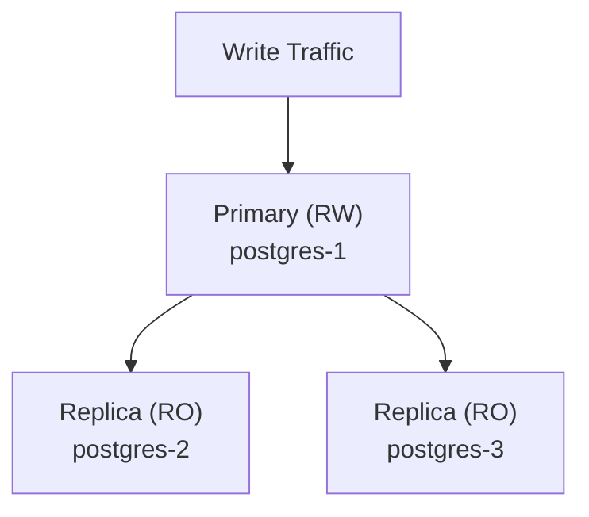

# How to Configure High Availability with CloudNativePG

Author: [nawazdhandala](https://www.github.com/nawazdhandala)

Tags: CloudNativePG, Kubernetes, PostgreSQL, High Availability, Failover, Replication

Description: A comprehensive guide to configuring high availability PostgreSQL clusters with CloudNativePG, covering automatic failover, replica configuration, pod anti-affinity, and production HA best practices.

---

High availability is critical for production PostgreSQL deployments. CloudNativePG provides built-in HA capabilities with automatic failover, streaming replication, and self-healing. This guide covers everything you need to configure robust HA PostgreSQL clusters.

## Prerequisites

- Kubernetes cluster with multiple nodes
- CloudNativePG operator installed
- Understanding of PostgreSQL replication concepts

## HA Architecture Overview

CloudNativePG implements HA through:

1. **Primary-Replica Architecture**: One primary (read-write) and multiple replicas (read-only)
2. **Streaming Replication**: Synchronous or asynchronous WAL streaming
3. **Automatic Failover**: Operator promotes replica when primary fails
4. **Self-Healing**: Automatic recovery of failed instances



## Basic HA Configuration

### Minimum HA Cluster

```yaml
apiVersion: postgresql.cnpg.io/v1
kind: Cluster
metadata:
  name: postgres-ha
  namespace: default
spec:
  instances: 3  # 1 primary + 2 replicas

  storage:
    size: 10Gi

  # Spread pods across nodes
  affinity:
    enablePodAntiAffinity: true
    topologyKey: kubernetes.io/hostname
```

### Production HA Cluster

```yaml
apiVersion: postgresql.cnpg.io/v1
kind: Cluster
metadata:
  name: postgres-production
  namespace: production
spec:
  instances: 3
  imageName: ghcr.io/cloudnative-pg/postgresql:16.1

  postgresql:
    parameters:
      # Replication settings
      wal_level: "replica"
      max_wal_senders: "10"
      max_replication_slots: "10"
      hot_standby: "on"
      hot_standby_feedback: "on"

      # Memory and performance
      shared_buffers: "2GB"
      effective_cache_size: "6GB"

  storage:
    size: 100Gi
    storageClass: fast-ssd

  # Resource allocation
  resources:
    requests:
      memory: "4Gi"
      cpu: "2"
    limits:
      memory: "8Gi"
      cpu: "4"

  # HA scheduling configuration
  affinity:
    enablePodAntiAffinity: true
    topologyKey: kubernetes.io/hostname
    podAntiAffinityType: required

  # Replication configuration
  replicationSlots:
    highAvailability:
      enabled: true
      slotPrefix: _cnpg_

  # Failover behavior
  failoverDelay: 0
  switchoverDelay: 40  # seconds

  # Primary update strategy
  primaryUpdateStrategy: unsupervised
  primaryUpdateMethod: switchover

  # Synchronous replication (if required)
  # postgresql:
  #   synchronous:
  #     method: any
  #     number: 1
  #     dataDurability: required
```

## Pod Anti-Affinity Configuration

### Required Anti-Affinity (Strict)

Pods must be on different nodes:

```yaml
spec:
  affinity:
    enablePodAntiAffinity: true
    topologyKey: kubernetes.io/hostname
    podAntiAffinityType: required
```

### Preferred Anti-Affinity (Soft)

Try to spread, but allow co-location if necessary:

```yaml
spec:
  affinity:
    enablePodAntiAffinity: true
    topologyKey: kubernetes.io/hostname
    podAntiAffinityType: preferred
```

### Zone-Level Anti-Affinity

Spread across availability zones:

```yaml
spec:
  affinity:
    enablePodAntiAffinity: true
    topologyKey: topology.kubernetes.io/zone
    podAntiAffinityType: required
```

### Combined Node and Zone Anti-Affinity

```yaml
spec:
  affinity:
    enablePodAntiAffinity: true
    topologyKey: kubernetes.io/hostname
    podAntiAffinityType: required

    additionalPodAntiAffinity:
      preferredDuringSchedulingIgnoredDuringExecution:
        - weight: 100
          podAffinityTerm:
            topologyKey: topology.kubernetes.io/zone
            labelSelector:
              matchLabels:
                cnpg.io/cluster: postgres-production
```

### Topology Spread Constraints

For more control over pod distribution:

```yaml
spec:
  topologySpreadConstraints:
    - maxSkew: 1
      topologyKey: topology.kubernetes.io/zone
      whenUnsatisfiable: DoNotSchedule
      labelSelector:
        matchLabels:
          cnpg.io/cluster: postgres-production
    - maxSkew: 1
      topologyKey: kubernetes.io/hostname
      whenUnsatisfiable: ScheduleAnyway
      labelSelector:
        matchLabels:
          cnpg.io/cluster: postgres-production
```

## Synchronous Replication

### Enable Synchronous Replication

For zero data loss (RPO = 0):

```yaml
spec:
  instances: 3

  postgresql:
    synchronous:
      method: any
      number: 1
      dataDurability: required
    parameters:
      # Synchronous commit level
      synchronous_commit: "remote_apply"  # Strongest durability
```

### Synchronous Commit Levels

| Level | Data Safety | Performance |
|-------|-------------|-------------|
| `off` | Lowest | Highest |
| `local` | Local WAL | High |
| `remote_write` | WAL shipped | Medium |
| `on` | WAL flushed remotely | Medium |
| `remote_apply` | Applied on replica | Lowest |

### Quorum-Based Sync Replication

```yaml
spec:
  instances: 5

  postgresql:
    synchronous:
      method: any
      number: 2
      dataDurability: required
    parameters:
      synchronous_commit: "on"
```

## Failover Configuration

### Automatic Failover Behavior

```yaml
spec:
  # Delay before failover (seconds, 0 = immediate)
  failoverDelay: 0

  # Optional: keep lagging replicas out of failover/read-only service eligibility
  probes:
    readiness:
      type: streaming
      maximumLag: 64Mi
```

### Monitoring Failover

```bash
# Watch cluster status

kubectl get cluster postgres-ha -w

# Check current primary
kubectl get pods -l cnpg.io/cluster=postgres-ha -L cnpg.io/instanceRole

# View events during failover
kubectl get events --field-selector involvedObject.name=postgres-ha --sort-by='.lastTimestamp'
```

### Manual Switchover

Trigger planned switchover to specific instance:

```bash
# Using cnpg plugin
kubectl cnpg promote postgres-ha postgres-ha-2
```

### Fence Primary (Emergency)

Fence the primary instance without promoting a new primary:

```bash
kubectl annotate cluster postgres-ha \
  cnpg.io/fencedInstances='["postgres-ha-1"]'
```

## Replication Slots

### HA Replication Slots

```yaml
spec:
  replicationSlots:
    highAvailability:
      enabled: true
      slotPrefix: _cnpg_

    # Update mechanism
    updateInterval: 30  # seconds
```

### Physical Replication Slots for Replicas

Ensures replicas don't lose data during maintenance:

```yaml
spec:
  replicationSlots:
    highAvailability:
      enabled: true
      slotPrefix: _cnpg_

  postgresql:
    parameters:
      # Ensure slots are created
      max_replication_slots: "10"
```

## Self-Healing and Recovery

### Pod Disruption Budget

CloudNativePG creates PDB automatically. Customize:

```yaml
spec:
  # Disable operator-managed PDBs only for non-production cases
  enablePDB: false
```

### Instance Recovery

When a pod fails:

1. Kubernetes restarts the pod
2. CloudNativePG detects the instance
3. If replica: rejoins cluster
4. If primary: remains primary (if pod restarts quickly)
5. If primary failed: replica promoted

### Storage Recovery

```yaml
spec:
  storage:
    size: 100Gi
    storageClass: fast-ssd

    # Enable resize if storage class supports
    resizeInUseVolumes: true

  # WAL recovery settings
  postgresql:
    parameters:
      # Recovery target settings (for PITR)
      recovery_target_time: ""  # Set during recovery
```

## Read Replica Configuration

### Dedicated Read Replicas

Route read traffic to replicas:

```yaml
apiVersion: postgresql.cnpg.io/v1
kind: Cluster
metadata:
  name: postgres-ha
spec:
  instances: 5  # 1 primary + 4 replicas

  # Replica configuration
  replica:
    enabled: false  # This cluster is primary

  postgresql:
    parameters:
      # Optimize replicas for reads
      hot_standby: "on"
      hot_standby_feedback: "on"
      max_standby_streaming_delay: "30s"
```

### Connect to Read Replicas

```bash
# List services
kubectl get svc -l cnpg.io/cluster=postgres-ha

# Services:
# postgres-ha-rw  - Primary only (read-write)
# postgres-ha-ro  - Replicas only (read-only)
# postgres-ha-r   - Any instance
```

Application connection strings:

```yaml
# Read-write connection (primary)
host: postgres-ha-rw.default.svc
port: 5432

# Read-only connection (replicas)
host: postgres-ha-ro.default.svc
port: 5432
```

## Multi-Zone HA Setup

### Three-Zone Configuration

```yaml
apiVersion: postgresql.cnpg.io/v1
kind: Cluster
metadata:
  name: postgres-multi-zone
spec:
  instances: 3

  storage:
    size: 100Gi
    storageClass: regional-ssd  # Zone-replicated storage

  # Spread across zones
  affinity:
    enablePodAntiAffinity: true
    topologyKey: topology.kubernetes.io/zone
    podAntiAffinityType: required

  # Tolerate zone failures
  topologySpreadConstraints:
    - maxSkew: 1
      topologyKey: topology.kubernetes.io/zone
      whenUnsatisfiable: DoNotSchedule
      labelSelector:
        matchLabels:
          cnpg.io/cluster: postgres-multi-zone

  postgresql:
    synchronous:
      method: any
      number: 1
      dataDurability: required
    parameters:
      synchronous_commit: "on"
```

### Zone-Aware Node Selection

```yaml
spec:
  affinity:
    nodeAffinity:
      requiredDuringSchedulingIgnoredDuringExecution:
        nodeSelectorTerms:
          - matchExpressions:
              - key: topology.kubernetes.io/zone
                operator: In
                values:
                  - us-east-1a
                  - us-east-1b
                  - us-east-1c
```

## Monitoring HA Status

### Cluster Status

```bash
# Overall cluster health
kubectl get cluster postgres-ha

# Detailed status
kubectl describe cluster postgres-ha

# Pod roles
kubectl get pods -l cnpg.io/cluster=postgres-ha -L cnpg.io/instanceRole

# Check replication lag
kubectl exec postgres-ha-1 -- psql -c "SELECT * FROM pg_stat_replication;"
```

### Prometheus Metrics

Key HA metrics to monitor:

```text
# Replication lag (seconds)
cnpg_pg_replication_lag

# Replica recovery status
cnpg_pg_replication_in_recovery

# Streaming replicas connected to the instance
cnpg_pg_replication_streaming_replicas

# PostgreSQL availability
cnpg_collector_up
```

### Alert Rules

```yaml
groups:
  - name: cloudnativepg-ha
    rules:
      - alert: PostgreSQLClusterDegraded
        expr: cnpg_collector_up == 0
        for: 5m
        labels:
          severity: warning
        annotations:
          summary: "PostgreSQL cluster degraded"
          description: "PostgreSQL is down on {{ $labels.pod }}"

      - alert: PostgreSQLHighReplicationLag
        expr: cnpg_pg_replication_lag > 30
        for: 5m
        labels:
          severity: warning
        annotations:
          summary: "High replication lag"
          description: "Replication lag is {{ $value }}s on {{ $labels.instance }}"

      - alert: ReplicaFailingReplication
        expr: cnpg_pg_replication_in_recovery > cnpg_pg_replication_is_wal_receiver_up
        for: 1m
        labels:
          severity: warning
        annotations:
          summary: "Replica is failing to replicate"
```

## Testing HA

### Simulate Primary Failure

```bash
# Delete primary pod
kubectl delete pod postgres-ha-1

# Watch failover
kubectl get pods -l cnpg.io/cluster=postgres-ha -w

# Check new primary
kubectl get pods -l cnpg.io/cluster=postgres-ha -L cnpg.io/instanceRole
```

### Simulate Node Failure

```bash
# Cordon node (prevent scheduling)
kubectl cordon node-1

# Drain node (evict pods)
kubectl drain node-1 --ignore-daemonsets --delete-emptydir-data

# Watch cluster recovery
kubectl get pods -l cnpg.io/cluster=postgres-ha -o wide -w

# Uncordon node
kubectl uncordon node-1
```

### Network Partition Test

```bash
# Block network to primary pod
kubectl exec postgres-ha-1 -- iptables -A INPUT -p tcp --dport 5432 -j DROP

# Watch failover (timeout-based)
kubectl get cluster postgres-ha -w
```

## Best Practices

### Minimum Configuration for HA

```yaml
spec:
  instances: 3  # Minimum for HA with failover
  affinity:
    enablePodAntiAffinity: true
    topologyKey: kubernetes.io/hostname
    podAntiAffinityType: required
```

### Production HA Checklist

1. **Minimum 3 instances** for stronger HA and maintenance flexibility
2. **Pod anti-affinity** across nodes or zones
3. **Separate WAL storage** for better I/O
4. **Synchronous replication** if zero data loss required
5. **Backup to object storage** for disaster recovery
6. **Monitoring and alerting** for replication lag
7. **Regular failover testing** to verify HA works

### Sizing Recommendations

| Workload | Instances | Sync Replicas | Zones |
|----------|-----------|---------------|-------|
| Development | 1-2 | 0 | 1 |
| Staging | 3 | 0-1 | 1-2 |
| Production | 3-5 | 1-2 | 2-3 |
| Critical | 5+ | 2+ | 3+ |

## Conclusion

CloudNativePG provides robust HA capabilities out of the box:

1. **Automatic failover** with minimal downtime
2. **Flexible replication** - sync or async
3. **Self-healing** for failed instances
4. **Multi-zone support** for regional resilience
5. **Easy monitoring** with Prometheus metrics

Configure HA based on your RPO/RTO requirements and regularly test failover scenarios to ensure your cluster behaves as expected during real incidents.
