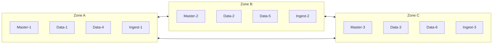

# How to Configure Elasticsearch Cluster Resilience

Author: [nawazdhandala](https://www.github.com/nawazdhandala)

Tags: Elasticsearch, High Availability, Cluster, Shard Allocation, Rack Awareness, Disaster Recovery

Description: A comprehensive guide to configuring Elasticsearch cluster resilience with shard allocation awareness, rack awareness, and fault tolerance strategies for production environments.

---

Building a resilient Elasticsearch cluster requires careful planning around shard allocation, node distribution, and failure domain awareness. This guide covers essential configurations to ensure your cluster survives hardware failures, network partitions, and datacenter outages.

## Understanding Elasticsearch Cluster Resilience

Cluster resilience in Elasticsearch depends on several factors:

- **Shard replication** - Primary and replica shards distributed across nodes
- **Allocation awareness** - Shards spread across failure domains
- **Minimum master nodes** - Preventing split-brain scenarios
- **Recovery settings** - Fast recovery after failures

## Basic Cluster Configuration

Start with a properly configured `elasticsearch.yml`:

```yaml
# Cluster name - must be unique
cluster.name: production-cluster

# Node name - unique identifier
node.name: node-1

# Node roles
node.roles: [master, data, ingest]

# Network settings
network.host: 0.0.0.0
http.port: 9200
transport.port: 9300

# Discovery settings
discovery.seed_hosts:
  - node-1.example.com:9300
  - node-2.example.com:9300
  - node-3.example.com:9300

# Initial master nodes (only for first cluster bootstrap)
cluster.initial_master_nodes:
  - node-1
  - node-2
  - node-3
```

## Configuring Shard Allocation Awareness

Allocation awareness ensures that primary and replica shards are placed on different failure domains. This prevents data loss when an entire rack or zone fails.

### Zone-Based Allocation Awareness

Configure each node with its zone attribute:

```yaml
# Node in zone-a
node.attr.zone: zone-a

# Cluster-level settings for allocation awareness
cluster.routing.allocation.awareness.attributes: zone
```

Apply the cluster setting via API:

```bash
curl -X PUT "localhost:9200/_cluster/settings" -H 'Content-Type: application/json' -d'
{
  "persistent": {
    "cluster.routing.allocation.awareness.attributes": "zone"
  }
}'
```

### Forced Awareness

Forced awareness prevents all replicas from being allocated to a single zone when other zones are unavailable:

```bash
curl -X PUT "localhost:9200/_cluster/settings" -H 'Content-Type: application/json' -d'
{
  "persistent": {
    "cluster.routing.allocation.awareness.attributes": "zone",
    "cluster.routing.allocation.awareness.force.zone.values": ["zone-a", "zone-b", "zone-c"]
  }
}'
```

This ensures Elasticsearch knows about all zones and won't allocate all shards to available zones during partial outages.

## Configuring Rack Awareness

Rack awareness extends zone awareness to physical rack locations:

```yaml
# Node configuration
node.attr.rack: rack-1
node.attr.zone: zone-a
```

Configure multiple awareness attributes:

```bash
curl -X PUT "localhost:9200/_cluster/settings" -H 'Content-Type: application/json' -d'
{
  "persistent": {
    "cluster.routing.allocation.awareness.attributes": "zone,rack"
  }
}'
```

## Shard Allocation Filtering

Control which nodes can host specific indices:

### Include/Exclude Nodes

```bash
# Only allocate to nodes with SSD storage
curl -X PUT "localhost:9200/my-index/_settings" -H 'Content-Type: application/json' -d'
{
  "index.routing.allocation.include.storage_type": "ssd"
}'

# Exclude specific nodes
curl -X PUT "localhost:9200/my-index/_settings" -H 'Content-Type: application/json' -d'
{
  "index.routing.allocation.exclude._name": "node-4,node-5"
}'

# Require specific zones
curl -X PUT "localhost:9200/my-index/_settings" -H 'Content-Type: application/json' -d'
{
  "index.routing.allocation.require.zone": "zone-a"
}'
```

### Node Attribute Configuration

Define custom node attributes:

```yaml
# Hot node for recent data
node.attr.data_tier: hot
node.attr.storage_type: ssd

# Warm node for older data
node.attr.data_tier: warm
node.attr.storage_type: hdd
```

## Configuring Replica Settings

Ensure adequate replication for resilience:

```bash
# Create index with replicas
curl -X PUT "localhost:9200/my-index" -H 'Content-Type: application/json' -d'
{
  "settings": {
    "number_of_shards": 3,
    "number_of_replicas": 2,
    "auto_expand_replicas": "0-2"
  }
}'

# Update replica count for existing index
curl -X PUT "localhost:9200/my-index/_settings" -H 'Content-Type: application/json' -d'
{
  "number_of_replicas": 2
}'
```

### Auto-Expanding Replicas

Automatically adjust replicas based on cluster size:

```bash
curl -X PUT "localhost:9200/my-index/_settings" -H 'Content-Type: application/json' -d'
{
  "index.auto_expand_replicas": "0-all"
}'
```

## Cluster-Level Resilience Settings

### Minimum Master Nodes (Pre-7.x Reference)

For Elasticsearch 7.x and later, this is handled automatically, but understanding the concept is important:

```yaml
# Modern Elasticsearch uses voting configuration
# This is automatic but can be adjusted
cluster.max_voting_config_exclusions: 10
```

### Cluster Recovery Settings

Configure how the cluster recovers from restarts:

```bash
curl -X PUT "localhost:9200/_cluster/settings" -H 'Content-Type: application/json' -d'
{
  "persistent": {
    "gateway.recover_after_nodes": 2,
    "gateway.expected_nodes": 3,
    "gateway.recover_after_time": "5m"
  }
}'
```

### Shard Recovery Settings

Control recovery speed and concurrency:

```bash
curl -X PUT "localhost:9200/_cluster/settings" -H 'Content-Type: application/json' -d'
{
  "persistent": {
    "cluster.routing.allocation.node_concurrent_recoveries": 4,
    "cluster.routing.allocation.node_initial_primaries_recoveries": 8,
    "indices.recovery.max_bytes_per_sec": "100mb"
  }
}'
```

## Delayed Allocation for Temporary Failures

Prevent unnecessary shard movement during brief outages:

```bash
curl -X PUT "localhost:9200/_all/_settings" -H 'Content-Type: application/json' -d'
{
  "settings": {
    "index.unassigned.node_left.delayed_timeout": "5m"
  }
}'
```

This gives nodes 5 minutes to rejoin before reallocating their shards.

## Monitoring Cluster Health

### Basic Health Check

```bash
curl -X GET "localhost:9200/_cluster/health?pretty"
```

Response:

```json
{
  "cluster_name": "production-cluster",
  "status": "green",
  "timed_out": false,
  "number_of_nodes": 6,
  "number_of_data_nodes": 3,
  "active_primary_shards": 50,
  "active_shards": 150,
  "relocating_shards": 0,
  "initializing_shards": 0,
  "unassigned_shards": 0,
  "delayed_unassigned_shards": 0,
  "number_of_pending_tasks": 0,
  "number_of_in_flight_fetch": 0,
  "task_max_waiting_in_queue_millis": 0,
  "active_shards_percent_as_number": 100.0
}
```

### Detailed Allocation Information

```bash
# Check allocation explanation
curl -X GET "localhost:9200/_cluster/allocation/explain?pretty"

# View shard allocation
curl -X GET "localhost:9200/_cat/shards?v&h=index,shard,prirep,state,node,unassigned.reason"
```

### Node Attributes Verification

```bash
curl -X GET "localhost:9200/_cat/nodeattrs?v&h=node,attr,value"
```

## Production Resilience Architecture

### Three-Zone Deployment



Configuration for this setup:

```yaml
# Zone A nodes
node.attr.zone: zone-a
node.attr.rack: rack-1

# Cluster settings
cluster.routing.allocation.awareness.attributes: zone
cluster.routing.allocation.awareness.force.zone.values: zone-a,zone-b,zone-c
```

### Index Template for Resilience

```bash
curl -X PUT "localhost:9200/_index_template/resilient-template" -H 'Content-Type: application/json' -d'
{
  "index_patterns": ["logs-*", "metrics-*"],
  "template": {
    "settings": {
      "number_of_shards": 3,
      "number_of_replicas": 2,
      "index.unassigned.node_left.delayed_timeout": "5m",
      "index.routing.allocation.total_shards_per_node": 2
    }
  },
  "priority": 100
}
'
```

## Handling Disk Watermarks

Configure disk-based shard allocation:

```bash
curl -X PUT "localhost:9200/_cluster/settings" -H 'Content-Type: application/json' -d'
{
  "persistent": {
    "cluster.routing.allocation.disk.threshold_enabled": true,
    "cluster.routing.allocation.disk.watermark.low": "85%",
    "cluster.routing.allocation.disk.watermark.high": "90%",
    "cluster.routing.allocation.disk.watermark.flood_stage": "95%"
  }
}'
```

## Testing Cluster Resilience

### Simulate Node Failure

```bash
# Gracefully remove a node
curl -X PUT "localhost:9200/_cluster/settings" -H 'Content-Type: application/json' -d'
{
  "transient": {
    "cluster.routing.allocation.exclude._name": "node-1"
  }
}'

# Watch shard relocation
watch -n 1 'curl -s localhost:9200/_cat/shards?v | grep -E "RELOCATING|INITIALIZING"'
```

### Verify Allocation Awareness

```bash
# Check shard distribution across zones
curl -s "localhost:9200/_cat/shards?v" | awk '{print $1, $8}' | sort | uniq -c
```

## Summary

Building a resilient Elasticsearch cluster requires:

1. **Allocation awareness** - Distribute shards across failure domains
2. **Forced awareness** - Prevent over-concentration during partial failures
3. **Proper replication** - Maintain enough replicas for your availability requirements
4. **Recovery tuning** - Balance speed with cluster stability
5. **Delayed allocation** - Avoid unnecessary shard movement during brief outages
6. **Monitoring** - Continuously verify cluster health and allocation

With these configurations, your Elasticsearch cluster can survive node failures, rack outages, and even zone-level disasters while maintaining data availability.

## Related Resources

- [Elasticsearch Cluster Health Monitoring](https://www.elastic.co/guide/en/elasticsearch/reference/current/cluster-health.html)
- [Shard Allocation and Cluster-Level Routing](https://www.elastic.co/guide/en/elasticsearch/reference/current/modules-cluster.html)
- [Index-Level Shard Allocation Filtering](https://www.elastic.co/guide/en/elasticsearch/reference/current/shard-allocation-filtering.html)
