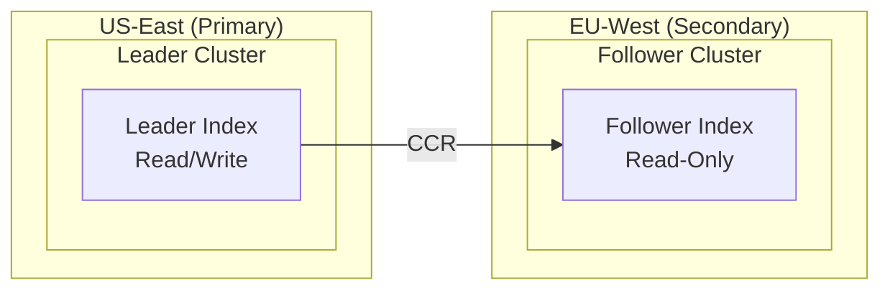
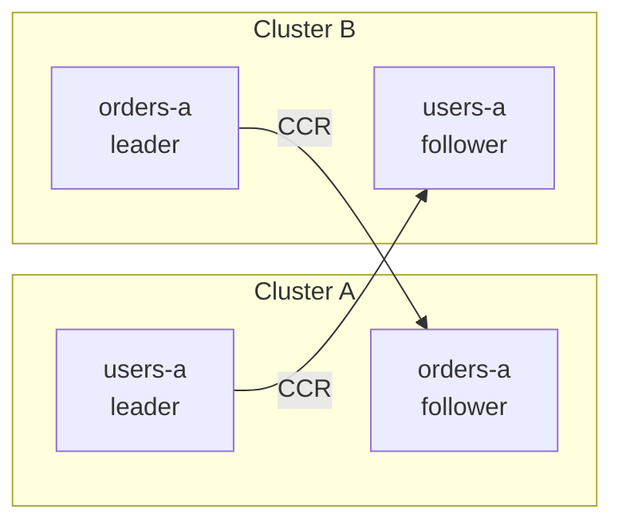

# How to Set Up Cross-Cluster Replication in Elasticsearch

Author: [nawazdhandala](https://www.github.com/nawazdhandala)

Tags: Elasticsearch, Cross-Cluster Replication, CCR, Disaster Recovery, High Availability, Geo-Replication

Description: A comprehensive guide to setting up Elasticsearch Cross-Cluster Replication (CCR) for disaster recovery, geo-distribution, and data locality with step-by-step configuration and best practices.

---

Cross-Cluster Replication (CCR) in Elasticsearch enables you to replicate indices from one cluster to another. This is essential for disaster recovery, serving data closer to users geographically, and maintaining read replicas for reporting workloads.

## Understanding Cross-Cluster Replication

CCR provides:

- **Disaster recovery** - Maintain a hot standby in another region
- **Geo-proximity** - Serve data from clusters closer to users
- **Reporting isolation** - Run heavy queries on follower clusters
- **Data locality** - Comply with data residency requirements

### CCR Architecture



## Prerequisites

CCR requires:

- Elasticsearch 6.5+ (basic features) or 7.x+ (recommended)
- Platinum or Enterprise license (or trial license)
- Network connectivity between clusters
- TLS configured on both clusters

### Enable Trial License (For Testing)

```bash
# On both clusters
curl -X POST "localhost:9200/_license/start_trial?acknowledge=true"
```

## Setting Up the Remote Cluster Connection

### Step 1: Configure Remote Cluster on Follower

On the follower cluster, configure the connection to the leader:

```bash
curl -X PUT "localhost:9200/_cluster/settings" -H 'Content-Type: application/json' -d'
{
  "persistent": {
    "cluster": {
      "remote": {
        "leader-cluster": {
          "seeds": [
            "leader-node-1:9300",
            "leader-node-2:9300",
            "leader-node-3:9300"
          ]
        }
      }
    }
  }
}'
```

### Step 2: Verify Remote Cluster Connection

```bash
curl -X GET "localhost:9200/_remote/info?pretty"
```

Expected response:

```json
{
  "leader-cluster": {
    "connected": true,
    "mode": "sniff",
    "seeds": ["leader-node-1:9300"],
    "num_nodes_connected": 3,
    "max_connections_per_cluster": 3,
    "initial_connect_timeout": "30s",
    "skip_unavailable": false
  }
}
```

### Using Proxy Mode (For Kubernetes/Load Balancers)

```bash
curl -X PUT "localhost:9200/_cluster/settings" -H 'Content-Type: application/json' -d'
{
  "persistent": {
    "cluster": {
      "remote": {
        "leader-cluster": {
          "mode": "proxy",
          "proxy_address": "leader-cluster-proxy:9300"
        }
      }
    }
  }
}'
```

## Creating Follower Indices

### Basic Follower Index

```bash
curl -X PUT "localhost:9200/my-index-follower/_ccr/follow" -H 'Content-Type: application/json' -d'
{
  "remote_cluster": "leader-cluster",
  "leader_index": "my-index"
}'
```

### Follower Index with Custom Settings

```bash
curl -X PUT "localhost:9200/my-index-follower/_ccr/follow" -H 'Content-Type: application/json' -d'
{
  "remote_cluster": "leader-cluster",
  "leader_index": "my-index",
  "settings": {
    "index.number_of_replicas": 1
  },
  "max_read_request_operation_count": 5120,
  "max_outstanding_read_requests": 12,
  "max_read_request_size": "32mb",
  "max_write_request_operation_count": 5120,
  "max_write_request_size": "9223372036854775807b",
  "max_outstanding_write_requests": 9,
  "max_write_buffer_count": 2147483647,
  "max_write_buffer_size": "512mb",
  "max_retry_delay": "500ms",
  "read_poll_timeout": "1m"
}'
```

## Auto-Follow Patterns

Auto-follow patterns automatically replicate new indices matching a pattern:

### Create Auto-Follow Pattern

```bash
curl -X PUT "localhost:9200/_ccr/auto_follow/logs-pattern" -H 'Content-Type: application/json' -d'
{
  "remote_cluster": "leader-cluster",
  "leader_index_patterns": ["logs-*"],
  "follow_index_pattern": "{{leader_index}}-replica",
  "settings": {
    "index.number_of_replicas": 0
  },
  "max_read_request_operation_count": 5120,
  "max_outstanding_read_requests": 12,
  "read_poll_timeout": "1m"
}'
```

### Multiple Auto-Follow Patterns

```bash
# Pattern for logs
curl -X PUT "localhost:9200/_ccr/auto_follow/logs-pattern" -H 'Content-Type: application/json' -d'
{
  "remote_cluster": "leader-cluster",
  "leader_index_patterns": ["logs-*"],
  "follow_index_pattern": "{{leader_index}}"
}'

# Pattern for metrics
curl -X PUT "localhost:9200/_ccr/auto_follow/metrics-pattern" -H 'Content-Type: application/json' -d'
{
  "remote_cluster": "leader-cluster",
  "leader_index_patterns": ["metrics-*"],
  "follow_index_pattern": "{{leader_index}}"
}'
```

### List Auto-Follow Patterns

```bash
curl -X GET "localhost:9200/_ccr/auto_follow?pretty"
```

### Delete Auto-Follow Pattern

```bash
curl -X DELETE "localhost:9200/_ccr/auto_follow/logs-pattern"
```

## Monitoring CCR

### Check Follower Stats

```bash
curl -X GET "localhost:9200/my-index-follower/_ccr/stats?pretty"
```

Response:

```json
{
  "indices": [
    {
      "index": "my-index-follower",
      "shards": [
        {
          "remote_cluster": "leader-cluster",
          "leader_index": "my-index",
          "follower_index": "my-index-follower",
          "shard_id": 0,
          "leader_global_checkpoint": 1000,
          "leader_max_seq_no": 1000,
          "follower_global_checkpoint": 1000,
          "follower_max_seq_no": 1000,
          "last_requested_seq_no": 1000,
          "outstanding_read_requests": 1,
          "outstanding_write_requests": 0,
          "write_buffer_operation_count": 0,
          "follower_mapping_version": 1,
          "total_read_time_millis": 5000,
          "total_read_remote_exec_time_millis": 4000,
          "successful_read_requests": 100,
          "failed_read_requests": 0,
          "operations_read": 1000,
          "bytes_read": 1048576,
          "total_write_time_millis": 2000,
          "successful_write_requests": 50,
          "failed_write_requests": 0,
          "operations_written": 1000,
          "time_since_last_read_millis": 100
        }
      ]
    }
  ]
}
```

### Check Auto-Follow Stats

```bash
curl -X GET "localhost:9200/_ccr/stats?pretty"
```

### Monitor Replication Lag

```bash
# Create a script to check lag
curl -s "localhost:9200/my-index-follower/_ccr/stats" | jq '
  .indices[0].shards[0] |
  {
    leader_checkpoint: .leader_global_checkpoint,
    follower_checkpoint: .follower_global_checkpoint,
    lag: (.leader_global_checkpoint - .follower_global_checkpoint)
  }'
```

## Pausing and Resuming Replication

### Pause Follower Index

```bash
curl -X POST "localhost:9200/my-index-follower/_ccr/pause_follow"
```

### Resume Follower Index

```bash
curl -X POST "localhost:9200/my-index-follower/_ccr/resume_follow" -H 'Content-Type: application/json' -d'
{
  "max_read_request_operation_count": 5120,
  "max_outstanding_read_requests": 12,
  "read_poll_timeout": "1m"
}'
```

## Promoting Follower to Leader (Failover)

When the leader cluster fails, promote the follower:

### Step 1: Pause Following

```bash
curl -X POST "localhost:9200/my-index-follower/_ccr/pause_follow"
```

### Step 2: Unfollow (Convert to Regular Index)

```bash
curl -X POST "localhost:9200/my-index-follower/_ccr/unfollow"
```

The follower index is now a regular read-write index.

### Step 3: Update Applications

Point your applications to the new primary cluster.

### Step 4: Re-establish Replication (After Recovery)

After the original leader recovers, set up reverse replication:

```bash
# On the original leader (now follower)
curl -X PUT "localhost:9200/my-index-new-follower/_ccr/follow" -H 'Content-Type: application/json' -d'
{
  "remote_cluster": "original-follower-cluster",
  "leader_index": "my-index-follower"
}'
```

## Bi-Directional Replication

For active-active setups with different indices:



### Configure on Cluster A

```bash
# Connect to Cluster B
curl -X PUT "localhost:9200/_cluster/settings" -H 'Content-Type: application/json' -d'
{
  "persistent": {
    "cluster.remote.cluster-b.seeds": ["cluster-b-node:9300"]
  }
}'

# Follow orders from Cluster B
curl -X PUT "localhost:9200/orders-a/_ccr/follow" -H 'Content-Type: application/json' -d'
{
  "remote_cluster": "cluster-b",
  "leader_index": "orders-b"
}'
```

### Configure on Cluster B

```bash
# Connect to Cluster A
curl -X PUT "localhost:9200/_cluster/settings" -H 'Content-Type: application/json' -d'
{
  "persistent": {
    "cluster.remote.cluster-a.seeds": ["cluster-a-node:9300"]
  }
}'

# Follow users from Cluster A
curl -X PUT "localhost:9200/users-a/_ccr/follow" -H 'Content-Type: application/json' -d'
{
  "remote_cluster": "cluster-a",
  "leader_index": "users-a"
}'
```

## Handling CCR with Index Lifecycle Management

### Leader Index with ILM

```bash
# Create ILM policy on leader
curl -X PUT "localhost:9200/_ilm/policy/logs-policy" -H 'Content-Type: application/json' -d'
{
  "policy": {
    "phases": {
      "hot": {
        "min_age": "0ms",
        "actions": {
          "rollover": {
            "max_size": "50gb",
            "max_age": "1d"
          }
        }
      },
      "delete": {
        "min_age": "30d",
        "actions": {
          "delete": {}
        }
      }
    }
  }
}'
```

### Auto-Follow with ILM Awareness

```bash
curl -X PUT "localhost:9200/_ccr/auto_follow/logs-pattern" -H 'Content-Type: application/json' -d'
{
  "remote_cluster": "leader-cluster",
  "leader_index_patterns": ["logs-*"],
  "follow_index_pattern": "{{leader_index}}"
}'
```

The follower will automatically follow rolled-over indices.

## Security Configuration

### Configure TLS Between Clusters

On both clusters, configure transport TLS:

```yaml
# elasticsearch.yml
xpack.security.transport.ssl.enabled: true
xpack.security.transport.ssl.verification_mode: certificate
xpack.security.transport.ssl.keystore.path: elastic-certificates.p12
xpack.security.transport.ssl.truststore.path: elastic-certificates.p12
```

### Create CCR User

```bash
# Create role on leader cluster
curl -X PUT "localhost:9200/_security/role/ccr_role" -H 'Content-Type: application/json' -d'
{
  "cluster": ["read_ccr"],
  "indices": [
    {
      "names": ["*"],
      "privileges": ["monitor", "read", "view_index_metadata"]
    }
  ]
}'

# Create user
curl -X PUT "localhost:9200/_security/user/ccr_user" -H 'Content-Type: application/json' -d'
{
  "password": "secure-password",
  "roles": ["ccr_role"]
}'
```

### Configure Remote Cluster with Authentication

```bash
curl -X PUT "localhost:9200/_cluster/settings" -H 'Content-Type: application/json' -d'
{
  "persistent": {
    "cluster.remote.leader-cluster.seeds": ["leader-node:9300"]
  }
}'
```

## Troubleshooting CCR

### Check Follower Status

```bash
curl -X GET "localhost:9200/_ccr/stats?pretty"
```

### Common Issues

#### 1. Connection Failed

```bash
# Verify remote cluster connectivity
curl -X GET "localhost:9200/_remote/info?pretty"

# Check network
nc -zv leader-node 9300
```

#### 2. Replication Lag

```bash
# Check follower stats for lag
curl -s "localhost:9200/my-index-follower/_ccr/stats" | jq '.indices[0].shards[0] | {lag: (.leader_global_checkpoint - .follower_global_checkpoint)}'

# Increase replication throughput
curl -X POST "localhost:9200/my-index-follower/_ccr/resume_follow" -H 'Content-Type: application/json' -d'
{
  "max_read_request_operation_count": 10240,
  "max_outstanding_read_requests": 24,
  "max_read_request_size": "64mb"
}'
```

#### 3. Mapping Conflicts

```bash
# Check follower shard failures
curl -X GET "localhost:9200/my-index-follower/_ccr/stats?pretty" | jq '.indices[0].shards[0].read_exceptions'
```

### View Shard-Level Errors

```bash
curl -X GET "localhost:9200/my-index-follower/_ccr/stats?pretty" | jq '
  .indices[0].shards[] |
  select(.failed_read_requests > 0 or .failed_write_requests > 0) |
  {shard: .shard_id, read_failures: .failed_read_requests, write_failures: .failed_write_requests}'
```

## Best Practices

### 1. Network Configuration

- Use dedicated network for CCR traffic
- Configure appropriate timeouts for WAN links
- Consider proxy mode for Kubernetes deployments

### 2. Performance Tuning

```bash
# For high-throughput replication
curl -X POST "localhost:9200/my-index-follower/_ccr/resume_follow" -H 'Content-Type: application/json' -d'
{
  "max_read_request_operation_count": 10240,
  "max_outstanding_read_requests": 24,
  "max_read_request_size": "64mb",
  "max_outstanding_write_requests": 12,
  "max_write_buffer_size": "1gb"
}'
```

### 3. Monitoring

- Set up alerts for replication lag
- Monitor follower error rates
- Track remote cluster connectivity

### 4. Disaster Recovery Planning

- Document failover procedures
- Test failover regularly
- Automate promotion process where possible

## Summary

Cross-Cluster Replication provides a robust solution for:

1. **Disaster recovery** - Hot standby in another region
2. **Geo-distribution** - Serve users from nearby clusters
3. **Workload isolation** - Run analytics on followers
4. **Data locality** - Meet compliance requirements

Key configurations include:

- Remote cluster connections
- Follower indices for specific replication
- Auto-follow patterns for automatic replication
- Proper security and TLS setup

With CCR properly configured, you can achieve near-real-time data replication across geographically distributed Elasticsearch clusters.
