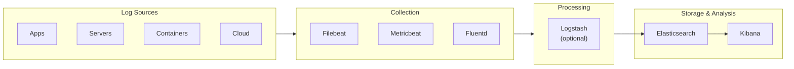

# How to Build a Log Analytics Platform with Elasticsearch

Author: [nawazdhandala](https://www.github.com/nawazdhandala)

Tags: Elasticsearch, ELK Stack, Log Analytics, Kibana, Logstash, Observability, Logging

Description: A comprehensive guide to building a log analytics platform with Elasticsearch, covering ELK stack architecture, data pipeline design, index strategies, and operational best practices.

---

Building a log analytics platform with Elasticsearch (the ELK stack - Elasticsearch, Logstash, Kibana) enables centralized logging, real-time analysis, and powerful visualization of your application and infrastructure logs. This guide covers the complete architecture and implementation.

## ELK Stack Architecture Overview



## Component Selection

### Modern Stack Options

| Component | Options | Recommendation |
|-----------|---------|----------------|
| Collection | Filebeat, Fluent Bit, Vector | Filebeat for simplicity, Vector for performance |
| Processing | Logstash, Ingest Pipelines | Ingest Pipelines when possible |
| Storage | Elasticsearch | Consider data tiers |
| Visualization | Kibana | Includes alerting and ML |

## Elasticsearch Cluster Setup

### Production Cluster Configuration

```yaml
# elasticsearch.yml for master node
cluster.name: log-analytics
node.name: master-1
node.roles: [master]

network.host: 0.0.0.0
discovery.seed_hosts:
  - master-1:9300
  - master-2:9300
  - master-3:9300
cluster.initial_master_nodes:
  - master-1
  - master-2
  - master-3

# Security
xpack.security.enabled: true
xpack.security.transport.ssl.enabled: true
xpack.security.http.ssl.enabled: true
```

```yaml
# elasticsearch.yml for data node
cluster.name: log-analytics
node.name: data-hot-1
node.roles: [data_hot, data_content, ingest]

node.attr.data: hot

# Memory settings
indices.memory.index_buffer_size: 30%
```

### Index Settings for Logs

```bash
curl -u elastic:password -X PUT "localhost:9200/_index_template/logs-template" -H 'Content-Type: application/json' -d'
{
  "index_patterns": ["logs-*"],
  "template": {
    "settings": {
      "number_of_shards": 3,
      "number_of_replicas": 1,
      "index.lifecycle.name": "logs-policy",
      "index.lifecycle.rollover_alias": "logs",
      "index.refresh_interval": "5s",
      "index.translog.durability": "async",
      "index.translog.sync_interval": "5s"
    },
    "mappings": {
      "properties": {
        "@timestamp": {"type": "date"},
        "message": {"type": "text"},
        "level": {"type": "keyword"},
        "service": {
          "properties": {
            "name": {"type": "keyword"},
            "version": {"type": "keyword"},
            "environment": {"type": "keyword"}
          }
        },
        "host": {
          "properties": {
            "name": {"type": "keyword"},
            "ip": {"type": "ip"}
          }
        },
        "trace": {
          "properties": {
            "id": {"type": "keyword"},
            "span_id": {"type": "keyword"}
          }
        },
        "error": {
          "properties": {
            "message": {"type": "text"},
            "stack_trace": {"type": "text"}
          }
        }
      }
    }
  },
  "priority": 100
}
'
```

## Index Lifecycle Management

### Create ILM Policy

```bash
curl -u elastic:password -X PUT "localhost:9200/_ilm/policy/logs-policy" -H 'Content-Type: application/json' -d'
{
  "policy": {
    "phases": {
      "hot": {
        "min_age": "0ms",
        "actions": {
          "rollover": {
            "max_primary_shard_size": "50gb",
            "max_age": "1d"
          },
          "set_priority": {
            "priority": 100
          }
        }
      },
      "warm": {
        "min_age": "3d",
        "actions": {
          "shrink": {
            "number_of_shards": 1
          },
          "forcemerge": {
            "max_num_segments": 1
          },
          "allocate": {
            "require": {
              "data": "warm"
            }
          },
          "set_priority": {
            "priority": 50
          }
        }
      },
      "cold": {
        "min_age": "14d",
        "actions": {
          "allocate": {
            "require": {
              "data": "cold"
            }
          },
          "set_priority": {
            "priority": 0
          }
        }
      },
      "delete": {
        "min_age": "30d",
        "actions": {
          "delete": {}
        }
      }
    }
  }
}'
```

### Bootstrap the Index

```bash
# Create initial index with write alias
curl -u elastic:password -X PUT "localhost:9200/logs-000001" -H 'Content-Type: application/json' -d'
{
  "aliases": {
    "logs": {
      "is_write_index": true
    }
  }
}'
```

## Log Collection with Filebeat

### Filebeat Configuration

```yaml
# filebeat.yml
filebeat.inputs:
  # Application logs
  - type: log
    enabled: true
    paths:
      - /var/log/app/*.log
    fields:
      service.name: my-application
      service.environment: production
    fields_under_root: true
    multiline:
      pattern: '^\d{4}-\d{2}-\d{2}'
      negate: true
      match: after

  # System logs
  - type: log
    enabled: true
    paths:
      - /var/log/syslog
      - /var/log/messages
    fields:
      service.name: system
    fields_under_root: true

  # Container logs
  - type: container
    enabled: true
    paths:
      - /var/lib/docker/containers/*/*.log
    processors:
      - add_kubernetes_metadata:
          host: ${NODE_NAME}
          matchers:
            - logs_path:
                logs_path: "/var/lib/docker/containers/"

processors:
  - add_host_metadata: ~
  - add_cloud_metadata: ~
  - add_docker_metadata: ~

output.elasticsearch:
  hosts: ["https://elasticsearch:9200"]
  username: "${ES_USERNAME}"
  password: "${ES_PASSWORD}"
  ssl.certificate_authorities: ["/etc/filebeat/ca.crt"]
  index: "logs-%{+yyyy.MM.dd}"

setup.template.enabled: false
setup.ilm.enabled: false

logging.level: info
logging.to_files: true
logging.files:
  path: /var/log/filebeat
  name: filebeat
  keepfiles: 7
  permissions: 0640
```

### Filebeat Modules

Enable built-in modules for common log formats:

```bash
# Enable modules
filebeat modules enable system nginx mysql

# List available modules
filebeat modules list
```

Module configuration (`modules.d/nginx.yml`):

```yaml
- module: nginx
  access:
    enabled: true
    var.paths: ["/var/log/nginx/access.log*"]
  error:
    enabled: true
    var.paths: ["/var/log/nginx/error.log*"]
```

## Ingest Pipelines

### Create Log Parsing Pipeline

```bash
curl -u elastic:password -X PUT "localhost:9200/_ingest/pipeline/logs-pipeline" -H 'Content-Type: application/json' -d'
{
  "description": "Pipeline for processing application logs",
  "processors": [
    {
      "grok": {
        "field": "message",
        "patterns": [
          "%{TIMESTAMP_ISO8601:@timestamp} %{LOGLEVEL:level} \\[%{DATA:logger}\\] %{GREEDYDATA:log_message}"
        ],
        "ignore_failure": true
      }
    },
    {
      "date": {
        "field": "@timestamp",
        "formats": ["ISO8601", "yyyy-MM-dd HH:mm:ss,SSS"],
        "target_field": "@timestamp",
        "ignore_failure": true
      }
    },
    {
      "lowercase": {
        "field": "level",
        "ignore_failure": true
      }
    },
    {
      "set": {
        "field": "event.kind",
        "value": "event"
      }
    },
    {
      "geoip": {
        "field": "client.ip",
        "target_field": "client.geo",
        "ignore_missing": true
      }
    },
    {
      "user_agent": {
        "field": "user_agent.original",
        "target_field": "user_agent",
        "ignore_missing": true
      }
    },
    {
      "remove": {
        "field": ["message"],
        "ignore_missing": true,
        "if": "ctx.log_message != null"
      }
    },
    {
      "rename": {
        "field": "log_message",
        "target_field": "message",
        "ignore_missing": true
      }
    }
  ],
  "on_failure": [
    {
      "set": {
        "field": "error.message",
        "value": "{{ _ingest.on_failure_message }}"
      }
    }
  ]
}'
```

### JSON Log Pipeline

```bash
curl -u elastic:password -X PUT "localhost:9200/_ingest/pipeline/json-logs-pipeline" -H 'Content-Type: application/json' -d'
{
  "description": "Pipeline for JSON-formatted logs",
  "processors": [
    {
      "json": {
        "field": "message",
        "target_field": "parsed",
        "ignore_failure": true
      }
    },
    {
      "date": {
        "field": "parsed.timestamp",
        "formats": ["ISO8601", "UNIX_MS"],
        "target_field": "@timestamp",
        "ignore_failure": true
      }
    },
    {
      "rename": {
        "field": "parsed.level",
        "target_field": "level",
        "ignore_missing": true
      }
    },
    {
      "rename": {
        "field": "parsed.message",
        "target_field": "message",
        "ignore_missing": true
      }
    },
    {
      "rename": {
        "field": "parsed.service",
        "target_field": "service.name",
        "ignore_missing": true
      }
    },
    {
      "rename": {
        "field": "parsed.trace_id",
        "target_field": "trace.id",
        "ignore_missing": true
      }
    },
    {
      "remove": {
        "field": "parsed",
        "ignore_missing": true
      }
    }
  ]
}'
```

## Logstash Configuration (Optional)

For complex processing requirements:

```ruby
# logstash.conf
input {
  beats {
    port => 5044
    ssl => true
    ssl_certificate => "/etc/logstash/certs/logstash.crt"
    ssl_key => "/etc/logstash/certs/logstash.key"
  }
}

filter {
  # Parse different log formats
  if [service][name] == "nginx" {
    grok {
      match => { "message" => "%{COMBINEDAPACHELOG}" }
    }
    date {
      match => [ "timestamp", "dd/MMM/yyyy:HH:mm:ss Z" ]
    }
    geoip {
      source => "clientip"
      target => "geoip"
    }
    useragent {
      source => "agent"
      target => "user_agent"
    }
  }

  if [service][name] == "application" {
    grok {
      match => { "message" => "%{TIMESTAMP_ISO8601:timestamp} %{LOGLEVEL:level} \[%{DATA:thread}\] %{DATA:logger} - %{GREEDYDATA:log_message}" }
    }
    date {
      match => [ "timestamp", "ISO8601" ]
    }
  }

  # Add metadata
  mutate {
    add_field => { "[@metadata][index]" => "logs-%{[service][name]}-%{+YYYY.MM.dd}" }
  }
}

output {
  elasticsearch {
    hosts => ["https://elasticsearch:9200"]
    user => "${ES_USER}"
    password => "${ES_PASSWORD}"
    ssl => true
    cacert => "/etc/logstash/certs/ca.crt"
    index => "%{[@metadata][index]}"
    pipeline => "logs-pipeline"
  }
}
```

## Kibana Configuration

### Kibana Settings

```yaml
# kibana.yml
server.host: "0.0.0.0"
server.port: 5601
server.name: "kibana"

elasticsearch.hosts: ["https://elasticsearch:9200"]
elasticsearch.username: "kibana_system"
elasticsearch.password: "${KIBANA_PASSWORD}"
elasticsearch.ssl.certificateAuthorities: ["/etc/kibana/certs/ca.crt"]

xpack.encryptedSavedObjects.encryptionKey: "your-32-character-encryption-key"
xpack.security.encryptionKey: "your-32-character-encryption-key"
xpack.reporting.encryptionKey: "your-32-character-encryption-key"
```

### Create Index Pattern

```bash
curl -u elastic:password -X POST "localhost:5601/api/index_patterns/index_pattern" -H 'Content-Type: application/json' -H 'kbn-xsrf: true' -d'
{
  "index_pattern": {
    "title": "logs-*",
    "timeFieldName": "@timestamp"
  }
}'
```

## Query Examples

### Search for Errors

```bash
curl -u elastic:password -X GET "localhost:9200/logs-*/_search?pretty" -H 'Content-Type: application/json' -d'
{
  "query": {
    "bool": {
      "must": [
        {"term": {"level": "error"}}
      ],
      "filter": [
        {"range": {"@timestamp": {"gte": "now-1h"}}}
      ]
    }
  },
  "sort": [{"@timestamp": {"order": "desc"}}],
  "size": 100
}'
```

### Error Count by Service

```bash
curl -u elastic:password -X GET "localhost:9200/logs-*/_search?pretty" -H 'Content-Type: application/json' -d'
{
  "size": 0,
  "query": {
    "bool": {
      "must": [
        {"term": {"level": "error"}}
      ],
      "filter": [
        {"range": {"@timestamp": {"gte": "now-24h"}}}
      ]
    }
  },
  "aggs": {
    "by_service": {
      "terms": {
        "field": "service.name",
        "size": 20
      },
      "aggs": {
        "error_over_time": {
          "date_histogram": {
            "field": "@timestamp",
            "fixed_interval": "1h"
          }
        }
      }
    }
  }
}'
```

### Full-Text Search

```bash
curl -u elastic:password -X GET "localhost:9200/logs-*/_search?pretty" -H 'Content-Type: application/json' -d'
{
  "query": {
    "bool": {
      "must": [
        {
          "multi_match": {
            "query": "connection timeout",
            "fields": ["message", "error.message"],
            "type": "phrase"
          }
        }
      ],
      "filter": [
        {"range": {"@timestamp": {"gte": "now-6h"}}}
      ]
    }
  },
  "highlight": {
    "fields": {
      "message": {}
    }
  }
}'
```

### Trace Correlation

```bash
curl -u elastic:password -X GET "localhost:9200/logs-*/_search?pretty" -H 'Content-Type: application/json' -d'
{
  "query": {
    "term": {"trace.id": "abc123xyz"}
  },
  "sort": [{"@timestamp": {"order": "asc"}}],
  "size": 1000
}'
```

## Performance Optimization

### Bulk Indexing Settings

```bash
# During initial load
curl -u elastic:password -X PUT "localhost:9200/logs-*/_settings" -H 'Content-Type: application/json' -d'
{
  "index": {
    "refresh_interval": "30s",
    "number_of_replicas": 0
  }
}'

# After load complete
curl -u elastic:password -X PUT "localhost:9200/logs-*/_settings" -H 'Content-Type: application/json' -d'
{
  "index": {
    "refresh_interval": "5s",
    "number_of_replicas": 1
  }
}'
```

### Cluster Settings for Logs

```bash
curl -u elastic:password -X PUT "localhost:9200/_cluster/settings" -H 'Content-Type: application/json' -d'
{
  "persistent": {
    "indices.memory.index_buffer_size": "30%",
    "thread_pool.write.queue_size": 1000
  }
}'
```

## Monitoring the Platform

### Cluster Health

```bash
curl -u elastic:password -X GET "localhost:9200/_cluster/health?pretty"
```

### Index Statistics

```bash
curl -u elastic:password -X GET "localhost:9200/logs-*/_stats?pretty"
```

### Ingest Pipeline Statistics

```bash
curl -u elastic:password -X GET "localhost:9200/_nodes/stats/ingest?pretty"
```

## Security Best Practices

### Create Log Writer Role

```bash
curl -u elastic:password -X PUT "localhost:9200/_security/role/log_writer" -H 'Content-Type: application/json' -d'
{
  "cluster": ["monitor"],
  "indices": [
    {
      "names": ["logs-*"],
      "privileges": ["create_index", "write", "view_index_metadata"]
    }
  ]
}'
```

### Create Log Reader Role

```bash
curl -u elastic:password -X PUT "localhost:9200/_security/role/log_reader" -H 'Content-Type: application/json' -d'
{
  "cluster": ["monitor"],
  "indices": [
    {
      "names": ["logs-*"],
      "privileges": ["read", "view_index_metadata"]
    }
  ]
}'
```

## Summary

Building a log analytics platform with Elasticsearch requires:

1. **Proper cluster architecture** - Separate node roles, data tiers
2. **Optimized index templates** - Appropriate mappings and settings
3. **ILM policies** - Automated data lifecycle management
4. **Efficient collection** - Filebeat or Vector for log shipping
5. **Processing pipelines** - Parse and enrich logs at ingest
6. **Security configuration** - Role-based access control
7. **Monitoring** - Track cluster health and performance

With this architecture, you can handle millions of log events per day while providing fast search and visualization capabilities.
