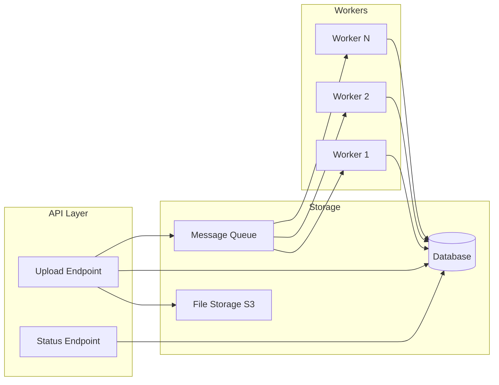

# How to Build a File Processing Service in Python

Author: [nawazdhandala](https://www.github.com/nawazdhandala)

Tags: Python, File Processing, FastAPI, Async, Celery, S3, Background Jobs

Description: Learn how to build a robust file processing service in Python. This guide covers async file uploads, background processing with Celery, progress tracking, and handling large files efficiently.

---

> File processing is a common requirement for many applications. Whether you are handling document uploads, image transformations, or data imports, you need a system that handles files reliably without blocking your API. This guide shows you how to build a production-ready file processing service.

The key challenges in file processing are handling large files, providing progress feedback, recovering from failures, and scaling to handle concurrent uploads. We will address each of these.

---

## Architecture Overview

A robust file processing service separates upload handling from actual processing.



The flow works like this:
1. Client uploads file to the API
2. API stores file and creates a job record
3. API enqueues processing task
4. Worker picks up task and processes file
5. Client polls status endpoint for progress

---

## File Upload Endpoint

Start with an upload endpoint that handles the file and creates a processing job.

```python
# upload.py
# File upload endpoint with job creation
from fastapi import FastAPI, UploadFile, File, HTTPException, BackgroundTasks
from pydantic import BaseModel
from typing import Optional
from datetime import datetime
import uuid
import aiofiles
import os

app = FastAPI()

class ProcessingJob(BaseModel):
    """Model for a file processing job"""
    id: str
    filename: str
    file_size: int
    status: str  # pending, processing, completed, failed
    progress: int  # 0-100
    created_at: datetime
    completed_at: Optional[datetime] = None
    result_url: Optional[str] = None
    error: Optional[str] = None

# In production, use a database
jobs_db = {}

UPLOAD_DIR = "/tmp/uploads"
PROCESSED_DIR = "/tmp/processed"

@app.post("/upload", response_model=ProcessingJob)
async def upload_file(
    file: UploadFile = File(...),
    background_tasks: BackgroundTasks = None
):
    """
    Upload a file for processing.
    Returns a job ID that can be used to track progress.
    """
    # Validate file
    if not file.filename:
        raise HTTPException(status_code=400, detail="No filename provided")

    # Check file size (read in chunks to avoid memory issues)
    MAX_SIZE = 100 * 1024 * 1024  # 100 MB
    file_size = 0

    # Generate unique ID for this job
    job_id = str(uuid.uuid4())
    file_extension = os.path.splitext(file.filename)[1]
    stored_filename = f"{job_id}{file_extension}"
    file_path = os.path.join(UPLOAD_DIR, stored_filename)

    # Ensure upload directory exists
    os.makedirs(UPLOAD_DIR, exist_ok=True)

    # Stream file to disk to handle large files
    try:
        async with aiofiles.open(file_path, 'wb') as out_file:
            while chunk := await file.read(8192):  # 8KB chunks
                file_size += len(chunk)
                if file_size > MAX_SIZE:
                    # Clean up partial file
                    os.remove(file_path)
                    raise HTTPException(
                        status_code=413,
                        detail=f"File too large. Maximum size is {MAX_SIZE} bytes"
                    )
                await out_file.write(chunk)
    except Exception as e:
        if os.path.exists(file_path):
            os.remove(file_path)
        raise HTTPException(status_code=500, detail=f"Upload failed: {str(e)}")

    # Create job record
    job = ProcessingJob(
        id=job_id,
        filename=file.filename,
        file_size=file_size,
        status="pending",
        progress=0,
        created_at=datetime.utcnow()
    )
    jobs_db[job_id] = job

    # Queue processing task
    background_tasks.add_task(process_file_task, job_id, file_path)

    return job

@app.get("/jobs/{job_id}", response_model=ProcessingJob)
async def get_job_status(job_id: str):
    """Get the status of a processing job"""
    if job_id not in jobs_db:
        raise HTTPException(status_code=404, detail="Job not found")
    return jobs_db[job_id]
```

---

## Processing with Celery

For production workloads, use Celery for reliable background processing with retries.

```python
# tasks.py
# Celery tasks for file processing
from celery import Celery
from celery.exceptions import MaxRetriesExceededError
import os
import time
from datetime import datetime

# Configure Celery
celery_app = Celery(
    'file_processor',
    broker='redis://localhost:6379/0',
    backend='redis://localhost:6379/1'
)

celery_app.conf.update(
    task_serializer='json',
    result_serializer='json',
    accept_content=['json'],
    task_track_started=True,  # Track when task starts
    task_time_limit=3600,     # 1 hour timeout
    task_soft_time_limit=3300,  # Soft limit for cleanup
    worker_prefetch_multiplier=1,  # One task at a time per worker
)

@celery_app.task(
    bind=True,
    max_retries=3,
    default_retry_delay=60,  # Wait 60 seconds between retries
    autoretry_for=(IOError, ConnectionError),  # Auto-retry on these exceptions
)
def process_file(self, job_id: str, file_path: str):
    """
    Process an uploaded file.
    Updates job status in database as processing progresses.
    """
    try:
        # Update status to processing
        update_job_status(job_id, status="processing", progress=0)

        # Read file info
        file_size = os.path.getsize(file_path)

        # Process file in stages
        # Stage 1: Validate file (10%)
        update_job_status(job_id, progress=10)
        validate_file(file_path)

        # Stage 2: Transform file (10-80%)
        # Report progress during long operations
        def progress_callback(percent):
            # Scale 0-100 to 10-80
            scaled = 10 + int(percent * 0.7)
            update_job_status(job_id, progress=scaled)

        output_path = transform_file(file_path, progress_callback)

        # Stage 3: Upload result (80-90%)
        update_job_status(job_id, progress=80)
        result_url = upload_to_storage(output_path)

        # Stage 4: Cleanup (90-100%)
        update_job_status(job_id, progress=90)
        cleanup_files(file_path, output_path)

        # Mark complete
        update_job_status(
            job_id,
            status="completed",
            progress=100,
            result_url=result_url,
            completed_at=datetime.utcnow()
        )

        return {"job_id": job_id, "result_url": result_url}

    except Exception as e:
        # Handle failure
        update_job_status(
            job_id,
            status="failed",
            error=str(e),
            completed_at=datetime.utcnow()
        )

        # Re-raise for Celery retry mechanism
        try:
            self.retry(exc=e)
        except MaxRetriesExceededError:
            # Final failure after all retries
            update_job_status(
                job_id,
                status="failed",
                error=f"Processing failed after {self.max_retries} retries: {str(e)}"
            )

def update_job_status(job_id: str, **kwargs):
    """Update job status in database"""
    # In production, use actual database
    if job_id in jobs_db:
        for key, value in kwargs.items():
            setattr(jobs_db[job_id], key, value)
```

---

## Streaming Large File Processing

For very large files, process them as streams to avoid loading everything into memory.

```python
# streaming.py
# Stream processing for large files
import aiofiles
from typing import AsyncIterator, Callable
import asyncio

async def stream_file_lines(
    file_path: str,
    chunk_size: int = 8192
) -> AsyncIterator[str]:
    """
    Stream file line by line without loading entire file.
    Handles files of any size efficiently.
    """
    buffer = ""

    async with aiofiles.open(file_path, 'r') as f:
        while True:
            chunk = await f.read(chunk_size)
            if not chunk:
                # Yield remaining buffer
                if buffer:
                    yield buffer
                break

            buffer += chunk

            # Yield complete lines
            while '\n' in buffer:
                line, buffer = buffer.split('\n', 1)
                yield line

async def process_csv_streaming(
    file_path: str,
    row_processor: Callable[[dict], None],
    progress_callback: Callable[[int], None] = None
):
    """
    Process CSV file row by row without loading entire file.
    Useful for data imports and ETL jobs.
    """
    import csv
    from io import StringIO

    total_size = os.path.getsize(file_path)
    processed_bytes = 0
    headers = None

    async for line in stream_file_lines(file_path):
        processed_bytes += len(line.encode()) + 1  # +1 for newline

        # Parse CSV line
        reader = csv.reader(StringIO(line))
        row = next(reader)

        if headers is None:
            headers = row
            continue

        # Convert to dict
        row_dict = dict(zip(headers, row))

        # Process row
        await row_processor(row_dict)

        # Report progress
        if progress_callback:
            percent = int((processed_bytes / total_size) * 100)
            progress_callback(percent)

# Example: Import users from CSV
async def import_users_task(job_id: str, file_path: str):
    """Import users from uploaded CSV file"""
    imported_count = 0
    error_count = 0
    errors = []

    async def process_user_row(row: dict):
        nonlocal imported_count, error_count

        try:
            # Validate and create user
            user = UserCreate(
                email=row['email'],
                name=row['name'],
                department=row.get('department', '')
            )
            await create_user(user)
            imported_count += 1

        except Exception as e:
            error_count += 1
            errors.append({"row": row, "error": str(e)})

    def on_progress(percent: int):
        update_job_status(job_id, progress=percent)

    await process_csv_streaming(file_path, process_user_row, on_progress)

    # Update final status
    update_job_status(
        job_id,
        status="completed",
        result={
            "imported": imported_count,
            "errors": error_count,
            "error_details": errors[:100]  # First 100 errors
        }
    )
```

---

## S3 Integration for File Storage

Production systems should store files in object storage like S3.

```python
# storage.py
# S3 file storage integration
import boto3
from botocore.config import Config
from typing import BinaryIO, Optional
import os

class S3Storage:
    """S3 file storage with upload/download support"""

    def __init__(
        self,
        bucket: str,
        region: str = 'us-east-1',
        endpoint_url: Optional[str] = None  # For MinIO or LocalStack
    ):
        self.bucket = bucket
        self.client = boto3.client(
            's3',
            region_name=region,
            endpoint_url=endpoint_url,
            config=Config(
                signature_version='s3v4',
                retries={'max_attempts': 3}
            )
        )

    async def upload_file(
        self,
        file_path: str,
        s3_key: str,
        content_type: Optional[str] = None
    ) -> str:
        """
        Upload file to S3.
        Returns the S3 URL of the uploaded file.
        """
        extra_args = {}
        if content_type:
            extra_args['ContentType'] = content_type

        # Upload with multipart for large files
        self.client.upload_file(
            file_path,
            self.bucket,
            s3_key,
            ExtraArgs=extra_args
        )

        return f"s3://{self.bucket}/{s3_key}"

    async def upload_fileobj(
        self,
        file_obj: BinaryIO,
        s3_key: str,
        content_type: Optional[str] = None
    ) -> str:
        """Upload file object directly to S3"""
        extra_args = {}
        if content_type:
            extra_args['ContentType'] = content_type

        self.client.upload_fileobj(
            file_obj,
            self.bucket,
            s3_key,
            ExtraArgs=extra_args
        )

        return f"s3://{self.bucket}/{s3_key}"

    async def download_file(self, s3_key: str, local_path: str):
        """Download file from S3 to local path"""
        self.client.download_file(self.bucket, s3_key, local_path)

    async def generate_presigned_url(
        self,
        s3_key: str,
        expiration: int = 3600
    ) -> str:
        """
        Generate a presigned URL for downloading.
        URL expires after specified seconds.
        """
        url = self.client.generate_presigned_url(
            'get_object',
            Params={'Bucket': self.bucket, 'Key': s3_key},
            ExpiresIn=expiration
        )
        return url

    async def generate_presigned_upload(
        self,
        s3_key: str,
        content_type: str,
        expiration: int = 3600
    ) -> dict:
        """
        Generate presigned URL for direct upload from client.
        Returns URL and fields needed for upload.
        """
        response = self.client.generate_presigned_post(
            self.bucket,
            s3_key,
            Fields={'Content-Type': content_type},
            Conditions=[
                {'Content-Type': content_type},
                ['content-length-range', 0, 100 * 1024 * 1024]  # 100MB max
            ],
            ExpiresIn=expiration
        )
        return response

# Direct upload endpoint (client uploads directly to S3)
@app.post("/upload/presigned")
async def get_upload_url(filename: str, content_type: str):
    """
    Get a presigned URL for direct client upload to S3.
    This bypasses the API server for large files.
    """
    job_id = str(uuid.uuid4())
    file_extension = os.path.splitext(filename)[1]
    s3_key = f"uploads/{job_id}{file_extension}"

    storage = S3Storage(bucket="my-bucket")
    presigned = await storage.generate_presigned_upload(
        s3_key,
        content_type,
        expiration=3600
    )

    # Create job record
    job = ProcessingJob(
        id=job_id,
        filename=filename,
        file_size=0,  # Will be updated after upload
        status="awaiting_upload",
        progress=0,
        created_at=datetime.utcnow()
    )
    jobs_db[job_id] = job

    return {
        "job_id": job_id,
        "upload_url": presigned["url"],
        "fields": presigned["fields"]
    }
```

---

## Progress Tracking with WebSocket

For real-time progress updates, use WebSocket instead of polling.

```python
# progress_ws.py
# WebSocket progress tracking
from fastapi import WebSocket, WebSocketDisconnect
from typing import Dict, Set
import json

class ProgressTracker:
    """Track processing progress with WebSocket notifications"""

    def __init__(self):
        # job_id -> set of connected websockets
        self.subscribers: Dict[str, Set[WebSocket]] = {}

    async def subscribe(self, job_id: str, websocket: WebSocket):
        """Subscribe to progress updates for a job"""
        await websocket.accept()

        if job_id not in self.subscribers:
            self.subscribers[job_id] = set()
        self.subscribers[job_id].add(websocket)

        # Send current status immediately
        if job_id in jobs_db:
            await websocket.send_json(jobs_db[job_id].dict())

    def unsubscribe(self, job_id: str, websocket: WebSocket):
        """Unsubscribe from job updates"""
        if job_id in self.subscribers:
            self.subscribers[job_id].discard(websocket)
            if not self.subscribers[job_id]:
                del self.subscribers[job_id]

    async def notify_progress(self, job_id: str, progress: int, status: str = None):
        """Notify all subscribers of progress update"""
        if job_id not in self.subscribers:
            return

        message = {"job_id": job_id, "progress": progress}
        if status:
            message["status"] = status

        dead_connections = []

        for ws in self.subscribers[job_id]:
            try:
                await ws.send_json(message)
            except Exception:
                dead_connections.append(ws)

        # Clean up dead connections
        for ws in dead_connections:
            self.subscribers[job_id].discard(ws)

progress_tracker = ProgressTracker()

@app.websocket("/jobs/{job_id}/progress")
async def job_progress_ws(websocket: WebSocket, job_id: str):
    """WebSocket endpoint for real-time progress updates"""
    await progress_tracker.subscribe(job_id, websocket)

    try:
        # Keep connection alive
        while True:
            # Wait for client pings or disconnection
            data = await websocket.receive_text()
            if data == "ping":
                await websocket.send_text("pong")
    except WebSocketDisconnect:
        progress_tracker.unsubscribe(job_id, websocket)

# Update the job status function to notify subscribers
async def update_job_status_with_notification(job_id: str, **kwargs):
    """Update job status and notify WebSocket subscribers"""
    if job_id in jobs_db:
        for key, value in kwargs.items():
            setattr(jobs_db[job_id], key, value)

        # Notify subscribers
        await progress_tracker.notify_progress(
            job_id,
            progress=kwargs.get('progress', jobs_db[job_id].progress),
            status=kwargs.get('status')
        )
```

---

## File Type Processing

Different file types need different processing logic.

```python
# processors.py
# File type specific processors
from abc import ABC, abstractmethod
from typing import Callable, Optional
import mimetypes
from PIL import Image
import fitz  # PyMuPDF for PDFs
import pandas as pd

class FileProcessor(ABC):
    """Base class for file processors"""

    @abstractmethod
    async def process(
        self,
        input_path: str,
        output_path: str,
        progress_callback: Optional[Callable[[int], None]] = None
    ) -> dict:
        """Process the file and return metadata"""
        pass

class ImageProcessor(FileProcessor):
    """Process image files"""

    async def process(
        self,
        input_path: str,
        output_path: str,
        progress_callback: Optional[Callable[[int], None]] = None
    ) -> dict:
        """Resize and optimize image"""
        if progress_callback:
            progress_callback(10)

        # Open image
        img = Image.open(input_path)
        original_size = img.size

        if progress_callback:
            progress_callback(30)

        # Resize if larger than max dimensions
        max_dimension = 2000
        if max(img.size) > max_dimension:
            img.thumbnail((max_dimension, max_dimension), Image.Resampling.LANCZOS)

        if progress_callback:
            progress_callback(60)

        # Convert to RGB if necessary (for JPEG)
        if img.mode in ('RGBA', 'P'):
            img = img.convert('RGB')

        # Save optimized
        img.save(output_path, 'JPEG', quality=85, optimize=True)

        if progress_callback:
            progress_callback(100)

        return {
            "original_size": original_size,
            "processed_size": img.size,
            "format": "JPEG"
        }

class PDFProcessor(FileProcessor):
    """Process PDF files"""

    async def process(
        self,
        input_path: str,
        output_path: str,
        progress_callback: Optional[Callable[[int], None]] = None
    ) -> dict:
        """Extract text and metadata from PDF"""
        doc = fitz.open(input_path)
        total_pages = len(doc)

        extracted_text = []

        for i, page in enumerate(doc):
            text = page.get_text()
            extracted_text.append(text)

            if progress_callback:
                progress = int(((i + 1) / total_pages) * 100)
                progress_callback(progress)

        # Save extracted text
        with open(output_path, 'w') as f:
            f.write('\n\n---PAGE BREAK---\n\n'.join(extracted_text))

        return {
            "pages": total_pages,
            "character_count": sum(len(t) for t in extracted_text)
        }

class CSVProcessor(FileProcessor):
    """Process CSV files"""

    async def process(
        self,
        input_path: str,
        output_path: str,
        progress_callback: Optional[Callable[[int], None]] = None
    ) -> dict:
        """Validate and clean CSV data"""
        # Read in chunks for large files
        chunks = []
        total_rows = 0

        for chunk in pd.read_csv(input_path, chunksize=10000):
            # Clean data
            chunk = chunk.dropna(how='all')  # Remove empty rows
            chunk = chunk.drop_duplicates()   # Remove duplicates

            chunks.append(chunk)
            total_rows += len(chunk)

            if progress_callback:
                # Estimate progress based on file position
                progress_callback(min(90, len(chunks) * 10))

        # Combine and save
        df = pd.concat(chunks, ignore_index=True)
        df.to_csv(output_path, index=False)

        if progress_callback:
            progress_callback(100)

        return {
            "rows": len(df),
            "columns": len(df.columns),
            "column_names": list(df.columns)
        }

def get_processor(mime_type: str) -> FileProcessor:
    """Get appropriate processor for file type"""
    processors = {
        'image/jpeg': ImageProcessor(),
        'image/png': ImageProcessor(),
        'image/gif': ImageProcessor(),
        'application/pdf': PDFProcessor(),
        'text/csv': CSVProcessor(),
    }

    processor = processors.get(mime_type)
    if not processor:
        raise ValueError(f"Unsupported file type: {mime_type}")

    return processor
```

---

## Error Handling and Cleanup

Robust error handling ensures files do not accumulate and jobs do not get stuck.

```python
# cleanup.py
# Error handling and file cleanup
import os
import asyncio
from datetime import datetime, timedelta
from typing import List

async def cleanup_temp_files(max_age_hours: int = 24):
    """Remove temporary files older than max_age_hours"""
    now = datetime.utcnow()
    cutoff = now - timedelta(hours=max_age_hours)

    for directory in [UPLOAD_DIR, PROCESSED_DIR]:
        if not os.path.exists(directory):
            continue

        for filename in os.listdir(directory):
            file_path = os.path.join(directory, filename)

            # Get file modification time
            mtime = datetime.fromtimestamp(os.path.getmtime(file_path))

            if mtime < cutoff:
                try:
                    os.remove(file_path)
                except Exception as e:
                    print(f"Failed to remove {file_path}: {e}")

async def cleanup_stuck_jobs(max_processing_hours: int = 2):
    """Mark jobs stuck in processing as failed"""
    now = datetime.utcnow()
    cutoff = now - timedelta(hours=max_processing_hours)

    for job_id, job in jobs_db.items():
        if job.status == "processing" and job.created_at < cutoff:
            job.status = "failed"
            job.error = "Processing timeout - job was stuck"
            job.completed_at = now

# Scheduled cleanup task
@celery_app.task
def periodic_cleanup():
    """Run periodic cleanup of files and stuck jobs"""
    loop = asyncio.get_event_loop()
    loop.run_until_complete(cleanup_temp_files())
    loop.run_until_complete(cleanup_stuck_jobs())

# Schedule with Celery Beat
celery_app.conf.beat_schedule = {
    'cleanup-every-hour': {
        'task': 'tasks.periodic_cleanup',
        'schedule': 3600.0,  # Every hour
    },
}
```

---

## Best Practices Summary

### Validate Early

```python
# Validate file type and size before processing
ALLOWED_TYPES = {'image/jpeg', 'image/png', 'application/pdf'}

if file.content_type not in ALLOWED_TYPES:
    raise HTTPException(400, "File type not supported")
```

### Use Streaming for Large Files

```python
# Never load entire file into memory
async with aiofiles.open(path, 'rb') as f:
    while chunk := await f.read(8192):
        process_chunk(chunk)
```

### Provide Progress Updates

```python
# Update progress at meaningful intervals
for i, item in enumerate(items):
    process(item)
    if i % 100 == 0:  # Every 100 items
        progress = int((i / total) * 100)
        update_progress(progress)
```

### Clean Up After Processing

```python
# Always clean up temporary files
try:
    result = process_file(temp_path)
finally:
    if os.path.exists(temp_path):
        os.remove(temp_path)
```

---

## Conclusion

Building a file processing service requires attention to several concerns:

- **Upload handling**: Stream files to disk, validate size and type
- **Background processing**: Use Celery or similar for reliable job execution
- **Progress tracking**: Provide real-time updates via WebSocket or polling
- **Storage**: Use object storage like S3 for production deployments
- **Error handling**: Retry failed jobs and clean up stuck processes
- **Cleanup**: Remove temporary files and handle edge cases

These patterns scale from small applications to systems processing millions of files.

---

*Need to monitor your file processing pipeline? [OneUptime](https://oneuptime.com) provides job monitoring, queue metrics, and alerting for background processing systems.*

**Related Reading:**
- [How to Build a Graceful Shutdown Handler in Python](https://oneuptime.com/blog/post/2025-01-06-python-graceful-shutdown-kubernetes/view)
- [How to Implement WebSocket Connections in Python with FastAPI](https://oneuptime.com/blog/post/2025-01-06-python-websocket-fastapi/view)
