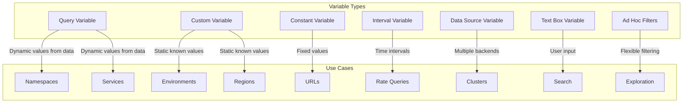

# How to Use Variables for Dynamic Dashboards in Grafana

Author: [nawazdhandala](https://www.github.com/nawazdhandala)

Tags: Grafana, Variables, Dashboards, PromQL, Dynamic Filtering, Templating

Description: Master Grafana dashboard variables to create flexible, reusable dashboards that let users filter by namespace, service, environment, or any dimension without duplicating dashboards.

---

Building a separate dashboard for every service is unsustainable. Variables transform static dashboards into dynamic tools that adapt to user selections. This guide covers all variable types, chaining techniques, and practical patterns for production dashboards.

## Why Use Variables?

Without variables, you need separate dashboards for each environment, namespace, or service. With variables, one dashboard serves multiple contexts. Users select values from dropdowns, and all panels update automatically.

Benefits:
- Reduce dashboard proliferation
- Enable self-service exploration
- Maintain consistency across teams
- Simplify dashboard maintenance

## Creating Your First Variable

Open a dashboard and go to Settings (gear icon) > Variables > Add variable.

### Query Variable

The most common type. Populates options by querying your data source.

```yaml
Name: namespace
Type: Query
Data source: Prometheus
Query: label_values(kube_pod_info, namespace)
Sort: Alphabetical (asc)
Multi-value: true
Include All option: true
```

This creates a dropdown with all namespaces that have pods.

Use the variable in panel queries:

```promql
# Filter by selected namespace
sum by (pod) (
  rate(container_cpu_usage_seconds_total{namespace="$namespace"}[5m])
)
```

### Custom Variable

Hardcoded list of values. Useful for environments or regions.

```yaml
Name: environment
Type: Custom
Values: production,staging,development
Default: production
```

### Constant Variable

Single value used across the dashboard. Good for URLs or shared identifiers.

```yaml
Name: cluster
Type: Constant
Value: us-east-1-prod
Hide: Variable
```

### Interval Variable

Time intervals for rate functions. Adapts to the selected time range.

```yaml
Name: interval
Type: Interval
Values: 1m,5m,10m,30m,1h
Auto option: true
Auto count: 30
```

Use in queries:

```promql
rate(http_requests_total{namespace="$namespace"}[$interval])
```

### Data Source Variable

Switch between data sources of the same type.

```yaml
Name: datasource
Type: Data source
Data source type: Prometheus
Regex: /Prometheus-.*/
```

Use as the data source in panels instead of hardcoding.

## Variable Types Overview



## Chaining Variables

Variables can depend on other variables. This creates cascading dropdowns.

### Example: Namespace > Service > Pod

First variable (namespace):
```yaml
Name: namespace
Query: label_values(kube_pod_info, namespace)
```

Second variable (service), filtered by namespace:
```yaml
Name: service
Query: label_values(kube_pod_info{namespace="$namespace"}, pod)
Regex: /(.+)-[a-z0-9]+-[a-z0-9]+$/
```

The regex extracts the service name from pod names like `api-gateway-abc123-xyz`.

Third variable (pod), filtered by namespace and service:
```yaml
Name: pod
Query: label_values(kube_pod_info{namespace="$namespace", pod=~"$service.*"}, pod)
```

When users select a namespace, the service dropdown updates. When they select a service, the pod dropdown updates.

## Multi-Value Variables

Enable multi-value to allow selecting multiple options simultaneously.

```yaml
Multi-value: true
Include All option: true
All value: .*
```

In queries, use regex matching:

```promql
# Matches multiple selected namespaces
sum by (namespace) (
  rate(http_requests_total{namespace=~"$namespace"}[5m])
)
```

The `=~` operator enables regex matching, which handles pipe-separated values like `namespace1|namespace2`.

### Customizing the All Value

By default, "All" selects all options. Override this for better query performance:

```yaml
All value: .*
```

Or for specific data sources:

```yaml
All value: .+  # Match any non-empty string
```

## Using Variables in Different Contexts

### Panel Titles

```
HTTP Requests - $namespace / $service
```

### Panel Queries

```promql
sum(rate(http_requests_total{
  namespace="$namespace",
  service=~"$service"
}[5m]))
```

### Dashboard Links

```
/d/abc123/service-detail?var-namespace=$namespace&var-service=$service
```

### Annotation Queries

```promql
changes(kube_deployment_status_observed_generation{
  namespace="$namespace",
  deployment=~"$service"
}[5m]) > 0
```

## Advanced Query Patterns

### Extracting Labels with Regex

Extract parts of labels using capture groups:

```yaml
Query: label_values(container_cpu_usage_seconds_total, pod)
Regex: /(.+)-[a-z0-9]{5}-[a-z0-9]{5}/
```

This extracts deployment names from pod names.

### Combining Multiple Metrics

Query one metric but filter another:

```yaml
# Get namespaces that have both pods and services
Query: label_values(kube_pod_info * on(namespace) group_left kube_service_info, namespace)
```

### Using Label Queries

For Prometheus data sources:

```promql
# Get unique values
label_values(namespace)

# Get values from specific metric
label_values(http_requests_total, service)

# Get values with filters
label_values(http_requests_total{namespace="$namespace"}, endpoint)
```

## Variable Refresh Options

Control when variables refresh their options:

- **Never**: Options cached until dashboard refresh
- **On Dashboard Load**: Refresh when dashboard opens
- **On Time Range Change**: Refresh when time picker changes

For frequently changing data, use "On Dashboard Load". For stable data like namespaces, "Never" improves performance.

## Text Box Variables

Allow users to input arbitrary text:

```yaml
Name: search
Type: Text box
Default:
```

Use for filtering:

```promql
# Search logs containing user input
{namespace="$namespace"} |= "$search"
```

## Ad Hoc Filters

Enable flexible filtering without predefined variables:

```yaml
Name: Filters
Type: Ad hoc filters
Data source: Prometheus
```

Users can add any label filter dynamically. Panels automatically apply these filters.

## Practical Dashboard Example

Let us build a service overview dashboard with effective variables:

### Variables Configuration

```yaml
# 1. Data source selector
- name: datasource
  type: datasource
  query: prometheus
  regex: /.*/

# 2. Namespace filter
- name: namespace
  type: query
  datasource: $datasource
  query: label_values(kube_namespace_labels, namespace)
  multi: true
  includeAll: true

# 3. Service filter (depends on namespace)
- name: service
  type: query
  datasource: $datasource
  query: label_values(kube_deployment_labels{namespace=~"$namespace"}, deployment)
  multi: true
  includeAll: true

# 4. Time interval
- name: interval
  type: interval
  auto: true
  auto_count: 50
  auto_min: 30s
```

### Panel Query Using Variables

```promql
# Request rate with all filters applied
sum by (service, namespace) (
  rate(http_requests_total{
    namespace=~"$namespace",
    service=~"$service"
  }[$interval])
)
```

## Common Patterns and Tips

### Pattern: Environment Switcher

```yaml
Name: env
Type: Custom
Values: prod,staging,dev
```

Use to switch data sources:
```yaml
Name: prometheus
Type: Data source
Regex: /prometheus-$env/
```

### Pattern: Time Comparison

Create a variable for comparing current vs previous period:

```yaml
Name: offset
Type: Custom
Values: 0h,1d,7d,30d
```

```promql
# Current value
sum(rate(http_requests_total[$interval]))

# Previous period value
sum(rate(http_requests_total[$interval] offset $offset))
```

### Pattern: Percentile Selector

```yaml
Name: percentile
Type: Custom
Values: 0.50,0.90,0.95,0.99
Default: 0.99
```

```promql
histogram_quantile($percentile,
  sum by (le) (rate(http_request_duration_seconds_bucket[$interval]))
)
```

## Debugging Variables

### Preview Values

In the variable edit screen, scroll down to see "Preview of values". This shows what the query returns.

### Check Query Errors

If no values appear:
1. Go to Explore
2. Run the same query
3. Verify the metric exists and has expected labels

### Variable Interpolation

See how variables expand in queries:

1. Edit a panel
2. Click "Query Inspector"
3. View the "Query" tab to see interpolated values

## Performance Considerations

1. **Limit option count**: Queries returning thousands of values slow down the dashboard
2. **Use regex sparingly**: Complex regex patterns are expensive
3. **Cache aggressively**: Set refresh to "Never" for stable data
4. **Avoid chained dependencies**: Deep chains (A > B > C > D) create query cascades

## Conclusion

Variables transform Grafana dashboards from static displays into interactive exploration tools. Start with namespace and service filters, add interval variables for rate queries, and chain variables for hierarchical data. Well-designed variables let one dashboard serve an entire organization while remaining fast and intuitive.
