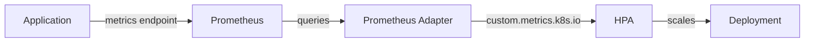

# How to Set Up Horizontal Pod Autoscaler (HPA) with Custom Metrics

Author: [nawazdhandala](https://www.github.com/nawazdhandala)

Tags: Kubernetes, HPA, Autoscaling, Metrics, Prometheus

Description: Learn how to configure Horizontal Pod Autoscaler with custom metrics in Kubernetes. This guide covers Prometheus adapter setup, custom metric definitions, and practical scaling examples.

---

The Horizontal Pod Autoscaler (HPA) can scale your deployments based on CPU and memory usage out of the box. But real applications often need to scale on application-specific metrics: requests per second, queue depth, active connections, or business metrics. This guide shows you how to configure HPA with custom metrics.

## Architecture Overview

Custom metrics flow from your application through Prometheus to the Prometheus Adapter, which exposes them via the Kubernetes custom metrics API:



## Prerequisites

You need:
1. Prometheus installed in your cluster
2. Prometheus Adapter configured
3. Your application exposing metrics

## Step 1: Install Prometheus Adapter

Install the Prometheus Adapter using Helm:

```bash
# Add prometheus-community repo
helm repo add prometheus-community https://prometheus-community.github.io/helm-charts
helm repo update

# Install prometheus adapter
helm install prometheus-adapter prometheus-community/prometheus-adapter \
  --namespace monitoring \
  --set prometheus.url=http://prometheus-server.monitoring.svc \
  --set prometheus.port=80
```

Verify installation:

```bash
# Check adapter is running
kubectl get pods -n monitoring | grep prometheus-adapter

# Verify custom metrics API is available
kubectl get --raw /apis/custom.metrics.k8s.io/v1beta1 | jq .
```

## Step 2: Configure Prometheus Adapter Rules

The adapter needs rules to convert Prometheus metrics into Kubernetes custom metrics. Create a ConfigMap or use Helm values:

```yaml
# prometheus-adapter-config.yaml
apiVersion: v1
kind: ConfigMap
metadata:
  name: prometheus-adapter
  namespace: monitoring
data:
  config.yaml: |
    rules:
    # Rule for HTTP requests per second
    - seriesQuery: 'http_requests_total{namespace!="",pod!=""}'
      resources:
        overrides:
          namespace: {resource: "namespace"}
          pod: {resource: "pod"}
      name:
        matches: "^(.*)_total$"
        as: "${1}_per_second"
      metricsQuery: 'sum(rate(<<.Series>>{<<.LabelMatchers>>}[2m])) by (<<.GroupBy>>)'

    # Rule for queue depth
    - seriesQuery: 'queue_messages_pending{namespace!="",pod!=""}'
      resources:
        overrides:
          namespace: {resource: "namespace"}
          pod: {resource: "pod"}
      name:
        matches: "^(.*)$"
        as: "${1}"
      metricsQuery: 'avg(<<.Series>>{<<.LabelMatchers>>}) by (<<.GroupBy>>)'

    # Rule for active connections
    - seriesQuery: 'app_active_connections{namespace!="",pod!=""}'
      resources:
        overrides:
          namespace: {resource: "namespace"}
          pod: {resource: "pod"}
      name:
        matches: "^(.*)$"
        as: "${1}"
      metricsQuery: 'sum(<<.Series>>{<<.LabelMatchers>>}) by (<<.GroupBy>>)'
```

If using Helm, configure via values:

```yaml
# values.yaml for prometheus-adapter
rules:
  custom:
  - seriesQuery: 'http_requests_total{namespace!="",pod!=""}'
    resources:
      overrides:
        namespace: {resource: "namespace"}
        pod: {resource: "pod"}
    name:
      matches: "^(.*)_total$"
      as: "${1}_per_second"
    metricsQuery: 'sum(rate(<<.Series>>{<<.LabelMatchers>>}[2m])) by (<<.GroupBy>>)'
```

Upgrade with new config:

```bash
helm upgrade prometheus-adapter prometheus-community/prometheus-adapter \
  --namespace monitoring \
  -f values.yaml
```

## Step 3: Verify Custom Metrics

Check that metrics are available:

```bash
# List all custom metrics
kubectl get --raw /apis/custom.metrics.k8s.io/v1beta1 | jq '.resources[].name'

# Get specific metric for a pod
kubectl get --raw "/apis/custom.metrics.k8s.io/v1beta1/namespaces/default/pods/*/http_requests_per_second" | jq .

# Get metric for all pods in namespace
kubectl get --raw "/apis/custom.metrics.k8s.io/v1beta1/namespaces/default/pods/*/queue_messages_pending" | jq .
```

## Step 4: Create HPA with Custom Metrics

Now create an HPA that uses your custom metric:

```yaml
# hpa-custom-metric.yaml
apiVersion: autoscaling/v2
kind: HorizontalPodAutoscaler
metadata:
  name: web-app-hpa
  namespace: default
spec:
  scaleTargetRef:
    apiVersion: apps/v1
    kind: Deployment
    name: web-app
  minReplicas: 2
  maxReplicas: 10
  metrics:
  # Scale based on requests per second per pod
  - type: Pods
    pods:
      metric:
        name: http_requests_per_second
      target:
        type: AverageValue
        averageValue: "100"  # Scale up when > 100 req/s per pod
```

Apply it:

```bash
kubectl apply -f hpa-custom-metric.yaml

# Check HPA status
kubectl get hpa web-app-hpa
# NAME          REFERENCE            TARGETS   MINPODS   MAXPODS   REPLICAS   AGE
# web-app-hpa   Deployment/web-app   45/100    2         10        2          1m
```

## HPA with Multiple Metrics

Combine CPU, memory, and custom metrics:

```yaml
apiVersion: autoscaling/v2
kind: HorizontalPodAutoscaler
metadata:
  name: api-server-hpa
spec:
  scaleTargetRef:
    apiVersion: apps/v1
    kind: Deployment
    name: api-server
  minReplicas: 3
  maxReplicas: 20
  metrics:
  # CPU utilization
  - type: Resource
    resource:
      name: cpu
      target:
        type: Utilization
        averageUtilization: 70
  # Memory utilization
  - type: Resource
    resource:
      name: memory
      target:
        type: Utilization
        averageUtilization: 80
  # Custom: requests per second
  - type: Pods
    pods:
      metric:
        name: http_requests_per_second
      target:
        type: AverageValue
        averageValue: "500"
  # Custom: queue depth
  - type: Pods
    pods:
      metric:
        name: queue_messages_pending
      target:
        type: AverageValue
        averageValue: "50"
  behavior:
    scaleDown:
      stabilizationWindowSeconds: 300  # Wait 5 min before scaling down
      policies:
      - type: Percent
        value: 10
        periodSeconds: 60
    scaleUp:
      stabilizationWindowSeconds: 0
      policies:
      - type: Percent
        value: 100
        periodSeconds: 15
      - type: Pods
        value: 4
        periodSeconds: 15
      selectPolicy: Max
```

## Example: Application with Custom Metrics

Here is a complete example with a Python app exposing Prometheus metrics:

```python
# app.py
from flask import Flask
from prometheus_client import Counter, Gauge, generate_latest
import random

app = Flask(__name__)

# Define metrics
REQUEST_COUNT = Counter('http_requests_total', 'Total HTTP requests', ['method', 'endpoint'])
QUEUE_DEPTH = Gauge('queue_messages_pending', 'Messages waiting in queue')
ACTIVE_CONNECTIONS = Gauge('app_active_connections', 'Active client connections')

@app.route('/')
def index():
    REQUEST_COUNT.labels(method='GET', endpoint='/').inc()
    return 'Hello World'

@app.route('/metrics')
def metrics():
    # Simulate queue depth and connections
    QUEUE_DEPTH.set(random.randint(0, 100))
    ACTIVE_CONNECTIONS.set(random.randint(10, 50))
    return generate_latest()

if __name__ == '__main__':
    app.run(host='0.0.0.0', port=8080)
```

Deployment with Prometheus annotations:

```yaml
apiVersion: apps/v1
kind: Deployment
metadata:
  name: web-app
spec:
  replicas: 2
  selector:
    matchLabels:
      app: web-app
  template:
    metadata:
      labels:
        app: web-app
      annotations:
        # Tell Prometheus to scrape this pod
        prometheus.io/scrape: "true"
        prometheus.io/port: "8080"
        prometheus.io/path: "/metrics"
    spec:
      containers:
      - name: app
        image: myapp:1.0
        ports:
        - containerPort: 8080
        resources:
          requests:
            cpu: 100m
            memory: 128Mi
          limits:
            cpu: 500m
            memory: 256Mi
```

## External Metrics (from outside the cluster)

For metrics not tied to pods (like cloud service queue depth):

```yaml
apiVersion: autoscaling/v2
kind: HorizontalPodAutoscaler
metadata:
  name: worker-hpa
spec:
  scaleTargetRef:
    apiVersion: apps/v1
    kind: Deployment
    name: queue-worker
  minReplicas: 1
  maxReplicas: 50
  metrics:
  - type: External
    external:
      metric:
        name: sqs_queue_depth
        selector:
          matchLabels:
            queue: orders
      target:
        type: AverageValue
        averageValue: "10"  # Scale up when > 10 messages per pod
```

## Troubleshooting

### Metric Not Found

```bash
# Check if Prometheus has the metric
kubectl exec -n monitoring prometheus-server-xxx -- \
  wget -qO- 'http://localhost:9090/api/v1/query?query=http_requests_total'

# Check adapter logs
kubectl logs -n monitoring -l app=prometheus-adapter

# Verify adapter rules
kubectl get configmap -n monitoring prometheus-adapter -o yaml
```

### HPA Shows Unknown

```bash
kubectl describe hpa web-app-hpa
# Check for error messages about metrics

# Verify metric is available
kubectl get --raw "/apis/custom.metrics.k8s.io/v1beta1/namespaces/default/pods/*/http_requests_per_second"
```

### Scaling Too Aggressively

Add behavior controls:

```yaml
behavior:
  scaleDown:
    stabilizationWindowSeconds: 300
    policies:
    - type: Pods
      value: 1
      periodSeconds: 60
  scaleUp:
    stabilizationWindowSeconds: 60
    policies:
    - type: Pods
      value: 2
      periodSeconds: 60
```

## Summary

Custom metrics HPA lets you scale based on application-specific metrics rather than just CPU and memory. Install the Prometheus Adapter, configure rules to expose your Prometheus metrics via the Kubernetes API, then create HPAs that reference those metrics. Combine multiple metrics for sophisticated scaling behavior, and use the behavior field to control scaling velocity. Monitor your HPA with `kubectl describe hpa` and check Prometheus directly when troubleshooting metric issues.
