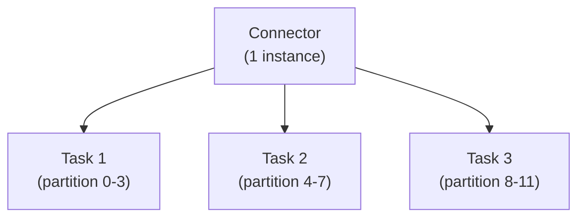

# How to Build Custom Kafka Connectors

Author: [nawazdhandala](https://github.com/nawazdhandala)

Tags: Apache Kafka, Kafka Connect, Custom Connectors, Source Connector, Sink Connector, Data Integration

Description: Learn how to build custom Kafka Connect source and sink connectors, including connector design patterns, task implementation, offset management, and packaging for production deployment.

---

Custom Kafka Connectors allow you to integrate Kafka with any data source or sink. This guide covers building both source and sink connectors with proper error handling, offset management, and production considerations.

## Connector Architecture



- **Connector**: Configuration, task distribution
- **Task**: Actual data movement

## Project Setup

### Maven Dependencies

```xml
<project>
    <groupId>com.example</groupId>
    <artifactId>my-kafka-connector</artifactId>
    <version>1.0.0</version>
    <packaging>jar</packaging>

    <dependencies>
        <dependency>
            <groupId>org.apache.kafka</groupId>
            <artifactId>connect-api</artifactId>
            <version>3.7.0</version>
            <scope>provided</scope>
        </dependency>
        <dependency>
            <groupId>org.apache.kafka</groupId>
            <artifactId>connect-transforms</artifactId>
            <version>3.7.0</version>
            <scope>provided</scope>
        </dependency>

        <!-- Your external dependencies -->
        <dependency>
            <groupId>com.squareup.okhttp3</groupId>
            <artifactId>okhttp</artifactId>
            <version>4.12.0</version>
        </dependency>

        <!-- Testing -->
        <dependency>
            <groupId>org.junit.jupiter</groupId>
            <artifactId>junit-jupiter</artifactId>
            <version>5.10.0</version>
            <scope>test</scope>
        </dependency>
    </dependencies>

    <build>
        <plugins>
            <plugin>
                <groupId>org.apache.maven.plugins</groupId>
                <artifactId>maven-assembly-plugin</artifactId>
                <version>3.6.0</version>
                <configuration>
                    <descriptorRefs>
                        <descriptorRef>jar-with-dependencies</descriptorRef>
                    </descriptorRefs>
                </configuration>
                <executions>
                    <execution>
                        <phase>package</phase>
                        <goals>
                            <goal>single</goal>
                        </goals>
                    </execution>
                </executions>
            </plugin>
        </plugins>
    </build>
</project>
```

## Source Connector

### Connector Class

```java
package com.example.connect;

import org.apache.kafka.common.config.ConfigDef;
import org.apache.kafka.connect.connector.Task;
import org.apache.kafka.connect.source.SourceConnector;

import java.util.*;

public class HttpSourceConnector extends SourceConnector {
    private Map<String, String> configProps;

    @Override
    public String version() {
        return "1.0.0";
    }

    @Override
    public void start(Map<String, String> props) {
        this.configProps = props;

        // Validate configuration
        HttpSourceConnectorConfig config = new HttpSourceConnectorConfig(props);
        config.validate();
    }

    @Override
    public Class<? extends Task> taskClass() {
        return HttpSourceTask.class;
    }

    @Override
    public List<Map<String, String>> taskConfigs(int maxTasks) {
        // Distribute work among tasks
        List<Map<String, String>> taskConfigs = new ArrayList<>();

        String endpoints = configProps.get(HttpSourceConnectorConfig.ENDPOINTS_CONFIG);
        String[] endpointList = endpoints.split(",");

        // Distribute endpoints among tasks
        int numTasks = Math.min(maxTasks, endpointList.length);
        for (int i = 0; i < numTasks; i++) {
            Map<String, String> taskConfig = new HashMap<>(configProps);

            // Assign subset of endpoints to each task
            List<String> taskEndpoints = new ArrayList<>();
            for (int j = i; j < endpointList.length; j += numTasks) {
                taskEndpoints.add(endpointList[j].trim());
            }
            taskConfig.put("task.endpoints", String.join(",", taskEndpoints));
            taskConfigs.add(taskConfig);
        }

        return taskConfigs;
    }

    @Override
    public void stop() {
        // Cleanup resources
    }

    @Override
    public ConfigDef config() {
        return HttpSourceConnectorConfig.CONFIG_DEF;
    }
}
```

### Connector Configuration

```java
package com.example.connect;

import org.apache.kafka.common.config.AbstractConfig;
import org.apache.kafka.common.config.ConfigDef;
import org.apache.kafka.common.config.ConfigException;

import java.util.Map;

public class HttpSourceConnectorConfig extends AbstractConfig {
    public static final String ENDPOINTS_CONFIG = "http.endpoints";
    public static final String POLL_INTERVAL_CONFIG = "poll.interval.ms";
    public static final String TOPIC_CONFIG = "topic";
    public static final String AUTH_HEADER_CONFIG = "http.auth.header";
    public static final String BATCH_SIZE_CONFIG = "batch.size";

    public static final ConfigDef CONFIG_DEF = new ConfigDef()
        .define(ENDPOINTS_CONFIG,
            ConfigDef.Type.STRING,
            ConfigDef.NO_DEFAULT_VALUE,
            ConfigDef.Importance.HIGH,
            "Comma-separated list of HTTP endpoints to poll")
        .define(TOPIC_CONFIG,
            ConfigDef.Type.STRING,
            ConfigDef.NO_DEFAULT_VALUE,
            ConfigDef.Importance.HIGH,
            "Topic to write data to")
        .define(POLL_INTERVAL_CONFIG,
            ConfigDef.Type.LONG,
            60000L,
            ConfigDef.Importance.MEDIUM,
            "Poll interval in milliseconds")
        .define(AUTH_HEADER_CONFIG,
            ConfigDef.Type.PASSWORD,
            null,
            ConfigDef.Importance.MEDIUM,
            "Authorization header value")
        .define(BATCH_SIZE_CONFIG,
            ConfigDef.Type.INT,
            100,
            ConfigDef.Importance.LOW,
            "Maximum records per poll");

    public HttpSourceConnectorConfig(Map<String, String> props) {
        super(CONFIG_DEF, props);
    }

    public void validate() {
        String endpoints = getString(ENDPOINTS_CONFIG);
        if (endpoints == null || endpoints.isEmpty()) {
            throw new ConfigException("At least one endpoint must be specified");
        }
    }

    public String[] getEndpoints() {
        return getString(ENDPOINTS_CONFIG).split(",");
    }

    public String getTopic() {
        return getString(TOPIC_CONFIG);
    }

    public long getPollInterval() {
        return getLong(POLL_INTERVAL_CONFIG);
    }

    public String getAuthHeader() {
        return getPassword(AUTH_HEADER_CONFIG) != null
            ? getPassword(AUTH_HEADER_CONFIG).value()
            : null;
    }

    public int getBatchSize() {
        return getInt(BATCH_SIZE_CONFIG);
    }
}
```

### Source Task

```java
package com.example.connect;

import org.apache.kafka.connect.data.Schema;
import org.apache.kafka.connect.source.SourceRecord;
import org.apache.kafka.connect.source.SourceTask;
import com.fasterxml.jackson.databind.JsonNode;
import com.fasterxml.jackson.databind.ObjectMapper;
import okhttp3.*;

import java.util.*;
import java.util.concurrent.TimeUnit;

public class HttpSourceTask extends SourceTask {
    private HttpSourceConnectorConfig config;
    private String[] endpoints;
    private OkHttpClient httpClient;
    private ObjectMapper objectMapper;
    private long lastPollTime;

    @Override
    public String version() {
        return "1.0.0";
    }

    @Override
    public void start(Map<String, String> props) {
        this.config = new HttpSourceConnectorConfig(props);
        this.endpoints = props.get("task.endpoints").split(",");
        this.objectMapper = new ObjectMapper();

        this.httpClient = new OkHttpClient.Builder()
            .connectTimeout(30, TimeUnit.SECONDS)
            .readTimeout(30, TimeUnit.SECONDS)
            .build();
    }

    @Override
    public List<SourceRecord> poll() throws InterruptedException {
        // Rate limiting
        long elapsed = System.currentTimeMillis() - lastPollTime;
        if (elapsed < config.getPollInterval()) {
            Thread.sleep(config.getPollInterval() - elapsed);
        }

        List<SourceRecord> records = new ArrayList<>();

        for (String endpoint : endpoints) {
            try {
                List<SourceRecord> endpointRecords = pollEndpoint(endpoint.trim());
                records.addAll(endpointRecords);
            } catch (Exception e) {
                // Log error but continue with other endpoints
                System.err.println("Error polling " + endpoint + ": " + e.getMessage());
            }
        }

        lastPollTime = System.currentTimeMillis();
        return records;
    }

    private List<SourceRecord> pollEndpoint(String endpoint) throws Exception {
        List<SourceRecord> records = new ArrayList<>();

        // Get last offset for this endpoint
        Map<String, Object> sourcePartition = Collections.singletonMap("endpoint", endpoint);
        Map<String, Object> lastOffset = context.offsetStorageReader().offset(sourcePartition);

        String lastId = lastOffset != null ? (String) lastOffset.get("last_id") : "0";

        // Build request
        Request.Builder requestBuilder = new Request.Builder()
            .url(endpoint + "?since_id=" + lastId)
            .get();

        if (config.getAuthHeader() != null) {
            requestBuilder.addHeader("Authorization", config.getAuthHeader());
        }

        // Execute request
        try (Response response = httpClient.newCall(requestBuilder.build()).execute()) {
            if (!response.isSuccessful()) {
                throw new RuntimeException("HTTP error: " + response.code());
            }

            JsonNode root = objectMapper.readTree(response.body().string());
            JsonNode items = root.get("items");

            if (items != null && items.isArray()) {
                String newLastId = lastId;

                for (JsonNode item : items) {
                    String id = item.get("id").asText();
                    String value = objectMapper.writeValueAsString(item);

                    Map<String, Object> sourceOffset = Collections.singletonMap("last_id", id);

                    SourceRecord record = new SourceRecord(
                        sourcePartition,
                        sourceOffset,
                        config.getTopic(),
                        null,  // partition
                        Schema.STRING_SCHEMA,
                        id,
                        Schema.STRING_SCHEMA,
                        value
                    );

                    records.add(record);
                    newLastId = id;
                }
            }
        }

        return records;
    }

    @Override
    public void stop() {
        if (httpClient != null) {
            httpClient.dispatcher().executorService().shutdown();
            httpClient.connectionPool().evictAll();
        }
    }
}
```

## Sink Connector

### Connector Class

```java
package com.example.connect;

import org.apache.kafka.common.config.ConfigDef;
import org.apache.kafka.connect.connector.Task;
import org.apache.kafka.connect.sink.SinkConnector;

import java.util.*;

public class HttpSinkConnector extends SinkConnector {
    private Map<String, String> configProps;

    @Override
    public String version() {
        return "1.0.0";
    }

    @Override
    public void start(Map<String, String> props) {
        this.configProps = props;
        HttpSinkConnectorConfig config = new HttpSinkConnectorConfig(props);
        config.validate();
    }

    @Override
    public Class<? extends Task> taskClass() {
        return HttpSinkTask.class;
    }

    @Override
    public List<Map<String, String>> taskConfigs(int maxTasks) {
        // All tasks get the same config for sink connector
        List<Map<String, String>> taskConfigs = new ArrayList<>();
        for (int i = 0; i < maxTasks; i++) {
            taskConfigs.add(new HashMap<>(configProps));
        }
        return taskConfigs;
    }

    @Override
    public void stop() {
        // Cleanup
    }

    @Override
    public ConfigDef config() {
        return HttpSinkConnectorConfig.CONFIG_DEF;
    }
}
```

### Sink Task

```java
package com.example.connect;

import org.apache.kafka.connect.sink.SinkRecord;
import org.apache.kafka.connect.sink.SinkTask;
import org.apache.kafka.connect.errors.RetriableException;
import okhttp3.*;

import java.util.*;
import java.util.concurrent.TimeUnit;

public class HttpSinkTask extends SinkTask {
    private HttpSinkConnectorConfig config;
    private OkHttpClient httpClient;
    private static final MediaType JSON = MediaType.parse("application/json");

    @Override
    public String version() {
        return "1.0.0";
    }

    @Override
    public void start(Map<String, String> props) {
        this.config = new HttpSinkConnectorConfig(props);

        this.httpClient = new OkHttpClient.Builder()
            .connectTimeout(30, TimeUnit.SECONDS)
            .writeTimeout(30, TimeUnit.SECONDS)
            .build();
    }

    @Override
    public void put(Collection<SinkRecord> records) {
        if (records.isEmpty()) {
            return;
        }

        // Batch records
        List<SinkRecord> batch = new ArrayList<>();
        for (SinkRecord record : records) {
            batch.add(record);

            if (batch.size() >= config.getBatchSize()) {
                sendBatch(batch);
                batch.clear();
            }
        }

        // Send remaining
        if (!batch.isEmpty()) {
            sendBatch(batch);
        }
    }

    private void sendBatch(List<SinkRecord> records) {
        try {
            // Build JSON array
            StringBuilder jsonBuilder = new StringBuilder("[");
            for (int i = 0; i < records.size(); i++) {
                if (i > 0) jsonBuilder.append(",");
                jsonBuilder.append(records.get(i).value().toString());
            }
            jsonBuilder.append("]");

            RequestBody body = RequestBody.create(jsonBuilder.toString(), JSON);

            Request.Builder requestBuilder = new Request.Builder()
                .url(config.getEndpoint())
                .post(body);

            if (config.getAuthHeader() != null) {
                requestBuilder.addHeader("Authorization", config.getAuthHeader());
            }

            try (Response response = httpClient.newCall(requestBuilder.build()).execute()) {
                if (!response.isSuccessful()) {
                    if (response.code() >= 500) {
                        // Retriable error
                        throw new RetriableException("Server error: " + response.code());
                    }
                    throw new RuntimeException("HTTP error: " + response.code());
                }
            }
        } catch (java.io.IOException e) {
            throw new RetriableException("Network error: " + e.getMessage(), e);
        }
    }

    @Override
    public void flush(Map<org.apache.kafka.common.TopicPartition, org.apache.kafka.clients.consumer.OffsetAndMetadata> offsets) {
        // No buffering, records sent immediately in put()
    }

    @Override
    public void stop() {
        if (httpClient != null) {
            httpClient.dispatcher().executorService().shutdown();
            httpClient.connectionPool().evictAll();
        }
    }
}
```

## Error Handling

### Retriable Errors

```java
import org.apache.kafka.connect.errors.RetriableException;
import org.apache.kafka.connect.errors.ConnectException;

public void put(Collection<SinkRecord> records) {
    try {
        sendRecords(records);
    } catch (TemporaryException e) {
        // Will be retried
        throw new RetriableException(e);
    } catch (PermanentException e) {
        // Will fail the task
        throw new ConnectException(e);
    }
}
```

### Dead Letter Queue

```java
@Override
public void put(Collection<SinkRecord> records) {
    for (SinkRecord record : records) {
        try {
            processRecord(record);
        } catch (Exception e) {
            // Report error for DLQ
            context.errantRecordReporter().report(record, e);
        }
    }
}
```

## Testing

### Unit Tests

```java
import org.junit.jupiter.api.*;
import static org.junit.jupiter.api.Assertions.*;

class HttpSourceConnectorTest {
    private HttpSourceConnector connector;

    @BeforeEach
    void setup() {
        connector = new HttpSourceConnector();
    }

    @Test
    void testTaskConfigs() {
        Map<String, String> props = new HashMap<>();
        props.put("http.endpoints", "http://api1.com,http://api2.com,http://api3.com");
        props.put("topic", "test-topic");

        connector.start(props);

        List<Map<String, String>> taskConfigs = connector.taskConfigs(2);

        assertEquals(2, taskConfigs.size());
        // Verify endpoint distribution
    }

    @Test
    void testConfig() {
        ConfigDef config = connector.config();
        assertNotNull(config.configKeys().get("http.endpoints"));
    }
}
```

### Integration Tests with EmbeddedKafka

```java
import org.apache.kafka.connect.runtime.standalone.StandaloneConfig;
import org.junit.jupiter.api.*;

class HttpSourceConnectorIntegrationTest {
    // Use testcontainers for Kafka
    @Container
    static KafkaContainer kafka = new KafkaContainer(DockerImageName.parse("confluentinc/cp-kafka:7.5.0"));

    @Test
    void testConnectorProducesRecords() throws Exception {
        // Start connector in standalone mode
        // Verify records are produced to topic
    }
}
```

## Packaging

### Create Connect Plugin

```bash
# Structure
my-connector/
├── lib/
│   ├── my-connector-1.0.0.jar
│   └── dependencies/
│       ├── okhttp-4.12.0.jar
│       └── ...
└── manifest.json
```

### Manifest File

```json
{
  "name": "http-connector",
  "version": "1.0.0",
  "title": "HTTP Source and Sink Connector",
  "description": "Kafka Connect connector for HTTP APIs",
  "owner": {
    "name": "Your Company",
    "url": "https://example.com"
  },
  "tags": ["http", "api", "rest"],
  "features": {
    "supported_encodings": ["json"],
    "single_message_transforms": true
  }
}
```

### Build Script

```bash
#!/bin/bash
mvn clean package

mkdir -p target/connector/lib
cp target/my-connector-1.0.0-jar-with-dependencies.jar target/connector/lib/
cp manifest.json target/connector/

cd target && zip -r my-connector-1.0.0.zip connector
```

## Deployment

### Install Plugin

```bash
# Copy to Connect plugin path
cp -r my-connector /usr/share/java/

# Or extract from zip
unzip my-connector-1.0.0.zip -d /usr/share/confluent-hub-components/
```

### Configuration

```json
{
  "name": "http-source",
  "config": {
    "connector.class": "com.example.connect.HttpSourceConnector",
    "http.endpoints": "https://api.example.com/events",
    "topic": "events",
    "poll.interval.ms": "30000",
    "tasks.max": "2"
  }
}
```

## Best Practices

1. **Use ConfigDef** - Proper configuration validation
2. **Handle errors gracefully** - Use RetriableException for transient errors
3. **Implement proper offset tracking** - For source connectors
4. **Batch operations** - Improve throughput for sink connectors
5. **Resource cleanup** - Close connections in stop()
6. **Comprehensive logging** - Aid debugging in production

## Summary

| Component | Responsibility |
|-----------|---------------|
| Connector | Configuration, task distribution |
| Task | Data movement, offset management |
| ConfigDef | Configuration schema and validation |
| Context | Framework interaction, offsets |

Build custom connectors when existing ones don't meet your needs, following the Connect API patterns for reliable data integration.
