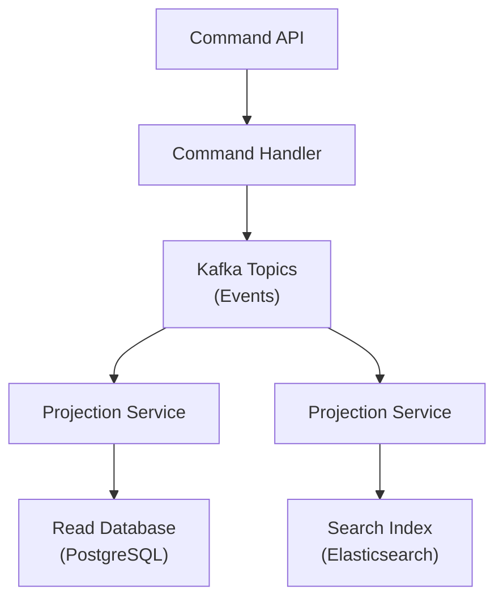

# How to Build CQRS with Kafka

Author: [nawazdhandala](https://github.com/nawazdhandala)

Tags: Apache Kafka, CQRS, Event-Driven Architecture, Command Query Separation, Microservices, Java

Description: Learn how to implement Command Query Responsibility Segregation (CQRS) with Apache Kafka, including command handling, event publishing, and read model projections.

---

CQRS (Command Query Responsibility Segregation) separates read and write operations into different models. Kafka serves as an excellent event bus for implementing CQRS patterns in distributed systems.

## CQRS Architecture Overview



## Domain Events

```java
// Base event interface
public interface DomainEvent {
    String getEventId();
    String getAggregateId();
    Instant getTimestamp();
    String getEventType();
}

// Order events
@Value
public class OrderCreatedEvent implements DomainEvent {
    String eventId = UUID.randomUUID().toString();
    String aggregateId;
    Instant timestamp = Instant.now();
    String eventType = "OrderCreated";

    String customerId;
    List<OrderItem> items;
    BigDecimal totalAmount;
}

@Value
public class OrderShippedEvent implements DomainEvent {
    String eventId = UUID.randomUUID().toString();
    String aggregateId;
    Instant timestamp = Instant.now();
    String eventType = "OrderShipped";

    String trackingNumber;
    String carrier;
}

@Value
public class OrderCancelledEvent implements DomainEvent {
    String eventId = UUID.randomUUID().toString();
    String aggregateId;
    Instant timestamp = Instant.now();
    String eventType = "OrderCancelled";

    String reason;
}
```

## Command Side

### Command Handling

```java
// Commands
public interface Command {
    String getCommandId();
}

@Value
public class CreateOrderCommand implements Command {
    String commandId = UUID.randomUUID().toString();
    String customerId;
    List<OrderItem> items;
}

@Value
public class ShipOrderCommand implements Command {
    String commandId = UUID.randomUUID().toString();
    String orderId;
    String trackingNumber;
    String carrier;
}

// Command handler
@Service
public class OrderCommandHandler {
    private final KafkaTemplate<String, DomainEvent> kafkaTemplate;
    private final OrderRepository orderRepository;

    public OrderCommandHandler(KafkaTemplate<String, DomainEvent> kafkaTemplate,
                               OrderRepository orderRepository) {
        this.kafkaTemplate = kafkaTemplate;
        this.orderRepository = orderRepository;
    }

    @Transactional
    public String handle(CreateOrderCommand command) {
        // Validate command
        validateCreateOrder(command);

        // Create aggregate
        String orderId = UUID.randomUUID().toString();
        BigDecimal total = calculateTotal(command.getItems());

        // Create event
        OrderCreatedEvent event = new OrderCreatedEvent(
            orderId,
            command.getCustomerId(),
            command.getItems(),
            total
        );

        // Persist to write store (optional for event sourcing)
        Order order = new Order(orderId, command.getCustomerId(), "CREATED");
        orderRepository.save(order);

        // Publish event
        kafkaTemplate.send("order-events", orderId, event);

        return orderId;
    }

    @Transactional
    public void handle(ShipOrderCommand command) {
        Order order = orderRepository.findById(command.getOrderId())
            .orElseThrow(() -> new OrderNotFoundException(command.getOrderId()));

        if (!order.getStatus().equals("CREATED")) {
            throw new InvalidOrderStateException("Cannot ship order in state: " + order.getStatus());
        }

        // Update state
        order.setStatus("SHIPPED");
        orderRepository.save(order);

        // Publish event
        OrderShippedEvent event = new OrderShippedEvent(
            command.getOrderId(),
            command.getTrackingNumber(),
            command.getCarrier()
        );

        kafkaTemplate.send("order-events", command.getOrderId(), event);
    }
}
```

### Command API

```java
@RestController
@RequestMapping("/api/orders")
public class OrderCommandController {
    private final OrderCommandHandler commandHandler;

    @PostMapping
    public ResponseEntity<CreateOrderResponse> createOrder(@RequestBody CreateOrderRequest request) {
        CreateOrderCommand command = new CreateOrderCommand(
            request.getCustomerId(),
            request.getItems()
        );

        String orderId = commandHandler.handle(command);

        return ResponseEntity
            .status(HttpStatus.ACCEPTED)
            .body(new CreateOrderResponse(orderId, "Order creation initiated"));
    }

    @PostMapping("/{orderId}/ship")
    public ResponseEntity<Void> shipOrder(
            @PathVariable String orderId,
            @RequestBody ShipOrderRequest request) {

        ShipOrderCommand command = new ShipOrderCommand(
            orderId,
            request.getTrackingNumber(),
            request.getCarrier()
        );

        commandHandler.handle(command);

        return ResponseEntity.accepted().build();
    }
}
```

## Query Side - Projections

### PostgreSQL Read Model

```java
@Entity
@Table(name = "order_view")
public class OrderView {
    @Id
    private String orderId;
    private String customerId;
    private String status;
    private BigDecimal totalAmount;
    private String trackingNumber;
    private String carrier;
    private Instant createdAt;
    private Instant updatedAt;

    // Getters, setters
}

@Service
public class OrderProjection {
    private final OrderViewRepository viewRepository;

    @KafkaListener(topics = "order-events", groupId = "order-projection")
    public void handleEvent(DomainEvent event) {
        switch (event.getEventType()) {
            case "OrderCreated":
                handleOrderCreated((OrderCreatedEvent) event);
                break;
            case "OrderShipped":
                handleOrderShipped((OrderShippedEvent) event);
                break;
            case "OrderCancelled":
                handleOrderCancelled((OrderCancelledEvent) event);
                break;
        }
    }

    private void handleOrderCreated(OrderCreatedEvent event) {
        OrderView view = new OrderView();
        view.setOrderId(event.getAggregateId());
        view.setCustomerId(event.getCustomerId());
        view.setStatus("CREATED");
        view.setTotalAmount(event.getTotalAmount());
        view.setCreatedAt(event.getTimestamp());
        view.setUpdatedAt(event.getTimestamp());

        viewRepository.save(view);
    }

    private void handleOrderShipped(OrderShippedEvent event) {
        viewRepository.findById(event.getAggregateId()).ifPresent(view -> {
            view.setStatus("SHIPPED");
            view.setTrackingNumber(event.getTrackingNumber());
            view.setCarrier(event.getCarrier());
            view.setUpdatedAt(event.getTimestamp());
            viewRepository.save(view);
        });
    }

    private void handleOrderCancelled(OrderCancelledEvent event) {
        viewRepository.findById(event.getAggregateId()).ifPresent(view -> {
            view.setStatus("CANCELLED");
            view.setUpdatedAt(event.getTimestamp());
            viewRepository.save(view);
        });
    }
}
```

### Elasticsearch Read Model

```java
@Document(indexName = "orders")
public class OrderSearchDocument {
    @Id
    private String orderId;
    private String customerId;
    private String status;
    private BigDecimal totalAmount;
    private List<String> productNames;
    private Instant createdAt;
}

@Service
public class OrderSearchProjection {
    private final ElasticsearchOperations elasticsearchOps;

    @KafkaListener(topics = "order-events", groupId = "order-search-projection")
    public void handleEvent(DomainEvent event) {
        if (event instanceof OrderCreatedEvent) {
            handleOrderCreated((OrderCreatedEvent) event);
        } else if (event instanceof OrderShippedEvent) {
            updateOrderStatus(event.getAggregateId(), "SHIPPED");
        } else if (event instanceof OrderCancelledEvent) {
            updateOrderStatus(event.getAggregateId(), "CANCELLED");
        }
    }

    private void handleOrderCreated(OrderCreatedEvent event) {
        OrderSearchDocument doc = new OrderSearchDocument();
        doc.setOrderId(event.getAggregateId());
        doc.setCustomerId(event.getCustomerId());
        doc.setStatus("CREATED");
        doc.setTotalAmount(event.getTotalAmount());
        doc.setProductNames(event.getItems().stream()
            .map(OrderItem::getProductName)
            .collect(Collectors.toList()));
        doc.setCreatedAt(event.getTimestamp());

        elasticsearchOps.save(doc);
    }

    private void updateOrderStatus(String orderId, String status) {
        UpdateQuery updateQuery = UpdateQuery.builder(orderId)
            .withScript("ctx._source.status = '" + status + "'")
            .build();

        elasticsearchOps.update(updateQuery, IndexCoordinates.of("orders"));
    }
}
```

## Query API

```java
@RestController
@RequestMapping("/api/orders")
public class OrderQueryController {
    private final OrderViewRepository viewRepository;
    private final OrderSearchRepository searchRepository;

    // Simple queries use PostgreSQL view
    @GetMapping("/{orderId}")
    public ResponseEntity<OrderView> getOrder(@PathVariable String orderId) {
        return viewRepository.findById(orderId)
            .map(ResponseEntity::ok)
            .orElse(ResponseEntity.notFound().build());
    }

    @GetMapping("/customer/{customerId}")
    public List<OrderView> getCustomerOrders(@PathVariable String customerId) {
        return viewRepository.findByCustomerId(customerId);
    }

    // Full-text search uses Elasticsearch
    @GetMapping("/search")
    public List<OrderSearchDocument> searchOrders(
            @RequestParam String query,
            @RequestParam(required = false) String status) {

        return searchRepository.search(query, status);
    }
}
```

## Kafka Configuration

```java
@Configuration
public class KafkaConfig {

    @Bean
    public ProducerFactory<String, DomainEvent> producerFactory() {
        Map<String, Object> config = new HashMap<>();
        config.put(ProducerConfig.BOOTSTRAP_SERVERS_CONFIG, "localhost:9092");
        config.put(ProducerConfig.KEY_SERIALIZER_CLASS_CONFIG, StringSerializer.class);
        config.put(ProducerConfig.VALUE_SERIALIZER_CLASS_CONFIG, JsonSerializer.class);
        config.put(ProducerConfig.ACKS_CONFIG, "all");
        config.put(ProducerConfig.ENABLE_IDEMPOTENCE_CONFIG, true);

        return new DefaultKafkaProducerFactory<>(config);
    }

    @Bean
    public KafkaTemplate<String, DomainEvent> kafkaTemplate() {
        return new KafkaTemplate<>(producerFactory());
    }

    @Bean
    public ConsumerFactory<String, DomainEvent> consumerFactory() {
        Map<String, Object> config = new HashMap<>();
        config.put(ConsumerConfig.BOOTSTRAP_SERVERS_CONFIG, "localhost:9092");
        config.put(ConsumerConfig.KEY_DESERIALIZER_CLASS_CONFIG, StringDeserializer.class);
        config.put(ConsumerConfig.VALUE_DESERIALIZER_CLASS_CONFIG, JsonDeserializer.class);
        config.put(JsonDeserializer.TRUSTED_PACKAGES, "*");

        return new DefaultKafkaConsumerFactory<>(config);
    }
}
```

## Best Practices

| Practice | Description |
|----------|-------------|
| Idempotent projections | Handle duplicate events gracefully |
| Event versioning | Include version in events for schema evolution |
| Separate consumer groups | Each projection has its own group |
| Event ordering | Use aggregate ID as partition key |
| Eventual consistency | Accept read lag in projections |

CQRS with Kafka enables scalable, event-driven architectures with optimized read and write paths for different query patterns.
