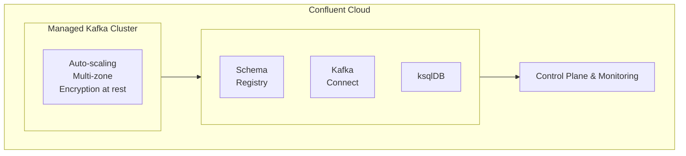
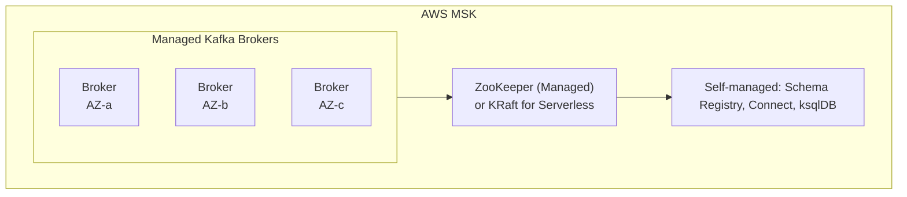
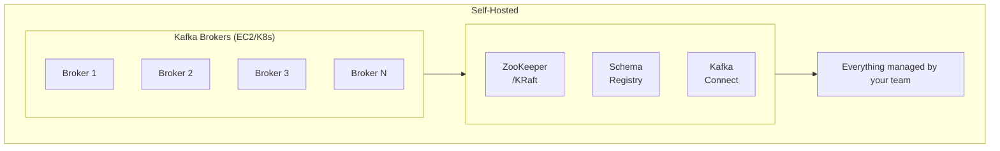

# Confluent Cloud vs AWS MSK vs Self-Hosted Kafka

Author: [nawazdhandala](https://www.github.com/nawazdhandala)

Tags: Apache Kafka, Confluent Cloud, AWS MSK, Managed Kafka, Cloud Comparison, Self-Hosted

Description: A comprehensive comparison of managed Kafka options including Confluent Cloud, AWS MSK, and self-hosted Kafka, covering features, pricing, operational overhead, and use cases.

---

Choosing the right Kafka deployment option is crucial for your streaming platform's success. This guide compares Confluent Cloud, AWS MSK, and self-hosted Kafka to help you make an informed decision.

## Overview Comparison

| Feature | Confluent Cloud | AWS MSK | Self-Hosted |
|---------|----------------|---------|-------------|
| Management | Fully managed | Managed brokers | Full control |
| Setup time | Minutes | Hours | Days/Weeks |
| Schema Registry | Included | Separate (Glue) | Deploy separately |
| Kafka Connect | Managed connectors | Self-managed | Self-managed |
| ksqlDB | Included | Not available | Deploy separately |
| Multi-cloud | Yes | AWS only | Yes |
| Cost model | Pay per use | Per broker hour | Infrastructure |

## Architecture Comparison

### Confluent Cloud



### AWS MSK



### Self-Hosted



## Feature Deep Dive

### Confluent Cloud Features

```yaml
# Confluent Cloud Capabilities
cluster_types:
  - basic: "Single zone, limited throughput"
  - standard: "Multi-zone, higher throughput"
  - dedicated: "Single-tenant, highest performance"

included_services:
  - schema_registry: "Fully managed"
  - kafka_connect: "Managed connectors (200+)"
  - ksqldb: "Managed stream processing"
  - cluster_linking: "Cross-cluster replication"
  - audit_logs: "Compliance logging"

security:
  - encryption_at_rest: true
  - encryption_in_transit: true
  - rbac: true
  - sso: true
  - private_link: true
```

### AWS MSK Features

```yaml
# AWS MSK Capabilities
cluster_types:
  - provisioned: "Fixed broker count"
  - serverless: "Auto-scaling, pay per use"

included_services:
  - kafka_brokers: "Managed"
  - zookeeper: "Managed"
  - storage: "Auto-scaling EBS"

integrations:
  - iam_authentication: true
  - glue_schema_registry: "Separate service"
  - lambda_triggers: true
  - kinesis_firehose: true
  - cloudwatch_metrics: true

security:
  - encryption_at_rest: true
  - encryption_in_transit: true
  - iam_auth: true
  - sasl_scram: true
  - vpc_only: true
```

## Java Client Configuration

### Confluent Cloud

```java
import org.apache.kafka.clients.producer.*;
import org.apache.kafka.clients.consumer.*;
import java.util.*;

public class ConfluentCloudClient {

    public static Properties getProducerConfig() {
        Properties props = new Properties();

        // Confluent Cloud connection
        props.put(ProducerConfig.BOOTSTRAP_SERVERS_CONFIG,
            "pkc-xxxxx.us-east-1.aws.confluent.cloud:9092");

        // Authentication
        props.put("security.protocol", "SASL_SSL");
        props.put("sasl.mechanism", "PLAIN");
        props.put("sasl.jaas.config",
            "org.apache.kafka.common.security.plain.PlainLoginModule required " +
            "username=\"API_KEY\" password=\"API_SECRET\";");

        // Serializers
        props.put(ProducerConfig.KEY_SERIALIZER_CLASS_CONFIG,
            "org.apache.kafka.common.serialization.StringSerializer");
        props.put(ProducerConfig.VALUE_SERIALIZER_CLASS_CONFIG,
            "org.apache.kafka.common.serialization.StringSerializer");

        // Schema Registry (if using Avro)
        props.put("schema.registry.url",
            "https://psrc-xxxxx.us-east-1.aws.confluent.cloud");
        props.put("basic.auth.credentials.source", "USER_INFO");
        props.put("basic.auth.user.info", "SR_API_KEY:SR_API_SECRET");

        return props;
    }

    public static Properties getConsumerConfig(String groupId) {
        Properties props = getProducerConfig();
        props.put(ConsumerConfig.GROUP_ID_CONFIG, groupId);
        props.put(ConsumerConfig.KEY_DESERIALIZER_CLASS_CONFIG,
            "org.apache.kafka.common.serialization.StringDeserializer");
        props.put(ConsumerConfig.VALUE_DESERIALIZER_CLASS_CONFIG,
            "org.apache.kafka.common.serialization.StringDeserializer");
        props.put(ConsumerConfig.AUTO_OFFSET_RESET_CONFIG, "earliest");
        return props;
    }
}
```

### AWS MSK

```java
import org.apache.kafka.clients.producer.*;
import org.apache.kafka.clients.consumer.*;
import software.amazon.msk.auth.iam.*;
import java.util.*;

public class AWSMSKClient {

    public static Properties getProducerConfigWithIAM() {
        Properties props = new Properties();

        // MSK bootstrap servers
        props.put(ProducerConfig.BOOTSTRAP_SERVERS_CONFIG,
            "b-1.mycluster.xxxxx.kafka.us-east-1.amazonaws.com:9098," +
            "b-2.mycluster.xxxxx.kafka.us-east-1.amazonaws.com:9098");

        // IAM Authentication
        props.put("security.protocol", "SASL_SSL");
        props.put("sasl.mechanism", "AWS_MSK_IAM");
        props.put("sasl.jaas.config",
            "software.amazon.msk.auth.iam.IAMLoginModule required;");
        props.put("sasl.client.callback.handler.class",
            "software.amazon.msk.auth.iam.IAMClientCallbackHandler");

        // Serializers
        props.put(ProducerConfig.KEY_SERIALIZER_CLASS_CONFIG,
            "org.apache.kafka.common.serialization.StringSerializer");
        props.put(ProducerConfig.VALUE_SERIALIZER_CLASS_CONFIG,
            "org.apache.kafka.common.serialization.StringSerializer");

        return props;
    }

    public static Properties getProducerConfigWithSASL() {
        Properties props = new Properties();

        // MSK bootstrap servers (SASL/SCRAM port)
        props.put(ProducerConfig.BOOTSTRAP_SERVERS_CONFIG,
            "b-1.mycluster.xxxxx.kafka.us-east-1.amazonaws.com:9096," +
            "b-2.mycluster.xxxxx.kafka.us-east-1.amazonaws.com:9096");

        // SASL/SCRAM Authentication
        props.put("security.protocol", "SASL_SSL");
        props.put("sasl.mechanism", "SCRAM-SHA-512");
        props.put("sasl.jaas.config",
            "org.apache.kafka.common.security.scram.ScramLoginModule required " +
            "username=\"user\" password=\"password\";");

        props.put(ProducerConfig.KEY_SERIALIZER_CLASS_CONFIG,
            "org.apache.kafka.common.serialization.StringSerializer");
        props.put(ProducerConfig.VALUE_SERIALIZER_CLASS_CONFIG,
            "org.apache.kafka.common.serialization.StringSerializer");

        return props;
    }
}
```

### Self-Hosted

```java
public class SelfHostedKafkaClient {

    public static Properties getProducerConfig() {
        Properties props = new Properties();

        // Self-hosted bootstrap servers
        props.put(ProducerConfig.BOOTSTRAP_SERVERS_CONFIG,
            "kafka-1.example.com:9092,kafka-2.example.com:9092,kafka-3.example.com:9092");

        // SSL/TLS (if configured)
        props.put("security.protocol", "SSL");
        props.put("ssl.truststore.location", "/path/to/truststore.jks");
        props.put("ssl.truststore.password", "password");
        props.put("ssl.keystore.location", "/path/to/keystore.jks");
        props.put("ssl.keystore.password", "password");

        // Or SASL
        // props.put("security.protocol", "SASL_SSL");
        // props.put("sasl.mechanism", "SCRAM-SHA-512");

        props.put(ProducerConfig.KEY_SERIALIZER_CLASS_CONFIG,
            "org.apache.kafka.common.serialization.StringSerializer");
        props.put(ProducerConfig.VALUE_SERIALIZER_CLASS_CONFIG,
            "org.apache.kafka.common.serialization.StringSerializer");

        // Schema Registry (self-hosted)
        props.put("schema.registry.url", "http://schema-registry.example.com:8081");

        return props;
    }
}
```

## Python Client Configuration

```python
from confluent_kafka import Producer, Consumer
import json

# Confluent Cloud
def get_confluent_cloud_config():
    return {
        'bootstrap.servers': 'pkc-xxxxx.us-east-1.aws.confluent.cloud:9092',
        'security.protocol': 'SASL_SSL',
        'sasl.mechanisms': 'PLAIN',
        'sasl.username': 'API_KEY',
        'sasl.password': 'API_SECRET'
    }

# AWS MSK with IAM
def get_msk_iam_config():
    return {
        'bootstrap.servers': 'b-1.mycluster.xxxxx.kafka.us-east-1.amazonaws.com:9098',
        'security.protocol': 'SASL_SSL',
        'sasl.mechanisms': 'OAUTHBEARER',
        # Use aws-msk-iam-sasl-signer-python
    }

# AWS MSK with SASL/SCRAM
def get_msk_sasl_config():
    return {
        'bootstrap.servers': 'b-1.mycluster.xxxxx.kafka.us-east-1.amazonaws.com:9096',
        'security.protocol': 'SASL_SSL',
        'sasl.mechanisms': 'SCRAM-SHA-512',
        'sasl.username': 'user',
        'sasl.password': 'password'
    }

# Self-hosted
def get_self_hosted_config():
    return {
        'bootstrap.servers': 'kafka-1.example.com:9092,kafka-2.example.com:9092',
        'security.protocol': 'SSL',
        'ssl.ca.location': '/path/to/ca.crt',
        'ssl.certificate.location': '/path/to/client.crt',
        'ssl.key.location': '/path/to/client.key'
    }


# Producer example
def produce_message(config, topic, key, value):
    producer = Producer(config)

    def delivery_callback(err, msg):
        if err:
            print(f'Delivery failed: {err}')
        else:
            print(f'Delivered to {msg.topic()}[{msg.partition()}]')

    producer.produce(topic, key=key, value=value, callback=delivery_callback)
    producer.flush()


# Consumer example
def consume_messages(config, topic, group_id):
    config['group.id'] = group_id
    config['auto.offset.reset'] = 'earliest'

    consumer = Consumer(config)
    consumer.subscribe([topic])

    while True:
        msg = consumer.poll(1.0)
        if msg is None:
            continue
        if msg.error():
            print(f'Error: {msg.error()}')
            continue
        print(f'Received: {msg.value().decode()}')
```

## Pricing Comparison

### Confluent Cloud Pricing

```
Basic Cluster:
- $0.0096 per partition hour
- $0.10 per GB data in
- $0.05 per GB data out

Dedicated Cluster:
- Starting at $1.50/hour (1 CKU)
- Additional networking costs

Schema Registry:
- $0.004 per schema hour
- $0.10 per 1M requests

ksqlDB:
- Starting at $0.17 per CSU hour

Example (moderate workload):
- 100 partitions: $70/month
- 500 GB in: $50/month
- 1 TB out: $50/month
- Total: ~$200/month
```

### AWS MSK Pricing

```
Provisioned:
- kafka.m5.large: $0.21/hour per broker (~$150/month)
- kafka.m5.xlarge: $0.42/hour per broker (~$300/month)
- Storage: $0.10 per GB-month

Serverless:
- $0.75 per partition hour (active)
- $0.015 per GB data in
- $0.0024 per GB data out

Example (3-broker m5.large cluster):
- Broker cost: $450/month
- Storage (500 GB): $50/month
- Data transfer: Variable
- Total: ~$500-600/month
```

### Self-Hosted Pricing

```
AWS EC2 (3 brokers + 3 ZK):
- 6x m5.xlarge: ~$1,100/month
- EBS storage (3 TB): ~$300/month
- Ops team cost: Variable

Kubernetes (3 brokers):
- 3x m5.xlarge nodes: ~$550/month
- Storage: ~$300/month
- Strimzi operator: Free
- Ops team cost: Variable

Total: ~$850-1,500/month + operations
```

## Operational Comparison

### Confluent Cloud Operations

```yaml
managed_tasks:
  - cluster_provisioning: "Automatic"
  - broker_upgrades: "Automatic"
  - scaling: "Automatic or manual"
  - monitoring: "Built-in"
  - security_patches: "Automatic"
  - backup: "Automatic"

your_responsibility:
  - topic_management: true
  - client_configuration: true
  - application_monitoring: true
  - cost_management: true
```

### AWS MSK Operations

```yaml
managed_tasks:
  - broker_provisioning: "Automatic"
  - zookeeper_management: "Automatic"
  - broker_patching: "Configurable window"
  - storage_scaling: "Automatic (if enabled)"

your_responsibility:
  - broker_sizing: true
  - kafka_configuration: true
  - schema_registry: true
  - kafka_connect: true
  - monitoring_setup: true
  - version_upgrades: "Manual trigger"
```

### Self-Hosted Operations

```yaml
your_responsibility:
  - infrastructure_provisioning: true
  - kafka_installation: true
  - zookeeper_management: true
  - broker_configuration: true
  - security_configuration: true
  - monitoring_and_alerting: true
  - backup_and_recovery: true
  - version_upgrades: true
  - scaling: true
  - troubleshooting: true
```

## Decision Matrix

### Choose Confluent Cloud When

1. **Speed to market**: Need to be up and running quickly
2. **Full ecosystem**: Need Schema Registry, ksqlDB, managed connectors
3. **Multi-cloud**: Deploying across AWS, GCP, Azure
4. **Limited Kafka expertise**: Want managed operations
5. **Predictable workloads**: Pay-per-use model works well

### Choose AWS MSK When

1. **AWS-native**: Already heavily invested in AWS
2. **IAM integration**: Want to use AWS IAM for authentication
3. **Cost optimization**: Provisioned clusters for predictable costs
4. **VPC isolation**: Need strict network isolation
5. **Existing tooling**: Already have monitoring/Schema Registry

### Choose Self-Hosted When

1. **Full control**: Need complete configuration control
2. **Cost at scale**: Very high throughput (can be cheaper)
3. **Special requirements**: Custom plugins, specific versions
4. **On-premises**: Data must stay in your datacenter
5. **Expertise available**: Have Kafka operations team

## Migration Considerations

### To Confluent Cloud

```bash
# Use Cluster Linking for live migration
confluent kafka link create source-link \
  --cluster lkc-xxxxx \
  --source-cluster-id lkc-yyyyy \
  --source-bootstrap-server source.example.com:9092

# Create mirror topic
confluent kafka mirror create my-topic \
  --cluster lkc-xxxxx \
  --link source-link
```

### To AWS MSK

```bash
# Use MirrorMaker 2 for migration
# Configure mm2.properties
clusters = source, target
source.bootstrap.servers = source.example.com:9092
target.bootstrap.servers = target.msk.amazonaws.com:9092
source->target.enabled = true
source->target.topics = .*
```

## Best Practices

1. **Start with managed**: Begin with Confluent Cloud or MSK, migrate if needed
2. **Calculate TCO**: Include operational costs, not just infrastructure
3. **Test thoroughly**: Benchmark with your actual workload
4. **Plan for growth**: Consider how each option scales
5. **Security first**: Evaluate authentication and encryption options

## Conclusion

Each Kafka deployment option has its strengths. Confluent Cloud offers the most complete managed experience, AWS MSK provides good AWS integration at lower cost, and self-hosted gives maximum control. Choose based on your team's expertise, budget, and operational requirements.
