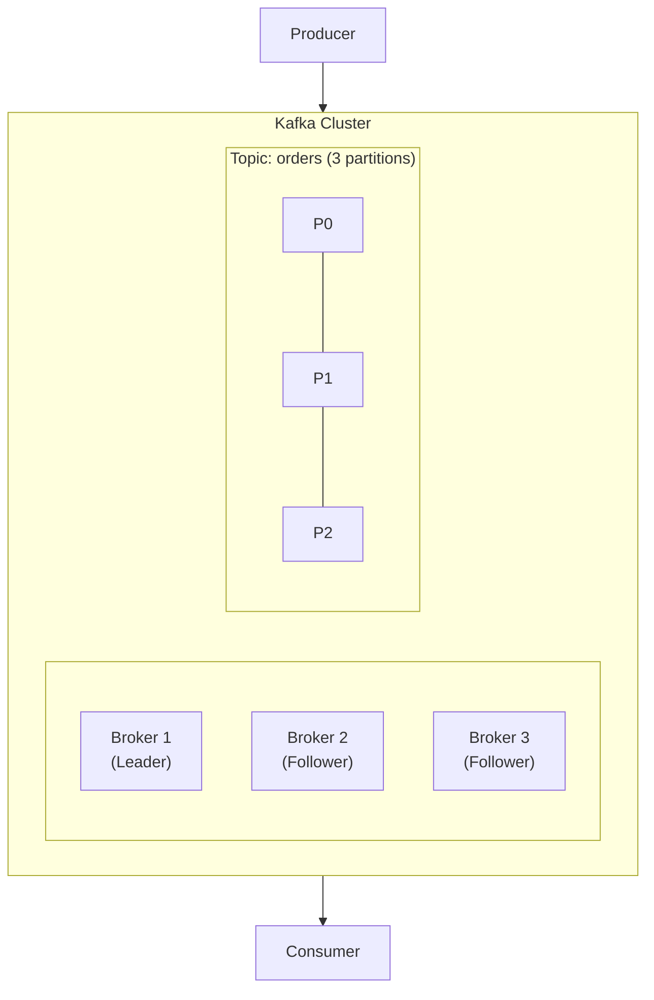
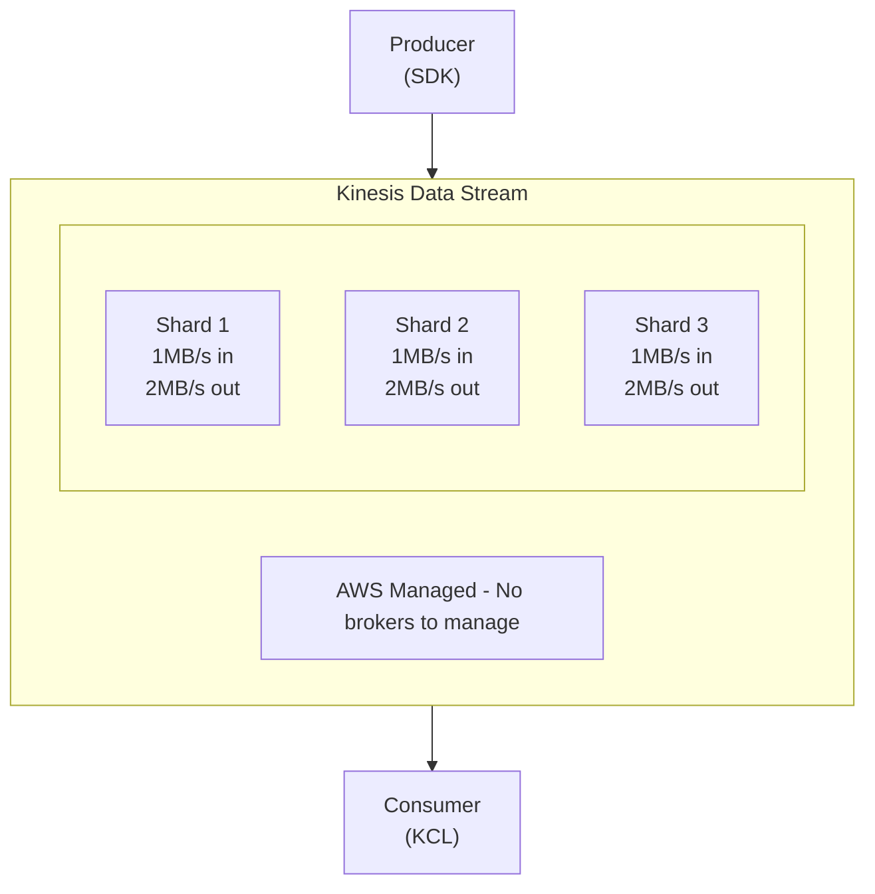

# Kafka vs AWS Kinesis: Managed vs Self-Hosted Streaming

Author: [nawazdhandala](https://www.github.com/nawazdhandala)

Tags: Apache Kafka, AWS Kinesis, Streaming Comparison, Managed Services, Self-Hosted, Event Streaming

Description: A comprehensive comparison of Apache Kafka and AWS Kinesis, covering architecture differences, pricing, scalability, and use cases to help you choose the right streaming platform.

---

Choosing between Apache Kafka and AWS Kinesis is a critical decision for streaming architectures. This guide provides a detailed comparison to help you make an informed choice based on your requirements.

## Overview Comparison

| Feature | Apache Kafka | AWS Kinesis |
|---------|-------------|-------------|
| Type | Self-hosted or managed | Fully managed |
| Throughput | Unlimited (depends on cluster) | 1 MB/s or 1000 records/s per shard |
| Retention | Configurable (unlimited with tiered storage) | 24 hours to 365 days |
| Latency | Sub-millisecond | 200ms+ typical |
| Ordering | Per partition | Per shard |
| Pricing | Infrastructure cost | Pay per shard + data |

## Architecture Differences

### Apache Kafka



### AWS Kinesis



## Java Implementation Comparison

### Kafka Producer

```java
import org.apache.kafka.clients.producer.*;
import java.util.*;

public class KafkaProducerExample {

    public static void main(String[] args) {
        Properties props = new Properties();
        props.put(ProducerConfig.BOOTSTRAP_SERVERS_CONFIG, "localhost:9092");
        props.put(ProducerConfig.KEY_SERIALIZER_CLASS_CONFIG,
            "org.apache.kafka.common.serialization.StringSerializer");
        props.put(ProducerConfig.VALUE_SERIALIZER_CLASS_CONFIG,
            "org.apache.kafka.common.serialization.StringSerializer");

        // Performance tuning
        props.put(ProducerConfig.BATCH_SIZE_CONFIG, 16384);
        props.put(ProducerConfig.LINGER_MS_CONFIG, 5);
        props.put(ProducerConfig.COMPRESSION_TYPE_CONFIG, "lz4");

        try (KafkaProducer<String, String> producer = new KafkaProducer<>(props)) {
            for (int i = 0; i < 1000; i++) {
                ProducerRecord<String, String> record =
                    new ProducerRecord<>("my-topic", "key-" + i, "value-" + i);

                producer.send(record, (metadata, exception) -> {
                    if (exception == null) {
                        System.out.printf("Sent to partition %d, offset %d%n",
                            metadata.partition(), metadata.offset());
                    } else {
                        exception.printStackTrace();
                    }
                });
            }
        }
    }
}
```

### Kinesis Producer

```java
import software.amazon.awssdk.services.kinesis.*;
import software.amazon.awssdk.services.kinesis.model.*;
import software.amazon.awssdk.core.SdkBytes;

import java.util.*;

public class KinesisProducerExample {

    public static void main(String[] args) {
        KinesisClient kinesis = KinesisClient.builder()
            .region(Region.US_EAST_1)
            .build();

        String streamName = "my-stream";

        for (int i = 0; i < 1000; i++) {
            PutRecordRequest request = PutRecordRequest.builder()
                .streamName(streamName)
                .partitionKey("key-" + i)
                .data(SdkBytes.fromUtf8String("value-" + i))
                .build();

            try {
                PutRecordResponse response = kinesis.putRecord(request);
                System.out.printf("Sent to shard %s, sequence %s%n",
                    response.shardId(), response.sequenceNumber());
            } catch (KinesisException e) {
                System.err.println("Error: " + e.getMessage());
            }
        }

        kinesis.close();
    }
}
```

### Kinesis with KPL (High Throughput)

```java
import com.amazonaws.services.kinesis.producer.*;
import java.nio.ByteBuffer;
import java.util.concurrent.*;

public class KinesisKPLExample {

    public static void main(String[] args) throws Exception {
        KinesisProducerConfiguration config = new KinesisProducerConfiguration()
            .setRegion("us-east-1")
            .setRecordMaxBufferedTime(100)
            .setMaxConnections(10)
            .setAggregationEnabled(true);

        KinesisProducer producer = new KinesisProducer(config);

        String streamName = "my-stream";

        for (int i = 0; i < 100000; i++) {
            ByteBuffer data = ByteBuffer.wrap(("value-" + i).getBytes());

            ListenableFuture<UserRecordResult> future =
                producer.addUserRecord(streamName, "key-" + i, data);

            Futures.addCallback(future, new FutureCallback<UserRecordResult>() {
                @Override
                public void onSuccess(UserRecordResult result) {
                    System.out.printf("Sent to shard %s%n", result.getShardId());
                }

                @Override
                public void onFailure(Throwable t) {
                    t.printStackTrace();
                }
            }, MoreExecutors.directExecutor());
        }

        producer.flushSync();
        producer.destroy();
    }
}
```

## Consumer Comparison

### Kafka Consumer

```java
import org.apache.kafka.clients.consumer.*;
import java.time.Duration;
import java.util.*;

public class KafkaConsumerExample {

    public static void main(String[] args) {
        Properties props = new Properties();
        props.put(ConsumerConfig.BOOTSTRAP_SERVERS_CONFIG, "localhost:9092");
        props.put(ConsumerConfig.GROUP_ID_CONFIG, "my-group");
        props.put(ConsumerConfig.KEY_DESERIALIZER_CLASS_CONFIG,
            "org.apache.kafka.common.serialization.StringDeserializer");
        props.put(ConsumerConfig.VALUE_DESERIALIZER_CLASS_CONFIG,
            "org.apache.kafka.common.serialization.StringDeserializer");
        props.put(ConsumerConfig.AUTO_OFFSET_RESET_CONFIG, "earliest");

        try (KafkaConsumer<String, String> consumer = new KafkaConsumer<>(props)) {
            consumer.subscribe(Collections.singletonList("my-topic"));

            while (true) {
                ConsumerRecords<String, String> records =
                    consumer.poll(Duration.ofMillis(100));

                for (ConsumerRecord<String, String> record : records) {
                    System.out.printf("Partition %d, Offset %d, Key %s, Value %s%n",
                        record.partition(), record.offset(),
                        record.key(), record.value());
                }
            }
        }
    }
}
```

### Kinesis Consumer (KCL)

```java
import software.amazon.kinesis.coordinator.*;
import software.amazon.kinesis.lifecycle.*;
import software.amazon.kinesis.processor.*;
import software.amazon.kinesis.retrieval.*;

public class KinesisKCLExample {

    public static void main(String[] args) {
        ConfigsBuilder configsBuilder = new ConfigsBuilder(
            "my-stream",
            "my-application",
            KinesisAsyncClient.create(),
            DynamoDbAsyncClient.create(),
            CloudWatchAsyncClient.create(),
            UUID.randomUUID().toString(),
            new RecordProcessorFactory()
        );

        Scheduler scheduler = new Scheduler(
            configsBuilder.checkpointConfig(),
            configsBuilder.coordinatorConfig(),
            configsBuilder.leaseManagementConfig(),
            configsBuilder.lifecycleConfig(),
            configsBuilder.metricsConfig(),
            configsBuilder.processorConfig(),
            configsBuilder.retrievalConfig()
        );

        Thread schedulerThread = new Thread(scheduler);
        schedulerThread.start();
    }
}

class RecordProcessorFactory implements ShardRecordProcessorFactory {
    @Override
    public ShardRecordProcessor shardRecordProcessor() {
        return new RecordProcessor();
    }
}

class RecordProcessor implements ShardRecordProcessor {

    @Override
    public void initialize(InitializationInput input) {
        System.out.println("Initializing shard: " + input.shardId());
    }

    @Override
    public void processRecords(ProcessRecordsInput input) {
        input.records().forEach(record -> {
            String data = new String(record.data().array());
            System.out.printf("Shard %s, Sequence %s, Data %s%n",
                input.shardId(), record.sequenceNumber(), data);
        });

        // Checkpoint
        try {
            input.checkpointer().checkpoint();
        } catch (Exception e) {
            e.printStackTrace();
        }
    }

    @Override
    public void leaseLost(LeaseLostInput input) {
        System.out.println("Lease lost");
    }

    @Override
    public void shardEnded(ShardEndedInput input) {
        try {
            input.checkpointer().checkpoint();
        } catch (Exception e) {
            e.printStackTrace();
        }
    }

    @Override
    public void shutdownRequested(ShutdownRequestedInput input) {
        try {
            input.checkpointer().checkpoint();
        } catch (Exception e) {
            e.printStackTrace();
        }
    }
}
```

## Python Comparison

### Kafka Python

```python
from confluent_kafka import Producer, Consumer
import json

# Producer
def kafka_producer():
    producer = Producer({
        'bootstrap.servers': 'localhost:9092',
        'batch.size': 16384,
        'linger.ms': 5,
        'compression.type': 'lz4'
    })

    def delivery_callback(err, msg):
        if err:
            print(f"Error: {err}")
        else:
            print(f"Delivered to {msg.topic()}[{msg.partition()}]")

    for i in range(1000):
        producer.produce(
            topic='my-topic',
            key=f'key-{i}',
            value=f'value-{i}',
            callback=delivery_callback
        )
        producer.poll(0)

    producer.flush()


# Consumer
def kafka_consumer():
    consumer = Consumer({
        'bootstrap.servers': 'localhost:9092',
        'group.id': 'my-group',
        'auto.offset.reset': 'earliest'
    })

    consumer.subscribe(['my-topic'])

    while True:
        msg = consumer.poll(0.1)
        if msg is None:
            continue
        if msg.error():
            print(f"Error: {msg.error()}")
            continue

        print(f"Partition {msg.partition()}, Offset {msg.offset()}, "
              f"Key {msg.key()}, Value {msg.value()}")

    consumer.close()
```

### Kinesis Python

```python
import boto3
from datetime import datetime
import time

# Producer
def kinesis_producer():
    kinesis = boto3.client('kinesis', region_name='us-east-1')
    stream_name = 'my-stream'

    for i in range(1000):
        response = kinesis.put_record(
            StreamName=stream_name,
            PartitionKey=f'key-{i}',
            Data=f'value-{i}'
        )
        print(f"Sent to shard {response['ShardId']}, "
              f"sequence {response['SequenceNumber']}")


# Consumer (basic)
def kinesis_consumer():
    kinesis = boto3.client('kinesis', region_name='us-east-1')
    stream_name = 'my-stream'

    # Get shard iterator
    response = kinesis.describe_stream(StreamName=stream_name)
    shard_id = response['StreamDescription']['Shards'][0]['ShardId']

    iterator_response = kinesis.get_shard_iterator(
        StreamName=stream_name,
        ShardId=shard_id,
        ShardIteratorType='TRIM_HORIZON'
    )
    shard_iterator = iterator_response['ShardIterator']

    while True:
        response = kinesis.get_records(
            ShardIterator=shard_iterator,
            Limit=100
        )

        for record in response['Records']:
            print(f"Sequence {record['SequenceNumber']}, "
                  f"Data {record['Data'].decode()}")

        shard_iterator = response['NextShardIterator']
        time.sleep(0.2)  # Respect rate limits
```

## Pricing Comparison

### Kafka (Self-Hosted)

```
Infrastructure costs (example for 3-broker cluster):
- 3x m5.xlarge instances: ~$500/month
- EBS storage (3TB): ~$300/month
- Data transfer: Variable

Total: ~$800-1500/month for small cluster
```

### AWS Kinesis

```
Per shard (provisioned):
- $0.015/hour = ~$11/shard/month
- PUT payload unit: $0.014 per 1M units

Example (10 shards, 100M records/month):
- Shard hours: $110/month
- PUT units: $1.40/month
- Data retrieval: Variable

Total: ~$115-200/month for 10 shards
```

### AWS MSK (Managed Kafka)

```
Broker hours:
- kafka.m5.large: $0.21/hour = ~$150/broker/month

Example (3 brokers):
- Broker cost: ~$450/month
- Storage: ~$100/month

Total: ~$550-700/month for small cluster
```

## Feature Comparison

### Throughput and Scaling

```
Kafka:
- Add partitions for more parallelism
- Add brokers for more capacity
- No hard limits on throughput

Kinesis:
- 1 MB/s ingress per shard
- 2 MB/s egress per shard
- Need more shards for higher throughput
- Resharding takes time
```

### Message Retention

```
Kafka:
- Configurable retention (time or size based)
- Tiered storage for unlimited retention
- Compacted topics for key-based retention

Kinesis:
- 24 hours default
- Up to 365 days (additional cost)
- No compaction feature
```

### Consumer Model

```
Kafka:
- Consumer groups with automatic rebalancing
- Exactly-once semantics available
- Offset stored in Kafka

Kinesis:
- KCL handles checkpointing
- At-least-once by default
- Checkpoint stored in DynamoDB
```

## When to Choose Kafka

1. **High throughput needs**: Millions of messages per second
2. **Low latency requirements**: Sub-millisecond latency
3. **Long retention**: Need to store data for extended periods
4. **Complex processing**: Kafka Streams or KSQL
5. **Multi-cloud or on-premise**: Avoid vendor lock-in
6. **Cost optimization at scale**: Lower per-message cost at high volume

## When to Choose Kinesis

1. **AWS-native architecture**: Deep AWS integration needed
2. **Serverless preference**: No infrastructure to manage
3. **Quick start**: Get streaming working in minutes
4. **Small to medium scale**: Cost-effective for lower volumes
5. **Lambda integration**: Direct trigger from stream
6. **Team expertise**: Limited Kafka experience

## Migration Considerations

### Kafka to Kinesis

```python
# Bridge pattern: Kafka consumer to Kinesis producer
from confluent_kafka import Consumer
import boto3

def kafka_to_kinesis_bridge():
    consumer = Consumer({
        'bootstrap.servers': 'kafka:9092',
        'group.id': 'kinesis-bridge'
    })
    consumer.subscribe(['source-topic'])

    kinesis = boto3.client('kinesis')

    while True:
        msg = consumer.poll(0.1)
        if msg and not msg.error():
            kinesis.put_record(
                StreamName='target-stream',
                PartitionKey=msg.key() or 'default',
                Data=msg.value()
            )
```

### Kinesis to Kafka

```python
# Bridge pattern: Kinesis to Kafka
import boto3
from confluent_kafka import Producer

def kinesis_to_kafka_bridge():
    kinesis = boto3.client('kinesis')
    producer = Producer({'bootstrap.servers': 'kafka:9092'})

    shard_iterator = get_shard_iterator(kinesis, 'source-stream')

    while True:
        response = kinesis.get_records(ShardIterator=shard_iterator)

        for record in response['Records']:
            producer.produce(
                topic='target-topic',
                value=record['Data']
            )

        producer.flush()
        shard_iterator = response['NextShardIterator']
```

## Conclusion

Choose Kafka for high-throughput, low-latency workloads where you need full control and advanced features. Choose Kinesis for AWS-native applications where managed infrastructure and quick deployment are priorities. Consider AWS MSK if you want Kafka with managed infrastructure.
