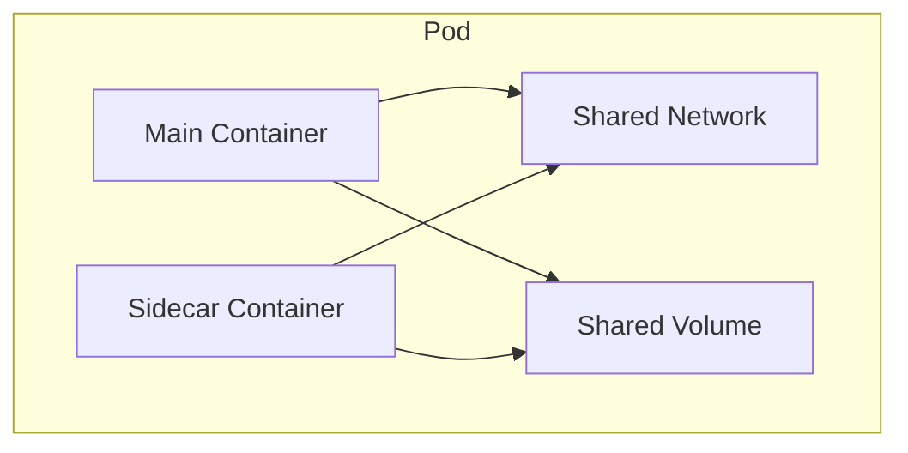

# How to Set Up Multi-Container Pods with Sidecar Pattern

Author: [nawazdhandala](https://www.github.com/nawazdhandala)

Tags: Kubernetes, Sidecar Pattern, Multi-Container Pods, Design Patterns, DevOps

Description: A comprehensive guide to implementing multi-container pods in Kubernetes using the sidecar pattern, including common use cases like logging, proxying, configuration sync, and security sidecars.

---

The sidecar pattern extends a pod's functionality by adding helper containers alongside the main application container. These sidecar containers share the pod's network and storage, enabling powerful patterns for logging, monitoring, proxying, and more without modifying your application code.

## Understanding Multi-Container Pods



All containers in a pod:
- Share the same network namespace (localhost communication)
- Can share volumes
- Are scheduled together on the same node
- Have the same lifecycle (start and stop together)

## Basic Multi-Container Pod

```yaml
apiVersion: v1
kind: Pod
metadata:
  name: multi-container
spec:
  containers:
    - name: main-app
      image: myapp:v1
      ports:
        - containerPort: 8080
    - name: sidecar
      image: sidecar:v1
  volumes:
    - name: shared-data
      emptyDir: {}
```

## Common Sidecar Patterns

### Pattern 1: Logging Sidecar

Collect and forward logs from the main application:

```yaml
apiVersion: v1
kind: Pod
metadata:
  name: app-with-logging
spec:
  containers:
    # Main application writes logs to shared volume
    - name: app
      image: myapp:v1
      volumeMounts:
        - name: logs
          mountPath: /var/log/app

    # Fluentd sidecar ships logs to central system
    - name: log-shipper
      image: fluent/fluentd:v1.16
      volumeMounts:
        - name: logs
          mountPath: /var/log/app
          readOnly: true
        - name: fluentd-config
          mountPath: /fluentd/etc

  volumes:
    - name: logs
      emptyDir: {}
    - name: fluentd-config
      configMap:
        name: fluentd-config
```

Fluentd ConfigMap:

```yaml
apiVersion: v1
kind: ConfigMap
metadata:
  name: fluentd-config
data:
  fluent.conf: |
    <source>
      @type tail
      path /var/log/app/*.log
      pos_file /var/log/app/app.log.pos
      tag app
      <parse>
        @type json
      </parse>
    </source>

    <match app>
      @type forward
      <server>
        host log-aggregator
        port 24224
      </server>
    </match>
```

### Pattern 2: Proxy Sidecar

Route traffic through a proxy for mTLS, load balancing, or service mesh:

```yaml
apiVersion: v1
kind: Pod
metadata:
  name: app-with-proxy
spec:
  containers:
    # Main application
    - name: app
      image: myapp:v1
      ports:
        - containerPort: 8080
      env:
        # App connects to localhost proxy
        - name: HTTP_PROXY
          value: "http://localhost:3128"

    # Envoy proxy sidecar
    - name: envoy
      image: envoyproxy/envoy:v1.28.0
      ports:
        - containerPort: 3128
        - containerPort: 9901    # Admin interface
      volumeMounts:
        - name: envoy-config
          mountPath: /etc/envoy

  volumes:
    - name: envoy-config
      configMap:
        name: envoy-config
```

### Pattern 3: Ambassador Sidecar

Proxy incoming requests with authentication or transformation:

```yaml
apiVersion: v1
kind: Pod
metadata:
  name: app-with-ambassador
spec:
  containers:
    # Main application only accessible via ambassador
    - name: app
      image: myapp:v1
      # Not exposed externally
      env:
        - name: PORT
          value: "8080"

    # Ambassador handles external requests
    - name: ambassador
      image: nginx:1.24
      ports:
        - containerPort: 80
      volumeMounts:
        - name: nginx-config
          mountPath: /etc/nginx/conf.d

  volumes:
    - name: nginx-config
      configMap:
        name: ambassador-nginx-config
```

Ambassador nginx config:

```yaml
apiVersion: v1
kind: ConfigMap
metadata:
  name: ambassador-nginx-config
data:
  default.conf: |
    server {
        listen 80;

        # Add authentication
        auth_basic "Restricted";
        auth_basic_user_file /etc/nginx/.htpasswd;

        # Proxy to main app
        location / {
            proxy_pass http://localhost:8080;
            proxy_set_header Host $host;
            proxy_set_header X-Real-IP $remote_addr;
        }

        # Health check bypasses auth
        location /health {
            auth_basic off;
            proxy_pass http://localhost:8080/health;
        }
    }
```

### Pattern 4: Adapter Sidecar

Transform or standardize output from the main application:

```yaml
apiVersion: v1
kind: Pod
metadata:
  name: app-with-adapter
spec:
  containers:
    # Legacy app with non-standard metrics
    - name: legacy-app
      image: legacy-app:v1
      ports:
        - containerPort: 8080

    # Adapter converts metrics to Prometheus format
    - name: metrics-adapter
      image: prom/statsd-exporter:v0.24.0
      ports:
        - containerPort: 9102    # Prometheus metrics
        - containerPort: 9125    # StatsD receiver
      args:
        - --statsd.listen-udp=:9125
        - --web.listen-address=:9102

  # Main app sends StatsD metrics to localhost:9125
  # Prometheus scrapes localhost:9102
```

### Pattern 5: Configuration Sync Sidecar

Keep configuration in sync with external source:

```yaml
apiVersion: v1
kind: Pod
metadata:
  name: app-with-config-sync
spec:
  containers:
    # Main application reads config from shared volume
    - name: app
      image: myapp:v1
      volumeMounts:
        - name: config
          mountPath: /etc/app/config

    # Git-sync keeps config updated
    - name: git-sync
      image: registry.k8s.io/git-sync/git-sync:v4.0.0
      env:
        - name: GITSYNC_REPO
          value: "https://github.com/org/config-repo"
        - name: GITSYNC_BRANCH
          value: "main"
        - name: GITSYNC_ROOT
          value: "/config"
        - name: GITSYNC_PERIOD
          value: "60s"
      volumeMounts:
        - name: config
          mountPath: /config

  volumes:
    - name: config
      emptyDir: {}
```

### Pattern 6: Security Sidecar

Add security scanning or policy enforcement:

```yaml
apiVersion: v1
kind: Pod
metadata:
  name: app-with-security
spec:
  containers:
    # Main application
    - name: app
      image: myapp:v1
      ports:
        - containerPort: 8080

    # OPA (Open Policy Agent) sidecar for policy decisions
    - name: opa
      image: openpolicyagent/opa:0.60.0
      ports:
        - containerPort: 8181
      args:
        - "run"
        - "--server"
        - "--addr=localhost:8181"
        - "/policies"
      volumeMounts:
        - name: policies
          mountPath: /policies
          readOnly: true

  volumes:
    - name: policies
      configMap:
        name: opa-policies
```

## Sidecar Resource Management

Each sidecar should have its own resource limits:

```yaml
apiVersion: v1
kind: Pod
metadata:
  name: app-with-sidecar
spec:
  containers:
    - name: app
      image: myapp:v1
      resources:
        requests:
          memory: "256Mi"
          cpu: "200m"
        limits:
          memory: "512Mi"
          cpu: "500m"

    - name: sidecar
      image: sidecar:v1
      resources:
        requests:
          memory: "64Mi"
          cpu: "50m"
        limits:
          memory: "128Mi"
          cpu: "100m"
```

## Communication Between Containers

### Localhost Network

```yaml
# Main app and sidecar communicate via localhost
containers:
  - name: app
    image: myapp:v1
    env:
      - name: CACHE_HOST
        value: "localhost"    # Talks to sidecar
      - name: CACHE_PORT
        value: "6379"

  - name: redis
    image: redis:7
    ports:
      - containerPort: 6379
```

### Shared Volume

```yaml
# Share data via volume
containers:
  - name: writer
    image: writer:v1
    volumeMounts:
      - name: shared
        mountPath: /data

  - name: reader
    image: reader:v1
    volumeMounts:
      - name: shared
        mountPath: /data
        readOnly: true

volumes:
  - name: shared
    emptyDir: {}
```

### Shared Process Namespace

```yaml
# Enable process visibility between containers
apiVersion: v1
kind: Pod
spec:
  shareProcessNamespace: true
  containers:
    - name: app
      image: myapp:v1
    - name: debugger
      image: busybox
      # Can see and interact with app's processes
```

## Health Checks for Sidecars

```yaml
apiVersion: v1
kind: Pod
spec:
  containers:
    - name: app
      image: myapp:v1
      readinessProbe:
        httpGet:
          path: /health
          port: 8080
        initialDelaySeconds: 5
        periodSeconds: 5

    - name: sidecar
      image: sidecar:v1
      readinessProbe:
        httpGet:
          path: /ready
          port: 9090
        initialDelaySeconds: 3
        periodSeconds: 5
      livenessProbe:
        httpGet:
          path: /health
          port: 9090
        initialDelaySeconds: 10
        periodSeconds: 10
```

## Native Sidecar Containers (Kubernetes 1.28+)

Kubernetes 1.28 introduced native sidecar support with `restartPolicy: Always`:

```yaml
apiVersion: v1
kind: Pod
metadata:
  name: native-sidecar
spec:
  initContainers:
    # Native sidecar - runs alongside main container
    - name: log-agent
      image: log-agent:v1
      restartPolicy: Always    # Makes it a sidecar
      volumeMounts:
        - name: logs
          mountPath: /var/log/app

  containers:
    - name: app
      image: myapp:v1
      volumeMounts:
        - name: logs
          mountPath: /var/log/app

  volumes:
    - name: logs
      emptyDir: {}
```

Benefits of native sidecars:
- Start before main containers
- Guaranteed to run throughout pod lifecycle
- Can be used in Jobs (stays running until job completes)

## Debugging Multi-Container Pods

```bash
# List containers in pod
kubectl get pod my-pod -o jsonpath='{.spec.containers[*].name}'

# Logs from specific container
kubectl logs my-pod -c sidecar

# Exec into specific container
kubectl exec -it my-pod -c app -- /bin/sh

# Describe shows all container statuses
kubectl describe pod my-pod
```

## Complete Example: Application with Logging and Metrics

```yaml
apiVersion: apps/v1
kind: Deployment
metadata:
  name: web-app
spec:
  replicas: 3
  selector:
    matchLabels:
      app: web
  template:
    metadata:
      labels:
        app: web
      annotations:
        prometheus.io/scrape: "true"
        prometheus.io/port: "9102"
    spec:
      containers:
        # Main application
        - name: app
          image: myapp:v1
          ports:
            - containerPort: 8080
          env:
            - name: LOG_PATH
              value: "/var/log/app"
            - name: STATSD_HOST
              value: "localhost"
            - name: STATSD_PORT
              value: "9125"
          volumeMounts:
            - name: logs
              mountPath: /var/log/app
          resources:
            requests:
              memory: "256Mi"
              cpu: "100m"
            limits:
              memory: "512Mi"
              cpu: "500m"

        # Log shipping sidecar
        - name: fluentbit
          image: fluent/fluent-bit:2.2
          volumeMounts:
            - name: logs
              mountPath: /var/log/app
              readOnly: true
            - name: fluentbit-config
              mountPath: /fluent-bit/etc
          resources:
            requests:
              memory: "64Mi"
              cpu: "50m"
            limits:
              memory: "128Mi"
              cpu: "100m"

        # Metrics adapter sidecar
        - name: statsd-exporter
          image: prom/statsd-exporter:v0.24.0
          ports:
            - containerPort: 9102
            - containerPort: 9125
              protocol: UDP
          args:
            - --statsd.listen-udp=:9125
            - --web.listen-address=:9102
          resources:
            requests:
              memory: "32Mi"
              cpu: "25m"
            limits:
              memory: "64Mi"
              cpu: "50m"

      volumes:
        - name: logs
          emptyDir: {}
        - name: fluentbit-config
          configMap:
            name: fluentbit-config
```

---

The sidecar pattern is powerful for extending application functionality without modifying the main application. Use logging sidecars to ship logs, proxy sidecars for traffic management, adapter sidecars for protocol translation, and config sync sidecars for dynamic configuration. Always set appropriate resource limits for each container and ensure health checks are configured for all containers in the pod.
