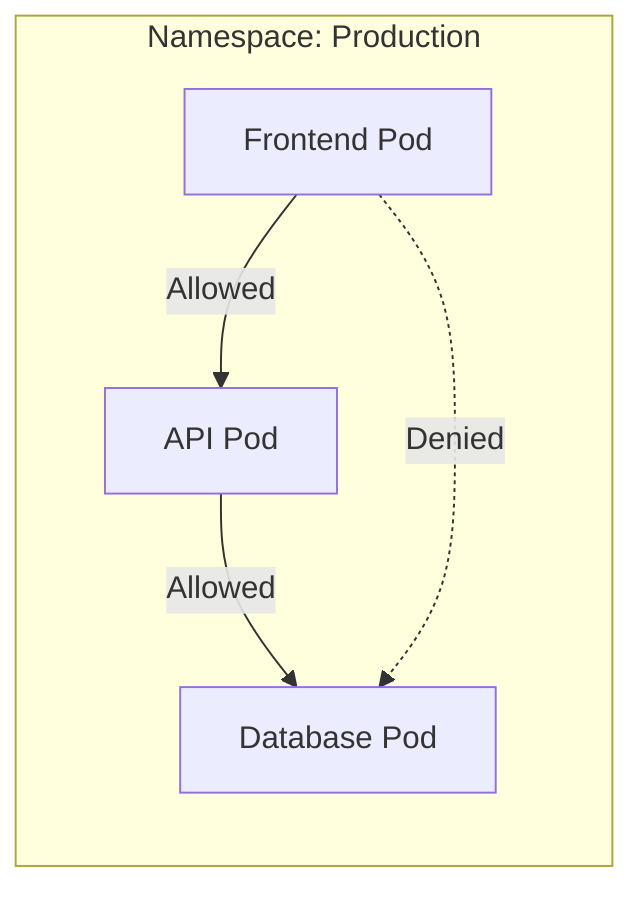

# How to Configure Network Policies for Pod Communication

Author: [nawazdhandala](https://www.github.com/nawazdhandala)

Tags: Kubernetes, Network Policies, Security, Networking, DevOps

Description: A practical guide to implementing Kubernetes Network Policies for controlling pod-to-pod communication, including ingress and egress rules, namespace isolation, and common security patterns.

---

Network Policies act as a firewall for pod communication in Kubernetes. By default, all pods can communicate with each other. Network Policies let you restrict this to only the traffic you explicitly allow, implementing the principle of least privilege at the network level.

## Prerequisites

Network Policies require a CNI plugin that supports them:
- Calico
- Cilium
- Weave Net
- Antrea

Check your CNI supports Network Policies:

```bash
# Check CNI plugin
kubectl get pods -n kube-system | grep -E "calico|cilium|weave"
```

## How Network Policies Work



Key concepts:
- Policies are additive (if any policy allows traffic, it is allowed)
- No policy = all traffic allowed
- Any policy selecting a pod = default deny for that pod
- Policies are namespace-scoped

## Basic Network Policy Structure

```yaml
apiVersion: networking.k8s.io/v1
kind: NetworkPolicy
metadata:
  name: example-policy
  namespace: production
spec:
  podSelector:
    matchLabels:
      app: web          # Apply to pods with this label
  policyTypes:
    - Ingress           # Control incoming traffic
    - Egress            # Control outgoing traffic
  ingress:
    - from:             # Who can connect to these pods
        - podSelector:
            matchLabels:
              app: frontend
      ports:
        - protocol: TCP
          port: 8080
  egress:
    - to:               # Where these pods can connect
        - podSelector:
            matchLabels:
              app: database
      ports:
        - protocol: TCP
          port: 5432
```

## Default Deny Policies

### Deny All Ingress

```yaml
apiVersion: networking.k8s.io/v1
kind: NetworkPolicy
metadata:
  name: default-deny-ingress
  namespace: production
spec:
  podSelector: {}       # Applies to all pods
  policyTypes:
    - Ingress
  # No ingress rules = deny all incoming
```

### Deny All Egress

```yaml
apiVersion: networking.k8s.io/v1
kind: NetworkPolicy
metadata:
  name: default-deny-egress
  namespace: production
spec:
  podSelector: {}
  policyTypes:
    - Egress
  # No egress rules = deny all outgoing
```

### Deny All Traffic

```yaml
apiVersion: networking.k8s.io/v1
kind: NetworkPolicy
metadata:
  name: default-deny-all
  namespace: production
spec:
  podSelector: {}
  policyTypes:
    - Ingress
    - Egress
```

## Allow Specific Traffic

### Allow from Specific Pods

```yaml
apiVersion: networking.k8s.io/v1
kind: NetworkPolicy
metadata:
  name: allow-frontend-to-api
  namespace: production
spec:
  podSelector:
    matchLabels:
      app: api
  policyTypes:
    - Ingress
  ingress:
    - from:
        - podSelector:
            matchLabels:
              app: frontend
      ports:
        - protocol: TCP
          port: 8080
```

### Allow from Specific Namespace

```yaml
apiVersion: networking.k8s.io/v1
kind: NetworkPolicy
metadata:
  name: allow-from-monitoring
  namespace: production
spec:
  podSelector:
    matchLabels:
      app: api
  policyTypes:
    - Ingress
  ingress:
    - from:
        - namespaceSelector:
            matchLabels:
              name: monitoring
      ports:
        - protocol: TCP
          port: 9090
```

### Allow from Both Pod and Namespace

```yaml
apiVersion: networking.k8s.io/v1
kind: NetworkPolicy
metadata:
  name: allow-specific-source
  namespace: production
spec:
  podSelector:
    matchLabels:
      app: api
  policyTypes:
    - Ingress
  ingress:
    # AND: From pods labeled app=prometheus IN namespace labeled name=monitoring
    - from:
        - namespaceSelector:
            matchLabels:
              name: monitoring
          podSelector:
            matchLabels:
              app: prometheus
      ports:
        - protocol: TCP
          port: 9090
```

### Allow from External IPs

```yaml
apiVersion: networking.k8s.io/v1
kind: NetworkPolicy
metadata:
  name: allow-external
  namespace: production
spec:
  podSelector:
    matchLabels:
      app: api
  policyTypes:
    - Ingress
  ingress:
    - from:
        - ipBlock:
            cidr: 10.0.0.0/8
            except:
              - 10.0.1.0/24    # Except this subnet
      ports:
        - protocol: TCP
          port: 443
```

## Egress Policies

### Allow Egress to Specific Pods

```yaml
apiVersion: networking.k8s.io/v1
kind: NetworkPolicy
metadata:
  name: api-egress-to-database
  namespace: production
spec:
  podSelector:
    matchLabels:
      app: api
  policyTypes:
    - Egress
  egress:
    - to:
        - podSelector:
            matchLabels:
              app: database
      ports:
        - protocol: TCP
          port: 5432
```

### Allow DNS Egress

Critical for most applications:

```yaml
apiVersion: networking.k8s.io/v1
kind: NetworkPolicy
metadata:
  name: allow-dns
  namespace: production
spec:
  podSelector: {}
  policyTypes:
    - Egress
  egress:
    - to:
        - namespaceSelector:
            matchLabels:
              kubernetes.io/metadata.name: kube-system
          podSelector:
            matchLabels:
              k8s-app: kube-dns
      ports:
        - protocol: UDP
          port: 53
        - protocol: TCP
          port: 53
```

### Allow External Internet

```yaml
apiVersion: networking.k8s.io/v1
kind: NetworkPolicy
metadata:
  name: allow-internet
  namespace: production
spec:
  podSelector:
    matchLabels:
      app: api
  policyTypes:
    - Egress
  egress:
    # Allow all egress except to private IPs
    - to:
        - ipBlock:
            cidr: 0.0.0.0/0
            except:
              - 10.0.0.0/8
              - 172.16.0.0/12
              - 192.168.0.0/16
```

## Common Patterns

### Pattern 1: Three-Tier Application

```yaml
# Frontend can only receive from ingress, send to API
apiVersion: networking.k8s.io/v1
kind: NetworkPolicy
metadata:
  name: frontend-policy
  namespace: production
spec:
  podSelector:
    matchLabels:
      tier: frontend
  policyTypes:
    - Ingress
    - Egress
  ingress:
    - from:
        - ipBlock:
            cidr: 0.0.0.0/0    # From anywhere (load balancer)
      ports:
        - port: 80
        - port: 443
  egress:
    - to:
        - podSelector:
            matchLabels:
              tier: api
      ports:
        - port: 8080
    # DNS
    - to:
        - namespaceSelector:
            matchLabels:
              kubernetes.io/metadata.name: kube-system
      ports:
        - port: 53
          protocol: UDP
---
# API can only receive from frontend, send to database
apiVersion: networking.k8s.io/v1
kind: NetworkPolicy
metadata:
  name: api-policy
  namespace: production
spec:
  podSelector:
    matchLabels:
      tier: api
  policyTypes:
    - Ingress
    - Egress
  ingress:
    - from:
        - podSelector:
            matchLabels:
              tier: frontend
      ports:
        - port: 8080
  egress:
    - to:
        - podSelector:
            matchLabels:
              tier: database
      ports:
        - port: 5432
    # DNS
    - to:
        - namespaceSelector:
            matchLabels:
              kubernetes.io/metadata.name: kube-system
      ports:
        - port: 53
          protocol: UDP
---
# Database can only receive from API
apiVersion: networking.k8s.io/v1
kind: NetworkPolicy
metadata:
  name: database-policy
  namespace: production
spec:
  podSelector:
    matchLabels:
      tier: database
  policyTypes:
    - Ingress
  ingress:
    - from:
        - podSelector:
            matchLabels:
              tier: api
      ports:
        - port: 5432
```

### Pattern 2: Namespace Isolation

```yaml
# Allow traffic only within same namespace
apiVersion: networking.k8s.io/v1
kind: NetworkPolicy
metadata:
  name: namespace-isolation
  namespace: production
spec:
  podSelector: {}
  policyTypes:
    - Ingress
    - Egress
  ingress:
    - from:
        - podSelector: {}    # Same namespace only
  egress:
    - to:
        - podSelector: {}    # Same namespace only
    # DNS
    - to:
        - namespaceSelector:
            matchLabels:
              kubernetes.io/metadata.name: kube-system
      ports:
        - port: 53
          protocol: UDP
```

### Pattern 3: Allow Monitoring

```yaml
apiVersion: networking.k8s.io/v1
kind: NetworkPolicy
metadata:
  name: allow-prometheus
  namespace: production
spec:
  podSelector: {}    # All pods
  policyTypes:
    - Ingress
  ingress:
    - from:
        - namespaceSelector:
            matchLabels:
              name: monitoring
          podSelector:
            matchLabels:
              app: prometheus
      ports:
        - port: 9090    # Metrics port
```

## Testing Network Policies

### Create Test Pods

```bash
# Create test namespace
kubectl create namespace netpol-test

# Create server pod
kubectl run server --image=nginx -n netpol-test --port=80
kubectl expose pod server --port=80 -n netpol-test

# Create client pod
kubectl run client --image=busybox -n netpol-test -- sleep 3600
```

### Test Connectivity

```bash
# Before policy - should work
kubectl exec -n netpol-test client -- wget -qO- --timeout=2 http://server

# Apply deny policy
kubectl apply -f - <<EOF
apiVersion: networking.k8s.io/v1
kind: NetworkPolicy
metadata:
  name: deny-all
  namespace: netpol-test
spec:
  podSelector: {}
  policyTypes:
    - Ingress
EOF

# After policy - should timeout
kubectl exec -n netpol-test client -- wget -qO- --timeout=2 http://server
```

## Debugging Network Policies

### Check Applied Policies

```bash
# List policies in namespace
kubectl get networkpolicies -n production

# Describe policy
kubectl describe networkpolicy api-policy -n production

# Check which pods are selected
kubectl get pods -n production -l app=api
```

### Verify Policy is Applied

```bash
# Check pod's network policies
kubectl describe pod my-pod -n production | grep -A 10 "Network Policies"
```

### Common Issues

**Traffic blocked unexpectedly:**
- Check if any NetworkPolicy selects the pod (creates default deny)
- Verify DNS egress is allowed
- Check namespace labels match selectors

**Traffic not blocked:**
- Verify CNI supports NetworkPolicy
- Check podSelector matches target pods
- Ensure policyTypes includes Ingress/Egress as needed

## Best Practices

### 1. Start with Default Deny

```yaml
# Apply to every namespace
apiVersion: networking.k8s.io/v1
kind: NetworkPolicy
metadata:
  name: default-deny-all
spec:
  podSelector: {}
  policyTypes:
    - Ingress
    - Egress
```

### 2. Always Allow DNS

```yaml
# Include in every namespace with egress deny
egress:
  - to:
      - namespaceSelector:
          matchLabels:
            kubernetes.io/metadata.name: kube-system
    ports:
      - port: 53
        protocol: UDP
```

### 3. Use Labels Consistently

```yaml
# Good: consistent labeling scheme
labels:
  app: api
  tier: backend
  environment: production
```

### 4. Document Your Policies

```yaml
apiVersion: networking.k8s.io/v1
kind: NetworkPolicy
metadata:
  name: api-ingress
  annotations:
    description: "Allow frontend pods to reach API on port 8080"
    owner: "platform-team"
```

### 5. Test Policies Before Production

```bash
# Use dry-run and test namespaces
kubectl apply -f policy.yaml --dry-run=client
kubectl apply -f policy.yaml -n test-environment
```

## Complete Example

```yaml
# Namespace with labels
apiVersion: v1
kind: Namespace
metadata:
  name: production
  labels:
    name: production
    environment: prod
---
# Default deny
apiVersion: networking.k8s.io/v1
kind: NetworkPolicy
metadata:
  name: default-deny
  namespace: production
spec:
  podSelector: {}
  policyTypes:
    - Ingress
    - Egress
---
# Allow DNS for all pods
apiVersion: networking.k8s.io/v1
kind: NetworkPolicy
metadata:
  name: allow-dns
  namespace: production
spec:
  podSelector: {}
  policyTypes:
    - Egress
  egress:
    - to:
        - namespaceSelector:
            matchLabels:
              kubernetes.io/metadata.name: kube-system
      ports:
        - port: 53
          protocol: UDP
        - port: 53
          protocol: TCP
---
# Frontend policy
apiVersion: networking.k8s.io/v1
kind: NetworkPolicy
metadata:
  name: frontend-netpol
  namespace: production
spec:
  podSelector:
    matchLabels:
      app: frontend
  policyTypes:
    - Ingress
    - Egress
  ingress:
    - ports:
        - port: 80
        - port: 443
  egress:
    - to:
        - podSelector:
            matchLabels:
              app: api
      ports:
        - port: 8080
---
# API policy
apiVersion: networking.k8s.io/v1
kind: NetworkPolicy
metadata:
  name: api-netpol
  namespace: production
spec:
  podSelector:
    matchLabels:
      app: api
  policyTypes:
    - Ingress
    - Egress
  ingress:
    - from:
        - podSelector:
            matchLabels:
              app: frontend
      ports:
        - port: 8080
  egress:
    - to:
        - podSelector:
            matchLabels:
              app: database
      ports:
        - port: 5432
```

---

Network Policies provide essential security controls for pod communication in Kubernetes. Start with default deny policies, then explicitly allow only the traffic your applications need. Always include DNS egress rules, test policies thoroughly before production, and use consistent labeling to make policy management easier.
