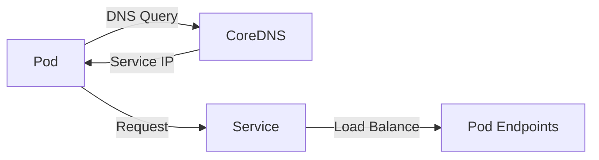

# How to Troubleshoot Service Discovery Issues in Kubernetes

Author: [nawazdhandala](https://www.github.com/nawazdhandala)

Tags: Kubernetes, Service Discovery, DNS, Networking, Troubleshooting

Description: A systematic guide to diagnosing and fixing service discovery problems in Kubernetes, including DNS issues, service endpoint problems, and connectivity debugging techniques.

---

Service discovery allows pods to find and communicate with each other using DNS names instead of IP addresses. When service discovery fails, your microservices cannot connect, leading to application errors and downtime. This guide walks through diagnosing and fixing these issues.

## How Service Discovery Works



When a pod accesses `my-service`, it:
1. Queries CoreDNS for `my-service.namespace.svc.cluster.local`
2. Gets the ClusterIP address
3. Sends traffic to that IP
4. kube-proxy routes to a healthy pod endpoint

## Quick Connectivity Test

```bash
# Create debug pod
kubectl run debug --image=busybox:1.36 --restart=Never -- sleep 3600

# Test DNS resolution
kubectl exec debug -- nslookup my-service

# Test connectivity
kubectl exec debug -- wget -qO- --timeout=5 http://my-service:8080/health
```

## Common Issues and Solutions

### Issue 1: Service Does Not Exist

```bash
# Check if service exists
kubectl get svc my-service

# If not found, create it
kubectl expose deployment my-app --port=8080 --name=my-service
```

### Issue 2: Service Has No Endpoints

```bash
# Check service endpoints
kubectl get endpoints my-service

# Output shows no endpoints:
# NAME         ENDPOINTS   AGE
# my-service   <none>      5m

# Check if selector matches pods
kubectl describe svc my-service | grep Selector
kubectl get pods -l <selector-labels>

# Common causes:
# - Selector does not match pod labels
# - No pods running
# - Pods not ready (failing readiness probes)
```

**Fix selector mismatch:**

```yaml
# Service selector must match pod labels exactly
apiVersion: v1
kind: Service
metadata:
  name: my-service
spec:
  selector:
    app: my-app        # Must match pod labels
  ports:
    - port: 8080
---
apiVersion: apps/v1
kind: Deployment
spec:
  template:
    metadata:
      labels:
        app: my-app    # Must match service selector
```

### Issue 3: Pods Failing Readiness Probes

Only pods passing readiness probes are added to endpoints:

```bash
# Check pod readiness
kubectl get pods -l app=my-app

# NAME        READY   STATUS    RESTARTS
# my-app-xyz  0/1     Running   0       # Not ready

# Check probe failures
kubectl describe pod my-app-xyz | grep -A 5 "Readiness"
```

**Fix readiness probe:**

```yaml
readinessProbe:
  httpGet:
    path: /health    # Ensure this endpoint returns 200
    port: 8080
  initialDelaySeconds: 10    # Give app time to start
  periodSeconds: 5
```

### Issue 4: DNS Resolution Fails

```bash
# Test DNS
kubectl exec debug -- nslookup my-service

# If it fails, check CoreDNS
kubectl get pods -n kube-system -l k8s-app=kube-dns
kubectl logs -n kube-system -l k8s-app=kube-dns

# Check resolv.conf in pod
kubectl exec debug -- cat /etc/resolv.conf
```

**Common DNS fixes:**

```bash
# Restart CoreDNS
kubectl rollout restart deployment coredns -n kube-system

# Check CoreDNS service
kubectl get svc kube-dns -n kube-system
```

### Issue 5: Wrong Port Configuration

```bash
# Check service ports
kubectl get svc my-service -o yaml | grep -A 10 ports

# Verify targetPort matches container port
# port: Service port (what clients connect to)
# targetPort: Pod port (where container listens)
```

```yaml
apiVersion: v1
kind: Service
metadata:
  name: my-service
spec:
  ports:
    - port: 80           # Clients connect to port 80
      targetPort: 8080   # Container listens on 8080
      protocol: TCP
  selector:
    app: my-app
```

### Issue 6: Network Policy Blocking Traffic

```bash
# Check network policies in namespace
kubectl get networkpolicies -n my-namespace

# Describe policy
kubectl describe networkpolicy my-policy

# Test with policy temporarily removed
kubectl delete networkpolicy my-policy  # Be careful in production
```

**Allow traffic in network policy:**

```yaml
apiVersion: networking.k8s.io/v1
kind: NetworkPolicy
metadata:
  name: allow-frontend
spec:
  podSelector:
    matchLabels:
      app: backend
  ingress:
    - from:
        - podSelector:
            matchLabels:
              app: frontend
      ports:
        - port: 8080
```

### Issue 7: Service in Different Namespace

```bash
# Cross-namespace access requires full name
kubectl exec debug -- wget -qO- http://my-service.other-namespace.svc.cluster.local:8080

# Or configure service to reference external namespace
```

### Issue 8: Headless Service Misconfiguration

Headless services (clusterIP: None) return pod IPs directly:

```bash
# Check if service is headless
kubectl get svc my-service -o jsonpath='{.spec.clusterIP}'

# For headless services, DNS returns pod IPs
kubectl exec debug -- nslookup my-service

# Should return multiple A records (one per pod)
```

```yaml
# Headless service for StatefulSets
apiVersion: v1
kind: Service
metadata:
  name: my-stateful-service
spec:
  clusterIP: None    # Headless
  selector:
    app: my-stateful
  ports:
    - port: 8080
```

## Debugging Tools

### Using dnsutils Pod

```bash
kubectl run dnsutils --image=registry.k8s.io/e2e-test-images/jessie-dnsutils:1.3 --restart=Never -- sleep infinity

# DNS lookup with details
kubectl exec dnsutils -- dig my-service.default.svc.cluster.local

# DNS trace
kubectl exec dnsutils -- dig +trace my-service.default.svc.cluster.local
```

### Using netshoot Pod

```bash
kubectl run netshoot --image=nicolaka/netshoot --restart=Never -- sleep infinity

# Full network diagnostics
kubectl exec -it netshoot -- bash

# Inside container:
# DNS test
dig my-service.default.svc.cluster.local

# HTTP test
curl -v http://my-service:8080/health

# TCP test
nc -zv my-service 8080

# Trace route
traceroute my-service
```

### Check kube-proxy

```bash
# Check kube-proxy is running
kubectl get pods -n kube-system -l k8s-app=kube-proxy

# Check kube-proxy logs
kubectl logs -n kube-system -l k8s-app=kube-proxy

# Check iptables rules (on node)
iptables -t nat -L KUBE-SERVICES | grep my-service
```

## Service Types Reference

| Type | Description | Use Case |
|------|-------------|----------|
| ClusterIP | Internal cluster IP | Pod-to-pod communication |
| NodePort | Expose on node ports | External access without LB |
| LoadBalancer | External load balancer | Production external access |
| ExternalName | DNS alias | Access external services |

### ClusterIP (Default)

```yaml
apiVersion: v1
kind: Service
metadata:
  name: internal-service
spec:
  type: ClusterIP
  selector:
    app: my-app
  ports:
    - port: 8080
```

### ExternalName

```yaml
apiVersion: v1
kind: Service
metadata:
  name: external-db
spec:
  type: ExternalName
  externalName: database.example.com
```

Access as `external-db` from pods, resolves to `database.example.com`.

## Troubleshooting Checklist

```bash
#!/bin/bash
# Service discovery troubleshooting script

SERVICE=$1
NAMESPACE=${2:-default}

echo "=== Checking Service: $SERVICE in $NAMESPACE ==="

# Check service exists
echo -e "\n--- Service ---"
kubectl get svc $SERVICE -n $NAMESPACE

# Check endpoints
echo -e "\n--- Endpoints ---"
kubectl get endpoints $SERVICE -n $NAMESPACE

# Check pods matching selector
echo -e "\n--- Matching Pods ---"
SELECTOR=$(kubectl get svc $SERVICE -n $NAMESPACE -o jsonpath='{.spec.selector}' | jq -r 'to_entries | map("\(.key)=\(.value)") | join(",")')
kubectl get pods -n $NAMESPACE -l $SELECTOR

# Check DNS resolution
echo -e "\n--- DNS Resolution ---"
kubectl run dns-test-$RANDOM --image=busybox:1.36 --rm -it --restart=Never -- nslookup $SERVICE.$NAMESPACE.svc.cluster.local

# Check CoreDNS
echo -e "\n--- CoreDNS Status ---"
kubectl get pods -n kube-system -l k8s-app=kube-dns
```

## Common Patterns

### Retry with Backoff

Applications should handle transient failures:

```python
import time
import requests

def call_service(url, max_retries=5):
    for attempt in range(max_retries):
        try:
            response = requests.get(url, timeout=5)
            return response
        except requests.RequestException as e:
            if attempt < max_retries - 1:
                wait = 2 ** attempt  # Exponential backoff
                print(f"Retry {attempt + 1} in {wait}s")
                time.sleep(wait)
            else:
                raise
```

### Health Check Endpoint

```python
from flask import Flask, jsonify

app = Flask(__name__)

@app.route('/health')
def health():
    # Check dependencies
    db_ok = check_database()
    cache_ok = check_cache()

    if db_ok and cache_ok:
        return jsonify({"status": "healthy"}), 200
    else:
        return jsonify({"status": "unhealthy"}), 503
```

### Service Mesh for Advanced Discovery

For complex scenarios, consider a service mesh like Istio:

```yaml
# Istio VirtualService for traffic management
apiVersion: networking.istio.io/v1beta1
kind: VirtualService
metadata:
  name: my-service
spec:
  hosts:
    - my-service
  http:
    - route:
        - destination:
            host: my-service
            subset: v1
          weight: 90
        - destination:
            host: my-service
            subset: v2
          weight: 10
```

## Quick Fixes Summary

| Symptom | Likely Cause | Fix |
|---------|--------------|-----|
| DNS not resolving | CoreDNS issue | Restart CoreDNS |
| No endpoints | Selector mismatch | Fix labels |
| Endpoints present, no connection | Network policy | Check policies |
| Intermittent failures | Pod not ready | Fix readiness probe |
| Connection refused | Wrong port | Check targetPort |
| Timeout | Network/firewall | Check CNI, policies |

---

Service discovery issues usually stem from one of a few common causes: missing services, selector mismatches, DNS problems, or network policies. Start with `kubectl get endpoints` to verify the service has healthy backends, then trace through DNS and network connectivity. Most issues resolve once you identify whether the problem is at the service, DNS, or network level.
