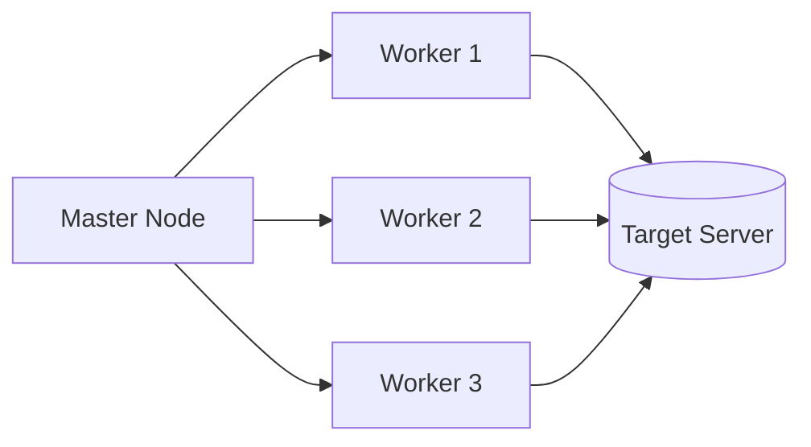

# How to Build a Load Testing Tool with Locust in Python

Author: [nawazdhandala](https://www.github.com/nawazdhandala)

Tags: Python, Locust, Load Testing, Performance Testing, Stress Testing, API Testing

Description: Learn how to build and run load tests with Locust in Python. This guide covers user behavior simulation, distributed testing, custom metrics, and interpreting results to find performance bottlenecks in your applications.

---

> Load testing reveals how your application performs under stress. Locust is a Python-based load testing tool that lets you define user behavior in code, making tests easy to write, version control, and extend. This guide shows you how to build comprehensive load tests for your APIs and web applications.

Unlike GUI-based tools, Locust tests are just Python code. This makes them flexible, maintainable, and easy to integrate into CI/CD pipelines.

---

## Why Locust?

Locust offers several advantages for load testing:

- **Python-based** - Write tests in a familiar language
- **Distributed** - Scale to millions of users across multiple machines
- **Real-time web UI** - Monitor tests as they run
- **Extensible** - Hook into events and add custom metrics
- **Lightweight** - Each user is a greenlet, not a thread



---

## Installation

Install Locust with pip. The package includes everything you need.

```bash
pip install locust
```

For distributed testing, install on all machines that will run workers.

---

## Your First Locust Test

Create a file called `locustfile.py`. Locust automatically finds this file in the current directory.

```python
# locustfile.py
# Basic Locust load test for a REST API
from locust import HttpUser, task, between

class WebsiteUser(HttpUser):
    """Simulates a user interacting with the website"""

    # Wait 1-3 seconds between tasks (simulates human behavior)
    wait_time = between(1, 3)

    @task
    def view_homepage(self):
        """Load the homepage"""
        self.client.get("/")

    @task(3)  # Weight of 3 means this runs 3x more often
    def view_products(self):
        """Browse the products page"""
        self.client.get("/products")

    @task(2)
    def view_product_detail(self):
        """View a specific product"""
        product_id = 123  # In real tests, randomize this
        self.client.get(f"/products/{product_id}")

    @task
    def search_products(self):
        """Search for products"""
        self.client.get("/search", params={"q": "laptop"})
```

Run the test with:

```bash
locust --host=http://localhost:8000
```

Then open `http://localhost:8089` to access the web UI, set the number of users, and start the test.

---

## Realistic User Behavior

Real users don't just hit random endpoints. Model realistic user journeys with sequential tasks and shared state.

```python
# realistic_user.py
# Simulate realistic user journeys through an e-commerce site
from locust import HttpUser, task, between, SequentialTaskSet
import random

class ShoppingJourney(SequentialTaskSet):
    """Sequential tasks that model a shopping journey"""

    def on_start(self):
        """Called when a simulated user starts this task set"""
        # Initialize user-specific data
        self.cart_items = []
        self.user_logged_in = False

    @task
    def browse_homepage(self):
        """Step 1: Visit homepage"""
        with self.client.get("/", catch_response=True) as response:
            if response.status_code == 200:
                response.success()
            else:
                response.failure(f"Homepage failed: {response.status_code}")

    @task
    def browse_category(self):
        """Step 2: Browse a product category"""
        categories = ["electronics", "clothing", "books", "home"]
        category = random.choice(categories)
        self.client.get(f"/category/{category}")

    @task
    def view_product(self):
        """Step 3: View product details"""
        # Simulate viewing a random product
        product_id = random.randint(1, 100)
        response = self.client.get(f"/products/{product_id}")
        if response.status_code == 200:
            # Store product for potential cart addition
            self.current_product = product_id

    @task
    def add_to_cart(self):
        """Step 4: Add product to cart (50% chance)"""
        if random.random() < 0.5 and hasattr(self, 'current_product'):
            response = self.client.post(
                "/cart/add",
                json={"product_id": self.current_product, "quantity": 1}
            )
            if response.status_code == 200:
                self.cart_items.append(self.current_product)

    @task
    def view_cart(self):
        """Step 5: View shopping cart"""
        self.client.get("/cart")

    @task
    def checkout(self):
        """Step 6: Start checkout (if items in cart)"""
        if self.cart_items:
            self.client.post("/checkout", json={"items": self.cart_items})
            self.cart_items = []  # Clear cart after checkout

        # Stop this task set and return to parent
        self.interrupt()

class EcommerceUser(HttpUser):
    """E-commerce user that follows shopping journeys"""
    wait_time = between(2, 5)
    tasks = [ShoppingJourney]

    def on_start(self):
        """Login when user starts"""
        self.client.post(
            "/login",
            json={"username": f"user_{self.user_id}", "password": "testpass"}
        )
```

---

## API Authentication

Many APIs require authentication. Handle login and token management properly.

```python
# authenticated_user.py
# Load testing authenticated APIs
from locust import HttpUser, task, between
import logging

logger = logging.getLogger(__name__)

class AuthenticatedUser(HttpUser):
    """User that authenticates before making requests"""
    wait_time = between(1, 2)

    def on_start(self):
        """Login and store the authentication token"""
        response = self.client.post(
            "/auth/login",
            json={
                "email": "loadtest@example.com",
                "password": "testpassword"
            }
        )

        if response.status_code == 200:
            data = response.json()
            self.token = data.get("access_token")
            # Set default header for all subsequent requests
            self.client.headers["Authorization"] = f"Bearer {self.token}"
            logger.info("User authenticated successfully")
        else:
            logger.error(f"Authentication failed: {response.status_code}")
            self.token = None

    @task(5)
    def get_user_profile(self):
        """Fetch own profile (requires auth)"""
        if self.token:
            self.client.get("/users/me")

    @task(3)
    def list_orders(self):
        """List user's orders (requires auth)"""
        if self.token:
            self.client.get("/orders")

    @task(2)
    def create_order(self):
        """Create a new order (requires auth)"""
        if self.token:
            self.client.post(
                "/orders",
                json={
                    "product_id": 123,
                    "quantity": 1
                }
            )

    def on_stop(self):
        """Logout when user stops"""
        if self.token:
            self.client.post("/auth/logout")
```

---

## Custom Response Validation

Verify response content, not just status codes.

```python
# validation.py
# Custom response validation in load tests
from locust import HttpUser, task, between
import json

class ValidatingUser(HttpUser):
    """User that validates response content"""
    wait_time = between(1, 2)

    @task
    def get_products_validated(self):
        """Fetch products and validate the response structure"""
        with self.client.get("/products", catch_response=True) as response:
            try:
                # Check status code
                if response.status_code != 200:
                    response.failure(f"Expected 200, got {response.status_code}")
                    return

                # Parse and validate JSON
                data = response.json()

                # Validate response structure
                if "products" not in data:
                    response.failure("Response missing 'products' field")
                    return

                if not isinstance(data["products"], list):
                    response.failure("'products' should be a list")
                    return

                # Validate we got some products
                if len(data["products"]) == 0:
                    response.failure("No products returned")
                    return

                # Validate each product has required fields
                for product in data["products"][:5]:  # Check first 5
                    if "id" not in product or "name" not in product:
                        response.failure("Product missing required fields")
                        return

                # All validations passed
                response.success()

            except json.JSONDecodeError:
                response.failure("Response is not valid JSON")

    @task
    def check_response_time(self):
        """Fail if response is too slow"""
        with self.client.get("/api/slow-endpoint", catch_response=True) as response:
            if response.elapsed.total_seconds() > 2.0:
                response.failure(f"Response too slow: {response.elapsed.total_seconds():.2f}s")
            else:
                response.success()
```

---

## Parameterized Tests

Use test data files to vary requests across users.

```python
# parameterized.py
# Load tests with external test data
from locust import HttpUser, task, between
import csv
import random

# Load test data at module level (shared across all users)
def load_test_data():
    """Load user credentials from CSV file"""
    users = []
    with open("test_users.csv", "r") as f:
        reader = csv.DictReader(f)
        for row in reader:
            users.append(row)
    return users

TEST_USERS = load_test_data()
PRODUCT_IDS = list(range(1, 1001))  # Products 1-1000

class ParameterizedUser(HttpUser):
    """User with parameterized test data"""
    wait_time = between(1, 3)

    def on_start(self):
        """Pick a random test user and login"""
        # Each simulated user gets a different test account
        self.test_user = random.choice(TEST_USERS)
        response = self.client.post(
            "/login",
            json={
                "username": self.test_user["username"],
                "password": self.test_user["password"]
            }
        )
        if response.status_code != 200:
            raise Exception("Login failed")

    @task
    def view_random_product(self):
        """View a random product from the test data"""
        product_id = random.choice(PRODUCT_IDS)
        self.client.get(f"/products/{product_id}")

    @task
    def search_random_term(self):
        """Search with random terms"""
        search_terms = ["laptop", "phone", "camera", "tablet", "headphones"]
        term = random.choice(search_terms)
        self.client.get("/search", params={"q": term})
```

---

## Custom Metrics and Events

Track custom metrics beyond just response times.

```python
# custom_metrics.py
# Custom metrics and event handling in Locust
from locust import HttpUser, task, between, events
import time

# Track custom metrics
custom_metrics = {
    "orders_created": 0,
    "orders_failed": 0,
    "total_order_value": 0.0
}

@events.request.add_listener
def on_request(request_type, name, response_time, response_length, response, **kwargs):
    """Hook into every request for custom tracking"""
    # Track specific endpoints
    if name == "/orders" and request_type == "POST":
        if response and response.status_code == 201:
            custom_metrics["orders_created"] += 1
            try:
                data = response.json()
                custom_metrics["total_order_value"] += data.get("total", 0)
            except:
                pass
        else:
            custom_metrics["orders_failed"] += 1

@events.test_stop.add_listener
def on_test_stop(environment, **kwargs):
    """Called when the test stops"""
    print("\n--- Custom Metrics ---")
    print(f"Orders created: {custom_metrics['orders_created']}")
    print(f"Orders failed: {custom_metrics['orders_failed']}")
    print(f"Total order value: ${custom_metrics['total_order_value']:.2f}")

class OrderingUser(HttpUser):
    """User that creates orders and tracks custom metrics"""
    wait_time = between(2, 5)

    @task
    def create_order(self):
        """Create an order"""
        order_data = {
            "product_id": 123,
            "quantity": 2,
            "shipping_address": "123 Test St"
        }
        self.client.post("/orders", json=order_data)

    @task(5)
    def browse_products(self):
        """Browse products (runs 5x more than orders)"""
        self.client.get("/products")
```

---

## Distributed Load Testing

Run Locust across multiple machines to generate massive load.

```python
# distributed/locustfile.py
# Configuration for distributed testing
from locust import HttpUser, task, between, events
import socket

class DistributedUser(HttpUser):
    """User for distributed load testing"""
    wait_time = between(1, 3)

    def on_start(self):
        """Log which worker this user is running on"""
        self.worker_id = socket.gethostname()

    @task
    def api_request(self):
        """Make API request"""
        self.client.get(
            "/api/data",
            headers={"X-Worker-ID": self.worker_id}  # Track which worker
        )
```

Run the master:

```bash
locust --master --host=http://target-server.com
```

Run workers on each machine:

```bash
locust --worker --master-host=192.168.1.100
```

Or use Docker for easy scaling:

```yaml
# docker-compose.yml
version: '3'
services:
  master:
    image: locustio/locust
    ports:
      - "8089:8089"
    volumes:
      - ./:/mnt/locust
    command: -f /mnt/locust/locustfile.py --master -H http://target-server.com

  worker:
    image: locustio/locust
    volumes:
      - ./:/mnt/locust
    command: -f /mnt/locust/locustfile.py --worker --master-host master
    deploy:
      replicas: 4  # Run 4 worker containers
```

---

## Running from Command Line

Run tests without the web UI for CI/CD integration.

```bash
# Run with 100 users, spawning 10 per second, for 5 minutes
locust --headless \
    --users 100 \
    --spawn-rate 10 \
    --run-time 5m \
    --host http://localhost:8000 \
    --csv=results/loadtest

# This generates:
# results/loadtest_stats.csv - Request statistics
# results/loadtest_failures.csv - Failed requests
# results/loadtest_stats_history.csv - Stats over time
```

---

## CI/CD Integration

Add load tests to your deployment pipeline.

```python
# ci_loadtest.py
# Load test designed for CI/CD with pass/fail criteria
from locust import HttpUser, task, between, events
import sys

# Performance thresholds
THRESHOLDS = {
    "p95_response_time_ms": 500,  # 95th percentile under 500ms
    "failure_rate_percent": 1.0,  # Less than 1% failures
    "requests_per_second": 100    # At least 100 RPS
}

test_passed = True
failure_reasons = []

@events.quitting.add_listener
def check_thresholds(environment, **kwargs):
    """Check if test met performance thresholds"""
    global test_passed, failure_reasons

    stats = environment.stats.total

    # Check response time
    if stats.get_response_time_percentile(0.95) > THRESHOLDS["p95_response_time_ms"]:
        test_passed = False
        failure_reasons.append(
            f"P95 response time {stats.get_response_time_percentile(0.95):.0f}ms "
            f"exceeds threshold {THRESHOLDS['p95_response_time_ms']}ms"
        )

    # Check failure rate
    if stats.num_requests > 0:
        failure_rate = (stats.num_failures / stats.num_requests) * 100
        if failure_rate > THRESHOLDS["failure_rate_percent"]:
            test_passed = False
            failure_reasons.append(
                f"Failure rate {failure_rate:.2f}% "
                f"exceeds threshold {THRESHOLDS['failure_rate_percent']}%"
            )

    # Check throughput
    if stats.total_rps < THRESHOLDS["requests_per_second"]:
        test_passed = False
        failure_reasons.append(
            f"Throughput {stats.total_rps:.0f} RPS "
            f"below threshold {THRESHOLDS['requests_per_second']} RPS"
        )

    # Print results
    if test_passed:
        print("\n[PASS] Load test passed all thresholds")
    else:
        print("\n[FAIL] Load test failed:")
        for reason in failure_reasons:
            print(f"  - {reason}")
        environment.process_exit_code = 1

class CIUser(HttpUser):
    wait_time = between(0.5, 1)

    @task
    def api_health(self):
        self.client.get("/health")

    @task(5)
    def api_data(self):
        self.client.get("/api/data")
```

Run in CI:

```bash
locust --headless -u 50 -r 10 -t 2m --host http://staging.example.com
exit_code=$?
if [ $exit_code -ne 0 ]; then
    echo "Load test failed!"
    exit 1
fi
```

---

## Best Practices

1. **Model real user behavior** - Use realistic wait times and task weights
2. **Warm up gradually** - Don't hit the server with full load instantly
3. **Test in staging** - Never load test production without preparation
4. **Monitor the target** - Watch server metrics during tests
5. **Run consistently** - Same test conditions for comparable results
6. **Set thresholds** - Define pass/fail criteria before testing
7. **Test at scale** - Use distributed testing for realistic load

---

## Conclusion

Locust provides a powerful, flexible framework for load testing. Key takeaways:

- **Python-based** - Tests are code you can version control
- **Realistic behavior** - Model user journeys, not just random requests
- **Custom validation** - Check response content, not just status codes
- **Distributed** - Scale across machines for high load
- **CI/CD ready** - Integrate into deployment pipelines

Start with simple tests and evolve to comprehensive performance validation as your needs grow.

---

*Need to monitor your application under load? [OneUptime](https://oneuptime.com) provides real-time performance monitoring and alerting during load tests and production traffic.*
