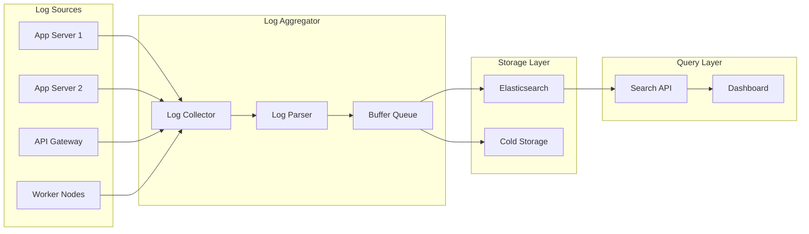

# How to Build a Log Aggregation Service in Node.js

Author: [nawazdhandala](https://www.github.com/nawazdhandala)

Tags: Node.js, Logging, Log Aggregation, Observability, TypeScript, Elasticsearch, Monitoring

Description: Learn how to build a centralized log aggregation service in Node.js that collects, processes, and stores logs from multiple sources. This guide covers log ingestion, parsing, indexing, and querying patterns.

---

> Logs scattered across servers are useless during incidents. A centralized log aggregation service collects logs from all your services, making troubleshooting faster and root cause analysis possible. Build your own log infrastructure.

When services run across multiple servers and containers, finding relevant logs becomes a needle-in-haystack problem. Log aggregation solves this by collecting everything in one searchable location.

---

## Overview



---

## Log Collector Service

Create a service that receives logs over HTTP and TCP:

```typescript
// collector.ts
import express, { Request, Response } from 'express';
import net from 'net';
import { v4 as uuidv4 } from 'uuid';

// Define the structure of a log entry
interface LogEntry {
  id: string;
  timestamp: Date;
  level: 'debug' | 'info' | 'warn' | 'error' | 'fatal';
  service: string;
  host: string;
  message: string;
  metadata?: Record<string, any>;
  traceId?: string;
  spanId?: string;
}

// Buffer for batching logs before processing
const logBuffer: LogEntry[] = [];
const BUFFER_SIZE = 100;
const FLUSH_INTERVAL_MS = 5000;

// HTTP endpoint for log ingestion
const app = express();
app.use(express.json({ limit: '10mb' }));

// Single log entry endpoint
app.post('/logs', (req: Request, res: Response) => {
  const entry = parseLogEntry(req.body, req.headers);
  bufferLog(entry);
  res.status(202).json({ id: entry.id, status: 'accepted' });
});

// Batch log entry endpoint for efficiency
app.post('/logs/batch', (req: Request, res: Response) => {
  const { logs } = req.body;

  if (!Array.isArray(logs)) {
    return res.status(400).json({ error: 'logs must be an array' });
  }

  const ids: string[] = [];
  for (const log of logs) {
    const entry = parseLogEntry(log, req.headers);
    bufferLog(entry);
    ids.push(entry.id);
  }

  res.status(202).json({ ids, count: ids.length, status: 'accepted' });
});

// Parse incoming log data into standard format
function parseLogEntry(data: any, headers: any): LogEntry {
  return {
    id: uuidv4(),
    timestamp: data.timestamp ? new Date(data.timestamp) : new Date(),
    level: normalizeLevel(data.level),
    service: data.service || headers['x-service-name'] || 'unknown',
    host: data.host || headers['x-forwarded-for'] || 'unknown',
    message: data.message || data.msg || '',
    metadata: data.metadata || data.extra || {},
    traceId: data.traceId || data.trace_id || headers['x-trace-id'],
    spanId: data.spanId || data.span_id || headers['x-span-id']
  };
}

// Normalize different log level formats
function normalizeLevel(level: string): LogEntry['level'] {
  const normalized = (level || 'info').toLowerCase();
  const levelMap: Record<string, LogEntry['level']> = {
    'debug': 'debug',
    'trace': 'debug',
    'info': 'info',
    'information': 'info',
    'warn': 'warn',
    'warning': 'warn',
    'error': 'error',
    'err': 'error',
    'fatal': 'fatal',
    'critical': 'fatal',
    'crit': 'fatal'
  };
  return levelMap[normalized] || 'info';
}

// Add log to buffer for batch processing
function bufferLog(entry: LogEntry): void {
  logBuffer.push(entry);

  // Flush if buffer is full
  if (logBuffer.length >= BUFFER_SIZE) {
    flushBuffer();
  }
}

// Flush buffer periodically
setInterval(flushBuffer, FLUSH_INTERVAL_MS);

app.listen(3000, () => {
  console.log('Log collector HTTP server running on port 3000');
});
```

---

## TCP Syslog Receiver

Accept logs via syslog protocol for legacy systems:

```typescript
// syslog-receiver.ts
import net from 'net';

// RFC 5424 syslog priority to level mapping
const SYSLOG_SEVERITY: Record<number, LogEntry['level']> = {
  0: 'fatal',   // Emergency
  1: 'fatal',   // Alert
  2: 'fatal',   // Critical
  3: 'error',   // Error
  4: 'warn',    // Warning
  5: 'info',    // Notice
  6: 'info',    // Informational
  7: 'debug'    // Debug
};

// Create TCP server for syslog
const syslogServer = net.createServer((socket) => {
  console.log('Syslog client connected');

  let buffer = '';

  socket.on('data', (data) => {
    buffer += data.toString();

    // Split on newlines and process complete messages
    const lines = buffer.split('\n');
    buffer = lines.pop() || '';  // Keep incomplete line in buffer

    for (const line of lines) {
      if (line.trim()) {
        const entry = parseSyslogMessage(line);
        if (entry) {
          bufferLog(entry);
        }
      }
    }
  });

  socket.on('close', () => {
    console.log('Syslog client disconnected');
  });

  socket.on('error', (err) => {
    console.error('Syslog socket error:', err);
  });
});

// Parse RFC 5424 syslog message
function parseSyslogMessage(message: string): LogEntry | null {
  // Example: <134>1 2024-01-25T10:30:00.000Z hostname app - - message
  const syslogRegex = /^<(\d+)>(\d+)?\s*(\S+)\s+(\S+)\s+(\S+)\s+(\S+)?\s*(\S+)?\s*(.*)$/;
  const match = message.match(syslogRegex);

  if (!match) {
    // Try simple BSD syslog format
    return parseSimpleSyslog(message);
  }

  const [, priorityStr, , timestamp, hostname, appName, , , msg] = match;
  const priority = parseInt(priorityStr, 10);
  const severity = priority & 7;  // Last 3 bits are severity

  return {
    id: uuidv4(),
    timestamp: new Date(timestamp),
    level: SYSLOG_SEVERITY[severity] || 'info',
    service: appName || 'unknown',
    host: hostname || 'unknown',
    message: msg.trim(),
    metadata: {
      facility: Math.floor(priority / 8),
      severity,
      raw: message
    }
  };
}

// Parse simple BSD syslog format
function parseSimpleSyslog(message: string): LogEntry | null {
  const simpleRegex = /^<(\d+)>(.*)$/;
  const match = message.match(simpleRegex);

  if (!match) {
    return null;
  }

  const [, priorityStr, msg] = match;
  const priority = parseInt(priorityStr, 10);
  const severity = priority & 7;

  return {
    id: uuidv4(),
    timestamp: new Date(),
    level: SYSLOG_SEVERITY[severity] || 'info',
    service: 'syslog',
    host: 'unknown',
    message: msg.trim()
  };
}

syslogServer.listen(514, () => {
  console.log('Syslog server running on port 514');
});
```

---

## Log Parser and Enrichment

Process logs to extract structured data and add context:

```typescript
// parser.ts

interface ParsedLog extends LogEntry {
  parsed: {
    requestId?: string;
    userId?: string;
    duration?: number;
    statusCode?: number;
    method?: string;
    path?: string;
    errorStack?: string[];
  };
  tags: string[];
}

// Parser chain for different log formats
type LogParser = (entry: LogEntry) => Partial<ParsedLog['parsed']>;

const parsers: LogParser[] = [
  parseHttpLog,
  parseErrorStack,
  parseJsonFields,
  extractRequestId,
  extractUserId
];

// Parse HTTP access log patterns
function parseHttpLog(entry: LogEntry): Partial<ParsedLog['parsed']> {
  // Match common log format: GET /api/users 200 45ms
  const httpRegex = /^(GET|POST|PUT|DELETE|PATCH)\s+(\S+)\s+(\d{3})\s+(\d+)ms/;
  const match = entry.message.match(httpRegex);

  if (match) {
    return {
      method: match[1],
      path: match[2],
      statusCode: parseInt(match[3], 10),
      duration: parseInt(match[4], 10)
    };
  }

  return {};
}

// Extract error stack traces
function parseErrorStack(entry: LogEntry): Partial<ParsedLog['parsed']> {
  if (entry.level !== 'error' && entry.level !== 'fatal') {
    return {};
  }

  // Look for stack trace in message or metadata
  const stack = entry.metadata?.stack || entry.metadata?.error?.stack;
  if (stack) {
    const lines = typeof stack === 'string'
      ? stack.split('\n').map((l: string) => l.trim())
      : stack;
    return { errorStack: lines };
  }

  return {};
}

// Parse JSON embedded in log message
function parseJsonFields(entry: LogEntry): Partial<ParsedLog['parsed']> {
  // Look for JSON objects in the message
  const jsonRegex = /\{[^{}]+\}/g;
  const matches = entry.message.match(jsonRegex);

  if (matches) {
    for (const match of matches) {
      try {
        const parsed = JSON.parse(match);
        // Merge parsed fields into metadata
        Object.assign(entry.metadata || {}, parsed);
      } catch {
        // Not valid JSON, skip
      }
    }
  }

  return {};
}

// Extract request ID patterns
function extractRequestId(entry: LogEntry): Partial<ParsedLog['parsed']> {
  // Common request ID patterns
  const patterns = [
    /request[_-]?id[=:]\s*([a-f0-9-]{36})/i,
    /req[_-]?id[=:]\s*([a-f0-9-]{36})/i,
    /correlation[_-]?id[=:]\s*([a-f0-9-]{36})/i
  ];

  for (const pattern of patterns) {
    const match = entry.message.match(pattern);
    if (match) {
      return { requestId: match[1] };
    }
  }

  return { requestId: entry.metadata?.requestId };
}

// Extract user ID patterns
function extractUserId(entry: LogEntry): Partial<ParsedLog['parsed']> {
  const patterns = [
    /user[_-]?id[=:]\s*(\d+)/i,
    /uid[=:]\s*(\d+)/i
  ];

  for (const pattern of patterns) {
    const match = entry.message.match(pattern);
    if (match) {
      return { userId: match[1] };
    }
  }

  return { userId: entry.metadata?.userId };
}

// Apply all parsers to a log entry
function enrichLog(entry: LogEntry): ParsedLog {
  const parsed: ParsedLog['parsed'] = {};

  // Run each parser and merge results
  for (const parser of parsers) {
    Object.assign(parsed, parser(entry));
  }

  // Generate tags based on content
  const tags = generateTags(entry, parsed);

  return {
    ...entry,
    parsed,
    tags
  };
}

// Generate searchable tags
function generateTags(entry: LogEntry, parsed: ParsedLog['parsed']): string[] {
  const tags: string[] = [];

  // Add level tag
  tags.push(`level:${entry.level}`);

  // Add service tag
  tags.push(`service:${entry.service}`);

  // Add status code tag if present
  if (parsed.statusCode) {
    tags.push(`status:${Math.floor(parsed.statusCode / 100)}xx`);
    if (parsed.statusCode >= 400) {
      tags.push('has:error');
    }
  }

  // Add error tag
  if (parsed.errorStack) {
    tags.push('has:stack');
  }

  // Add duration tags
  if (parsed.duration) {
    if (parsed.duration > 1000) {
      tags.push('slow:true');
    }
  }

  return tags;
}
```

---

## Buffer and Queue Management

Handle log buffering with backpressure support:

```typescript
// buffer-queue.ts
import { EventEmitter } from 'events';

interface QueueOptions {
  maxSize: number;
  batchSize: number;
  flushIntervalMs: number;
  onBatch: (logs: ParsedLog[]) => Promise<void>;
}

class LogQueue extends EventEmitter {
  private queue: ParsedLog[] = [];
  private processing = false;
  private options: QueueOptions;
  private flushTimer: NodeJS.Timeout | null = null;
  private metrics = {
    received: 0,
    processed: 0,
    dropped: 0,
    errors: 0
  };

  constructor(options: QueueOptions) {
    super();
    this.options = options;
    this.startFlushTimer();
  }

  // Add log to queue with backpressure
  enqueue(log: ParsedLog): boolean {
    this.metrics.received++;

    if (this.queue.length >= this.options.maxSize) {
      // Queue is full, apply backpressure
      this.metrics.dropped++;
      this.emit('dropped', log);
      return false;
    }

    this.queue.push(log);

    // Flush if batch size reached
    if (this.queue.length >= this.options.batchSize) {
      this.flush();
    }

    return true;
  }

  // Flush logs to storage
  async flush(): Promise<void> {
    if (this.processing || this.queue.length === 0) {
      return;
    }

    this.processing = true;

    // Take batch from queue
    const batch = this.queue.splice(0, this.options.batchSize);

    try {
      await this.options.onBatch(batch);
      this.metrics.processed += batch.length;
      this.emit('flushed', batch.length);
    } catch (error) {
      this.metrics.errors++;
      this.emit('error', error);

      // Re-queue failed logs at front
      this.queue.unshift(...batch);
    } finally {
      this.processing = false;

      // Continue flushing if more logs waiting
      if (this.queue.length >= this.options.batchSize) {
        setImmediate(() => this.flush());
      }
    }
  }

  // Start periodic flush timer
  private startFlushTimer(): void {
    this.flushTimer = setInterval(() => {
      this.flush();
    }, this.options.flushIntervalMs);
  }

  // Get queue statistics
  getMetrics() {
    return {
      ...this.metrics,
      queueSize: this.queue.length,
      processing: this.processing
    };
  }

  // Graceful shutdown
  async shutdown(): Promise<void> {
    if (this.flushTimer) {
      clearInterval(this.flushTimer);
    }

    // Flush remaining logs
    while (this.queue.length > 0) {
      await this.flush();
    }
  }
}

// Initialize queue with Elasticsearch storage
const logQueue = new LogQueue({
  maxSize: 10000,
  batchSize: 100,
  flushIntervalMs: 5000,
  onBatch: async (logs) => {
    await storeLogs(logs);
  }
});

// Integrate with buffer flush
async function flushBuffer(): Promise<void> {
  if (logBuffer.length === 0) return;

  const logs = logBuffer.splice(0, logBuffer.length);

  for (const log of logs) {
    const enriched = enrichLog(log);
    logQueue.enqueue(enriched);
  }
}
```

---

## Elasticsearch Storage

Store and index logs in Elasticsearch:

```typescript
// storage.ts
import { Client } from '@elastic/elasticsearch';

const esClient = new Client({
  node: process.env.ELASTICSEARCH_URL || 'http://localhost:9200'
});

// Index template for time-series logs
const indexTemplate = {
  index_patterns: ['logs-*'],
  template: {
    settings: {
      number_of_shards: 3,
      number_of_replicas: 1,
      'index.lifecycle.name': 'logs-policy',
      'index.lifecycle.rollover_alias': 'logs'
    },
    mappings: {
      properties: {
        timestamp: { type: 'date' },
        level: { type: 'keyword' },
        service: { type: 'keyword' },
        host: { type: 'keyword' },
        message: { type: 'text' },
        traceId: { type: 'keyword' },
        spanId: { type: 'keyword' },
        tags: { type: 'keyword' },
        parsed: {
          properties: {
            requestId: { type: 'keyword' },
            userId: { type: 'keyword' },
            duration: { type: 'long' },
            statusCode: { type: 'integer' },
            method: { type: 'keyword' },
            path: { type: 'keyword' }
          }
        },
        metadata: { type: 'object', enabled: false }
      }
    }
  }
};

// Initialize index template
async function initializeElasticsearch(): Promise<void> {
  try {
    await esClient.indices.putIndexTemplate({
      name: 'logs-template',
      ...indexTemplate
    });
    console.log('Elasticsearch index template created');
  } catch (error) {
    console.error('Failed to create index template:', error);
  }
}

// Store batch of logs
async function storeLogs(logs: ParsedLog[]): Promise<void> {
  // Generate index name based on date
  const today = new Date().toISOString().split('T')[0];
  const indexName = `logs-${today}`;

  // Prepare bulk operations
  const operations = logs.flatMap(log => [
    { index: { _index: indexName } },
    {
      ...log,
      '@timestamp': log.timestamp.toISOString()
    }
  ]);

  const response = await esClient.bulk({
    operations,
    refresh: false  // Don't wait for index refresh
  });

  if (response.errors) {
    // Log failed items
    const failedItems = response.items.filter(
      item => item.index?.error
    );
    console.error('Bulk indexing errors:', failedItems.length);
  }
}

// Initialize on startup
initializeElasticsearch();
```

---

## Search API

Expose a search API for querying logs:

```typescript
// search-api.ts
import express from 'express';

const searchRouter = express.Router();

interface SearchQuery {
  query?: string;
  level?: string | string[];
  service?: string | string[];
  startTime?: string;
  endTime?: string;
  page?: number;
  pageSize?: number;
  sortBy?: string;
  sortOrder?: 'asc' | 'desc';
}

// Search logs with filters
searchRouter.get('/search', async (req, res) => {
  const params: SearchQuery = {
    query: req.query.q as string,
    level: req.query.level as string | string[],
    service: req.query.service as string | string[],
    startTime: req.query.start as string,
    endTime: req.query.end as string,
    page: parseInt(req.query.page as string) || 1,
    pageSize: Math.min(parseInt(req.query.pageSize as string) || 50, 1000),
    sortBy: (req.query.sortBy as string) || 'timestamp',
    sortOrder: (req.query.sortOrder as 'asc' | 'desc') || 'desc'
  };

  try {
    const results = await searchLogs(params);
    res.json(results);
  } catch (error) {
    console.error('Search error:', error);
    res.status(500).json({ error: 'Search failed' });
  }
});

// Build Elasticsearch query
async function searchLogs(params: SearchQuery) {
  const must: any[] = [];
  const filter: any[] = [];

  // Full-text search on message
  if (params.query) {
    must.push({
      query_string: {
        query: params.query,
        fields: ['message', 'parsed.path', 'metadata.*'],
        default_operator: 'AND'
      }
    });
  }

  // Filter by level
  if (params.level) {
    const levels = Array.isArray(params.level) ? params.level : [params.level];
    filter.push({ terms: { level: levels } });
  }

  // Filter by service
  if (params.service) {
    const services = Array.isArray(params.service) ? params.service : [params.service];
    filter.push({ terms: { service: services } });
  }

  // Filter by time range
  if (params.startTime || params.endTime) {
    const range: any = {};
    if (params.startTime) range.gte = params.startTime;
    if (params.endTime) range.lte = params.endTime;
    filter.push({ range: { timestamp: range } });
  }

  const response = await esClient.search({
    index: 'logs-*',
    from: (params.page! - 1) * params.pageSize!,
    size: params.pageSize,
    query: {
      bool: {
        must: must.length > 0 ? must : [{ match_all: {} }],
        filter
      }
    },
    sort: [
      { [params.sortBy!]: params.sortOrder }
    ],
    highlight: {
      fields: {
        message: { pre_tags: ['<mark>'], post_tags: ['</mark>'] }
      }
    },
    aggs: {
      levels: { terms: { field: 'level' } },
      services: { terms: { field: 'service', size: 20 } },
      timeline: {
        date_histogram: {
          field: 'timestamp',
          calendar_interval: 'hour'
        }
      }
    }
  });

  return {
    total: (response.hits.total as any).value,
    page: params.page,
    pageSize: params.pageSize,
    logs: response.hits.hits.map(hit => ({
      ...hit._source,
      highlight: hit.highlight
    })),
    aggregations: {
      levels: response.aggregations?.levels,
      services: response.aggregations?.services,
      timeline: response.aggregations?.timeline
    }
  };
}

// Get logs by trace ID
searchRouter.get('/trace/:traceId', async (req, res) => {
  const { traceId } = req.params;

  const response = await esClient.search({
    index: 'logs-*',
    size: 1000,
    query: {
      term: { traceId }
    },
    sort: [{ timestamp: 'asc' }]
  });

  res.json({
    traceId,
    logs: response.hits.hits.map(hit => hit._source)
  });
});

// Get service statistics
searchRouter.get('/stats', async (req, res) => {
  const response = await esClient.search({
    index: 'logs-*',
    size: 0,
    query: {
      range: {
        timestamp: {
          gte: 'now-24h'
        }
      }
    },
    aggs: {
      by_service: {
        terms: { field: 'service', size: 50 },
        aggs: {
          by_level: { terms: { field: 'level' } },
          error_rate: {
            filter: { terms: { level: ['error', 'fatal'] } }
          }
        }
      },
      total_errors: {
        filter: { terms: { level: ['error', 'fatal'] } }
      }
    }
  });

  res.json({
    period: '24h',
    totalLogs: (response.hits.total as any).value,
    services: response.aggregations?.by_service,
    totalErrors: (response.aggregations?.total_errors as any).doc_count
  });
});

app.use('/api/logs', searchRouter);
```

---

## Log Retention and Archival

Manage log lifecycle with index rotation:

```typescript
// retention.ts

// Index lifecycle policy
const lifecyclePolicy = {
  policy: {
    phases: {
      hot: {
        actions: {
          rollover: {
            max_age: '1d',
            max_size: '50gb'
          }
        }
      },
      warm: {
        min_age: '7d',
        actions: {
          shrink: { number_of_shards: 1 },
          forcemerge: { max_num_segments: 1 }
        }
      },
      cold: {
        min_age: '30d',
        actions: {
          allocate: {
            require: { data: 'cold' }
          }
        }
      },
      delete: {
        min_age: '90d',
        actions: {
          delete: {}
        }
      }
    }
  }
};

// Create lifecycle policy
async function setupRetentionPolicy(): Promise<void> {
  await esClient.ilm.putLifecycle({
    name: 'logs-policy',
    ...lifecyclePolicy
  });
  console.log('Retention policy created');
}

// Archive old logs to cold storage
async function archiveLogs(olderThan: string): Promise<void> {
  // Find indices older than threshold
  const response = await esClient.cat.indices({
    index: 'logs-*',
    format: 'json'
  });

  const cutoffDate = new Date(olderThan);

  for (const index of response) {
    // Extract date from index name
    const dateStr = index.index?.replace('logs-', '');
    if (!dateStr) continue;

    const indexDate = new Date(dateStr);
    if (indexDate < cutoffDate) {
      // Export to S3 or other cold storage
      await archiveToS3(index.index!);

      // Delete from Elasticsearch
      await esClient.indices.delete({ index: index.index! });
      console.log(`Archived and deleted index: ${index.index}`);
    }
  }
}

async function archiveToS3(indexName: string): Promise<void> {
  // Implementation depends on your S3 setup
  console.log(`Archiving ${indexName} to S3...`);
}
```

---

## Health Monitoring

Monitor the log aggregation service itself:

```typescript
// health.ts

const healthRouter = express.Router();

// Health check endpoint
healthRouter.get('/health', async (req, res) => {
  const checks = {
    elasticsearch: await checkElasticsearch(),
    queue: checkQueue(),
    memory: checkMemory()
  };

  const healthy = Object.values(checks).every(c => c.status === 'healthy');

  res.status(healthy ? 200 : 503).json({
    status: healthy ? 'healthy' : 'unhealthy',
    checks,
    timestamp: new Date().toISOString()
  });
});

async function checkElasticsearch() {
  try {
    const response = await esClient.cluster.health();
    return {
      status: response.status === 'red' ? 'unhealthy' : 'healthy',
      clusterStatus: response.status,
      nodeCount: response.number_of_nodes
    };
  } catch (error) {
    return {
      status: 'unhealthy',
      error: 'Connection failed'
    };
  }
}

function checkQueue() {
  const metrics = logQueue.getMetrics();
  const queueFull = metrics.queueSize > 8000;

  return {
    status: queueFull ? 'degraded' : 'healthy',
    ...metrics
  };
}

function checkMemory() {
  const used = process.memoryUsage();
  const heapUsedPercent = (used.heapUsed / used.heapTotal) * 100;

  return {
    status: heapUsedPercent > 90 ? 'degraded' : 'healthy',
    heapUsedMB: Math.round(used.heapUsed / 1024 / 1024),
    heapTotalMB: Math.round(used.heapTotal / 1024 / 1024),
    heapUsedPercent: Math.round(heapUsedPercent)
  };
}

// Metrics endpoint for Prometheus
healthRouter.get('/metrics', (req, res) => {
  const metrics = logQueue.getMetrics();

  const output = `
# HELP log_aggregator_received_total Total logs received
# TYPE log_aggregator_received_total counter
log_aggregator_received_total ${metrics.received}

# HELP log_aggregator_processed_total Total logs processed
# TYPE log_aggregator_processed_total counter
log_aggregator_processed_total ${metrics.processed}

# HELP log_aggregator_dropped_total Total logs dropped
# TYPE log_aggregator_dropped_total counter
log_aggregator_dropped_total ${metrics.dropped}

# HELP log_aggregator_queue_size Current queue size
# TYPE log_aggregator_queue_size gauge
log_aggregator_queue_size ${metrics.queueSize}
`.trim();

  res.set('Content-Type', 'text/plain');
  res.send(output);
});

app.use(healthRouter);
```

---

## Best Practices

1. **Use structured logging** with consistent field names
2. **Include trace IDs** for distributed tracing correlation
3. **Buffer and batch** writes for performance
4. **Set retention policies** to manage storage costs
5. **Monitor the aggregator** to catch ingestion issues
6. **Index selectively** to balance search speed and storage

---

## Conclusion

A centralized log aggregation service provides visibility across your entire infrastructure. Key takeaways:

- **Multiple ingestion methods** support different sources
- **Log enrichment** adds searchable context
- **Buffering with backpressure** handles traffic spikes
- **Elasticsearch** enables fast full-text search

Build logging infrastructure that scales with your applications and makes troubleshooting faster.

---

*Running distributed systems? [OneUptime](https://oneuptime.com) provides monitoring, alerting, and log analysis to help you find issues before they impact users.*
