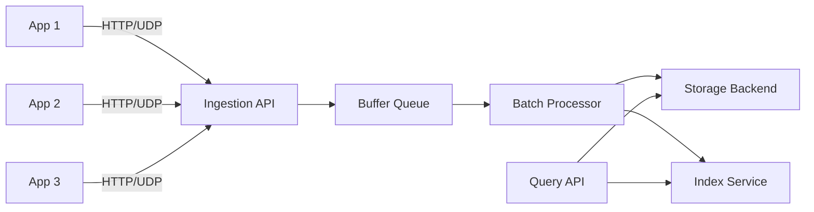

# How to Build a Log Aggregation Service in Python

Author: [nawazdhandala](https://www.github.com/nawazdhandala)

Tags: Python, Logging, Log Aggregation, Observability, FastAPI, AsyncIO

Description: Learn how to build a log aggregation service in Python that collects, processes, and stores logs from multiple sources. This guide covers log ingestion, buffering, batch processing, and storage patterns.

---

> Centralized logging is essential for debugging distributed systems. Building your own log aggregation service gives you full control over retention, processing, and costs. This guide shows you how to build a production-ready log aggregator in Python.

Modern applications generate logs across dozens or hundreds of services. Without centralized aggregation, debugging becomes a nightmare of SSH sessions and grep commands. While commercial solutions like Datadog and Splunk exist, building your own gives you control over costs and customization. This guide walks through building a log aggregation service from scratch.

---

## Architecture Overview

A log aggregation service has several key components:



The key design decisions:
- **Ingestion** accepts logs via HTTP and UDP for flexibility
- **Buffering** prevents data loss during traffic spikes
- **Batch processing** optimizes write performance
- **Storage** uses append-only files with indexing for queries

---

## Log Ingestion API

The ingestion layer accepts logs from various sources and normalizes them into a common format.

```python
# ingestion.py
# Log ingestion API with HTTP and UDP support
from fastapi import FastAPI, Request, BackgroundTasks
from pydantic import BaseModel, Field
from typing import List, Optional, Dict, Any
from datetime import datetime
from enum import Enum
import asyncio
import socket
import json

app = FastAPI(title="Log Aggregation Service")

class LogLevel(str, Enum):
    DEBUG = "debug"
    INFO = "info"
    WARNING = "warning"
    ERROR = "error"
    CRITICAL = "critical"

class LogEntry(BaseModel):
    """
    Normalized log entry format.
    All incoming logs are converted to this structure.
    """
    timestamp: datetime = Field(default_factory=datetime.utcnow)
    level: LogLevel = LogLevel.INFO
    service: str  # Source service name
    message: str
    trace_id: Optional[str] = None  # For distributed tracing
    span_id: Optional[str] = None
    host: Optional[str] = None
    attributes: Dict[str, Any] = Field(default_factory=dict)

class LogBatch(BaseModel):
    """Batch of logs for efficient ingestion"""
    logs: List[LogEntry]

# In-memory buffer for incoming logs
# In production, use Redis or a proper message queue
log_buffer: asyncio.Queue = None

async def get_buffer() -> asyncio.Queue:
    """Get or create the log buffer"""
    global log_buffer
    if log_buffer is None:
        log_buffer = asyncio.Queue(maxsize=100000)
    return log_buffer

@app.post("/ingest")
async def ingest_single_log(log: LogEntry, request: Request):
    """
    Ingest a single log entry.
    Fast path for low-volume logging.
    """
    # Add client IP if not provided
    if not log.host:
        log.host = request.client.host

    buffer = await get_buffer()

    try:
        buffer.put_nowait(log)
        return {"status": "accepted", "queue_size": buffer.qsize()}
    except asyncio.QueueFull:
        # Buffer is full - apply backpressure
        return {"status": "rejected", "reason": "buffer_full"}, 503

@app.post("/ingest/batch")
async def ingest_batch(batch: LogBatch, request: Request):
    """
    Ingest a batch of logs.
    More efficient for high-volume logging.
    """
    buffer = await get_buffer()
    accepted = 0

    for log in batch.logs:
        if not log.host:
            log.host = request.client.host

        try:
            buffer.put_nowait(log)
            accepted += 1
        except asyncio.QueueFull:
            break

    return {
        "status": "accepted",
        "accepted": accepted,
        "total": len(batch.logs),
        "queue_size": buffer.qsize()
    }

# UDP ingestion for syslog-style logging
class UDPLogServer:
    """
    UDP server for high-performance log ingestion.
    Useful for syslog compatibility and low-latency logging.
    """

    def __init__(self, host: str = "0.0.0.0", port: int = 5514):
        self.host = host
        self.port = port
        self.transport = None
        self.protocol = None

    async def start(self, buffer: asyncio.Queue):
        """Start the UDP server"""
        loop = asyncio.get_event_loop()

        self.transport, self.protocol = await loop.create_datagram_endpoint(
            lambda: UDPLogProtocol(buffer),
            local_addr=(self.host, self.port)
        )

        print(f"UDP log server listening on {self.host}:{self.port}")

    def stop(self):
        """Stop the UDP server"""
        if self.transport:
            self.transport.close()

class UDPLogProtocol(asyncio.DatagramProtocol):
    """Protocol handler for UDP log messages"""

    def __init__(self, buffer: asyncio.Queue):
        self.buffer = buffer

    def datagram_received(self, data: bytes, addr):
        """Process incoming UDP log message"""
        try:
            # Try to parse as JSON
            log_data = json.loads(data.decode('utf-8'))
            log = LogEntry(**log_data)
        except (json.JSONDecodeError, ValueError):
            # Fall back to plain text
            log = LogEntry(
                service="unknown",
                message=data.decode('utf-8', errors='replace'),
                host=addr[0]
            )

        try:
            self.buffer.put_nowait(log)
        except asyncio.QueueFull:
            pass  # Drop logs when buffer is full (UDP is lossy anyway)

# Start UDP server alongside FastAPI
udp_server = UDPLogServer()

@app.on_event("startup")
async def startup():
    buffer = await get_buffer()
    await udp_server.start(buffer)

@app.on_event("shutdown")
async def shutdown():
    udp_server.stop()
```

---

## Batch Processor

The batch processor reads from the buffer and writes logs efficiently in batches.

```python
# processor.py
# Batch processor for log aggregation
import asyncio
from typing import List, Optional
from datetime import datetime, timedelta
from dataclasses import dataclass
import json
import gzip
import os

from ingestion import LogEntry

@dataclass
class ProcessorConfig:
    """Configuration for the batch processor"""
    batch_size: int = 1000  # Max logs per batch
    flush_interval: float = 5.0  # Seconds between flushes
    storage_path: str = "/var/log/aggregated"
    compress: bool = True

class BatchProcessor:
    """
    Processes logs from the buffer in batches.
    Optimizes write performance by batching and compressing.
    """

    def __init__(self, buffer: asyncio.Queue, config: ProcessorConfig):
        self.buffer = buffer
        self.config = config
        self.current_batch: List[LogEntry] = []
        self.last_flush = datetime.utcnow()
        self._running = False

    async def start(self):
        """Start the batch processor"""
        self._running = True

        # Create storage directory
        os.makedirs(self.config.storage_path, exist_ok=True)

        # Run processor loop
        await asyncio.gather(
            self._process_loop(),
            self._flush_timer()
        )

    def stop(self):
        """Stop the processor"""
        self._running = False

    async def _process_loop(self):
        """Main processing loop - reads from buffer"""
        while self._running:
            try:
                # Wait for a log entry with timeout
                log = await asyncio.wait_for(
                    self.buffer.get(),
                    timeout=1.0
                )

                self.current_batch.append(log)

                # Flush if batch is full
                if len(self.current_batch) >= self.config.batch_size:
                    await self._flush_batch()

            except asyncio.TimeoutError:
                continue
            except Exception as e:
                print(f"Processor error: {e}")

    async def _flush_timer(self):
        """Periodic flush timer"""
        while self._running:
            await asyncio.sleep(self.config.flush_interval)

            # Flush if there are pending logs
            if self.current_batch:
                await self._flush_batch()

    async def _flush_batch(self):
        """Write current batch to storage"""
        if not self.current_batch:
            return

        # Grab the batch and reset
        batch = self.current_batch
        self.current_batch = []
        self.last_flush = datetime.utcnow()

        # Generate filename based on timestamp
        timestamp = datetime.utcnow().strftime("%Y%m%d_%H%M%S_%f")
        filename = f"logs_{timestamp}.jsonl"

        if self.config.compress:
            filename += ".gz"

        filepath = os.path.join(self.config.storage_path, filename)

        # Write logs to file
        await self._write_batch(batch, filepath)

        print(f"Flushed {len(batch)} logs to {filename}")

    async def _write_batch(self, batch: List[LogEntry], filepath: str):
        """Write a batch of logs to a file"""
        # Serialize logs to JSON lines
        lines = [
            log.model_dump_json() + "\n"
            for log in batch
        ]
        content = "".join(lines).encode('utf-8')

        # Run file I/O in thread pool to avoid blocking
        loop = asyncio.get_event_loop()

        if self.config.compress:
            await loop.run_in_executor(
                None,
                self._write_compressed,
                filepath,
                content
            )
        else:
            await loop.run_in_executor(
                None,
                self._write_plain,
                filepath,
                content
            )

    def _write_compressed(self, filepath: str, content: bytes):
        """Write compressed content to file"""
        with gzip.open(filepath, 'wb') as f:
            f.write(content)

    def _write_plain(self, filepath: str, content: bytes):
        """Write plain content to file"""
        with open(filepath, 'wb') as f:
            f.write(content)

# Service-specific indexing for fast queries
class LogIndex:
    """
    Simple index for fast log lookups.
    Tracks which files contain logs from which services.
    """

    def __init__(self, index_path: str):
        self.index_path = index_path
        self.index: dict = {}  # service -> list of files
        self._load_index()

    def _load_index(self):
        """Load index from disk"""
        if os.path.exists(self.index_path):
            with open(self.index_path, 'r') as f:
                self.index = json.load(f)

    def _save_index(self):
        """Save index to disk"""
        with open(self.index_path, 'w') as f:
            json.dump(self.index, f)

    def add_batch(self, filename: str, services: set):
        """Add a batch to the index"""
        for service in services:
            if service not in self.index:
                self.index[service] = []
            self.index[service].append(filename)
        self._save_index()

    def get_files_for_service(self, service: str) -> List[str]:
        """Get all files containing logs for a service"""
        return self.index.get(service, [])
```

---

## Query API

The query API allows searching and retrieving logs from storage.

```python
# query.py
# Query API for searching aggregated logs
from fastapi import APIRouter, Query, HTTPException
from pydantic import BaseModel
from typing import List, Optional
from datetime import datetime, timedelta
import asyncio
import gzip
import json
import os
import re

from ingestion import LogEntry, LogLevel

router = APIRouter(prefix="/query", tags=["Query"])

class LogQuery(BaseModel):
    """Query parameters for log search"""
    service: Optional[str] = None
    level: Optional[LogLevel] = None
    start_time: Optional[datetime] = None
    end_time: Optional[datetime] = None
    search: Optional[str] = None  # Text search in message
    trace_id: Optional[str] = None
    limit: int = 100
    offset: int = 0

class LogQueryResult(BaseModel):
    """Result of a log query"""
    logs: List[LogEntry]
    total: int
    has_more: bool

STORAGE_PATH = "/var/log/aggregated"

@router.post("/search")
async def search_logs(query: LogQuery) -> LogQueryResult:
    """
    Search logs with flexible filtering.
    Scans relevant log files based on query parameters.
    """
    # Get list of files to search
    files = await get_relevant_files(query)

    # Search files in parallel
    all_logs = []
    tasks = [search_file(f, query) for f in files]
    results = await asyncio.gather(*tasks)

    for logs in results:
        all_logs.extend(logs)

    # Sort by timestamp descending (newest first)
    all_logs.sort(key=lambda x: x.timestamp, reverse=True)

    # Apply pagination
    total = len(all_logs)
    paginated = all_logs[query.offset:query.offset + query.limit]

    return LogQueryResult(
        logs=paginated,
        total=total,
        has_more=(query.offset + query.limit) < total
    )

async def get_relevant_files(query: LogQuery) -> List[str]:
    """
    Get list of log files that might contain matching logs.
    Uses file timestamps and index to narrow down search.
    """
    files = []

    # List all log files
    for filename in os.listdir(STORAGE_PATH):
        if not filename.startswith("logs_"):
            continue

        # Extract timestamp from filename
        try:
            # Format: logs_YYYYMMDD_HHMMSS_ffffff.jsonl.gz
            ts_str = filename.split("_")[1] + filename.split("_")[2]
            file_time = datetime.strptime(ts_str, "%Y%m%d%H%M%S")
        except (ValueError, IndexError):
            continue

        # Filter by time range if specified
        if query.start_time and file_time < query.start_time - timedelta(hours=1):
            continue
        if query.end_time and file_time > query.end_time + timedelta(hours=1):
            continue

        files.append(os.path.join(STORAGE_PATH, filename))

    return sorted(files, reverse=True)  # Newest first

async def search_file(filepath: str, query: LogQuery) -> List[LogEntry]:
    """
    Search a single log file for matching entries.
    Runs file I/O in thread pool to avoid blocking.
    """
    loop = asyncio.get_event_loop()

    # Read file in thread pool
    if filepath.endswith('.gz'):
        content = await loop.run_in_executor(
            None, read_gzip_file, filepath
        )
    else:
        content = await loop.run_in_executor(
            None, read_plain_file, filepath
        )

    # Parse and filter logs
    matching = []
    for line in content.split('\n'):
        if not line.strip():
            continue

        try:
            log = LogEntry(**json.loads(line))
        except (json.JSONDecodeError, ValueError):
            continue

        if matches_query(log, query):
            matching.append(log)

    return matching

def read_gzip_file(filepath: str) -> str:
    """Read and decompress a gzip file"""
    with gzip.open(filepath, 'rt', encoding='utf-8') as f:
        return f.read()

def read_plain_file(filepath: str) -> str:
    """Read a plain text file"""
    with open(filepath, 'r', encoding='utf-8') as f:
        return f.read()

def matches_query(log: LogEntry, query: LogQuery) -> bool:
    """Check if a log entry matches the query filters"""
    # Service filter
    if query.service and log.service != query.service:
        return False

    # Level filter
    if query.level and log.level != query.level:
        return False

    # Time range filter
    if query.start_time and log.timestamp < query.start_time:
        return False
    if query.end_time and log.timestamp > query.end_time:
        return False

    # Text search
    if query.search:
        if query.search.lower() not in log.message.lower():
            return False

    # Trace ID filter
    if query.trace_id and log.trace_id != query.trace_id:
        return False

    return True

@router.get("/services")
async def list_services() -> List[str]:
    """List all services that have sent logs"""
    services = set()

    for filename in os.listdir(STORAGE_PATH)[:100]:  # Limit scan
        filepath = os.path.join(STORAGE_PATH, filename)

        if filename.endswith('.gz'):
            content = read_gzip_file(filepath)
        else:
            content = read_plain_file(filepath)

        for line in content.split('\n')[:1000]:  # Sample first 1000 lines
            if not line.strip():
                continue
            try:
                data = json.loads(line)
                services.add(data.get('service', 'unknown'))
            except json.JSONDecodeError:
                continue

    return sorted(list(services))

@router.get("/tail/{service}")
async def tail_logs(
    service: str,
    lines: int = Query(default=100, le=1000)
) -> List[LogEntry]:
    """
    Get the most recent logs for a service.
    Similar to 'tail -f' functionality.
    """
    query = LogQuery(service=service, limit=lines)
    result = await search_logs(query)
    return result.logs
```

---

## Client Library

A simple client library makes it easy for services to send logs.

```python
# client.py
# Client library for sending logs to the aggregation service
import requests
import asyncio
import aiohttp
from typing import Optional, Dict, Any, List
from datetime import datetime
from dataclasses import dataclass
from enum import Enum
import queue
import threading
import atexit

class LogLevel(str, Enum):
    DEBUG = "debug"
    INFO = "info"
    WARNING = "warning"
    ERROR = "error"
    CRITICAL = "critical"

@dataclass
class LogConfig:
    """Configuration for the log client"""
    service_name: str
    aggregator_url: str
    batch_size: int = 100
    flush_interval: float = 5.0
    max_queue_size: int = 10000

class LogAggregatorClient:
    """
    Client for sending logs to the aggregation service.
    Batches logs for efficient network usage.
    """

    def __init__(self, config: LogConfig):
        self.config = config
        self._queue = queue.Queue(maxsize=config.max_queue_size)
        self._running = True

        # Start background flush thread
        self._flush_thread = threading.Thread(target=self._flush_loop, daemon=True)
        self._flush_thread.start()

        # Ensure flush on exit
        atexit.register(self.close)

    def log(
        self,
        level: LogLevel,
        message: str,
        trace_id: Optional[str] = None,
        **attributes
    ):
        """
        Log a message. This is non-blocking and queues the log for sending.
        """
        entry = {
            "timestamp": datetime.utcnow().isoformat() + "Z",
            "level": level.value,
            "service": self.config.service_name,
            "message": message,
            "trace_id": trace_id,
            "attributes": attributes
        }

        try:
            self._queue.put_nowait(entry)
        except queue.Full:
            # Drop logs if queue is full
            pass

    def debug(self, message: str, **kwargs):
        self.log(LogLevel.DEBUG, message, **kwargs)

    def info(self, message: str, **kwargs):
        self.log(LogLevel.INFO, message, **kwargs)

    def warning(self, message: str, **kwargs):
        self.log(LogLevel.WARNING, message, **kwargs)

    def error(self, message: str, **kwargs):
        self.log(LogLevel.ERROR, message, **kwargs)

    def critical(self, message: str, **kwargs):
        self.log(LogLevel.CRITICAL, message, **kwargs)

    def _flush_loop(self):
        """Background thread that flushes logs periodically"""
        while self._running:
            self._flush_batch()
            threading.Event().wait(self.config.flush_interval)

    def _flush_batch(self):
        """Flush pending logs to the aggregator"""
        batch = []

        # Drain queue up to batch size
        while len(batch) < self.config.batch_size:
            try:
                entry = self._queue.get_nowait()
                batch.append(entry)
            except queue.Empty:
                break

        if not batch:
            return

        # Send batch to aggregator
        try:
            response = requests.post(
                f"{self.config.aggregator_url}/ingest/batch",
                json={"logs": batch},
                timeout=5.0
            )

            if response.status_code != 200:
                # Re-queue failed logs (best effort)
                for entry in batch:
                    try:
                        self._queue.put_nowait(entry)
                    except queue.Full:
                        break
        except requests.RequestException:
            # Network error - re-queue logs
            for entry in batch:
                try:
                    self._queue.put_nowait(entry)
                except queue.Full:
                    break

    def close(self):
        """Flush remaining logs and stop the client"""
        self._running = False

        # Final flush
        self._flush_batch()

# Context manager for trace correlation
class TraceContext:
    """
    Context manager for correlating logs with a trace ID.
    Useful for tracking requests across log entries.
    """

    _current = threading.local()

    def __init__(self, trace_id: str):
        self.trace_id = trace_id
        self.previous = None

    def __enter__(self):
        self.previous = getattr(self._current, 'trace_id', None)
        self._current.trace_id = self.trace_id
        return self

    def __exit__(self, *args):
        if self.previous:
            self._current.trace_id = self.previous
        else:
            delattr(self._current, 'trace_id')

    @classmethod
    def get_current(cls) -> Optional[str]:
        return getattr(cls._current, 'trace_id', None)

# Usage example
if __name__ == "__main__":
    # Create client
    config = LogConfig(
        service_name="my-service",
        aggregator_url="http://localhost:8000"
    )
    logger = LogAggregatorClient(config)

    # Log messages
    logger.info("Application started", version="1.0.0")

    with TraceContext("trace-123"):
        logger.info("Processing request", trace_id=TraceContext.get_current())
        logger.debug("Query executed", query="SELECT * FROM users")
        logger.info("Request completed", trace_id=TraceContext.get_current())

    logger.error("Something went wrong", error_code="E001")

    # Clean shutdown
    logger.close()
```

---

## Running the Complete Service

Here's how to put all the pieces together.

```python
# main.py
# Main entry point for the log aggregation service
from fastapi import FastAPI
from contextlib import asynccontextmanager
import asyncio

from ingestion import app as ingestion_app, get_buffer, udp_server
from processor import BatchProcessor, ProcessorConfig
from query import router as query_router

# Processor instance
processor: BatchProcessor = None

@asynccontextmanager
async def lifespan(app: FastAPI):
    """Manage application lifecycle"""
    global processor

    # Start the batch processor
    buffer = await get_buffer()
    config = ProcessorConfig(
        batch_size=1000,
        flush_interval=5.0,
        storage_path="/var/log/aggregated",
        compress=True
    )
    processor = BatchProcessor(buffer, config)

    # Start processor in background
    processor_task = asyncio.create_task(processor.start())

    yield

    # Shutdown
    processor.stop()
    processor_task.cancel()
    udp_server.stop()

# Create main app
app = FastAPI(title="Log Aggregation Service", lifespan=lifespan)

# Mount routers
app.mount("/", ingestion_app)
app.include_router(query_router)

@app.get("/health")
async def health():
    """Health check endpoint"""
    buffer = await get_buffer()
    return {
        "status": "healthy",
        "queue_size": buffer.qsize()
    }

if __name__ == "__main__":
    import uvicorn
    uvicorn.run(app, host="0.0.0.0", port=8000)
```

---

## Best Practices

1. **Buffer incoming logs** - Don't write directly to storage on each request.

2. **Compress stored logs** - GZIP typically achieves 10x compression on text logs.

3. **Use time-based file names** - Makes it easy to find and purge old logs.

4. **Build indexes** - Essential for fast queries on large log volumes.

5. **Implement backpressure** - Return 503 when buffers are full rather than losing data silently.

6. **Support batch ingestion** - Reduces network overhead for high-volume logging.

---

## Conclusion

Building a log aggregation service in Python is straightforward with the right architecture. The key is separating ingestion from processing and storage, using buffers to handle traffic spikes, and batching writes for efficiency. Start simple and add features like full-text search, retention policies, and alerting as your needs grow.

---

*Need comprehensive observability for your applications? [OneUptime](https://oneuptime.com) provides log aggregation, metrics, and tracing in a single platform, with powerful querying and alerting built in.*

**Related Reading:**
- [How to Implement Structured Logging with OpenTelemetry in Python](https://oneuptime.com/blog/post/2025-01-06-python-structured-logging-opentelemetry/view)
- [How to Process Datasets with Parallel Jobs in Python](https://oneuptime.com/blog/post/2026-01-23-parallel-dataset-processing-python/view)
