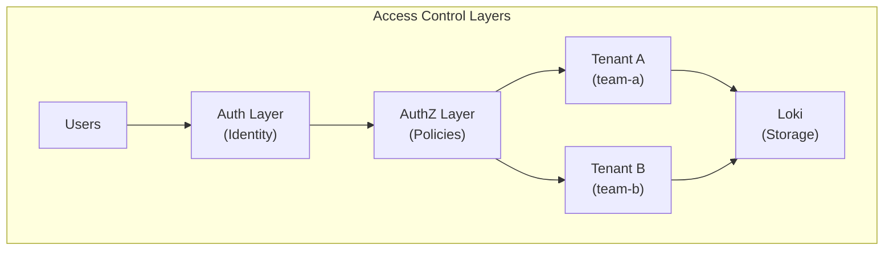

# How to Implement Log Access Control in Loki

Author: [nawazdhandala](https://www.github.com/nawazdhandala)

Tags: Grafana Loki, Access Control, Multi-Tenancy, Security, Authorization, RBAC

Description: A comprehensive guide to implementing log access control in Grafana Loki, covering multi-tenancy, label-based authorization, proxy-based access control, and integration with identity providers for fine-grained log access.

---

Controlling who can access what log data is critical for security and compliance. Grafana Loki provides multi-tenancy as its primary access control mechanism, but achieving fine-grained access control requires additional configuration with reverse proxies, Grafana, or custom authorization services. This guide covers comprehensive strategies for implementing log access control.

## Prerequisites

Before starting, ensure you have:

- Grafana Loki 2.4 or later
- Grafana 9.0 or later
- Reverse proxy (NGINX, Traefik, or similar)
- Understanding of multi-tenancy concepts
- Optional: Identity provider (LDAP, OIDC)

## Access Control Architecture



## Multi-Tenancy Configuration

### Enable Multi-Tenancy in Loki

```yaml
# loki-config.yaml
auth_enabled: true

server:
  http_listen_port: 3100
  grpc_listen_port: 9096

common:
  instance_addr: 127.0.0.1
  path_prefix: /loki
  storage:
    filesystem:
      chunks_directory: /loki/chunks
      rules_directory: /loki/rules
  replication_factor: 1
  ring:
    kvstore:
      store: inmemory

schema_config:
  configs:
    - from: 2020-10-24
      store: tsdb
      object_store: filesystem
      schema: v13
      index:
        prefix: index_
        period: 24h

limits_config:
  # Default limits for all tenants
  ingestion_rate_mb: 10
  ingestion_burst_size_mb: 20
  max_streams_per_user: 10000
  max_line_size: 256kb
  reject_old_samples: true
  reject_old_samples_max_age: 168h

# Per-tenant overrides
overrides:
  # Team A gets higher limits
  team-a:
    ingestion_rate_mb: 50
    ingestion_burst_size_mb: 100
    max_streams_per_user: 50000
  # Team B standard limits
  team-b:
    ingestion_rate_mb: 20
    ingestion_burst_size_mb: 40
    max_streams_per_user: 20000
```

### Tenant Header Configuration

Clients must send the `X-Scope-OrgID` header:

```bash
# Push logs for tenant "team-a"
curl -X POST "http://loki:3100/loki/api/v1/push" \
  -H "Content-Type: application/json" \
  -H "X-Scope-OrgID: team-a" \
  -d '{"streams":[{"stream":{"job":"app"},"values":[["'$(date +%s)'000000000","log message"]]}]}'

# Query logs for tenant "team-a"
curl -G "http://loki:3100/loki/api/v1/query_range" \
  -H "X-Scope-OrgID: team-a" \
  --data-urlencode 'query={job="app"}'
```

## Proxy-Based Access Control

### NGINX with User-to-Tenant Mapping

```nginx
# /etc/nginx/conf.d/loki.conf

# Map users to tenants
map $remote_user $tenant_id {
    default         "";
    "alice"         "team-a";
    "bob"           "team-a";
    "charlie"       "team-b";
    "david"         "team-b";
    "admin"         "admin";
}

# Map for cross-tenant query (admin only)
map $remote_user $is_admin {
    default 0;
    "admin" 1;
}

upstream loki {
    server loki:3100;
    keepalive 32;
}

server {
    listen 443 ssl http2;
    server_name loki.example.com;

    ssl_certificate /etc/nginx/ssl/loki.crt;
    ssl_certificate_key /etc/nginx/ssl/loki.key;

    # Basic authentication
    auth_basic "Loki Access";
    auth_basic_user_file /etc/nginx/.htpasswd;

    # Block access if no tenant mapping
    if ($tenant_id = "") {
        return 403 '{"error": "User not authorized for any tenant"}';
    }

    # Push endpoint - set tenant from user mapping
    location /loki/api/v1/push {
        proxy_set_header X-Scope-OrgID $tenant_id;
        proxy_pass http://loki;
        proxy_http_version 1.1;
        proxy_set_header Host $host;
        client_max_body_size 10m;
    }

    # Query endpoints - set tenant from user mapping
    location /loki/api/v1 {
        proxy_set_header X-Scope-OrgID $tenant_id;
        proxy_pass http://loki;
        proxy_http_version 1.1;
        proxy_set_header Host $host;
    }

    # Admin endpoint for cross-tenant queries
    location /admin/loki/api/v1 {
        if ($is_admin = 0) {
            return 403 '{"error": "Admin access required"}';
        }

        # Allow querying multiple tenants
        # Tenant passed in header by admin
        proxy_pass http://loki/loki/api/v1;
        proxy_http_version 1.1;
        proxy_set_header Host $host;
    }
}
```

### NGINX with LDAP Group Mapping

```nginx
# Map LDAP groups to tenants using headers from auth module
map $http_x_ldap_groups $tenant_from_ldap {
    default "";
    "~*team-a-logs" "team-a";
    "~*team-b-logs" "team-b";
    "~*platform-logs" "platform";
    "~*admin-logs" "admin";
}

server {
    listen 443 ssl http2;
    server_name loki.example.com;

    # LDAP authentication module
    auth_ldap "Loki LDAP Auth";
    auth_ldap_servers ldap_server;

    location /loki/api/v1 {
        # Use LDAP group mapping
        set $tenant $tenant_from_ldap;

        if ($tenant = "") {
            return 403 '{"error": "No log access group membership"}';
        }

        proxy_set_header X-Scope-OrgID $tenant;
        proxy_pass http://loki;
    }
}
```

## OPA (Open Policy Agent) Integration

### OPA Policy for Log Access

```rego
# policy.rego
package loki.authz

import future.keywords.if
import future.keywords.in

default allow = false

# Define user-tenant mappings
user_tenants := {
    "alice": ["team-a"],
    "bob": ["team-a", "team-b"],
    "charlie": ["team-b"],
    "admin": ["team-a", "team-b", "platform", "admin"]
}

# Allow if user has access to requested tenant
allow if {
    input.tenant in user_tenants[input.user]
}

# Allow cross-tenant queries for admins
allow if {
    input.user == "admin"
    input.action == "query"
}

# Deny write access to certain tenants
deny if {
    input.action == "push"
    input.tenant == "audit"
    input.user != "audit-service"
}
```

### NGINX with OPA

```nginx
server {
    listen 443 ssl http2;
    server_name loki.example.com;

    # Authentication
    auth_basic "Loki";
    auth_basic_user_file /etc/nginx/.htpasswd;

    location /loki/api/v1/push {
        # Check authorization with OPA
        auth_request /auth;
        auth_request_set $tenant $upstream_http_x_tenant;

        proxy_set_header X-Scope-OrgID $tenant;
        proxy_pass http://loki;
    }

    location /loki/api/v1/query {
        auth_request /auth;
        auth_request_set $tenant $upstream_http_x_tenant;

        proxy_set_header X-Scope-OrgID $tenant;
        proxy_pass http://loki;
    }

    # OPA authorization endpoint
    location = /auth {
        internal;
        proxy_pass http://opa:8181/v1/data/loki/authz/allow;
        proxy_pass_request_body off;
        proxy_set_header Content-Length "";
        proxy_set_header X-Original-URI $request_uri;
        proxy_set_header X-User $remote_user;
        proxy_set_header X-Tenant $http_x_scope_orgid;
        proxy_set_header X-Action $request_method;
    }
}
```

## Grafana Access Control

### Grafana with Multiple Loki Data Sources

Create separate data sources per team:

```yaml
# grafana-provisioning/datasources/loki.yaml
apiVersion: 1

datasources:
  - name: Loki - Team A
    type: loki
    access: proxy
    url: http://loki:3100
    jsonData:
      maxLines: 1000
      httpHeaderName1: 'X-Scope-OrgID'
    secureJsonData:
      httpHeaderValue1: 'team-a'

  - name: Loki - Team B
    type: loki
    access: proxy
    url: http://loki:3100
    jsonData:
      maxLines: 1000
      httpHeaderName1: 'X-Scope-OrgID'
    secureJsonData:
      httpHeaderValue1: 'team-b'

  - name: Loki - All (Admin)
    type: loki
    access: proxy
    url: http://loki:3100
    jsonData:
      maxLines: 1000
      httpHeaderName1: 'X-Scope-OrgID'
    secureJsonData:
      httpHeaderValue1: 'team-a|team-b|platform'
```

### Grafana RBAC for Data Sources

```yaml
# grafana-provisioning/access-control/datasources.yaml
apiVersion: 1

accessControl:
  # Team A can only access their data source
  - role: team-a-viewer
    permissions:
      - action: datasources:read
        scope: datasources:name:Loki - Team A
      - action: datasources:query
        scope: datasources:name:Loki - Team A

  - role: team-a-editor
    permissions:
      - action: datasources:read
        scope: datasources:name:Loki - Team A
      - action: datasources:query
        scope: datasources:name:Loki - Team A
      - action: datasources:explore
        scope: datasources:name:Loki - Team A

  # Team B permissions
  - role: team-b-viewer
    permissions:
      - action: datasources:read
        scope: datasources:name:Loki - Team B
      - action: datasources:query
        scope: datasources:name:Loki - Team B

  # Admin has access to all
  - role: loki-admin
    permissions:
      - action: datasources:*
        scope: datasources:name:Loki*
```

### Dynamic Tenant from Grafana User

Using Grafana's header forwarding:

```yaml
# grafana.ini
[auth.proxy]
enabled = true
header_name = X-WEBAUTH-USER
header_property = username
auto_sign_up = true

# Forward user info to data sources
[dataproxy]
send_user_header = true
```

```nginx
# NGINX extracts tenant from Grafana user header
map $http_x_grafana_user $grafana_tenant {
    default "";
    "~^team-a-.*" "team-a";
    "~^team-b-.*" "team-b";
    "~^admin-.*" "admin";
}

location /loki/api/v1 {
    set $tenant $grafana_tenant;
    if ($tenant = "") {
        set $tenant $http_x_scope_orgid;
    }
    proxy_set_header X-Scope-OrgID $tenant;
    proxy_pass http://loki;
}
```

## Label-Based Access Control

### Implementing Label Filtering Proxy

Create a custom proxy that filters queries by allowed labels:

```python
# label_filter_proxy.py
from flask import Flask, request, Response
import requests
import json

app = Flask(__name__)

# Define allowed labels per tenant
TENANT_LABEL_FILTERS = {
    "team-a": {
        "namespace": ["team-a-prod", "team-a-staging"],
        "app": [".*"]  # Allow all apps
    },
    "team-b": {
        "namespace": ["team-b-prod", "team-b-staging"],
        "app": [".*"]
    },
    "platform": {
        "namespace": [".*"],
        "app": [".*"]
    }
}

LOKI_URL = "http://loki:3100"

def add_label_filter(query, tenant):
    """Add label filter to LogQL query based on tenant"""
    filters = TENANT_LABEL_FILTERS.get(tenant, {})
    if not filters:
        return None  # Deny access

    # Build label selector
    label_selectors = []
    for label, allowed_values in filters.items():
        if allowed_values != [".*"]:
            values = "|".join(allowed_values)
            label_selectors.append(f'{label}=~"{values}"')

    if label_selectors:
        filter_str = ", ".join(label_selectors)
        # Inject filter into query
        if query.startswith("{"):
            # Add to existing selector
            return query.replace("{", "{" + filter_str + ", ", 1)
        else:
            return "{" + filter_str + "} " + query

    return query

@app.route('/loki/api/v1/query', methods=['GET'])
@app.route('/loki/api/v1/query_range', methods=['GET'])
def proxy_query():
    tenant = request.headers.get('X-Scope-OrgID', '')
    query = request.args.get('query', '')

    # Apply label filter
    filtered_query = add_label_filter(query, tenant)
    if filtered_query is None:
        return Response(
            json.dumps({"error": "Access denied"}),
            status=403,
            mimetype='application/json'
        )

    # Forward to Loki with filtered query
    params = dict(request.args)
    params['query'] = filtered_query

    resp = requests.get(
        f"{LOKI_URL}{request.path}",
        params=params,
        headers={'X-Scope-OrgID': tenant}
    )

    return Response(
        resp.content,
        status=resp.status_code,
        headers=dict(resp.headers)
    )

@app.route('/loki/api/v1/push', methods=['POST'])
def proxy_push():
    tenant = request.headers.get('X-Scope-OrgID', '')

    # Validate labels in push request
    data = request.json
    allowed_filters = TENANT_LABEL_FILTERS.get(tenant, {})

    for stream in data.get('streams', []):
        labels = stream.get('stream', {})
        for label, value in labels.items():
            if label in allowed_filters:
                allowed = allowed_filters[label]
                if allowed != [".*"] and value not in allowed:
                    return Response(
                        json.dumps({"error": f"Label {label}={value} not allowed"}),
                        status=403,
                        mimetype='application/json'
                    )

    # Forward to Loki
    resp = requests.post(
        f"{LOKI_URL}/loki/api/v1/push",
        json=data,
        headers={'X-Scope-OrgID': tenant, 'Content-Type': 'application/json'}
    )

    return Response(
        resp.content,
        status=resp.status_code,
        headers=dict(resp.headers)
    )

if __name__ == '__main__':
    app.run(host='0.0.0.0', port=8080)
```

## Audit Logging

### Log Access Audit Trail

Configure NGINX to log all access attempts:

```nginx
log_format loki_audit '$remote_addr - $remote_user [$time_local] '
                      '"$request" $status $body_bytes_sent '
                      '"tenant:$http_x_scope_orgid" '
                      '"query:$arg_query" '
                      '"user_agent:$http_user_agent"';

access_log /var/log/nginx/loki_audit.log loki_audit;

# Send audit logs to Loki itself
location /loki/ {
    # ... proxy config ...

    # Post-action logging
    log_subrequest on;
}
```

### Audit Log Pipeline to Loki

```yaml
# promtail-config.yaml for audit logs
scrape_configs:
  - job_name: loki-audit
    static_configs:
      - targets:
          - localhost
        labels:
          job: loki-audit
          __path__: /var/log/nginx/loki_audit.log
    pipeline_stages:
      - regex:
          expression: '^(?P<ip>\S+) - (?P<user>\S+) \[(?P<time>[^\]]+)\] "(?P<method>\S+) (?P<path>\S+)[^"]*" (?P<status>\d+) (?P<bytes>\d+) "tenant:(?P<tenant>[^"]*)" "query:(?P<query>[^"]*)"'
      - labels:
          user:
          tenant:
          status:
      - timestamp:
          source: time
          format: "02/Jan/2006:15:04:05 -0700"
```

## Best Practices

1. **Use Multi-Tenancy**: Always enable `auth_enabled: true` in production
2. **Principle of Least Privilege**: Grant minimum necessary access
3. **Audit All Access**: Log who accessed what data and when
4. **Centralize Authorization**: Use consistent policy enforcement
5. **Separate Duties**: Different credentials for push vs query
6. **Regular Reviews**: Periodically audit access permissions
7. **Test Access Controls**: Verify unauthorized access is blocked
8. **Document Policies**: Maintain clear documentation of access rules

## Troubleshooting

### Verify Tenant Header

```bash
# Check tenant header is set
curl -v -H "X-Scope-OrgID: team-a" http://loki:3100/loki/api/v1/labels

# Should see X-Scope-OrgID in request headers
```

### Test Access Denial

```bash
# Try accessing another tenant's data (should fail)
curl -H "X-Scope-OrgID: team-a" \
  -G "http://loki:3100/loki/api/v1/query" \
  --data-urlencode 'query={namespace="team-b-prod"}'
```

### Debug Authorization Issues

```bash
# Check Loki logs for auth errors
docker logs loki 2>&1 | grep -i "auth\|tenant\|org"

# Check NGINX logs
tail -f /var/log/nginx/loki_audit.log
```

## Conclusion

Implementing log access control in Loki requires a combination of multi-tenancy, proxy-based authorization, and integration with identity providers. By properly configuring these layers, you can ensure that users only access the log data they are authorized to see while maintaining a complete audit trail of all access.

Key takeaways:
- Enable multi-tenancy as the foundation for access control
- Use reverse proxies to map users to tenants
- Implement label-based filtering for fine-grained access
- Configure Grafana RBAC for dashboard-level control
- Integrate with identity providers for centralized authentication
- Maintain audit logs of all access attempts
- Regularly review and test access control policies
