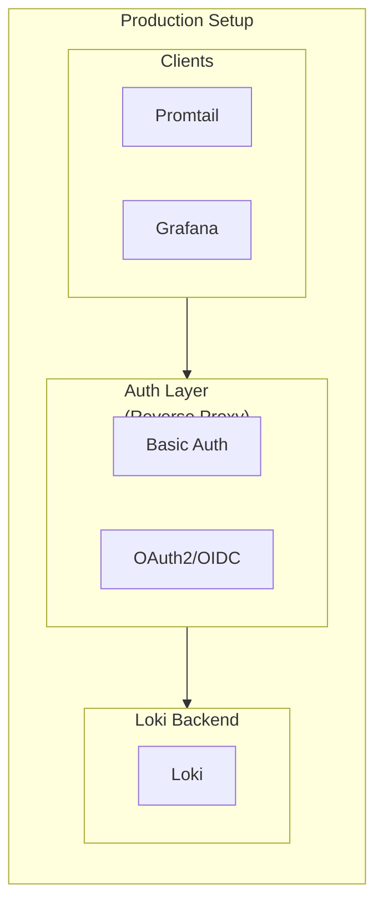

# How to Secure Loki with Authentication

Author: [nawazdhandala](https://www.github.com/nawazdhandala)

Tags: Grafana Loki, Security, Authentication, Basic Auth, OAuth, Reverse Proxy, NGINX

Description: A comprehensive guide to securing Grafana Loki with authentication mechanisms including basic auth, OAuth2, and reverse proxy configurations for production deployments.

---

Grafana Loki does not include built-in authentication by default, leaving your log data potentially exposed. In production environments, you must implement authentication to protect sensitive log data from unauthorized access. This guide covers various authentication methods including basic auth, OAuth2 proxy, and reverse proxy configurations.

## Prerequisites

Before starting, ensure you have:

- Grafana Loki 2.4 or later
- NGINX, Traefik, or similar reverse proxy
- Basic understanding of authentication concepts
- TLS certificates for secure communication

## Authentication Architecture



## Basic Authentication with NGINX

### NGINX Configuration

Create an NGINX configuration with basic authentication:

```nginx
# /etc/nginx/conf.d/loki.conf

upstream loki {
    server loki:3100;
    keepalive 32;
}

server {
    listen 443 ssl http2;
    server_name loki.example.com;

    # TLS Configuration
    ssl_certificate /etc/nginx/ssl/loki.crt;
    ssl_certificate_key /etc/nginx/ssl/loki.key;
    ssl_protocols TLSv1.2 TLSv1.3;
    ssl_ciphers ECDHE-ECDSA-AES128-GCM-SHA256:ECDHE-RSA-AES128-GCM-SHA256;
    ssl_prefer_server_ciphers off;

    # Basic Authentication
    auth_basic "Loki Authentication";
    auth_basic_user_file /etc/nginx/.htpasswd;

    # Logging
    access_log /var/log/nginx/loki_access.log;
    error_log /var/log/nginx/loki_error.log;

    # Push endpoint - for log ingestion
    location /loki/api/v1/push {
        auth_basic "Loki Push Authentication";
        auth_basic_user_file /etc/nginx/.htpasswd-push;

        proxy_pass http://loki;
        proxy_http_version 1.1;
        proxy_set_header Host $host;
        proxy_set_header X-Real-IP $remote_addr;
        proxy_set_header X-Forwarded-For $proxy_add_x_forwarded_for;
        proxy_set_header X-Forwarded-Proto $scheme;

        # Increase timeouts for large log batches
        proxy_connect_timeout 60s;
        proxy_send_timeout 60s;
        proxy_read_timeout 60s;

        # Increase body size for log batches
        client_max_body_size 10m;
    }

    # Query endpoints - for reading logs
    location /loki/api/v1 {
        proxy_pass http://loki;
        proxy_http_version 1.1;
        proxy_set_header Host $host;
        proxy_set_header X-Real-IP $remote_addr;
        proxy_set_header X-Forwarded-For $proxy_add_x_forwarded_for;
        proxy_set_header X-Forwarded-Proto $scheme;
        proxy_set_header Connection "";

        # WebSocket support for tail endpoint
        proxy_set_header Upgrade $http_upgrade;
        proxy_set_header Connection "upgrade";

        proxy_connect_timeout 60s;
        proxy_send_timeout 300s;
        proxy_read_timeout 300s;
    }

    # Health check - no auth required
    location /ready {
        auth_basic off;
        proxy_pass http://loki;
    }

    # Metrics - restricted access
    location /metrics {
        proxy_pass http://loki;
        allow 10.0.0.0/8;
        deny all;
    }
}
```

### Creating Password Files

```bash
# Install htpasswd utility
apt-get install apache2-utils

# Create password file for read access
htpasswd -c /etc/nginx/.htpasswd grafana
# Enter password when prompted

# Add additional users
htpasswd /etc/nginx/.htpasswd promtail-reader

# Create separate password file for push access
htpasswd -c /etc/nginx/.htpasswd-push promtail
htpasswd /etc/nginx/.htpasswd-push fluentbit

# Set proper permissions
chmod 640 /etc/nginx/.htpasswd*
chown root:nginx /etc/nginx/.htpasswd*
```

### Docker Compose with NGINX

```yaml
version: "3.8"

services:
  nginx:
    image: nginx:1.25
    container_name: nginx
    ports:
      - "443:443"
    volumes:
      - ./nginx.conf:/etc/nginx/conf.d/loki.conf:ro
      - ./ssl:/etc/nginx/ssl:ro
      - ./.htpasswd:/etc/nginx/.htpasswd:ro
      - ./.htpasswd-push:/etc/nginx/.htpasswd-push:ro
    networks:
      - loki-network
    depends_on:
      - loki

  loki:
    image: grafana/loki:2.9.4
    container_name: loki
    volumes:
      - ./loki-config.yaml:/etc/loki/config.yaml
      - loki-data:/loki
    command: -config.file=/etc/loki/config.yaml
    networks:
      - loki-network
    # Not exposing ports - access only through nginx

networks:
  loki-network:
    driver: bridge

volumes:
  loki-data:
```

## OAuth2 Proxy Authentication

### OAuth2 Proxy Setup

Use OAuth2 Proxy for integration with identity providers like Google, GitHub, or Okta:

```yaml
# docker-compose.yaml
version: "3.8"

services:
  oauth2-proxy:
    image: quay.io/oauth2-proxy/oauth2-proxy:v7.5.1
    container_name: oauth2-proxy
    ports:
      - "4180:4180"
    environment:
      - OAUTH2_PROXY_PROVIDER=google
      - OAUTH2_PROXY_CLIENT_ID=${GOOGLE_CLIENT_ID}
      - OAUTH2_PROXY_CLIENT_SECRET=${GOOGLE_CLIENT_SECRET}
      - OAUTH2_PROXY_COOKIE_SECRET=${COOKIE_SECRET}
      - OAUTH2_PROXY_EMAIL_DOMAINS=example.com
      - OAUTH2_PROXY_UPSTREAMS=http://loki:3100
      - OAUTH2_PROXY_HTTP_ADDRESS=0.0.0.0:4180
      - OAUTH2_PROXY_REDIRECT_URL=https://loki.example.com/oauth2/callback
      - OAUTH2_PROXY_COOKIE_SECURE=true
      - OAUTH2_PROXY_COOKIE_HTTPONLY=true
      - OAUTH2_PROXY_SKIP_PROVIDER_BUTTON=true
      - OAUTH2_PROXY_SET_XAUTHREQUEST=true
      - OAUTH2_PROXY_PASS_ACCESS_TOKEN=true
    networks:
      - loki-network
    depends_on:
      - loki

  loki:
    image: grafana/loki:2.9.4
    container_name: loki
    volumes:
      - ./loki-config.yaml:/etc/loki/config.yaml
      - loki-data:/loki
    command: -config.file=/etc/loki/config.yaml
    networks:
      - loki-network

networks:
  loki-network:
    driver: bridge

volumes:
  loki-data:
```

### OAuth2 Proxy with OIDC (Keycloak/Okta)

```yaml
environment:
  - OAUTH2_PROXY_PROVIDER=oidc
  - OAUTH2_PROXY_OIDC_ISSUER_URL=https://keycloak.example.com/realms/loki
  - OAUTH2_PROXY_CLIENT_ID=loki-client
  - OAUTH2_PROXY_CLIENT_SECRET=${OIDC_CLIENT_SECRET}
  - OAUTH2_PROXY_COOKIE_SECRET=${COOKIE_SECRET}
  - OAUTH2_PROXY_UPSTREAMS=http://loki:3100
  - OAUTH2_PROXY_HTTP_ADDRESS=0.0.0.0:4180
  - OAUTH2_PROXY_REDIRECT_URL=https://loki.example.com/oauth2/callback
  - OAUTH2_PROXY_COOKIE_SECURE=true
  - OAUTH2_PROXY_SKIP_PROVIDER_BUTTON=true
  - OAUTH2_PROXY_ALLOWED_GROUPS=loki-users,loki-admins
  - OAUTH2_PROXY_OIDC_GROUPS_CLAIM=groups
```

### NGINX with OAuth2 Proxy

```nginx
server {
    listen 443 ssl http2;
    server_name loki.example.com;

    ssl_certificate /etc/nginx/ssl/loki.crt;
    ssl_certificate_key /etc/nginx/ssl/loki.key;

    # OAuth2 Proxy authentication
    location /oauth2/ {
        proxy_pass http://oauth2-proxy:4180;
        proxy_set_header Host $host;
        proxy_set_header X-Real-IP $remote_addr;
        proxy_set_header X-Scheme $scheme;
        proxy_set_header X-Auth-Request-Redirect $request_uri;
    }

    location = /oauth2/auth {
        proxy_pass http://oauth2-proxy:4180;
        proxy_set_header Host $host;
        proxy_set_header X-Real-IP $remote_addr;
        proxy_set_header X-Scheme $scheme;
        proxy_set_header Content-Length "";
        proxy_pass_request_body off;
    }

    # Protected Loki endpoints
    location /loki/ {
        auth_request /oauth2/auth;
        error_page 401 = /oauth2/sign_in;

        # Pass user info to Loki
        auth_request_set $user $upstream_http_x_auth_request_user;
        auth_request_set $email $upstream_http_x_auth_request_email;
        proxy_set_header X-User $user;
        proxy_set_header X-Email $email;

        proxy_pass http://loki:3100;
        proxy_http_version 1.1;
        proxy_set_header Host $host;
        proxy_set_header Connection "";
    }

    # Push endpoint with API key authentication (for automated clients)
    location /loki/api/v1/push {
        # Use header-based authentication for programmatic access
        if ($http_x_api_key != "your-secure-api-key") {
            return 401;
        }

        proxy_pass http://loki:3100;
        proxy_http_version 1.1;
        proxy_set_header Host $host;
        client_max_body_size 10m;
    }
}
```

## API Key Authentication

### Implementing API Key Auth with NGINX

```nginx
# API key validation map
map $http_x_api_key $api_key_valid {
    default 0;
    "promtail-key-abc123" 1;
    "fluentbit-key-xyz789" 1;
    "grafana-key-def456" 1;
}

server {
    listen 443 ssl http2;
    server_name loki.example.com;

    ssl_certificate /etc/nginx/ssl/loki.crt;
    ssl_certificate_key /etc/nginx/ssl/loki.key;

    # API key authentication for all endpoints
    location /loki/api/ {
        if ($api_key_valid = 0) {
            return 401 '{"error": "Invalid API key"}';
        }

        proxy_pass http://loki:3100;
        proxy_http_version 1.1;
        proxy_set_header Host $host;
        proxy_set_header X-Real-IP $remote_addr;
    }

    # Health check without auth
    location /ready {
        proxy_pass http://loki:3100;
    }
}
```

### API Key Rotation Script

```bash
#!/bin/bash
# rotate-api-keys.sh

# Generate new API key
NEW_KEY=$(openssl rand -hex 32)

# Update NGINX map file
cat > /etc/nginx/conf.d/api-keys.conf << EOF
map \$http_x_api_key \$api_key_valid {
    default 0;
    "${NEW_KEY}" 1;
    # Keep old keys temporarily for rotation
    "${OLD_KEY}" 1;
}
EOF

# Reload NGINX
nginx -t && nginx -s reload

# Update clients (example: update Kubernetes secret)
kubectl create secret generic loki-api-key \
    --from-literal=api-key="${NEW_KEY}" \
    --dry-run=client -o yaml | kubectl apply -f -

echo "New API key: ${NEW_KEY}"
echo "Remember to update all clients and remove old key after rotation period"
```

## Configuring Clients with Authentication

### Promtail with Basic Auth

```yaml
# promtail-config.yaml
server:
  http_listen_port: 9080

positions:
  filename: /tmp/positions.yaml

clients:
  - url: https://loki.example.com/loki/api/v1/push
    basic_auth:
      username: promtail
      password: ${LOKI_PASSWORD}
    tls_config:
      ca_file: /etc/promtail/ca.crt
      # For self-signed certs (not recommended for production)
      # insecure_skip_verify: true

scrape_configs:
  - job_name: application
    static_configs:
      - targets:
          - localhost
        labels:
          job: application
          __path__: /var/log/app/*.log
```

### Promtail with API Key

```yaml
clients:
  - url: https://loki.example.com/loki/api/v1/push
    headers:
      X-API-Key: ${LOKI_API_KEY}
    tls_config:
      ca_file: /etc/promtail/ca.crt
```

### Grafana Data Source with Authentication

```yaml
# grafana-provisioning/datasources/loki.yaml
apiVersion: 1

datasources:
  - name: Loki
    type: loki
    access: proxy
    url: https://loki.example.com
    basicAuth: true
    basicAuthUser: grafana
    secureJsonData:
      basicAuthPassword: ${GRAFANA_LOKI_PASSWORD}
    jsonData:
      maxLines: 1000
      tlsAuth: false
      tlsAuthWithCACert: true
    secureJsonData:
      tlsCACert: |
        -----BEGIN CERTIFICATE-----
        ... CA certificate ...
        -----END CERTIFICATE-----
```

### Fluent Bit with Authentication

```ini
# fluent-bit.conf
[OUTPUT]
    Name        loki
    Match       *
    Host        loki.example.com
    Port        443
    TLS         On
    TLS.Verify  On
    TLS.CA_File /fluent-bit/ssl/ca.crt
    HTTP_User   fluentbit
    HTTP_Passwd ${LOKI_PASSWORD}
    Labels      job=fluentbit
```

## Multi-Tenant Authentication

### NGINX Multi-Tenant Configuration

```nginx
# Map API key to tenant
map $http_x_api_key $tenant_id {
    default "";
    "tenant1-key-abc123" "tenant1";
    "tenant2-key-xyz789" "tenant2";
    "admin-key-admin123" "admin";
}

server {
    listen 443 ssl http2;
    server_name loki.example.com;

    ssl_certificate /etc/nginx/ssl/loki.crt;
    ssl_certificate_key /etc/nginx/ssl/loki.key;

    location /loki/api/ {
        # Validate API key and tenant
        if ($tenant_id = "") {
            return 401 '{"error": "Invalid API key"}';
        }

        # Set tenant header for Loki
        proxy_set_header X-Scope-OrgID $tenant_id;

        proxy_pass http://loki:3100;
        proxy_http_version 1.1;
        proxy_set_header Host $host;
    }
}
```

### Loki Multi-Tenant Configuration

```yaml
# loki-config.yaml
auth_enabled: true

server:
  http_listen_port: 3100

# ... other configuration

limits_config:
  enforce_metric_name: false
  reject_old_samples: true
  reject_old_samples_max_age: 168h
  # Per-tenant limits
  per_tenant_override_config: /etc/loki/overrides.yaml
```

## Security Best Practices

### 1. Use Strong Passwords

```bash
# Generate strong passwords
openssl rand -base64 32
```

### 2. Rotate Credentials Regularly

```bash
# Create new credentials
htpasswd /etc/nginx/.htpasswd-new promtail

# Atomic swap
mv /etc/nginx/.htpasswd-new /etc/nginx/.htpasswd

# Reload NGINX
nginx -s reload
```

### 3. Audit Authentication Attempts

```nginx
# Enhanced logging
log_format auth_log '$remote_addr - $remote_user [$time_local] '
                    '"$request" $status $body_bytes_sent '
                    '"$http_referer" "$http_user_agent" '
                    'auth_status=$upstream_http_x_auth_status';

access_log /var/log/nginx/loki_auth.log auth_log;
```

### 4. Rate Limiting

```nginx
# Rate limiting zone
limit_req_zone $binary_remote_addr zone=loki_limit:10m rate=10r/s;

location /loki/api/v1/push {
    limit_req zone=loki_limit burst=20 nodelay;
    # ... other configuration
}
```

### 5. IP Whitelisting

```nginx
location /loki/api/ {
    # Allow only specific networks
    allow 10.0.0.0/8;
    allow 192.168.0.0/16;
    deny all;

    # Plus authentication
    auth_basic "Loki Authentication";
    auth_basic_user_file /etc/nginx/.htpasswd;

    proxy_pass http://loki:3100;
}
```

## Troubleshooting

### Test Authentication

```bash
# Test basic auth
curl -u username:password https://loki.example.com/ready

# Test API key
curl -H "X-API-Key: your-api-key" https://loki.example.com/loki/api/v1/labels

# Test with verbose output
curl -v -u username:password https://loki.example.com/loki/api/v1/labels
```

### Common Issues

**401 Unauthorized:**
```bash
# Check password file permissions
ls -la /etc/nginx/.htpasswd

# Verify password is correct
htpasswd -v /etc/nginx/.htpasswd username
```

**Connection refused:**
```bash
# Check NGINX is running
systemctl status nginx

# Check NGINX can reach Loki
docker exec nginx wget -q -O- http://loki:3100/ready
```

## Conclusion

Securing Loki with authentication is essential for production deployments. By implementing basic auth, OAuth2, or API key authentication through a reverse proxy, you can protect your log data from unauthorized access while enabling secure access for authorized users and automated systems.

Key takeaways:
- Use a reverse proxy (NGINX, Traefik) for authentication
- Implement basic auth for simple setups
- Use OAuth2 Proxy for SSO integration
- Separate read and write authentication when needed
- Enable TLS for all connections
- Implement rate limiting and IP whitelisting
- Audit authentication attempts
- Rotate credentials regularly
