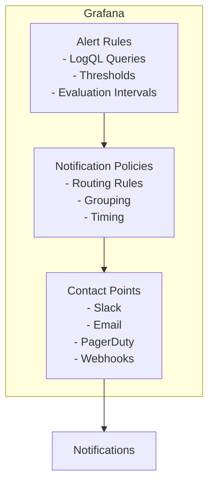

# How to Create Log-Based Alerts in Grafana

Author: [nawazdhandala](https://www.github.com/nawazdhandala)

Tags: Grafana, Loki, Alerting, LogQL, Observability, Monitoring, Notifications

Description: A comprehensive guide to creating log-based alerts in Grafana using Loki data sources, covering alert rules, contact points, notification policies, and best practices for effective log monitoring.

---

Grafana Alerting allows you to create alerts directly from Loki log queries, enabling proactive monitoring of your applications without relying solely on metric-based alerts. By setting up log-based alerts, you can detect issues like error spikes, security events, or missing expected log patterns. This guide covers everything you need to know about creating effective log-based alerts in Grafana.

## Prerequisites

Before starting, ensure you have:

- Grafana 9.0 or later with Unified Alerting enabled
- Grafana Loki configured as a data source
- Understanding of LogQL queries
- Contact points configured for notifications

## Architecture Overview



## Enabling Grafana Unified Alerting

Ensure unified alerting is enabled in your Grafana configuration:

```ini
# grafana.ini
[unified_alerting]
enabled = true

[alerting]
enabled = false
```

Or via environment variable:

```yaml
# docker-compose.yaml
environment:
  - GF_UNIFIED_ALERTING_ENABLED=true
  - GF_ALERTING_ENABLED=false
```

## Creating Contact Points

### Slack Contact Point

1. Navigate to Alerting > Contact points
2. Click "New contact point"
3. Configure Slack integration:

```yaml
Name: slack-alerts
Type: Slack
Webhook URL: https://hooks.slack.com/services/YOUR/WEBHOOK/URL
Channel: #alerts
Title: |
  {{ if eq .Status "firing" }}:rotating_light:{{ else }}:white_check_mark:{{ end }} {{ .CommonLabels.alertname }}
Text: |
  {{ range .Alerts }}
  *Status:* {{ .Status }}
  *Summary:* {{ .Annotations.summary }}
  *Description:* {{ .Annotations.description }}
  *Service:* {{ .Labels.service }}
  {{ end }}
```

### Email Contact Point

```yaml
Name: email-alerts
Type: Email
Addresses: oncall@example.com, alerts@example.com
Subject: |
  [{{ .Status | toUpper }}] {{ .CommonLabels.alertname }}
Message: |
  {{ range .Alerts }}
  Alert: {{ .Labels.alertname }}
  Status: {{ .Status }}
  Summary: {{ .Annotations.summary }}
  Description: {{ .Annotations.description }}
  Started: {{ .StartsAt }}
  {{ end }}
```

### PagerDuty Contact Point

```yaml
Name: pagerduty-critical
Type: PagerDuty
Integration Key: YOUR_PAGERDUTY_INTEGRATION_KEY
Severity: critical
Class: log-alert
Component: |
  {{ .CommonLabels.service }}
Group: |
  {{ .CommonLabels.alertname }}
```

## Creating Alert Rules

### Basic Error Count Alert

Navigate to Alerting > Alert rules > New alert rule:

**Step 1: Define query and alert condition**

```yaml
Query A (Loki):
  Expression: sum(count_over_time({job="application"} |= "error" [5m]))
  Legend: errors

Condition:
  Expression: A
  Threshold: IS ABOVE 10
```

**Step 2: Set evaluation behavior**

```yaml
Folder: Application Alerts
Evaluation Group: error-alerts
Evaluation Interval: 1m
For: 5m
```

**Step 3: Add details**

```yaml
Alert Name: HighErrorCount
Summary: High error count detected
Description: More than 10 errors in the last 5 minutes
Runbook URL: https://wiki.example.com/runbooks/high-errors
```

### Error Rate Alert

```yaml
Query A (Loki):
  Expression: |
    sum(rate({job="application"} |= "error" [5m]))
    /
    sum(rate({job="application"} [5m]))

Condition:
  Expression: A
  Threshold: IS ABOVE 0.05

Alert Name: HighErrorRate
Summary: Error rate exceeds 5%
Description: |
  Error rate is {{ $value | printf "%.2f" }}% which exceeds the 5% threshold.
Labels:
  severity: critical
  team: platform
```

### Critical Log Pattern Alert

```yaml
Query A (Loki):
  Expression: |
    count_over_time({job="application"} |~ "(?i)(fatal|critical|panic)" [5m])

Condition:
  Expression: A
  Threshold: IS ABOVE 0

For: 0m  # Alert immediately

Alert Name: CriticalLogDetected
Summary: Critical error logged
Description: A FATAL, CRITICAL, or PANIC level log entry was detected
Labels:
  severity: critical
```

### No Logs Alert (Absence Detection)

```yaml
Query A (Loki):
  Expression: |
    absent_over_time({service="payment-service"} [10m])

Condition:
  Expression: A
  Threshold: IS ABOVE 0

For: 10m

Alert Name: NoLogsFromPaymentService
Summary: Payment service not logging
Description: No logs received from payment-service for 10 minutes
Labels:
  severity: warning
  service: payment-service
```

### Security Alert

```yaml
Query A (Loki):
  Expression: |
    sum by (source_ip) (
      count_over_time({job="auth-service"} |= "authentication failed" | json | source_ip!="" [5m])
    )

Condition:
  Expression: A
  Threshold: IS ABOVE 20

Alert Name: BruteForceAttempt
Summary: Possible brute force attack from {{ $labels.source_ip }}
Description: More than 20 failed authentication attempts from a single IP in 5 minutes
Labels:
  severity: critical
  category: security
```

### Latency Alert from Logs

```yaml
Query A (Loki):
  Expression: |
    quantile_over_time(0.95,
      {job="application"}
      | json
      | unwrap duration [5m]
    ) by (service)

Condition:
  Expression: A
  Threshold: IS ABOVE 5

Alert Name: HighLatency
Summary: P95 latency exceeds 5 seconds for {{ $labels.service }}
Description: The 95th percentile latency is {{ $value }}s, exceeding the 5s threshold
Labels:
  severity: warning
```

## Creating Alert Rules via Provisioning

### Alert Rules Provisioning File

Create `grafana-provisioning/alerting/alert-rules.yaml`:

```yaml
apiVersion: 1

groups:
  - orgId: 1
    name: Application Errors
    folder: Application Alerts
    interval: 1m
    rules:
      - uid: error-rate-alert
        title: High Error Rate
        condition: C
        data:
          - refId: A
            relativeTimeRange:
              from: 300
              to: 0
            datasourceUid: loki-datasource
            model:
              expr: sum(rate({job="application"} |= "error" [5m]))
              queryType: range
          - refId: B
            relativeTimeRange:
              from: 300
              to: 0
            datasourceUid: loki-datasource
            model:
              expr: sum(rate({job="application"} [5m]))
              queryType: range
          - refId: C
            datasourceUid: __expr__
            model:
              type: math
              expression: $A / $B
        noDataState: NoData
        execErrState: Alerting
        for: 5m
        annotations:
          summary: Error rate is {{ $value | printf "%.2f" }}%
          description: The error rate has exceeded the 5% threshold
          runbook_url: https://wiki.example.com/runbooks/error-rate
        labels:
          severity: critical
          team: platform

      - uid: critical-error-alert
        title: Critical Error Logged
        condition: A
        data:
          - refId: A
            relativeTimeRange:
              from: 300
              to: 0
            datasourceUid: loki-datasource
            model:
              expr: count_over_time({job="application"} |~ "CRITICAL|FATAL" [5m])
              queryType: instant
        noDataState: OK
        execErrState: Alerting
        for: 0m
        annotations:
          summary: Critical error detected in application logs
          description: A CRITICAL or FATAL error was logged
        labels:
          severity: critical

  - orgId: 1
    name: Security Alerts
    folder: Security
    interval: 30s
    rules:
      - uid: auth-failure-spike
        title: Authentication Failure Spike
        condition: A
        data:
          - refId: A
            relativeTimeRange:
              from: 300
              to: 0
            datasourceUid: loki-datasource
            model:
              expr: sum(count_over_time({job="auth-service"} |= "authentication failed" [5m]))
              queryType: instant
        noDataState: OK
        execErrState: Alerting
        for: 2m
        annotations:
          summary: Authentication failures spiking
          description: "{{ $value }} authentication failures in the last 5 minutes"
        labels:
          severity: warning
          category: security
```

### Contact Points Provisioning

Create `grafana-provisioning/alerting/contact-points.yaml`:

```yaml
apiVersion: 1

contactPoints:
  - orgId: 1
    name: slack-notifications
    receivers:
      - uid: slack-receiver
        type: slack
        settings:
          url: ${SLACK_WEBHOOK_URL}
          recipient: "#alerts"
          title: |
            {{ if eq .Status "firing" }}[FIRING]{{ else }}[RESOLVED]{{ end }} {{ .CommonLabels.alertname }}
          text: |
            {{ range .Alerts }}
            *Summary:* {{ .Annotations.summary }}
            *Description:* {{ .Annotations.description }}
            *Severity:* {{ .Labels.severity }}
            {{ if .Labels.service }}*Service:* {{ .Labels.service }}{{ end }}
            {{ end }}
        disableResolveMessage: false

  - orgId: 1
    name: pagerduty-critical
    receivers:
      - uid: pagerduty-receiver
        type: pagerduty
        settings:
          integrationKey: ${PAGERDUTY_KEY}
          severity: critical
        disableResolveMessage: false
```

### Notification Policies Provisioning

Create `grafana-provisioning/alerting/notification-policies.yaml`:

```yaml
apiVersion: 1

policies:
  - orgId: 1
    receiver: slack-notifications
    group_by:
      - alertname
      - severity
    group_wait: 30s
    group_interval: 5m
    repeat_interval: 4h
    routes:
      - receiver: pagerduty-critical
        matchers:
          - severity = critical
        group_wait: 10s
        continue: true

      - receiver: slack-notifications
        matchers:
          - severity =~ warning|info
        repeat_interval: 8h
```

## Advanced Alert Patterns

### Multi-Condition Alert

Create an alert that requires multiple conditions:

```yaml
Query A - Error Count:
  Expression: sum(count_over_time({job="application"} |= "error" [5m]))

Query B - Total Logs:
  Expression: sum(count_over_time({job="application"} [5m]))

Query C - Math Expression:
  Expression: $A / $B * 100
  Type: Math

Query D - Threshold:
  Expression: $C
  Type: Threshold
  Conditions: IS ABOVE 5

AND

Query E - Minimum Volume:
  Expression: $B
  Type: Threshold
  Conditions: IS ABOVE 100
```

### Time-Based Alert Conditions

Alert only during business hours:

```yaml
Query A:
  Expression: sum(count_over_time({job="application"} |= "error" [5m]))

# In notification policy, use time intervals
Notification Policy:
  Time Intervals:
    - name: business-hours
      time_intervals:
        - weekdays: ['monday:friday']
          times:
            - start_time: '09:00'
              end_time: '18:00'
          location: 'America/New_York'
```

### Comparison with Previous Period

```yaml
Query A - Current Period:
  Expression: sum(count_over_time({job="application"} |= "error" [1h]))

Query B - Previous Period:
  Expression: sum(count_over_time({job="application"} |= "error" [1h] offset 1d))

Query C - Comparison:
  Expression: ($A - $B) / $B * 100
  Type: Math

Condition:
  Expression: C
  Threshold: IS ABOVE 50  # Alert if errors increased by 50%
```

## Testing Alerts

### Generate Test Logs

```bash
# Push test error logs to Loki
for i in {1..20}; do
  curl -X POST "http://localhost:3100/loki/api/v1/push" \
    -H "Content-Type: application/json" \
    -d '{
      "streams": [{
        "stream": {"job": "application", "level": "error"},
        "values": [["'"$(date +%s)"'000000000", "error: test error message '$i'"]]
      }]
    }'
  sleep 1
done
```

### Test Alert Rule in Grafana

1. Navigate to Alerting > Alert rules
2. Find your alert rule
3. Click "View" to open the rule
4. Click "Show state history" to see evaluation results
5. Use "Test rule" button to evaluate immediately

### Verify Notifications

1. Create a test contact point
2. Click "Test" on the contact point
3. Verify notification is received
4. Check Alerting > Notifications for delivery status

## Silencing and Muting

### Create a Silence

```yaml
# Via UI: Alerting > Silences > New silence
Matchers:
  - alertname = HighErrorRate
  - service = payment-service

Duration: 2h
Comment: Scheduled maintenance window
```

### Mute Timing

```yaml
# grafana-provisioning/alerting/mute-timings.yaml
apiVersion: 1

muteTimes:
  - orgId: 1
    name: maintenance-window
    time_intervals:
      - weekdays: ['saturday', 'sunday']
        times:
          - start_time: '02:00'
            end_time: '06:00'
```

## Monitoring Alert Health

### Key Metrics

Check Grafana's internal metrics for alerting health:

```promql
# Alert evaluation duration
grafana_alerting_rule_evaluation_duration_seconds

# Alert evaluation failures
grafana_alerting_rule_evaluation_failures_total

# Notifications sent
grafana_alerting_notifications_sent_total

# Notification failures
grafana_alerting_notifications_failed_total
```

## Best Practices

1. **Start with High-Impact Alerts**: Focus on critical errors and security events first

2. **Set Appropriate Thresholds**: Base thresholds on historical data and SLOs

3. **Use For Duration**: Avoid alert flapping with appropriate `for` duration

4. **Include Context**: Add runbook URLs, dashboard links, and clear descriptions

5. **Group Related Alerts**: Use notification policies to reduce noise

6. **Test Regularly**: Periodically verify alerts fire and notifications deliver

7. **Document Alerts**: Maintain runbooks for each alert type

8. **Review and Tune**: Regularly review alert frequency and adjust thresholds

## Troubleshooting

### Alert Not Firing

1. Check query returns data in Explore
2. Verify evaluation interval and `for` duration
3. Check alert state history for evaluation errors
4. Ensure data source is accessible

### Notifications Not Received

1. Test contact point directly
2. Check notification policy routing
3. Verify no active silences
4. Check Grafana logs for delivery errors

## Conclusion

Log-based alerts in Grafana provide a powerful complement to metric-based alerting. By creating well-designed alert rules with appropriate thresholds and notification policies, you can proactively detect issues in your applications and respond quickly. The combination of Grafana's unified alerting with Loki's log aggregation creates a comprehensive monitoring solution.

Key takeaways:
- Use LogQL metric queries for alertable conditions
- Configure appropriate evaluation intervals and `for` duration
- Set up contact points for multiple notification channels
- Use notification policies for intelligent routing
- Provision alerts as code for version control
- Test alerts regularly to ensure they work
- Follow best practices to minimize alert fatigue
