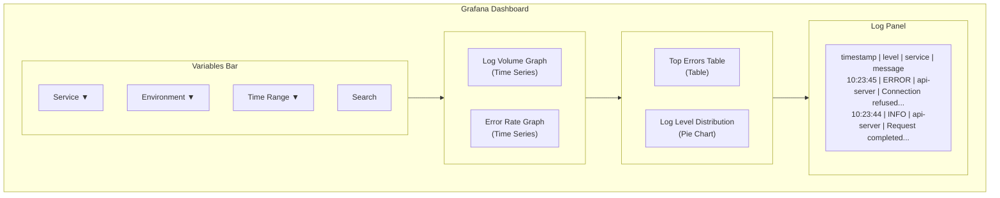

# How to Build Log Dashboards in Grafana with Loki

Author: [nawazdhandala](https://www.github.com/nawazdhandala)

Tags: Grafana Loki, Grafana Dashboards, Log Visualization, LogQL, Observability, Monitoring

Description: A comprehensive guide to building effective log dashboards in Grafana using Loki, covering panel types, variables, annotations, and best practices for log visualization and analysis.

---

Grafana dashboards transform raw log data from Loki into actionable insights. By combining log panels with metric visualizations derived from LogQL queries, you can create comprehensive dashboards that help teams understand system behavior, identify issues, and track trends. This guide walks you through building effective log dashboards.

## Prerequisites

Before starting, ensure you have:

- Grafana 9.0 or later
- Grafana Loki 2.4 or later configured as a data source
- Logs flowing into Loki with proper labels
- Basic understanding of LogQL queries

## Dashboard Architecture



## Creating Your First Log Dashboard

### Basic Dashboard Structure

Start by creating a new dashboard in Grafana:

1. Click "Dashboards" in the sidebar
2. Click "New" and select "New Dashboard"
3. Click "Add visualization"

### Log Panel Configuration

Create a basic log panel:

```json
{
  "type": "logs",
  "title": "Application Logs",
  "datasource": {
    "type": "loki",
    "uid": "loki-datasource"
  },
  "targets": [
    {
      "expr": "{job=\"application\"}",
      "refId": "A"
    }
  ],
  "options": {
    "showLabels": true,
    "showTime": true,
    "showCommonLabels": false,
    "wrapLogMessage": true,
    "prettifyLogMessage": false,
    "enableLogDetails": true,
    "dedupStrategy": "none",
    "sortOrder": "Descending"
  }
}
```

## Configuring Dashboard Variables

### Service Variable

Create a variable to filter by service:

```json
{
  "name": "service",
  "type": "query",
  "datasource": {
    "type": "loki",
    "uid": "loki-datasource"
  },
  "query": "label_values(service)",
  "multi": true,
  "includeAll": true,
  "allValue": ".+"
}
```

### Environment Variable

```json
{
  "name": "environment",
  "type": "query",
  "datasource": {
    "type": "loki",
    "uid": "loki-datasource"
  },
  "query": "label_values({service=~\"$service\"}, environment)",
  "multi": false,
  "includeAll": true
}
```

### Log Level Variable

```json
{
  "name": "level",
  "type": "custom",
  "options": [
    {"text": "All", "value": ".*"},
    {"text": "Error", "value": "error"},
    {"text": "Warning", "value": "warn"},
    {"text": "Info", "value": "info"},
    {"text": "Debug", "value": "debug"}
  ],
  "multi": false,
  "includeAll": false
}
```

### Search Variable

```json
{
  "name": "search",
  "type": "textbox",
  "label": "Search",
  "description": "Filter logs containing this text"
}
```

## Log Visualization Panels

### Filtered Log Panel with Variables

```json
{
  "type": "logs",
  "title": "Filtered Logs",
  "targets": [
    {
      "expr": "{service=~\"$service\", environment=~\"$environment\"} | json | level=~\"$level\" |= \"$search\"",
      "refId": "A"
    }
  ],
  "options": {
    "showLabels": true,
    "showTime": true,
    "enableLogDetails": true,
    "dedupStrategy": "signature",
    "sortOrder": "Descending"
  },
  "fieldConfig": {
    "defaults": {
      "custom": {
        "displayMode": "color-text"
      }
    }
  }
}
```

### Log Volume Time Series

```json
{
  "type": "timeseries",
  "title": "Log Volume",
  "targets": [
    {
      "expr": "sum by (service) (rate({service=~\"$service\", environment=~\"$environment\"} [1m]))",
      "legendFormat": "{{service}}",
      "refId": "A"
    }
  ],
  "fieldConfig": {
    "defaults": {
      "unit": "logs/s",
      "custom": {
        "drawStyle": "line",
        "lineWidth": 2,
        "fillOpacity": 20,
        "gradientMode": "opacity"
      }
    }
  }
}
```

### Error Rate Panel

```json
{
  "type": "timeseries",
  "title": "Error Rate",
  "targets": [
    {
      "expr": "sum by (service) (rate({service=~\"$service\", environment=~\"$environment\"} | json | level=\"error\" [$__interval]))",
      "legendFormat": "{{service}} errors",
      "refId": "A"
    }
  ],
  "fieldConfig": {
    "defaults": {
      "unit": "errors/s",
      "color": {
        "mode": "palette-classic"
      },
      "custom": {
        "drawStyle": "bars",
        "fillOpacity": 80
      }
    },
    "overrides": [
      {
        "matcher": {
          "id": "byFrameRefID",
          "options": "A"
        },
        "properties": [
          {
            "id": "color",
            "value": {
              "fixedColor": "red",
              "mode": "fixed"
            }
          }
        ]
      }
    ]
  }
}
```

## Table Visualizations

### Top Errors Table

```json
{
  "type": "table",
  "title": "Top Errors",
  "targets": [
    {
      "expr": "topk(10, sum by (error_type, service) (count_over_time({service=~\"$service\"} | json | level=\"error\" [$__range])))",
      "instant": true,
      "refId": "A"
    }
  ],
  "transformations": [
    {
      "id": "labelsToFields",
      "options": {
        "mode": "columns"
      }
    },
    {
      "id": "organize",
      "options": {
        "renameByName": {
          "Value": "Count",
          "error_type": "Error Type",
          "service": "Service"
        }
      }
    },
    {
      "id": "sortBy",
      "options": {
        "fields": {},
        "sort": [
          {
            "field": "Count",
            "desc": true
          }
        ]
      }
    }
  ],
  "fieldConfig": {
    "overrides": [
      {
        "matcher": {
          "id": "byName",
          "options": "Count"
        },
        "properties": [
          {
            "id": "custom.cellOptions",
            "value": {
              "type": "color-background",
              "mode": "gradient"
            }
          },
          {
            "id": "color",
            "value": {
              "mode": "continuous-RdYlGr",
              "steps": []
            }
          }
        ]
      }
    ]
  }
}
```

### Log Statistics Table

```json
{
  "type": "table",
  "title": "Service Log Statistics",
  "targets": [
    {
      "expr": "sum by (service) (count_over_time({service=~\"$service\"} [$__range]))",
      "instant": true,
      "legendFormat": "total",
      "refId": "total"
    },
    {
      "expr": "sum by (service) (count_over_time({service=~\"$service\"} | json | level=\"error\" [$__range]))",
      "instant": true,
      "legendFormat": "errors",
      "refId": "errors"
    },
    {
      "expr": "sum by (service) (count_over_time({service=~\"$service\"} | json | level=\"warn\" [$__range]))",
      "instant": true,
      "legendFormat": "warnings",
      "refId": "warnings"
    }
  ],
  "transformations": [
    {
      "id": "merge"
    },
    {
      "id": "organize",
      "options": {
        "renameByName": {
          "Value #total": "Total Logs",
          "Value #errors": "Errors",
          "Value #warnings": "Warnings"
        }
      }
    }
  ]
}
```

## Chart Visualizations

### Log Level Distribution Pie Chart

```json
{
  "type": "piechart",
  "title": "Log Level Distribution",
  "targets": [
    {
      "expr": "sum by (level) (count_over_time({service=~\"$service\"} | json | level=~\".+\" [$__range]))",
      "instant": true,
      "legendFormat": "{{level}}",
      "refId": "A"
    }
  ],
  "options": {
    "legend": {
      "displayMode": "table",
      "placement": "right",
      "showLegend": true,
      "values": ["value", "percent"]
    },
    "pieType": "pie",
    "tooltip": {
      "mode": "single"
    }
  },
  "fieldConfig": {
    "overrides": [
      {
        "matcher": {"id": "byName", "options": "error"},
        "properties": [{"id": "color", "value": {"fixedColor": "red", "mode": "fixed"}}]
      },
      {
        "matcher": {"id": "byName", "options": "warn"},
        "properties": [{"id": "color", "value": {"fixedColor": "yellow", "mode": "fixed"}}]
      },
      {
        "matcher": {"id": "byName", "options": "info"},
        "properties": [{"id": "color", "value": {"fixedColor": "green", "mode": "fixed"}}]
      },
      {
        "matcher": {"id": "byName", "options": "debug"},
        "properties": [{"id": "color", "value": {"fixedColor": "blue", "mode": "fixed"}}]
      }
    ]
  }
}
```

### Logs by Service Bar Chart

```json
{
  "type": "barchart",
  "title": "Logs by Service",
  "targets": [
    {
      "expr": "sum by (service) (count_over_time({service=~\"$service\"} [$__range]))",
      "instant": true,
      "legendFormat": "{{service}}",
      "refId": "A"
    }
  ],
  "options": {
    "orientation": "horizontal",
    "barWidth": 0.8,
    "legend": {
      "displayMode": "hidden"
    },
    "tooltip": {
      "mode": "single"
    },
    "xTickLabelRotation": 0,
    "showValue": "auto"
  }
}
```

## Stat Panels

### Total Logs Stat

```json
{
  "type": "stat",
  "title": "Total Logs",
  "targets": [
    {
      "expr": "sum(count_over_time({service=~\"$service\"} [$__range]))",
      "instant": true,
      "refId": "A"
    }
  ],
  "options": {
    "reduceOptions": {
      "calcs": ["lastNotNull"],
      "fields": "",
      "values": false
    },
    "orientation": "auto",
    "textMode": "auto",
    "colorMode": "value",
    "graphMode": "none"
  },
  "fieldConfig": {
    "defaults": {
      "unit": "short",
      "thresholds": {
        "mode": "absolute",
        "steps": [
          {"color": "green", "value": null}
        ]
      }
    }
  }
}
```

### Error Count Stat

```json
{
  "type": "stat",
  "title": "Errors",
  "targets": [
    {
      "expr": "sum(count_over_time({service=~\"$service\"} | json | level=\"error\" [$__range]))",
      "instant": true,
      "refId": "A"
    }
  ],
  "options": {
    "reduceOptions": {
      "calcs": ["lastNotNull"]
    },
    "colorMode": "background",
    "graphMode": "area"
  },
  "fieldConfig": {
    "defaults": {
      "thresholds": {
        "mode": "absolute",
        "steps": [
          {"color": "green", "value": null},
          {"color": "yellow", "value": 10},
          {"color": "red", "value": 100}
        ]
      }
    }
  }
}
```

## Adding Annotations

### Error Event Annotations

```json
{
  "annotations": {
    "list": [
      {
        "datasource": {
          "type": "loki",
          "uid": "loki-datasource"
        },
        "enable": true,
        "expr": "{service=~\"$service\"} | json | level=\"error\" | line_format \"{{.error_type}}: {{.message}}\"",
        "iconColor": "red",
        "name": "Errors",
        "tagKeys": "service,error_type",
        "textFormat": "{{message}}",
        "titleFormat": "Error in {{service}}"
      }
    ]
  }
}
```

### Deployment Annotations

```json
{
  "annotations": {
    "list": [
      {
        "datasource": {
          "type": "loki",
          "uid": "loki-datasource"
        },
        "enable": true,
        "expr": "{job=\"deployments\"} |= \"deployed\"",
        "iconColor": "blue",
        "name": "Deployments",
        "titleFormat": "Deployment",
        "textFormat": "{{message}}"
      }
    ]
  }
}
```

## Complete Dashboard JSON

Here is a complete dashboard example:

```json
{
  "dashboard": {
    "title": "Application Logs Dashboard",
    "uid": "app-logs-dashboard",
    "tags": ["loki", "logs", "application"],
    "timezone": "browser",
    "refresh": "30s",
    "templating": {
      "list": [
        {
          "name": "service",
          "type": "query",
          "datasource": {"type": "loki", "uid": "loki-datasource"},
          "query": "label_values(service)",
          "multi": true,
          "includeAll": true,
          "allValue": ".+"
        },
        {
          "name": "environment",
          "type": "query",
          "datasource": {"type": "loki", "uid": "loki-datasource"},
          "query": "label_values({service=~\"$service\"}, environment)",
          "multi": false,
          "includeAll": true
        },
        {
          "name": "level",
          "type": "custom",
          "options": [
            {"text": "All", "value": ".*", "selected": true},
            {"text": "Error", "value": "error"},
            {"text": "Warning", "value": "warn"},
            {"text": "Info", "value": "info"}
          ]
        },
        {
          "name": "search",
          "type": "textbox",
          "label": "Search"
        }
      ]
    },
    "panels": [
      {
        "id": 1,
        "type": "stat",
        "title": "Total Logs",
        "gridPos": {"x": 0, "y": 0, "w": 4, "h": 4},
        "targets": [
          {
            "expr": "sum(count_over_time({service=~\"$service\", environment=~\"$environment\"} [$__range]))",
            "instant": true
          }
        ],
        "fieldConfig": {"defaults": {"unit": "short"}}
      },
      {
        "id": 2,
        "type": "stat",
        "title": "Error Count",
        "gridPos": {"x": 4, "y": 0, "w": 4, "h": 4},
        "targets": [
          {
            "expr": "sum(count_over_time({service=~\"$service\", environment=~\"$environment\"} | json | level=\"error\" [$__range]))",
            "instant": true
          }
        ],
        "fieldConfig": {
          "defaults": {
            "thresholds": {
              "steps": [
                {"color": "green", "value": null},
                {"color": "red", "value": 1}
              ]
            }
          }
        }
      },
      {
        "id": 3,
        "type": "timeseries",
        "title": "Log Volume Over Time",
        "gridPos": {"x": 8, "y": 0, "w": 16, "h": 8},
        "targets": [
          {
            "expr": "sum by (service) (rate({service=~\"$service\", environment=~\"$environment\"} [$__interval]))",
            "legendFormat": "{{service}}"
          }
        ],
        "fieldConfig": {"defaults": {"unit": "logs/s"}}
      },
      {
        "id": 4,
        "type": "piechart",
        "title": "Log Level Distribution",
        "gridPos": {"x": 0, "y": 4, "w": 8, "h": 8},
        "targets": [
          {
            "expr": "sum by (level) (count_over_time({service=~\"$service\", environment=~\"$environment\"} | json | level=~\".+\" [$__range]))",
            "instant": true,
            "legendFormat": "{{level}}"
          }
        ]
      },
      {
        "id": 5,
        "type": "table",
        "title": "Top Errors",
        "gridPos": {"x": 0, "y": 12, "w": 12, "h": 8},
        "targets": [
          {
            "expr": "topk(10, sum by (error_message) (count_over_time({service=~\"$service\", environment=~\"$environment\"} | json | level=\"error\" [$__range])))",
            "instant": true
          }
        ]
      },
      {
        "id": 6,
        "type": "timeseries",
        "title": "Error Rate by Service",
        "gridPos": {"x": 12, "y": 12, "w": 12, "h": 8},
        "targets": [
          {
            "expr": "sum by (service) (rate({service=~\"$service\", environment=~\"$environment\"} | json | level=\"error\" [$__interval]))",
            "legendFormat": "{{service}}"
          }
        ],
        "fieldConfig": {
          "defaults": {
            "unit": "errors/s",
            "custom": {"drawStyle": "bars", "fillOpacity": 80}
          }
        }
      },
      {
        "id": 7,
        "type": "logs",
        "title": "Logs",
        "gridPos": {"x": 0, "y": 20, "w": 24, "h": 12},
        "targets": [
          {
            "expr": "{service=~\"$service\", environment=~\"$environment\"} | json | level=~\"$level\" |= \"$search\""
          }
        ],
        "options": {
          "showLabels": true,
          "showTime": true,
          "wrapLogMessage": true,
          "enableLogDetails": true,
          "sortOrder": "Descending"
        }
      }
    ]
  }
}
```

## Dashboard Best Practices

### 1. Use Consistent Time Ranges

Ensure all panels use the same time range variables:

```
[$__range]    - For aggregations over dashboard time range
[$__interval] - For rate calculations (auto-adjusts based on resolution)
[5m]          - For fixed-window calculations
```

### 2. Optimize Query Performance

- Use label matchers to narrow down results
- Avoid using regex when exact matches work
- Limit the number of log lines displayed

```logql
# Good - uses label matcher
{service="api-server"} |= "error"

# Less efficient - parses all logs first
{job="application"} | json | service="api-server" | level="error"
```

### 3. Color Coding

Use consistent colors across panels:

- Red: Errors, critical issues
- Yellow/Orange: Warnings
- Green: Success, info
- Blue: Debug, neutral information

### 4. Provide Context

Include links to related dashboards and documentation:

```json
{
  "links": [
    {
      "title": "Service Metrics",
      "url": "/d/service-metrics?var-service=${service}",
      "type": "link"
    },
    {
      "title": "Runbooks",
      "url": "https://wiki.example.com/runbooks",
      "type": "link"
    }
  ]
}
```

## Conclusion

Building effective log dashboards in Grafana with Loki requires thoughtful design that balances visibility with performance. By combining log panels with metric visualizations derived from LogQL queries, you can create dashboards that provide immediate insight into system behavior and help teams quickly identify and resolve issues.

Key takeaways:
- Use dashboard variables for flexible filtering
- Combine log panels with metric visualizations
- Create stat panels for at-a-glance status
- Use tables for detailed error analysis
- Add annotations for event correlation
- Follow color coding conventions for consistency
- Optimize queries for dashboard performance
