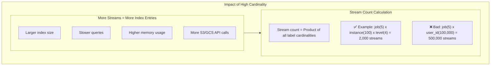

# How to Optimize Loki Label Cardinality

Author: [nawazdhandala](https://www.github.com/nawazdhandala)

Tags: Grafana Loki, Label Cardinality, Performance, Cost Optimization, LogQL, Best Practices

Description: A comprehensive guide to optimizing label cardinality in Grafana Loki, covering label selection strategies, high-cardinality detection, remediation techniques, and best practices for efficient log indexing.

---

Label cardinality - the number of unique label value combinations - directly impacts Loki's performance and cost. High cardinality creates excessive streams, increases index size, degrades query performance, and can lead to ingestion failures. This guide explains how to identify and fix cardinality issues for optimal Loki operation.

## Understanding Label Cardinality

### What is Cardinality?

Cardinality refers to the number of unique values for a label or unique combinations of all labels (streams):

```
Labels: {job="api", instance="pod-1", env="prod"}

Cardinality examples:
- job: 5 unique values (low cardinality - good)
- instance: 100 unique values (medium cardinality - acceptable)
- request_id: millions of unique values (high cardinality - BAD)
```

### Why High Cardinality is Problematic



## Identifying High Cardinality

### Check Stream Count

```bash
# Current stream count per tenant
curl -s 'http://loki:3100/loki/api/v1/label/__name__/values' | jq

# Active streams metric
curl -s http://loki:3100/metrics | grep "loki_ingester_streams_created_total"
```

### Prometheus Queries for Cardinality

```promql
# Total active streams
sum(loki_ingester_memory_streams)

# Streams per tenant
sum by (tenant) (loki_ingester_memory_streams)

# Stream creation rate (high rate indicates cardinality explosion)
rate(loki_ingester_streams_created_total[5m])

# Streams per job
sum by (job) (loki_ingester_memory_streams)
```

### LogQL Cardinality Analysis

```logql
# Count unique values for a label
count(count by (user_id) (rate({job="app"}[1h])))

# Find high-cardinality label values
topk(20, sum by (pod) (count_over_time({job="app"}[1h])))

# Identify labels causing stream explosion
sum by (request_id) (count_over_time({job="app"}[5m]))
```

### Check Loki Logs for Warnings

```bash
# Find cardinality warnings
docker logs loki 2>&1 | grep -i "cardinality\|streams\|rate limit"

# Check for stream limit errors
docker logs loki 2>&1 | grep "max streams"
```

## Common High-Cardinality Labels

### Labels to AVOID as Loki Labels

| Label Type | Example | Why Bad |
|------------|---------|---------|
| Request IDs | request_id, trace_id | Unique per request |
| User IDs | user_id, customer_id | Unbounded growth |
| Timestamps | log_time, event_time | Already indexed by Loki |
| Session IDs | session_id | Short-lived, unique |
| IP Addresses | client_ip, source_ip | Many unique values |
| Full Paths | file_path, url | Many variations |

### Labels that ARE Appropriate

| Label Type | Example | Why Good |
|------------|---------|----------|
| Environment | env=prod, env=staging | Few fixed values |
| Service Name | service, app | Known set of services |
| Log Level | level=info, level=error | Fixed set (4-5 values) |
| Namespace | namespace, team | Bounded set |
| Node/Instance | node, instance | Limited by infrastructure |
| Region | region, datacenter | Fixed set |

## Remediation Strategies

### Move High-Cardinality Data to Log Content

**Bad - user_id as label:**
```yaml
# promtail-config.yaml - DON'T DO THIS
pipeline_stages:
  - json:
      expressions:
        user_id: user_id
  - labels:
      user_id:  # Creates millions of streams!
```

**Good - user_id in log content:**
```yaml
# promtail-config.yaml - DO THIS
pipeline_stages:
  - json:
      expressions:
        user_id: user_id
  # Don't add user_id as label
  # Query with: {job="app"} | json | user_id="12345"
```

### Use Structured Metadata (Loki 2.7+)

```yaml
# promtail-config.yaml
pipeline_stages:
  - json:
      expressions:
        trace_id: trace_id
        user_id: user_id
  # Store as structured metadata instead of labels
  - structured_metadata:
      trace_id:
      user_id:
```

```yaml
# loki-config.yaml - Enable structured metadata
limits_config:
  allow_structured_metadata: true
```

Query with structured metadata:

```logql
# Filter by structured metadata
{job="app"} | trace_id="abc123"

# Structured metadata is indexed but doesn't create streams
```

### Aggregate or Bucket Values

**Bad - exact request duration as label:**
```yaml
pipeline_stages:
  - json:
      expressions:
        duration_ms: duration
  - labels:
      duration_ms:  # Millions of unique values!
```

**Good - bucketed duration:**
```yaml
pipeline_stages:
  - json:
      expressions:
        duration_ms: duration
  - template:
      source: duration_bucket
      template: '{{ if lt .duration_ms 100 }}fast{{ else if lt .duration_ms 1000 }}medium{{ else }}slow{{ end }}'
  - labels:
      duration_bucket:  # Only 3 values
```

### Drop Labels Before Ingestion

```yaml
# promtail-config.yaml
pipeline_stages:
  - json:
      expressions:
        level: level
        service: service
        request_id: request_id  # Extract but don't use as label
  - labels:
      level:
      service:
      # Don't add request_id as label

  # Or explicitly drop if added by relabeling
  - labeldrop:
      - request_id
      - trace_id
      - user_id
```

### Relabel with Limits

```yaml
# promtail-config.yaml - Kubernetes example
relabel_configs:
  # Keep only necessary labels
  - action: labelkeep
    regex: (job|namespace|pod|container|node)

  # Drop high-cardinality labels
  - action: labeldrop
    regex: (pod_uid|controller_revision_hash|pod_template_hash)
```

## Configure Cardinality Limits

### Loki Configuration

```yaml
# loki-config.yaml
limits_config:
  # Maximum streams per user/tenant
  max_streams_per_user: 10000
  max_global_streams_per_user: 50000

  # Maximum label names per series
  max_label_names_per_series: 15

  # Maximum label name length
  max_label_name_length: 1024

  # Maximum label value length
  max_label_value_length: 2048

  # Maximum labels size
  max_labels_size_bytes: 4096
```

### Per-Tenant Overrides

```yaml
overrides:
  # Strict limits for problematic tenant
  high-volume-tenant:
    max_streams_per_user: 5000
    max_label_names_per_series: 10

  # Higher limits for platform team
  platform:
    max_streams_per_user: 50000
    max_label_names_per_series: 20
```

## Monitoring Cardinality

### Prometheus Alerts

```yaml
groups:
  - name: loki-cardinality
    rules:
      - alert: LokiHighStreamCount
        expr: |
          sum by (tenant) (loki_ingester_memory_streams) > 50000
        for: 10m
        labels:
          severity: warning
        annotations:
          summary: "High stream count for tenant {{ $labels.tenant }}"
          description: "Stream count: {{ $value }}"

      - alert: LokiStreamCreationSpike
        expr: |
          rate(loki_ingester_streams_created_total[5m]) > 100
        for: 5m
        labels:
          severity: critical
        annotations:
          summary: "Rapid stream creation detected"
          description: "Creating {{ $value }} streams/sec"

      - alert: LokiMaxStreamsReached
        expr: |
          loki_discarded_samples_total{reason="per_user_series_limit"} > 0
        for: 1m
        labels:
          severity: critical
        annotations:
          summary: "Stream limit reached - logs being dropped"
```

### Cardinality Dashboard

```json
{
  "dashboard": {
    "title": "Loki Label Cardinality",
    "panels": [
      {
        "title": "Total Active Streams",
        "type": "stat",
        "targets": [
          {
            "expr": "sum(loki_ingester_memory_streams)"
          }
        ]
      },
      {
        "title": "Streams by Tenant",
        "type": "piechart",
        "targets": [
          {
            "expr": "sum by (tenant) (loki_ingester_memory_streams)",
            "legendFormat": "{{tenant}}"
          }
        ]
      },
      {
        "title": "Stream Creation Rate",
        "type": "timeseries",
        "targets": [
          {
            "expr": "sum(rate(loki_ingester_streams_created_total[5m]))",
            "legendFormat": "Streams/s"
          }
        ]
      },
      {
        "title": "Streams Rejected (Limit)",
        "type": "timeseries",
        "targets": [
          {
            "expr": "sum(rate(loki_discarded_samples_total{reason=\"per_user_series_limit\"}[5m]))",
            "legendFormat": "Rejected"
          }
        ]
      }
    ]
  }
}
```

## Label Design Guidelines

### Recommended Label Schema

```yaml
# Good label schema
labels:
  # Environment context (low cardinality)
  env: production        # prod, staging, dev
  region: us-east-1      # Few regions
  cluster: main          # Few clusters

  # Service identity (bounded)
  job: api-server        # Service name
  namespace: payments    # Team/domain
  app: checkout          # Application name

  # Instance (bounded by infrastructure)
  instance: pod-abc123   # Acceptable if bounded

  # Log classification (fixed set)
  level: error           # debug, info, warn, error

  # DO NOT include as labels:
  # - request_id
  # - user_id
  # - trace_id
  # - session_id
  # - timestamp variations
```

### Query High-Cardinality Data

Instead of labels, query high-cardinality data from log content:

```logql
# Find logs for specific user
{job="app"} | json | user_id="12345"

# Find logs for specific request
{job="app"} | json | request_id="abc-123-def"

# Aggregate by user (from content)
sum by (user_id) (
  count_over_time({job="app"} | json | user_id!="" [1h])
)
```

## Migration Strategy

### Identify Problematic Labels

```bash
# Find highest cardinality labels
curl -s 'http://loki:3100/loki/api/v1/labels' | jq

# For each label, check cardinality
for label in $(curl -s 'http://loki:3100/loki/api/v1/labels' | jq -r '.data[]'); do
  count=$(curl -s "http://loki:3100/loki/api/v1/label/$label/values" | jq '.data | length')
  echo "$label: $count"
done
```

### Gradual Migration

1. **Identify** high-cardinality labels
2. **Update Promtail** to stop adding them as labels
3. **Update queries** to filter by content instead
4. **Wait for retention** to expire old streams
5. **Monitor** stream count reduction

## Best Practices Summary

1. **Think before labeling**: Ask "Will this have bounded values?"
2. **Use content filtering**: Query high-cardinality values from log content
3. **Structured metadata**: Use for trace IDs, request IDs (Loki 2.7+)
4. **Set limits**: Configure max_streams_per_user appropriately
5. **Monitor cardinality**: Alert on stream count and creation rate
6. **Regular audits**: Review label usage periodically
7. **Document standards**: Create team guidelines for label usage

## Conclusion

Optimizing label cardinality is essential for maintaining Loki performance and controlling costs. By carefully selecting which values become labels and moving high-cardinality data to log content or structured metadata, you can achieve efficient indexing while retaining full queryability.

Key takeaways:
- Only use labels for low-cardinality, bounded values
- Move high-cardinality data to log content
- Use structured metadata for trace/request IDs
- Configure stream limits to catch cardinality explosions
- Monitor stream counts and creation rates
- Query high-cardinality values with content filters
