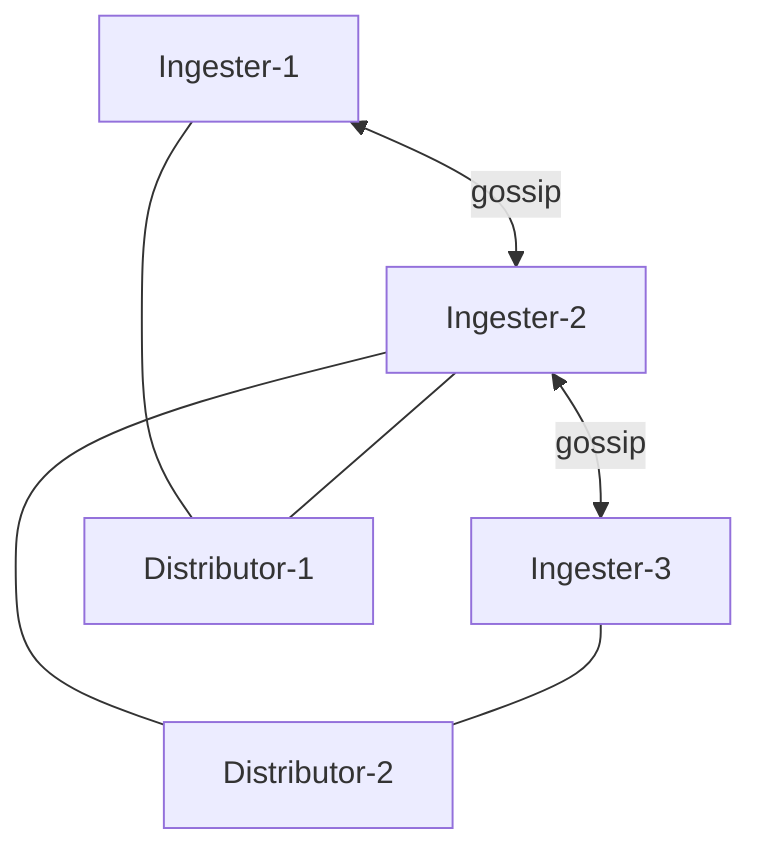

# How to Configure Loki with Memberlist

Author: [nawazdhandala](https://www.github.com/nawazdhandala)

Tags: Grafana Loki, Memberlist, Gossip Protocol, Service Discovery, Distributed Systems, High Availability

Description: A comprehensive guide to configuring Grafana Loki with memberlist for gossip-based cluster coordination, covering ring configuration, network settings, troubleshooting, and production deployment patterns.

---

Memberlist is a gossip-based protocol that enables Loki components to discover each other and coordinate without external dependencies like Consul or etcd. This guide covers how to configure and operate Loki with memberlist.

## Prerequisites

Before starting, ensure you have:

- Loki deployed in distributed/microservices mode
- Kubernetes cluster or network allowing gossip traffic
- Understanding of Loki's ring-based architecture
- Access to modify Loki configuration

## Understanding Memberlist

### How Memberlist Works



### Benefits

- No external dependencies (Consul, etcd)
- Lower operational complexity
- Automatic node discovery
- Built-in failure detection

### Gossip Protocol

1. Nodes join via seed addresses
2. State is shared via gossip messages
3. Failure detection via heartbeats
4. Membership changes propagate quickly

## Basic Configuration

### Minimal Configuration

```yaml
memberlist:
  join_members:
    - loki-memberlist:7946

common:
  ring:
    kvstore:
      store: memberlist
```

### Complete Configuration

```yaml
memberlist:
  # Seed addresses for initial join
  join_members:
    - loki-memberlist:7946

  # Node identification
  node_name: ${POD_NAME}
  advertise_addr: ${POD_IP}

  # Network settings
  bind_addr:
    - "0.0.0.0"
  bind_port: 7946
  advertise_port: 7946

  # Failure detection
  dead_node_reclaim_time: 30s
  gossip_to_dead_nodes_time: 15s
  left_ingesters_timeout: 30s

  # Gossip settings
  gossip_interval: 200ms
  gossip_nodes: 3

  # Timing
  retransmit_factor: 4
  push_pull_interval: 30s
  probe_interval: 1s
  probe_timeout: 500ms

  # Message settings
  packet_dial_timeout: 5s
  packet_write_timeout: 5s
  compression_enabled: true
```

## Ring Configuration

### Ingester Ring

```yaml
ingester:
  lifecycler:
    ring:
      kvstore:
        store: memberlist
      replication_factor: 3
    num_tokens: 128
    heartbeat_period: 5s
    heartbeat_timeout: 1m
    join_after: 30s
    observe_period: 10s
    min_ready_duration: 15s
    final_sleep: 30s
```

### Distributor Ring

```yaml
distributor:
  ring:
    kvstore:
      store: memberlist
    heartbeat_period: 5s
    heartbeat_timeout: 1m
```

### Compactor Ring

```yaml
compactor:
  compactor_ring:
    kvstore:
      store: memberlist
    heartbeat_period: 5s
    heartbeat_timeout: 1m
```

### Ruler Ring

```yaml
ruler:
  ring:
    kvstore:
      store: memberlist
    heartbeat_period: 5s
    heartbeat_timeout: 1m
```

## Kubernetes Deployment

### Headless Service for Discovery

```yaml
apiVersion: v1
kind: Service
metadata:
  name: loki-memberlist
  namespace: loki
spec:
  type: ClusterIP
  clusterIP: None
  publishNotReadyAddresses: true
  ports:
    - name: gossip
      port: 7946
      targetPort: 7946
      protocol: TCP
  selector:
    app.kubernetes.io/part-of: loki
```

### Ingester StatefulSet

```yaml
apiVersion: apps/v1
kind: StatefulSet
metadata:
  name: loki-ingester
  namespace: loki
spec:
  serviceName: loki-ingester
  replicas: 3
  podManagementPolicy: Parallel
  template:
    metadata:
      labels:
        app: loki-ingester
        app.kubernetes.io/part-of: loki
    spec:
      containers:
        - name: ingester
          image: grafana/loki:2.9.4
          args:
            - -config.file=/etc/loki/config.yaml
            - -target=ingester
          env:
            - name: POD_NAME
              valueFrom:
                fieldRef:
                  fieldPath: metadata.name
            - name: POD_IP
              valueFrom:
                fieldRef:
                  fieldPath: status.podIP
          ports:
            - name: http
              containerPort: 3100
            - name: grpc
              containerPort: 9095
            - name: gossip
              containerPort: 7946
```

### Distributor Deployment

```yaml
apiVersion: apps/v1
kind: Deployment
metadata:
  name: loki-distributor
  namespace: loki
spec:
  replicas: 3
  template:
    metadata:
      labels:
        app: loki-distributor
        app.kubernetes.io/part-of: loki
    spec:
      containers:
        - name: distributor
          image: grafana/loki:2.9.4
          args:
            - -config.file=/etc/loki/config.yaml
            - -target=distributor
          env:
            - name: POD_IP
              valueFrom:
                fieldRef:
                  fieldPath: status.podIP
          ports:
            - name: http
              containerPort: 3100
            - name: grpc
              containerPort: 9095
            - name: gossip
              containerPort: 7946
```

## Network Configuration

### Port Requirements

| Port | Protocol | Purpose |
|------|----------|---------|
| 7946 | TCP | Gossip communication |
| 7946 | UDP | Gossip communication |

### Network Policies

```yaml
apiVersion: networking.k8s.io/v1
kind: NetworkPolicy
metadata:
  name: loki-memberlist
  namespace: loki
spec:
  podSelector:
    matchLabels:
      app.kubernetes.io/part-of: loki
  policyTypes:
    - Ingress
    - Egress
  ingress:
    - from:
        - podSelector:
            matchLabels:
              app.kubernetes.io/part-of: loki
      ports:
        - port: 7946
          protocol: TCP
        - port: 7946
          protocol: UDP
  egress:
    - to:
        - podSelector:
            matchLabels:
              app.kubernetes.io/part-of: loki
      ports:
        - port: 7946
          protocol: TCP
        - port: 7946
          protocol: UDP
```

### Firewall Rules

```bash
# Allow memberlist traffic between Loki pods
iptables -A INPUT -p tcp --dport 7946 -j ACCEPT
iptables -A INPUT -p udp --dport 7946 -j ACCEPT
```

## DNS-Based Discovery

### Using DNS SRV Records

```yaml
memberlist:
  join_members:
    - dns+loki-memberlist.loki.svc.cluster.local:7946
```

### Multiple Seed Nodes

```yaml
memberlist:
  join_members:
    - loki-ingester-0.loki-ingester.loki.svc:7946
    - loki-ingester-1.loki-ingester.loki.svc:7946
    - loki-ingester-2.loki-ingester.loki.svc:7946
```

## Monitoring

### Key Metrics

```promql
# Memberlist members count
memberlist_client_cluster_members_count

# Ring members by state
sum by (state) (cortex_ring_members{name="ingester"})

# Gossip health
rate(memberlist_client_messages_in_total[5m])
rate(memberlist_client_messages_out_total[5m])
```

### Health Endpoints

```bash
# Check ring status
curl http://loki:3100/ring

# Check memberlist status
curl http://loki:3100/memberlist
```

### Alerts

```yaml
groups:
  - name: loki-memberlist
    rules:
      - alert: LokiMemberlistUnhealthy
        expr: memberlist_client_cluster_members_count < 3
        for: 5m
        labels:
          severity: critical
        annotations:
          summary: "Memberlist has fewer than expected members"

      - alert: LokiRingUnhealthy
        expr: |
          sum(cortex_ring_members{name="ingester", state!="ACTIVE"}) > 0
        for: 5m
        labels:
          severity: warning
        annotations:
          summary: "Ring has unhealthy members"
```

## Failure Handling

### Node Failure Detection

```yaml
memberlist:
  # Time to wait before reclaiming dead node's tokens
  dead_node_reclaim_time: 30s

  # Continue gossiping to dead nodes briefly
  gossip_to_dead_nodes_time: 15s

  # Probe settings
  probe_interval: 1s
  probe_timeout: 500ms
```

### Graceful Shutdown

```yaml
ingester:
  lifecycler:
    final_sleep: 30s
```

```yaml
# Kubernetes pod spec
spec:
  terminationGracePeriodSeconds: 300
```

### Recovery Behavior

```yaml
ingester:
  lifecycler:
    # Time to wait before joining
    join_after: 30s

    # Observation period before active
    observe_period: 10s

    # Minimum ready duration
    min_ready_duration: 15s
```

## Troubleshooting

### Common Issues

#### 1. Nodes Not Joining

```bash
# Check if memberlist port is accessible
kubectl exec -n loki loki-ingester-0 -- nc -zv loki-ingester-1.loki-ingester 7946

# Check DNS resolution
kubectl exec -n loki loki-ingester-0 -- nslookup loki-memberlist

# Check logs
kubectl logs -n loki loki-ingester-0 | grep -i memberlist
```

#### 2. Split Brain

```bash
# Check ring status from multiple pods
for pod in loki-ingester-{0,1,2}; do
  echo "=== $pod ==="
  kubectl exec -n loki $pod -- curl -s localhost:3100/ring | head -20
done
```

#### 3. Slow Convergence

```yaml
# Increase gossip frequency
memberlist:
  gossip_interval: 100ms
  gossip_nodes: 5
  push_pull_interval: 15s
```

### Debug Logging

```yaml
server:
  log_level: debug
```

### Ring Status API

```bash
# Get detailed ring status
curl http://loki:3100/ring | jq '.shards[] | select(.state != "ACTIVE")'
```

## Production Best Practices

### Configuration

1. Use DNS-based discovery
2. Set appropriate timeouts
3. Configure proper failure detection
4. Enable compression for large clusters

### Sizing

| Cluster Size | gossip_nodes | gossip_interval |
|--------------|--------------|-----------------|
| < 10 nodes | 3 | 200ms |
| 10-50 nodes | 5 | 200ms |
| 50-100 nodes | 7 | 300ms |
| > 100 nodes | 10 | 500ms |

### Network

1. Ensure low latency between nodes
2. Allow both TCP and UDP on gossip port
3. Use dedicated network for gossip if possible

## Complete Configuration Example

```yaml
auth_enabled: true

server:
  http_listen_port: 3100
  grpc_listen_port: 9095
  log_level: info

memberlist:
  join_members:
    - dns+loki-memberlist.loki.svc.cluster.local:7946
  node_name: ${POD_NAME}
  advertise_addr: ${POD_IP}
  bind_addr:
    - "0.0.0.0"
  bind_port: 7946
  dead_node_reclaim_time: 30s
  gossip_to_dead_nodes_time: 15s
  left_ingesters_timeout: 30s
  gossip_interval: 200ms
  gossip_nodes: 3
  compression_enabled: true

common:
  path_prefix: /loki
  replication_factor: 3
  ring:
    kvstore:
      store: memberlist

ingester:
  lifecycler:
    ring:
      kvstore:
        store: memberlist
      replication_factor: 3
    num_tokens: 128
    heartbeat_period: 5s
    join_after: 30s
    observe_period: 10s
    min_ready_duration: 15s
    final_sleep: 30s
  wal:
    enabled: true
    dir: /loki/wal

distributor:
  ring:
    kvstore:
      store: memberlist

compactor:
  compactor_ring:
    kvstore:
      store: memberlist

ruler:
  ring:
    kvstore:
      store: memberlist
```

## Conclusion

Memberlist provides a simple, dependency-free way to coordinate Loki clusters. Key takeaways:

- Use headless services for Kubernetes discovery
- Configure proper failure detection timeouts
- Monitor ring and memberlist health
- Allow gossip traffic through network policies
- Use graceful shutdown for clean node removal

With proper memberlist configuration, Loki can maintain cluster coordination without external dependencies.
