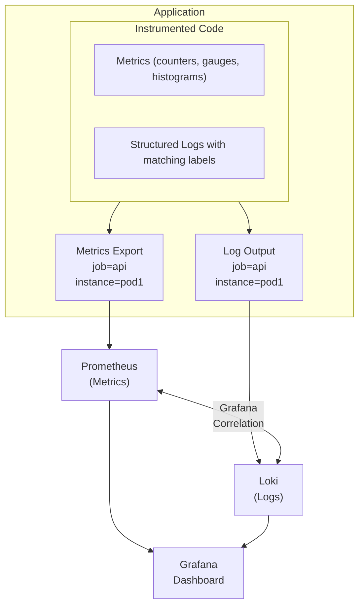

# How to Correlate Logs and Metrics with Loki

Author: [nawazdhandala](https://www.github.com/nawazdhandala)

Tags: Grafana Loki, Prometheus, Metrics Correlation, Observability, LogQL, PromQL, Grafana

Description: A comprehensive guide to correlating logs and metrics in Grafana using Loki and Prometheus, enabling unified observability dashboards that link metric anomalies to relevant log entries for faster root cause analysis.

---

Effective observability requires connecting different telemetry signals. When a metric shows an anomaly - a spike in error rates or latency - you need to quickly find the related logs explaining why. Grafana provides powerful capabilities to correlate Loki logs with Prometheus metrics, creating a unified view of your system's health. This guide shows you how to set up and leverage this correlation.

## Prerequisites

Before starting, ensure you have:

- Grafana 9.0 or later
- Grafana Loki 2.4 or later
- Prometheus 2.30 or later
- Applications emitting both logs and metrics
- Basic understanding of LogQL and PromQL

## Architecture Overview



## Deploying the Stack

### Docker Compose Setup

```yaml
version: "3.8"

services:
  prometheus:
    image: prom/prometheus:v2.49.1
    container_name: prometheus
    ports:
      - "9090:9090"
    volumes:
      - ./prometheus.yml:/etc/prometheus/prometheus.yml
      - prometheus-data:/prometheus
    command:
      - '--config.file=/etc/prometheus/prometheus.yml'
      - '--storage.tsdb.path=/prometheus'
      - '--web.enable-lifecycle'
    networks:
      - observability

  loki:
    image: grafana/loki:2.9.4
    container_name: loki
    ports:
      - "3100:3100"
    volumes:
      - ./loki-config.yaml:/etc/loki/config.yaml
      - loki-data:/loki
    command: -config.file=/etc/loki/config.yaml
    networks:
      - observability

  promtail:
    image: grafana/promtail:2.9.4
    container_name: promtail
    volumes:
      - ./promtail-config.yaml:/etc/promtail/config.yaml
      - /var/log:/var/log:ro
      - /var/lib/docker/containers:/var/lib/docker/containers:ro
    command: -config.file=/etc/promtail/config.yaml
    networks:
      - observability

  grafana:
    image: grafana/grafana:10.3.1
    container_name: grafana
    ports:
      - "3000:3000"
    environment:
      - GF_SECURITY_ADMIN_PASSWORD=admin
    volumes:
      - ./grafana-provisioning:/etc/grafana/provisioning
      - grafana-data:/var/lib/grafana
    networks:
      - observability
    depends_on:
      - prometheus
      - loki

networks:
  observability:
    driver: bridge

volumes:
  prometheus-data:
  loki-data:
  grafana-data:
```

### Prometheus Configuration

Create `prometheus.yml`:

```yaml
global:
  scrape_interval: 15s
  evaluation_interval: 15s
  external_labels:
    cluster: production

scrape_configs:
  - job_name: 'prometheus'
    static_configs:
      - targets: ['localhost:9090']

  - job_name: 'api-server'
    static_configs:
      - targets: ['api-server:8080']
    relabel_configs:
      - source_labels: [__address__]
        target_label: instance
        regex: '([^:]+):\d+'
        replacement: '${1}'

  - job_name: 'kubernetes-pods'
    kubernetes_sd_configs:
      - role: pod
    relabel_configs:
      - source_labels: [__meta_kubernetes_pod_label_app]
        target_label: app
      - source_labels: [__meta_kubernetes_namespace]
        target_label: namespace
      - source_labels: [__meta_kubernetes_pod_name]
        target_label: pod
```

### Loki Configuration

Create `loki-config.yaml`:

```yaml
auth_enabled: false

server:
  http_listen_port: 3100
  grpc_listen_port: 9096

common:
  instance_addr: 127.0.0.1
  path_prefix: /loki
  storage:
    filesystem:
      chunks_directory: /loki/chunks
      rules_directory: /loki/rules
  replication_factor: 1
  ring:
    kvstore:
      store: inmemory

schema_config:
  configs:
    - from: 2020-10-24
      store: tsdb
      object_store: filesystem
      schema: v13
      index:
        prefix: index_
        period: 24h

limits_config:
  reject_old_samples: true
  reject_old_samples_max_age: 168h

ruler:
  alertmanager_url: http://alertmanager:9093
```

### Promtail Configuration with Matching Labels

Create `promtail-config.yaml` to ensure labels match between logs and metrics:

```yaml
server:
  http_listen_port: 9080
  grpc_listen_port: 0

positions:
  filename: /tmp/positions.yaml

clients:
  - url: http://loki:3100/loki/api/v1/push

scrape_configs:
  # Kubernetes pods - matching Prometheus labels
  - job_name: kubernetes-pods
    kubernetes_sd_configs:
      - role: pod
    relabel_configs:
      # Match the job label from Prometheus
      - source_labels: [__meta_kubernetes_pod_label_app]
        target_label: app
      - source_labels: [__meta_kubernetes_namespace]
        target_label: namespace
      - source_labels: [__meta_kubernetes_pod_name]
        target_label: pod
      - source_labels: [__meta_kubernetes_pod_node_name]
        target_label: node
      # Set the job label to match Prometheus
      - source_labels: [__meta_kubernetes_pod_label_app]
        target_label: job
      - source_labels: [__meta_kubernetes_pod_container_name]
        target_label: container
      - replacement: /var/log/pods/*$1/*.log
        separator: /
        source_labels:
          - __meta_kubernetes_pod_uid
          - __meta_kubernetes_pod_container_name
        target_label: __path__
    pipeline_stages:
      - cri: {}
      - json:
          expressions:
            level: level
            msg: message
            error: error
      - labels:
          level:

  # Docker containers
  - job_name: docker
    static_configs:
      - targets:
          - localhost
        labels:
          job: docker
          __path__: /var/lib/docker/containers/*/*-json.log
    pipeline_stages:
      - json:
          expressions:
            log: log
            stream: stream
            time: time
            attrs: attrs
      # Extract container labels for correlation
      - json:
          expressions:
            container_name: '["attrs"]["container_name"]'
            service: '["attrs"]["service"]'
          source: attrs
      - labels:
          container_name:
          service:
      - output:
          source: log
```

## Configuring Grafana Data Sources

### Data Source Provisioning

Create `grafana-provisioning/datasources/datasources.yaml`:

```yaml
apiVersion: 1

datasources:
  - name: Prometheus
    type: prometheus
    access: proxy
    url: http://prometheus:9090
    isDefault: true
    jsonData:
      timeInterval: "15s"
      exemplarTraceIdDestinations:
        - datasourceUid: tempo
          name: trace_id

  - name: Loki
    type: loki
    access: proxy
    url: http://loki:3100
    jsonData:
      maxLines: 1000
```

## Instrumenting Applications for Correlation

### Python Application with Matching Labels

```python
import logging
import json
from flask import Flask, request
from prometheus_client import Counter, Histogram, generate_latest, CONTENT_TYPE_LATEST
import time

app = Flask(__name__)

# Metrics with consistent labels
REQUEST_COUNT = Counter(
    'http_requests_total',
    'Total HTTP requests',
    ['method', 'endpoint', 'status', 'service', 'instance']
)

REQUEST_LATENCY = Histogram(
    'http_request_duration_seconds',
    'HTTP request latency',
    ['method', 'endpoint', 'service', 'instance'],
    buckets=[0.01, 0.05, 0.1, 0.5, 1.0, 5.0]
)

ERROR_COUNT = Counter(
    'http_errors_total',
    'Total HTTP errors',
    ['method', 'endpoint', 'error_type', 'service', 'instance']
)

# Service identification
SERVICE_NAME = 'api-server'
INSTANCE = 'pod-1'

# Structured JSON logger
class JsonFormatter(logging.Formatter):
    def format(self, record):
        log_record = {
            "timestamp": self.formatTime(record),
            "level": record.levelname.lower(),
            "message": record.getMessage(),
            "service": SERVICE_NAME,
            "instance": INSTANCE,
            "logger": record.name,
        }
        # Add extra fields
        if hasattr(record, 'endpoint'):
            log_record['endpoint'] = record.endpoint
        if hasattr(record, 'method'):
            log_record['method'] = record.method
        if hasattr(record, 'status_code'):
            log_record['status_code'] = record.status_code
        if hasattr(record, 'duration'):
            log_record['duration'] = record.duration
        if record.exc_info:
            log_record['exception'] = self.formatException(record.exc_info)
        return json.dumps(log_record)

logger = logging.getLogger(__name__)
logger.setLevel(logging.INFO)
handler = logging.StreamHandler()
handler.setFormatter(JsonFormatter())
logger.addHandler(handler)

@app.before_request
def before_request():
    request.start_time = time.time()

@app.after_request
def after_request(response):
    duration = time.time() - request.start_time
    endpoint = request.endpoint or 'unknown'
    method = request.method

    # Record metrics
    REQUEST_COUNT.labels(
        method=method,
        endpoint=endpoint,
        status=response.status_code,
        service=SERVICE_NAME,
        instance=INSTANCE
    ).inc()

    REQUEST_LATENCY.labels(
        method=method,
        endpoint=endpoint,
        service=SERVICE_NAME,
        instance=INSTANCE
    ).observe(duration)

    # Log request with matching labels
    logger.info(
        f"Request completed",
        extra={
            'endpoint': endpoint,
            'method': method,
            'status_code': response.status_code,
            'duration': duration
        }
    )

    return response

@app.errorhandler(Exception)
def handle_error(error):
    endpoint = request.endpoint or 'unknown'
    method = request.method
    error_type = type(error).__name__

    # Record error metric
    ERROR_COUNT.labels(
        method=method,
        endpoint=endpoint,
        error_type=error_type,
        service=SERVICE_NAME,
        instance=INSTANCE
    ).inc()

    # Log error with matching labels
    logger.error(
        f"Request failed: {str(error)}",
        extra={
            'endpoint': endpoint,
            'method': method,
            'error_type': error_type
        },
        exc_info=True
    )

    return {'error': str(error)}, 500

@app.route('/api/orders', methods=['POST'])
def create_order():
    order_id = request.json.get('order_id')
    logger.info(f"Processing order {order_id}", extra={
        'endpoint': 'create_order',
        'method': 'POST'
    })
    # Process order...
    return {'status': 'success', 'order_id': order_id}

@app.route('/metrics')
def metrics():
    return generate_latest(), 200, {'Content-Type': CONTENT_TYPE_LATEST}

if __name__ == '__main__':
    app.run(host='0.0.0.0', port=8080)
```

### Node.js Application with Matching Labels

```javascript
const express = require('express');
const promClient = require('prom-client');
const pino = require('pino');

const app = express();
app.use(express.json());

// Service identification
const SERVICE_NAME = 'user-service';
const INSTANCE = process.env.HOSTNAME || 'local';

// Initialize Prometheus metrics
const register = new promClient.Registry();
promClient.collectDefaultMetrics({ register });

const httpRequestsTotal = new promClient.Counter({
  name: 'http_requests_total',
  help: 'Total HTTP requests',
  labelNames: ['method', 'endpoint', 'status', 'service', 'instance'],
  registers: [register],
});

const httpRequestDuration = new promClient.Histogram({
  name: 'http_request_duration_seconds',
  help: 'HTTP request latency',
  labelNames: ['method', 'endpoint', 'service', 'instance'],
  buckets: [0.01, 0.05, 0.1, 0.5, 1.0, 5.0],
  registers: [register],
});

const httpErrorsTotal = new promClient.Counter({
  name: 'http_errors_total',
  help: 'Total HTTP errors',
  labelNames: ['method', 'endpoint', 'error_type', 'service', 'instance'],
  registers: [register],
});

// Structured logger with matching labels
const logger = pino({
  base: {
    service: SERVICE_NAME,
    instance: INSTANCE,
  },
  formatters: {
    level: (label) => ({ level: label }),
  },
});

// Request logging middleware
app.use((req, res, next) => {
  const startTime = Date.now();

  res.on('finish', () => {
    const duration = (Date.now() - startTime) / 1000;
    const endpoint = req.route ? req.route.path : req.path;

    // Record metrics
    httpRequestsTotal.inc({
      method: req.method,
      endpoint,
      status: res.statusCode,
      service: SERVICE_NAME,
      instance: INSTANCE,
    });

    httpRequestDuration.observe(
      {
        method: req.method,
        endpoint,
        service: SERVICE_NAME,
        instance: INSTANCE,
      },
      duration
    );

    // Log with matching labels
    logger.info({
      endpoint,
      method: req.method,
      status_code: res.statusCode,
      duration,
    }, 'Request completed');
  });

  next();
});

// Error handler
app.use((err, req, res, next) => {
  const endpoint = req.route ? req.route.path : req.path;
  const errorType = err.name || 'Error';

  httpErrorsTotal.inc({
    method: req.method,
    endpoint,
    error_type: errorType,
    service: SERVICE_NAME,
    instance: INSTANCE,
  });

  logger.error({
    endpoint,
    method: req.method,
    error_type: errorType,
    error: err.message,
  }, 'Request failed');

  res.status(500).json({ error: err.message });
});

app.get('/api/users/:id', async (req, res) => {
  const userId = req.params.id;
  logger.info({ endpoint: '/api/users/:id', method: 'GET', user_id: userId }, 'Fetching user');
  // Fetch user...
  res.json({ id: userId, name: 'John Doe' });
});

app.get('/metrics', async (req, res) => {
  res.set('Content-Type', register.contentType);
  res.end(await register.metrics());
});

app.listen(8080, () => {
  logger.info({ port: 8080 }, 'Server started');
});
```

## Building Correlation Dashboards

### Dashboard JSON Example

```json
{
  "dashboard": {
    "title": "Service Overview with Log Correlation",
    "panels": [
      {
        "id": 1,
        "title": "Request Rate",
        "type": "timeseries",
        "gridPos": { "x": 0, "y": 0, "w": 12, "h": 8 },
        "datasource": "Prometheus",
        "targets": [
          {
            "expr": "sum(rate(http_requests_total{service=\"$service\"}[5m])) by (endpoint)",
            "legendFormat": "{{endpoint}}"
          }
        ]
      },
      {
        "id": 2,
        "title": "Error Rate",
        "type": "timeseries",
        "gridPos": { "x": 12, "y": 0, "w": 12, "h": 8 },
        "datasource": "Prometheus",
        "targets": [
          {
            "expr": "sum(rate(http_errors_total{service=\"$service\"}[5m])) by (error_type)",
            "legendFormat": "{{error_type}}"
          }
        ]
      },
      {
        "id": 3,
        "title": "Request Latency (p99)",
        "type": "timeseries",
        "gridPos": { "x": 0, "y": 8, "w": 12, "h": 8 },
        "datasource": "Prometheus",
        "targets": [
          {
            "expr": "histogram_quantile(0.99, sum(rate(http_request_duration_seconds_bucket{service=\"$service\"}[5m])) by (le, endpoint))",
            "legendFormat": "{{endpoint}}"
          }
        ]
      },
      {
        "id": 4,
        "title": "Error Logs",
        "type": "logs",
        "gridPos": { "x": 12, "y": 8, "w": 12, "h": 8 },
        "datasource": "Loki",
        "targets": [
          {
            "expr": "{service=\"$service\"} | json | level=\"error\"",
            "refId": "A"
          }
        ],
        "options": {
          "showLabels": true,
          "showTime": true,
          "wrapLogMessage": true,
          "enableLogDetails": true
        }
      },
      {
        "id": 5,
        "title": "Recent Logs",
        "type": "logs",
        "gridPos": { "x": 0, "y": 16, "w": 24, "h": 10 },
        "datasource": "Loki",
        "targets": [
          {
            "expr": "{service=\"$service\"}",
            "refId": "A"
          }
        ]
      }
    ],
    "templating": {
      "list": [
        {
          "name": "service",
          "type": "query",
          "datasource": "Prometheus",
          "query": "label_values(http_requests_total, service)",
          "refresh": 1
        }
      ]
    }
  }
}
```

## LogQL Queries for Metric Correlation

### Finding Logs During Metric Anomalies

```logql
# Find error logs for a service when error rate spikes
{service="api-server"} | json | level="error"

# Filter by specific endpoint matching metric labels
{service="api-server"} | json | endpoint="/api/orders"

# Find slow request logs (correlates with latency metrics)
{service="api-server"}
| json
| duration > 1
| line_format "{{.endpoint}} took {{.duration}}s"

# Count errors over time (compare with Prometheus error counter)
sum by (error_type) (
  count_over_time({service="api-server"} | json | level="error" [5m])
)
```

### Creating Metrics from Logs

```logql
# Request rate from logs (validates Prometheus metrics)
sum(rate({service="api-server"} | json | __error__="" [5m]))

# Error rate from logs
sum(rate({service="api-server"} | json | level="error" [5m]))

# Latency percentiles from log data
quantile_over_time(0.99,
  {service="api-server"}
  | json
  | unwrap duration [5m]
) by (endpoint)

# Bytes processed (if logged)
sum by (endpoint) (
  sum_over_time({service="api-server"} | json | unwrap bytes [1h])
)
```

## Using Grafana Explore for Correlation

### Split View Workflow

1. Open Grafana Explore
2. Click "Split" to create two panels
3. In the left panel, select Prometheus and run:
   ```promql
   rate(http_errors_total{service="api-server"}[5m])
   ```
4. In the right panel, select Loki and run:
   ```logql
   {service="api-server"} | json | level="error"
   ```
5. Use the time picker to synchronize both views
6. Click on a spike in the metrics graph to filter logs to that time range

### Data Links Configuration

Add data links to metrics panels that open Loki queries:

```json
{
  "fieldConfig": {
    "defaults": {
      "links": [
        {
          "title": "View related logs",
          "url": "/explore?left={\"datasource\":\"Loki\",\"queries\":[{\"expr\":\"{service=\\\"${__field.labels.service}\\\"}\"}],\"range\":{\"from\":\"${__from}\",\"to\":\"${__to}\"}}",
          "targetBlank": true
        }
      ]
    }
  }
}
```

## Advanced Correlation Techniques

### Using Recording Rules for Log Metrics

Create Loki recording rules in `loki-rules.yaml`:

```yaml
groups:
  - name: log-metrics
    interval: 1m
    rules:
      - record: log:http_requests:rate5m
        expr: |
          sum by (service, endpoint) (
            rate({job="application"} | json | __error__="" [5m])
          )

      - record: log:http_errors:rate5m
        expr: |
          sum by (service, endpoint, error_type) (
            rate({job="application"} | json | level="error" [5m])
          )

      - record: log:request_duration:p99
        expr: |
          quantile_over_time(0.99,
            {job="application"}
            | json
            | unwrap duration [5m]
          ) by (service, endpoint)
```

### Correlating with Annotations

Add annotations from logs to metric graphs:

```yaml
# Dashboard annotation configuration
{
  "annotations": {
    "list": [
      {
        "datasource": "Loki",
        "enable": true,
        "expr": "{service=\"$service\"} | json | level=\"error\" | line_format \"{{.error_type}}: {{.message}}\"",
        "iconColor": "red",
        "name": "Error Events",
        "tagKeys": "error_type",
        "textFormat": "{{message}}",
        "titleFormat": "Error"
      },
      {
        "datasource": "Loki",
        "enable": true,
        "expr": "{job=\"deployments\"} |= \"deployed\"",
        "iconColor": "blue",
        "name": "Deployments",
        "titleFormat": "Deployment"
      }
    ]
  }
}
```

## Alerting Based on Correlation

### Prometheus Alert with Log Context

```yaml
# prometheus-alerts.yaml
groups:
  - name: service-alerts
    rules:
      - alert: HighErrorRate
        expr: |
          sum(rate(http_errors_total[5m])) by (service)
          / sum(rate(http_requests_total[5m])) by (service)
          > 0.05
        for: 5m
        labels:
          severity: critical
        annotations:
          summary: "High error rate for {{ $labels.service }}"
          description: "Error rate is {{ $value | humanizePercentage }}"
          logs_link: "https://grafana.example.com/explore?left={\"datasource\":\"Loki\",\"queries\":[{\"expr\":\"{service=\\\"{{ $labels.service }}\\\"} | json | level=\\\"error\\\"\"}]}"
```

### Loki Alert with Metric Context

```yaml
# loki-alerts.yaml
groups:
  - name: log-alerts
    rules:
      - alert: CriticalErrorLogged
        expr: |
          count_over_time({job="application"} |= "CRITICAL" [5m]) > 0
        for: 1m
        labels:
          severity: critical
        annotations:
          summary: "Critical error logged"
          metrics_link: "https://grafana.example.com/d/service-dashboard?var-service={{ $labels.service }}"
```

## Best Practices

1. **Consistent Labels**: Use identical label names and values across logs and metrics
2. **Structured Logging**: Always use JSON format for easy correlation
3. **Common Time Windows**: Align metric scrape intervals with log aggregation windows
4. **Label Cardinality**: Be mindful of high-cardinality labels affecting both systems
5. **Dashboard Variables**: Use template variables that work across both data sources
6. **Time Synchronization**: Ensure all services use NTP for accurate correlation

## Troubleshooting

### Labels Not Matching

Verify label consistency:

```bash
# Check Prometheus labels
curl -s 'http://prometheus:9090/api/v1/labels' | jq

# Check Loki labels
curl -s 'http://loki:3100/loki/api/v1/labels' | jq

# Compare specific label values
curl -s 'http://prometheus:9090/api/v1/label/service/values' | jq
curl -s 'http://loki:3100/loki/api/v1/label/service/values' | jq
```

### Time Range Misalignment

Ensure time ranges cover the same period:

```logql
# Use explicit time range in LogQL
{service="api-server"} | json [$__range]
```

## Conclusion

Correlating logs and metrics with Grafana Loki and Prometheus creates a powerful observability solution. By ensuring consistent labels across both systems and leveraging Grafana's correlation features, you can quickly navigate from metric anomalies to the underlying log evidence. This integration dramatically reduces mean time to resolution for production issues.

Key takeaways:
- Maintain consistent labels between Prometheus metrics and Loki logs
- Use structured JSON logging for easy field extraction
- Create dashboards that display both metrics and logs side by side
- Configure data links for seamless navigation between panels
- Leverage LogQL metric queries to validate Prometheus data
- Set up alerts that provide links to correlated data
