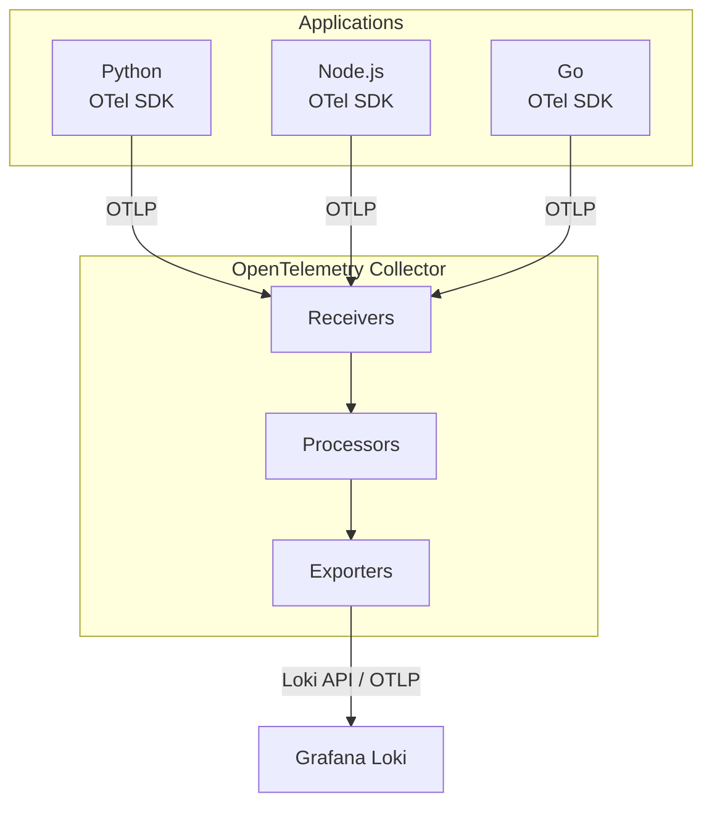

# How to Use Loki with OpenTelemetry

Author: [nawazdhandala](https://www.github.com/nawazdhandala)

Tags: Grafana Loki, OpenTelemetry, OTLP, Log Collection, Observability, OTel Collector

Description: A comprehensive guide to collecting and shipping logs to Grafana Loki using OpenTelemetry, including OTel Collector configuration, SDK instrumentation, and best practices for unified observability.

---

OpenTelemetry has become the standard for collecting observability data across metrics, traces, and logs. While Loki traditionally used Promtail or Fluent Bit for log collection, OpenTelemetry provides a vendor-neutral, unified approach to telemetry collection. This guide shows you how to configure OpenTelemetry to ship logs to Grafana Loki effectively.

## Prerequisites

Before starting, ensure you have:

- Grafana Loki 2.9 or later (with OTLP support)
- OpenTelemetry Collector 0.80 or later
- Basic understanding of OpenTelemetry concepts
- Applications instrumented with OpenTelemetry SDKs

## Architecture Overview



## Deploying the Stack

### Docker Compose Setup

```yaml
version: "3.8"

services:
  loki:
    image: grafana/loki:2.9.4
    container_name: loki
    ports:
      - "3100:3100"
      - "3101:3101"  # OTLP gRPC
    volumes:
      - ./loki-config.yaml:/etc/loki/config.yaml
      - loki-data:/loki
    command: -config.file=/etc/loki/config.yaml
    networks:
      - observability

  otel-collector:
    image: otel/opentelemetry-collector-contrib:0.92.0
    container_name: otel-collector
    ports:
      - "4317:4317"   # OTLP gRPC
      - "4318:4318"   # OTLP HTTP
      - "8888:8888"   # Prometheus metrics
      - "8889:8889"   # Prometheus exporter
    volumes:
      - ./otel-collector-config.yaml:/etc/otel/config.yaml
    command: --config=/etc/otel/config.yaml
    networks:
      - observability
    depends_on:
      - loki

  grafana:
    image: grafana/grafana:10.3.1
    container_name: grafana
    ports:
      - "3000:3000"
    environment:
      - GF_SECURITY_ADMIN_PASSWORD=admin
    volumes:
      - ./grafana-provisioning:/etc/grafana/provisioning
      - grafana-data:/var/lib/grafana
    networks:
      - observability
    depends_on:
      - loki

networks:
  observability:
    driver: bridge

volumes:
  loki-data:
  grafana-data:
```

### Loki Configuration with OTLP Support

Create `loki-config.yaml`:

```yaml
auth_enabled: false

server:
  http_listen_port: 3100
  grpc_listen_port: 9096

# Enable OTLP ingestion
distributor:
  otlp_config:
    default_labels_enabled:
      exporter: true
      job: true
      instance: true
      level: true

common:
  instance_addr: 127.0.0.1
  path_prefix: /loki
  storage:
    filesystem:
      chunks_directory: /loki/chunks
      rules_directory: /loki/rules
  replication_factor: 1
  ring:
    kvstore:
      store: inmemory

schema_config:
  configs:
    - from: 2020-10-24
      store: tsdb
      object_store: filesystem
      schema: v13
      index:
        prefix: index_
        period: 24h

limits_config:
  reject_old_samples: true
  reject_old_samples_max_age: 168h
  allow_structured_metadata: true
  otlp_config:
    resource_attributes:
      attributes_config:
        - action: index_label
          attributes:
            - service.name
            - service.namespace
            - deployment.environment
        - action: structured_metadata
          attributes:
            - service.instance.id
            - host.name
            - container.id

ingester:
  wal:
    enabled: true
    dir: /loki/wal
```

### OpenTelemetry Collector Configuration

Create `otel-collector-config.yaml`:

```yaml
receivers:
  otlp:
    protocols:
      grpc:
        endpoint: 0.0.0.0:4317
      http:
        endpoint: 0.0.0.0:4318

  # Collect Docker container logs
  filelog:
    include:
      - /var/lib/docker/containers/*/*.log
    start_at: end
    include_file_path: true
    include_file_name: false
    operators:
      - type: json_parser
        id: parser-docker
        timestamp:
          parse_from: attributes.time
          layout: '%Y-%m-%dT%H:%M:%S.%LZ'
      - type: move
        from: attributes.log
        to: body
      - type: remove
        field: attributes.time

  # Collect journald logs
  journald:
    directory: /var/log/journal
    units:
      - docker
      - kubelet
      - sshd
    priority: info

processors:
  batch:
    timeout: 1s
    send_batch_size: 1000
    send_batch_max_size: 1500

  memory_limiter:
    check_interval: 1s
    limit_mib: 1000
    spike_limit_mib: 200

  resource:
    attributes:
      - key: deployment.environment
        value: production
        action: upsert
      - key: collector.name
        value: otel-collector-1
        action: upsert

  attributes:
    actions:
      - key: log.file.path
        action: delete
      - key: container.id
        pattern: ^(?P<short_id>[a-f0-9]{12})
        action: extract

  # Transform logs for Loki compatibility
  transform:
    log_statements:
      - context: log
        statements:
          - set(severity_text, "INFO") where severity_text == ""
          - set(attributes["level"], severity_text)

exporters:
  # Export to Loki via OTLP
  otlphttp:
    endpoint: http://loki:3100/otlp
    tls:
      insecure: true

  # Alternative: Use Loki exporter (more control over labels)
  loki:
    endpoint: http://loki:3100/loki/api/v1/push
    tenant_id: default
    labels:
      attributes:
        severity: ""
        http.method: ""
      resource:
        service.name: "service_name"
        service.namespace: "namespace"
        deployment.environment: "env"

  # Debug exporter for troubleshooting
  debug:
    verbosity: detailed
    sampling_initial: 5
    sampling_thereafter: 200

  # Prometheus metrics from collector
  prometheus:
    endpoint: 0.0.0.0:8889

service:
  pipelines:
    logs/otlp:
      receivers: [otlp]
      processors: [memory_limiter, batch, resource, transform]
      exporters: [otlphttp]

    logs/files:
      receivers: [filelog]
      processors: [memory_limiter, batch, resource, attributes]
      exporters: [loki]

  telemetry:
    logs:
      level: info
    metrics:
      address: 0.0.0.0:8888
```

## Instrumenting Applications

### Python Application with OpenTelemetry Logs

```python
import logging
from opentelemetry import trace
from opentelemetry.sdk.trace import TracerProvider
from opentelemetry.sdk.trace.export import BatchSpanProcessor
from opentelemetry.exporter.otlp.proto.grpc.trace_exporter import OTLPSpanExporter
from opentelemetry.sdk._logs import LoggerProvider, LoggingHandler
from opentelemetry.sdk._logs.export import BatchLogRecordProcessor
from opentelemetry.exporter.otlp.proto.grpc._log_exporter import OTLPLogExporter
from opentelemetry.sdk.resources import Resource
from opentelemetry._logs import set_logger_provider

# Define service resource
resource = Resource.create({
    "service.name": "order-service",
    "service.namespace": "production",
    "service.version": "1.0.0",
    "deployment.environment": "production",
    "host.name": "order-service-pod-1"
})

# Configure tracing
trace_provider = TracerProvider(resource=resource)
trace_exporter = OTLPSpanExporter(
    endpoint="http://otel-collector:4317",
    insecure=True
)
trace_provider.add_span_processor(BatchSpanProcessor(trace_exporter))
trace.set_tracer_provider(trace_provider)

# Configure logging with OpenTelemetry
logger_provider = LoggerProvider(resource=resource)
log_exporter = OTLPLogExporter(
    endpoint="http://otel-collector:4317",
    insecure=True
)
logger_provider.add_log_record_processor(BatchLogRecordProcessor(log_exporter))
set_logger_provider(logger_provider)

# Create handler that sends logs via OTLP
handler = LoggingHandler(
    level=logging.DEBUG,
    logger_provider=logger_provider
)

# Configure Python logger
logging.basicConfig(level=logging.INFO)
logger = logging.getLogger(__name__)
logger.addHandler(handler)

# Example usage
from flask import Flask, request

app = Flask(__name__)
tracer = trace.get_tracer(__name__)

@app.route('/api/orders', methods=['POST'])
def create_order():
    with tracer.start_as_current_span("create_order") as span:
        order_id = request.json.get('order_id')
        span.set_attribute("order.id", order_id)

        logger.info(f"Processing order {order_id}", extra={
            "order_id": order_id,
            "customer_id": request.json.get('customer_id')
        })

        try:
            # Process order
            result = process_order(order_id)
            logger.info(f"Order {order_id} processed successfully")
            return {"status": "success", "order_id": order_id}
        except Exception as e:
            logger.error(f"Failed to process order {order_id}: {e}",
                        exc_info=True,
                        extra={"order_id": order_id})
            raise

def process_order(order_id):
    with tracer.start_as_current_span("process_order") as span:
        span.set_attribute("order.id", order_id)
        logger.debug(f"Validating order {order_id}")
        # Processing logic
        return True

if __name__ == '__main__':
    app.run(host='0.0.0.0', port=8080)
```

### Node.js Application with OpenTelemetry Logs

```javascript
const { NodeSDK } = require('@opentelemetry/sdk-node');
const { OTLPTraceExporter } = require('@opentelemetry/exporter-trace-otlp-grpc');
const { OTLPLogExporter } = require('@opentelemetry/exporter-logs-otlp-grpc');
const { Resource } = require('@opentelemetry/resources');
const { SemanticResourceAttributes } = require('@opentelemetry/semantic-conventions');
const { getNodeAutoInstrumentations } = require('@opentelemetry/auto-instrumentations-node');
const { LoggerProvider, SimpleLogRecordProcessor } = require('@opentelemetry/sdk-logs');
const logsAPI = require('@opentelemetry/api-logs');
const { SeverityNumber } = require('@opentelemetry/api-logs');

// Define service resource
const resource = new Resource({
  [SemanticResourceAttributes.SERVICE_NAME]: 'user-service',
  [SemanticResourceAttributes.SERVICE_NAMESPACE]: 'production',
  [SemanticResourceAttributes.SERVICE_VERSION]: '1.0.0',
  [SemanticResourceAttributes.DEPLOYMENT_ENVIRONMENT]: 'production',
});

// Initialize trace exporter
const traceExporter = new OTLPTraceExporter({
  url: 'http://otel-collector:4317',
});

// Initialize log exporter
const logExporter = new OTLPLogExporter({
  url: 'http://otel-collector:4317',
});

// Configure logger provider
const loggerProvider = new LoggerProvider({ resource });
loggerProvider.addLogRecordProcessor(new SimpleLogRecordProcessor(logExporter));
logsAPI.logs.setGlobalLoggerProvider(loggerProvider);

// Initialize SDK
const sdk = new NodeSDK({
  resource,
  traceExporter,
  instrumentations: [getNodeAutoInstrumentations()],
});

sdk.start();

// Create logger
const logger = logsAPI.logs.getLogger('user-service');

// Helper function for structured logging
function log(level, message, attributes = {}) {
  const severityMap = {
    debug: SeverityNumber.DEBUG,
    info: SeverityNumber.INFO,
    warn: SeverityNumber.WARN,
    error: SeverityNumber.ERROR,
  };

  logger.emit({
    severityNumber: severityMap[level] || SeverityNumber.INFO,
    severityText: level.toUpperCase(),
    body: message,
    attributes,
  });
}

// Express application
const express = require('express');
const { trace, context } = require('@opentelemetry/api');

const app = express();
app.use(express.json());

app.post('/api/users', async (req, res) => {
  const tracer = trace.getTracer('user-service');

  return tracer.startActiveSpan('createUser', async (span) => {
    const { email, name } = req.body;
    span.setAttribute('user.email', email);

    log('info', `Creating user: ${email}`, {
      email,
      operation: 'create_user',
    });

    try {
      // Simulate user creation
      const userId = `user_${Date.now()}`;
      span.setAttribute('user.id', userId);

      log('info', `User created successfully`, {
        user_id: userId,
        email,
        operation: 'create_user',
      });

      span.end();
      res.json({ userId, email, name });
    } catch (error) {
      log('error', `Failed to create user: ${error.message}`, {
        email,
        error: error.message,
        operation: 'create_user',
      });

      span.recordException(error);
      span.end();
      res.status(500).json({ error: error.message });
    }
  });
});

app.listen(8080, () => {
  log('info', 'Server started', { port: 8080 });
});

// Graceful shutdown
process.on('SIGTERM', () => {
  sdk.shutdown()
    .then(() => console.log('SDK shut down'))
    .catch((error) => console.error('Error shutting down SDK', error))
    .finally(() => process.exit(0));
});
```

### Go Application with OpenTelemetry Logs

```go
package main

import (
    "context"
    "log/slog"
    "net/http"
    "os"
    "time"

    "go.opentelemetry.io/contrib/bridges/otelslog"
    "go.opentelemetry.io/otel"
    "go.opentelemetry.io/otel/exporters/otlp/otlplog/otlploggrpc"
    "go.opentelemetry.io/otel/exporters/otlp/otlptrace/otlptracegrpc"
    "go.opentelemetry.io/otel/log/global"
    "go.opentelemetry.io/otel/sdk/log"
    "go.opentelemetry.io/otel/sdk/resource"
    sdktrace "go.opentelemetry.io/otel/sdk/trace"
    semconv "go.opentelemetry.io/otel/semconv/v1.21.0"
    "go.opentelemetry.io/otel/trace"
)

func initProvider(ctx context.Context) (func(), error) {
    res, err := resource.New(ctx,
        resource.WithAttributes(
            semconv.ServiceName("payment-service"),
            semconv.ServiceNamespace("production"),
            semconv.ServiceVersion("1.0.0"),
            semconv.DeploymentEnvironment("production"),
        ),
    )
    if err != nil {
        return nil, err
    }

    // Trace exporter
    traceExporter, err := otlptracegrpc.New(ctx,
        otlptracegrpc.WithEndpoint("otel-collector:4317"),
        otlptracegrpc.WithInsecure(),
    )
    if err != nil {
        return nil, err
    }

    tp := sdktrace.NewTracerProvider(
        sdktrace.WithBatcher(traceExporter),
        sdktrace.WithResource(res),
    )
    otel.SetTracerProvider(tp)

    // Log exporter
    logExporter, err := otlploggrpc.New(ctx,
        otlploggrpc.WithEndpoint("otel-collector:4317"),
        otlploggrpc.WithInsecure(),
    )
    if err != nil {
        return nil, err
    }

    lp := log.NewLoggerProvider(
        log.WithProcessor(log.NewBatchProcessor(logExporter)),
        log.WithResource(res),
    )
    global.SetLoggerProvider(lp)

    cleanup := func() {
        ctx, cancel := context.WithTimeout(context.Background(), 5*time.Second)
        defer cancel()
        tp.Shutdown(ctx)
        lp.Shutdown(ctx)
    }

    return cleanup, nil
}

func main() {
    ctx := context.Background()

    cleanup, err := initProvider(ctx)
    if err != nil {
        panic(err)
    }
    defer cleanup()

    // Create slog handler with OpenTelemetry bridge
    logger := otelslog.NewLogger("payment-service")
    slog.SetDefault(logger)

    tracer := otel.Tracer("payment-service")

    http.HandleFunc("/api/payments", func(w http.ResponseWriter, r *http.Request) {
        ctx, span := tracer.Start(r.Context(), "processPayment")
        defer span.End()

        paymentID := r.URL.Query().Get("id")
        amount := r.URL.Query().Get("amount")

        span.SetAttributes(
            semconv.HTTPMethod(r.Method),
            semconv.HTTPURL(r.URL.String()),
        )

        slog.InfoContext(ctx, "Processing payment",
            "payment_id", paymentID,
            "amount", amount,
        )

        // Process payment
        if err := processPayment(ctx, paymentID, amount); err != nil {
            slog.ErrorContext(ctx, "Payment failed",
                "payment_id", paymentID,
                "error", err.Error(),
            )
            http.Error(w, err.Error(), http.StatusInternalServerError)
            return
        }

        slog.InfoContext(ctx, "Payment processed successfully",
            "payment_id", paymentID,
        )

        w.WriteHeader(http.StatusOK)
    })

    slog.Info("Server starting", "port", 8080)
    http.ListenAndServe(":8080", nil)
}

func processPayment(ctx context.Context, paymentID, amount string) error {
    tracer := otel.Tracer("payment-service")
    ctx, span := tracer.Start(ctx, "validatePayment")
    defer span.End()

    slog.DebugContext(ctx, "Validating payment",
        "payment_id", paymentID,
    )

    // Payment processing logic
    return nil
}
```

## Advanced Collector Configuration

### Multi-Tenant Configuration

```yaml
receivers:
  otlp:
    protocols:
      grpc:
        endpoint: 0.0.0.0:4317

processors:
  batch:
    timeout: 1s
    send_batch_size: 1000

  # Route logs to different tenants based on attributes
  routing:
    default_exporters: [loki/default]
    table:
      - statement: route() where resource.attributes["deployment.environment"] == "production"
        exporters: [loki/production]
      - statement: route() where resource.attributes["deployment.environment"] == "staging"
        exporters: [loki/staging]

exporters:
  loki/default:
    endpoint: http://loki:3100/loki/api/v1/push
    tenant_id: default

  loki/production:
    endpoint: http://loki:3100/loki/api/v1/push
    tenant_id: production

  loki/staging:
    endpoint: http://loki:3100/loki/api/v1/push
    tenant_id: staging

service:
  pipelines:
    logs:
      receivers: [otlp]
      processors: [batch, routing]
      exporters: [loki/default, loki/production, loki/staging]
```

### Log Filtering and Sampling

```yaml
processors:
  # Filter out health check logs
  filter/healthcheck:
    logs:
      exclude:
        match_type: regexp
        bodies:
          - ".*healthcheck.*"
          - ".*health-check.*"
        record_attributes:
          - key: http.target
            value: "/health"

  # Tail sampling for high-volume logs
  tail_sampling:
    decision_wait: 10s
    num_traces: 100
    expected_new_traces_per_sec: 10
    policies:
      - name: errors-policy
        type: status_code
        status_code: {status_codes: [ERROR]}
      - name: slow-traces
        type: latency
        latency: {threshold_ms: 1000}
      - name: probabilistic-sample
        type: probabilistic
        probabilistic: {sampling_percentage: 10}

  # Transform to add computed attributes
  transform:
    log_statements:
      - context: log
        statements:
          - set(attributes["log.level"], severity_text)
          - set(attributes["app.name"], resource.attributes["service.name"])
```

### High Availability Collector Setup

```yaml
# otel-collector-ha.yaml
version: "3.8"

services:
  otel-collector-1:
    image: otel/opentelemetry-collector-contrib:0.92.0
    hostname: otel-collector-1
    volumes:
      - ./otel-collector-config.yaml:/etc/otel/config.yaml
    command: --config=/etc/otel/config.yaml
    deploy:
      resources:
        limits:
          memory: 2G
    networks:
      - observability

  otel-collector-2:
    image: otel/opentelemetry-collector-contrib:0.92.0
    hostname: otel-collector-2
    volumes:
      - ./otel-collector-config.yaml:/etc/otel/config.yaml
    command: --config=/etc/otel/config.yaml
    deploy:
      resources:
        limits:
          memory: 2G
    networks:
      - observability

  # Load balancer for collectors
  collector-lb:
    image: nginx:1.25
    ports:
      - "4317:4317"
      - "4318:4318"
    volumes:
      - ./nginx-lb.conf:/etc/nginx/nginx.conf
    networks:
      - observability
    depends_on:
      - otel-collector-1
      - otel-collector-2
```

## Querying OpenTelemetry Logs in Loki

### LogQL Queries for OTel Logs

```logql
# Query by service name (from resource attributes)
{service_name="order-service"}

# Filter by severity
{service_name="order-service"} | json | severity_text="ERROR"

# Query by deployment environment
{env="production", service_name="order-service"}

# Access structured metadata
{service_name="order-service"} | host_name=~".*pod-1.*"

# Correlate with trace ID (if present)
{service_name="order-service"} | json | trace_id="abc123"

# Count logs by severity
sum by (severity_text) (
  count_over_time({service_name="order-service"}[5m])
)

# Error rate by service
sum(rate({service_name=~".+"} | json | severity_text="ERROR" [5m])) by (service_name)
```

## Monitoring the Collector

### Prometheus Metrics from Collector

```yaml
# prometheus.yml
scrape_configs:
  - job_name: 'otel-collector'
    static_configs:
      - targets: ['otel-collector:8888']
```

Key metrics to monitor:

```promql
# Logs received rate
rate(otelcol_receiver_accepted_log_records[5m])

# Logs exported rate
rate(otelcol_exporter_sent_log_records[5m])

# Export errors
rate(otelcol_exporter_send_failed_log_records[5m])

# Queue size
otelcol_exporter_queue_size

# Memory usage
otelcol_process_memory_rss
```

## Troubleshooting

### Logs Not Appearing in Loki

1. Check collector logs:
```bash
docker logs otel-collector 2>&1 | grep -i error
```

2. Enable debug exporter:
```yaml
exporters:
  debug:
    verbosity: detailed

service:
  pipelines:
    logs:
      exporters: [debug, loki]
```

3. Verify Loki is receiving:
```bash
curl -s 'http://loki:3100/loki/api/v1/query' \
  --data-urlencode 'query={job="opentelemetry"}' | jq
```

### Label Configuration Issues

Verify labels are being set correctly:

```yaml
exporters:
  loki:
    endpoint: http://loki:3100/loki/api/v1/push
    labels:
      resource:
        service.name: "service_name"  # Maps to Loki label
      attributes:
        severity: "level"
    # Avoid high-cardinality labels
```

## Best Practices

1. **Resource Attributes**: Include service.name, service.namespace, and deployment.environment
2. **Structured Logging**: Use OpenTelemetry's structured log API
3. **Correlation**: Include trace_id and span_id for correlation with traces
4. **Batching**: Configure appropriate batch sizes to balance latency and throughput
5. **Memory Limits**: Set memory_limiter processor to prevent OOM
6. **Label Cardinality**: Map only low-cardinality attributes to Loki labels
7. **Graceful Shutdown**: Implement proper shutdown handlers in applications

## Conclusion

OpenTelemetry provides a powerful, vendor-neutral approach to collecting logs for Grafana Loki. By using the OpenTelemetry Collector and SDKs, you can unify your observability pipeline and easily correlate logs with traces and metrics. The flexible processing pipeline allows you to transform, filter, and route logs to meet your specific requirements.

Key takeaways:
- Use the OTLP exporter for native OpenTelemetry integration with Loki
- Configure resource attributes for proper service identification
- Implement structured logging in applications using OTel SDKs
- Use the collector's processing pipeline for filtering and transformation
- Monitor the collector itself to ensure reliable log delivery
- Follow label best practices to avoid cardinality issues in Loki
