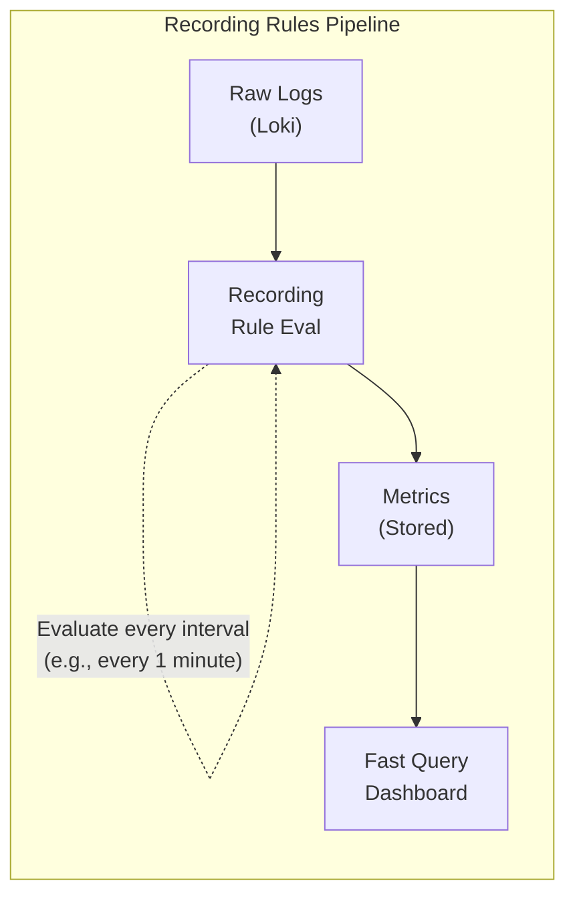

# How to Use Loki Recording Rules

Author: [nawazdhandala](https://www.github.com/nawazdhandala)

Tags: Grafana Loki, Recording Rules, LogQL, Performance Optimization, Metrics, Pre-aggregation

Description: A comprehensive guide to using Loki recording rules for pre-computing expensive LogQL queries, creating metrics from logs, and optimizing dashboard performance through query result caching.

---

Loki recording rules pre-compute LogQL metric queries and store the results as time series, similar to Prometheus recording rules. This dramatically improves dashboard performance for expensive queries and enables you to derive metrics from log data without re-querying raw logs every time. This guide covers how to configure and use recording rules effectively.

## Understanding Recording Rules

### What Are Recording Rules?

Recording rules periodically evaluate LogQL queries and write the results back as time series data that can be quickly queried:



### Benefits

1. **Faster dashboards**: Pre-computed results load instantly
2. **Reduced query load**: Heavy queries run once, not per dashboard view
3. **Log-derived metrics**: Create persistent metrics from log data
4. **Cost savings**: Fewer repeated expensive queries
5. **Historical data**: Metrics available even if logs are deleted

## Configuring the Ruler

### Enable Ruler in Loki

```yaml
# loki-config.yaml
ruler:
  # Enable the ruler
  enable_api: true

  # Storage for rule files
  storage:
    type: local
    local:
      directory: /loki/rules

  # How often to evaluate rules
  evaluation_interval: 1m

  # Alertmanager for alert rules (if needed)
  alertmanager_url: http://alertmanager:9093

  # Remote write for recording rule metrics
  remote_write:
    enabled: true
    client:
      url: http://prometheus:9090/api/v1/write

  # Ring configuration for HA
  ring:
    kvstore:
      store: inmemory
```

### Remote Write to Prometheus

```yaml
# loki-config.yaml - Full remote write configuration
ruler:
  remote_write:
    enabled: true
    clients:
      default:
        url: http://prometheus:9090/api/v1/write
        queue_config:
          capacity: 10000
          max_shards: 10
          min_shards: 1
          max_samples_per_send: 5000
          batch_send_deadline: 5s
          min_backoff: 30ms
          max_backoff: 100ms
        headers:
          X-Scope-OrgID: loki-rules
```

### Prometheus Configuration to Accept Remote Write

```yaml
# prometheus.yml
global:
  scrape_interval: 15s

# Enable remote write receiver
remote_write:
  - url: "http://prometheus:9090/api/v1/write"

# Or explicitly enable the feature
# Start Prometheus with: --enable-feature=remote-write-receiver
```

## Creating Recording Rules

### Rule File Structure

Create rules in `/loki/rules/` directory:

```yaml
# /loki/rules/tenant_id/rules.yaml
# For single tenant, use "fake" as tenant_id

groups:
  - name: log_metrics
    interval: 1m
    rules:
      # Basic rate recording rule
      - record: log:request_count:rate5m
        expr: |
          sum by (service) (
            rate({job="application"} [5m])
          )

      # Error rate recording rule
      - record: log:error_rate:rate5m
        expr: |
          sum by (service) (
            rate({job="application"} | json | level="error" [5m])
          )

      # Error percentage
      - record: log:error_percentage:5m
        expr: |
          (
            sum by (service) (rate({job="application"} | json | level="error" [5m]))
            /
            sum by (service) (rate({job="application"} [5m]))
          ) * 100
```

### Recording Rules Examples

#### Request Metrics from Logs

```yaml
groups:
  - name: request_metrics
    interval: 1m
    rules:
      # Request rate by service and endpoint
      - record: log:http_requests:rate5m
        expr: |
          sum by (service, endpoint) (
            rate({job="application"} | json | endpoint!="" [5m])
          )

      # Request rate by status code
      - record: log:http_requests_by_status:rate5m
        expr: |
          sum by (service, status_code) (
            rate({job="application"} | json | status_code!="" [5m])
          )

      # 5xx error rate
      - record: log:http_5xx_errors:rate5m
        expr: |
          sum by (service) (
            rate({job="application"} | json | status_code >= 500 [5m])
          )
```

#### Latency Metrics from Logs

```yaml
groups:
  - name: latency_metrics
    interval: 1m
    rules:
      # P50 latency
      - record: log:request_duration:p50_5m
        expr: |
          quantile_over_time(0.50,
            {job="application"} | json | unwrap duration [5m]
          ) by (service)

      # P95 latency
      - record: log:request_duration:p95_5m
        expr: |
          quantile_over_time(0.95,
            {job="application"} | json | unwrap duration [5m]
          ) by (service)

      # P99 latency
      - record: log:request_duration:p99_5m
        expr: |
          quantile_over_time(0.99,
            {job="application"} | json | unwrap duration [5m]
          ) by (service)

      # Average latency
      - record: log:request_duration:avg_5m
        expr: |
          avg_over_time(
            {job="application"} | json | unwrap duration [5m]
          ) by (service)
```

#### Error Analysis Rules

```yaml
groups:
  - name: error_analysis
    interval: 1m
    rules:
      # Error count by type
      - record: log:errors_by_type:count_5m
        expr: |
          sum by (service, error_type) (
            count_over_time({job="application"} | json | level="error" [5m])
          )

      # Top error messages (use with caution - cardinality)
      - record: log:top_errors:count_5m
        expr: |
          topk(10,
            sum by (service, error_message) (
              count_over_time({job="application"} | json | level="error" [5m])
            )
          )

      # Authentication failures
      - record: log:auth_failures:rate5m
        expr: |
          sum by (service) (
            rate({job="auth-service"} |= "authentication failed" [5m])
          )
```

#### Business Metrics from Logs

```yaml
groups:
  - name: business_metrics
    interval: 5m
    rules:
      # Orders per minute
      - record: log:orders:rate5m
        expr: |
          sum(
            rate({job="order-service"} |= "order created" [5m])
          )

      # Successful payments
      - record: log:payments_success:rate5m
        expr: |
          sum(
            rate({job="payment-service"} |= "payment successful" [5m])
          )

      # Failed payments
      - record: log:payments_failed:rate5m
        expr: |
          sum(
            rate({job="payment-service"} |= "payment failed" [5m])
          )

      # User signups
      - record: log:user_signups:rate5m
        expr: |
          sum(
            rate({job="auth-service"} |= "user registered" [5m])
          )
```

## Managing Recording Rules

### Via API

```bash
# List all rule groups
curl -s http://loki:3100/loki/api/v1/rules | jq

# Get rules for a specific tenant
curl -s http://loki:3100/loki/api/v1/rules/fake | jq

# Create/Update rules
curl -X POST http://loki:3100/loki/api/v1/rules/fake \
  -H "Content-Type: application/yaml" \
  -d '
groups:
  - name: my_rules
    rules:
      - record: log:test:rate5m
        expr: sum(rate({job="test"} [5m]))
'

# Delete a rule group
curl -X DELETE http://loki:3100/loki/api/v1/rules/fake/my_rules
```

### Via Configuration Files

```yaml
# File-based rule loading
ruler:
  storage:
    type: local
    local:
      directory: /loki/rules

# Rules are loaded from:
# /loki/rules/{tenant_id}/rules.yaml
# /loki/rules/{tenant_id}/*.yaml
```

### Kubernetes ConfigMap

```yaml
apiVersion: v1
kind: ConfigMap
metadata:
  name: loki-recording-rules
  namespace: loki
data:
  rules.yaml: |
    groups:
      - name: log_metrics
        interval: 1m
        rules:
          - record: log:error_rate:5m
            expr: |
              sum by (service) (
                rate({job="application"} | json | level="error" [5m])
              )
---
# Mount in Loki deployment
spec:
  volumes:
    - name: rules
      configMap:
        name: loki-recording-rules
  containers:
    - name: loki
      volumeMounts:
        - name: rules
          mountPath: /loki/rules/fake
```

## Querying Recording Rule Metrics

### In Prometheus

```promql
# Query the recorded metric directly
log:error_rate:rate5m{service="api-server"}

# Use in calculations
log:error_rate:rate5m / log:request_count:rate5m

# In alerts
alert: HighErrorRate
expr: log:error_rate:rate5m > 10
```

### In Grafana

```json
{
  "dashboard": {
    "panels": [
      {
        "title": "Error Rate (from Recording Rule)",
        "type": "timeseries",
        "datasource": "Prometheus",
        "targets": [
          {
            "expr": "log:error_rate:rate5m",
            "legendFormat": "{{service}}"
          }
        ]
      },
      {
        "title": "Request Rate (from Recording Rule)",
        "type": "timeseries",
        "datasource": "Prometheus",
        "targets": [
          {
            "expr": "log:http_requests:rate5m",
            "legendFormat": "{{service}}"
          }
        ]
      }
    ]
  }
}
```

## Best Practices

### Naming Conventions

```yaml
# Format: log:<metric_name>:<aggregation>
# Examples:
- log:requests:rate5m           # 5-minute rate of requests
- log:errors:count_over_time_1h # 1-hour count
- log:latency:p99_5m            # 5-minute P99 latency
- log:bytes:sum_1m              # 1-minute sum of bytes
```

### Choose Appropriate Intervals

```yaml
groups:
  # High-resolution for alerting
  - name: alerting_metrics
    interval: 30s
    rules:
      - record: log:critical_errors:rate1m
        expr: sum(rate({job="app"} |~ "CRITICAL" [1m]))

  # Standard resolution for dashboards
  - name: dashboard_metrics
    interval: 1m
    rules:
      - record: log:requests:rate5m
        expr: sum by (service) (rate({job="app"} [5m]))

  # Lower resolution for trends
  - name: trend_metrics
    interval: 5m
    rules:
      - record: log:daily_errors:rate1h
        expr: sum(rate({job="app"} | json | level="error" [1h]))
```

### Avoid High Cardinality

```yaml
# Bad: High cardinality from user_id
- record: log:requests_by_user:rate5m
  expr: sum by (user_id) (rate({job="app"} | json [5m]))  # DON'T DO THIS

# Good: Bounded cardinality
- record: log:requests_by_service:rate5m
  expr: sum by (service) (rate({job="app"} | json [5m]))

# Good: Use topk for unbounded dimensions
- record: log:top_endpoints:rate5m
  expr: |
    topk(10,
      sum by (endpoint) (rate({job="app"} | json [5m]))
    )
```

### Use with Alerts

```yaml
groups:
  - name: recording_rules
    rules:
      # Recording rule for metric
      - record: log:error_rate:rate5m
        expr: |
          sum by (service) (
            rate({job="application"} | json | level="error" [5m])
          )

  - name: alerts
    rules:
      # Alert using the recorded metric
      - alert: HighErrorRate
        expr: log:error_rate:rate5m > 0.1
        for: 5m
        labels:
          severity: critical
        annotations:
          summary: "High error rate in {{ $labels.service }}"
```

## Monitoring Recording Rules

### Key Metrics

```promql
# Rule evaluation duration
loki_ruler_eval_duration_seconds

# Rule evaluation failures
loki_ruler_eval_failures_total

# Samples written by recording rules
rate(loki_ruler_samples_total[5m])

# Rules currently being evaluated
loki_ruler_rules
```

### Alert on Rule Failures

```yaml
groups:
  - name: ruler_health
    rules:
      - alert: LokiRecordingRulesFailing
        expr: |
          rate(loki_ruler_eval_failures_total[5m]) > 0
        for: 5m
        labels:
          severity: warning
        annotations:
          summary: "Loki recording rules are failing"
```

## Conclusion

Loki recording rules transform expensive log queries into fast, pre-computed metrics. By strategically creating recording rules for frequently-used queries, you can dramatically improve dashboard performance and create persistent metrics from log data that survive log retention.

Key takeaways:
- Configure the ruler with remote write to Prometheus
- Create recording rules for expensive, frequently-used queries
- Use consistent naming conventions
- Avoid high-cardinality label dimensions
- Match evaluation intervals to use case (alerting vs trends)
- Monitor rule evaluation for failures
- Combine recording rules with alerting rules for efficient monitoring
