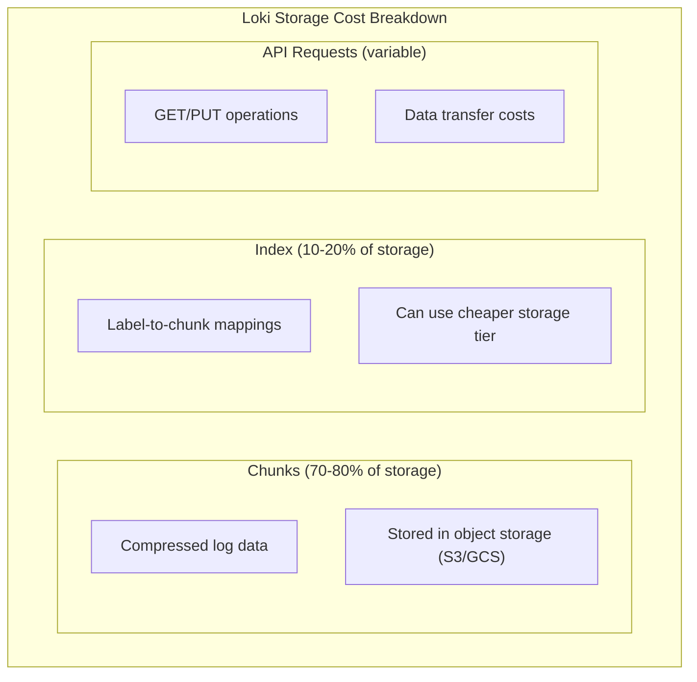

# How to Reduce Loki Storage Costs

Author: [nawazdhandala](https://www.github.com/nawazdhandala)

Tags: Grafana Loki, Cost Optimization, Storage, Retention, Compression, Log Management

Description: A comprehensive guide to reducing Grafana Loki storage costs through retention policies, compression optimization, log filtering, tiered storage, and efficient schema configuration.

---

Storage costs are often the largest expense when running Grafana Loki at scale. Unlike traditional log management systems that index full log content, Loki's architecture already provides significant cost savings by only indexing labels. However, there are many additional optimizations that can further reduce your storage costs. This guide covers practical strategies for minimizing Loki storage expenses.

## Understanding Loki Storage Costs

### Cost Components



### Estimating Storage Requirements

```
Storage = Log Volume per Day x Retention Days x (1 - Compression Ratio)

Example:
- 100 GB/day of raw logs
- 30 day retention
- 90% compression ratio

Storage = 100 GB x 30 x 0.10 = 300 GB
```

## Retention Policies

### Configure Retention Period

```yaml
# loki-config.yaml
limits_config:
  # Global retention period
  retention_period: 720h  # 30 days

compactor:
  working_directory: /loki/compactor
  compaction_interval: 10m
  retention_enabled: true
  retention_delete_delay: 2h
  retention_delete_worker_count: 150
  delete_request_store: s3
```

### Per-Tenant Retention

```yaml
# Different retention for different tenants
limits_config:
  retention_period: 720h  # Default: 30 days

overrides:
  # Critical services - longer retention
  production:
    retention_period: 2160h  # 90 days

  # Development - shorter retention
  development:
    retention_period: 168h  # 7 days

  # Testing - minimal retention
  testing:
    retention_period: 24h  # 1 day
```

### Per-Stream Retention

```yaml
# Retention based on labels
limits_config:
  retention_period: 720h
  retention_stream:
    - selector: '{level="debug"}'
      priority: 1
      period: 24h  # Only keep debug logs for 1 day
    - selector: '{env="development"}'
      priority: 2
      period: 72h  # Dev logs for 3 days
    - selector: '{app="audit"}'
      priority: 3
      period: 8760h  # Audit logs for 1 year
```

## Compression Optimization

### Enable Maximum Compression

```yaml
# loki-config.yaml
ingester:
  chunk_encoding: snappy  # Default, fast
  # Or use better compression
  chunk_encoding: gzip  # Better compression, slower

  # Chunk size affects compression
  chunk_target_size: 1572864  # 1.5MB target
  chunk_idle_period: 30m
  max_chunk_age: 2h
  chunk_retain_period: 0s
```

### Compression Comparison

| Encoding | Compression Ratio | CPU Usage | Write Speed |
|----------|-------------------|-----------|-------------|
| none     | 0%                | Low       | Fast        |
| gzip     | 70-80%            | Medium    | Medium      |
| snappy   | 50-60%            | Low       | Fast        |
| lz4      | 55-65%            | Low       | Fast        |
| zstd     | 75-85%            | Medium    | Medium      |

### Optimize Chunk Size

```yaml
# Larger chunks = better compression but slower queries
ingester:
  # For high-volume, query-infrequent logs
  chunk_target_size: 2097152  # 2MB

  # For lower volume, frequent queries
  chunk_target_size: 1048576  # 1MB
```

## Log Filtering and Reduction

### Drop Unnecessary Logs at Ingestion

```yaml
# promtail-config.yaml
scrape_configs:
  - job_name: application
    static_configs:
      - targets:
          - localhost
        labels:
          job: app
          __path__: /var/log/app/*.log
    pipeline_stages:
      # Drop debug logs
      - match:
          selector: '{job="app"}'
          stages:
            - json:
                expressions:
                  level: level
            - drop:
                source: level
                value: debug
                drop_counter_reason: debug_dropped

      # Drop health check logs
      - drop:
          expression: '.*healthcheck.*'
          drop_counter_reason: healthcheck_dropped

      # Drop specific endpoints
      - match:
          selector: '{job="app"}'
          stages:
            - json:
                expressions:
                  endpoint: endpoint
            - drop:
                source: endpoint
                expression: '/(metrics|health|ready)'
                drop_counter_reason: observability_endpoints
```

### Log Sampling

```yaml
# Sample verbose logs
pipeline_stages:
  - match:
      selector: '{job="app"} |= "INFO"'
      stages:
        - sampling:
            rate: 0.1  # Keep only 10% of INFO logs
```

### Deduplication

```yaml
# Remove duplicate log lines
pipeline_stages:
  - dedup:
      window: 10s  # Dedupe within 10 second window
```

## Tiered Storage

### S3 Intelligent Tiering

```yaml
# loki-config.yaml
storage_config:
  aws:
    s3: s3://bucket-name
    region: us-east-1
    # Use S3 Intelligent Tiering
    storage_class: INTELLIGENT_TIERING
```

### Configure Lifecycle Policies

```json
// S3 Lifecycle Policy
{
  "Rules": [
    {
      "ID": "LokiChunksToIA",
      "Status": "Enabled",
      "Filter": {
        "Prefix": "chunks/"
      },
      "Transitions": [
        {
          "Days": 30,
          "StorageClass": "STANDARD_IA"
        },
        {
          "Days": 90,
          "StorageClass": "GLACIER"
        }
      ]
    },
    {
      "ID": "LokiIndexToIA",
      "Status": "Enabled",
      "Filter": {
        "Prefix": "index/"
      },
      "Transitions": [
        {
          "Days": 60,
          "StorageClass": "STANDARD_IA"
        }
      ]
    }
  ]
}
```

### GCS Storage Classes

```yaml
# Use Nearline for older data
storage_config:
  gcs:
    bucket_name: loki-bucket
    # Configure lifecycle via GCS console or gsutil
```

```bash
# GCS Lifecycle configuration
gsutil lifecycle set lifecycle.json gs://loki-bucket

# lifecycle.json
{
  "rule": [
    {
      "action": {"type": "SetStorageClass", "storageClass": "NEARLINE"},
      "condition": {"age": 30, "matchesPrefix": ["chunks/"]}
    },
    {
      "action": {"type": "SetStorageClass", "storageClass": "COLDLINE"},
      "condition": {"age": 90, "matchesPrefix": ["chunks/"]}
    }
  ]
}
```

## Schema Optimization

### Use Latest Schema Version

```yaml
# Use TSDB (v13) for best efficiency
schema_config:
  configs:
    - from: 2024-01-01
      store: tsdb
      object_store: s3
      schema: v13
      index:
        prefix: loki_index_
        period: 24h
```

### Migrate from BoltDB to TSDB

```yaml
# Add new TSDB schema period
schema_config:
  configs:
    # Old BoltDB schema (keep for existing data)
    - from: 2023-01-01
      store: boltdb-shipper
      object_store: s3
      schema: v12
      index:
        prefix: index_
        period: 24h
    # New TSDB schema (more efficient)
    - from: 2024-01-01
      store: tsdb
      object_store: s3
      schema: v13
      index:
        prefix: loki_tsdb_
        period: 24h
```

## Ingestion Limits

### Control Ingestion Volume

```yaml
# loki-config.yaml
limits_config:
  # Per-tenant ingestion limits
  ingestion_rate_mb: 10
  ingestion_burst_size_mb: 20

  # Per-stream limits
  per_stream_rate_limit: 5MB
  per_stream_rate_limit_burst: 15MB

  # Maximum streams
  max_streams_per_user: 10000
  max_global_streams_per_user: 25000

  # Line size limits
  max_line_size: 256KB
  max_line_size_truncate: true  # Truncate instead of reject
```

### Reject Old Samples

```yaml
limits_config:
  # Don't accept logs older than 1 week
  reject_old_samples: true
  reject_old_samples_max_age: 168h
```

## Cost Monitoring

### Track Storage Metrics

```promql
# Total chunks stored
sum(loki_chunk_store_stored_chunks_total)

# Storage size estimation (approximate)
sum(loki_ingester_memory_chunks) * avg(loki_ingester_chunk_size_bytes)

# Ingestion rate
sum(rate(loki_distributor_bytes_received_total[5m]))

# Compression ratio
1 - (
  sum(rate(loki_distributor_bytes_received_total[5m]))
  / sum(rate(loki_ingester_chunk_stored_bytes_total[5m]))
)
```

### Cost Dashboard

```json
{
  "dashboard": {
    "title": "Loki Storage Costs",
    "panels": [
      {
        "title": "Daily Ingestion Volume",
        "type": "stat",
        "targets": [
          {
            "expr": "sum(increase(loki_distributor_bytes_received_total[24h])) / 1024 / 1024 / 1024",
            "legendFormat": "GB/day"
          }
        ],
        "fieldConfig": {
          "defaults": {
            "unit": "GB"
          }
        }
      },
      {
        "title": "Estimated Monthly Storage Cost",
        "type": "stat",
        "targets": [
          {
            "expr": "sum(increase(loki_distributor_bytes_received_total[24h])) * 30 * 0.023 / 1024 / 1024 / 1024 * 0.1",
            "legendFormat": "USD/month"
          }
        ],
        "fieldConfig": {
          "defaults": {
            "unit": "currencyUSD"
          }
        }
      },
      {
        "title": "Ingestion by Tenant",
        "type": "piechart",
        "targets": [
          {
            "expr": "sum by (tenant) (increase(loki_distributor_bytes_received_total[24h])) / 1024 / 1024",
            "legendFormat": "{{tenant}}"
          }
        ]
      },
      {
        "title": "Logs Dropped",
        "type": "timeseries",
        "targets": [
          {
            "expr": "sum by (reason) (rate(promtail_dropped_entries_total[5m]))",
            "legendFormat": "{{reason}}"
          }
        ]
      }
    ]
  }
}
```

## Implementation Checklist

### Quick Wins

1. **Enable retention** with appropriate periods
2. **Drop debug logs** at collection
3. **Filter health checks** and metrics endpoints
4. **Use TSDB schema** for new data

### Medium-Term Optimizations

1. **Implement tiered storage** with lifecycle policies
2. **Configure per-tenant limits** based on value
3. **Enable log sampling** for verbose services
4. **Migrate to latest schema** version

### Long-Term Strategy

1. **Regular retention review** based on usage patterns
2. **Cost allocation** by team/tenant
3. **Automated cleanup** of unused streams
4. **Right-size infrastructure** based on metrics

## Cost Comparison

### Before Optimization

```
- Raw log volume: 100 GB/day
- Retention: 90 days
- No filtering
- Standard S3 storage
- Estimated storage: ~900 GB
- Monthly cost: ~$21/month (S3) + compute
```

### After Optimization

```
- Log volume after filtering: 60 GB/day
- Retention: 30 days (with tiered per-stream)
- Debug logs: 1 day retention
- Tiered S3 storage
- Estimated storage: ~180 GB
- Monthly cost: ~$4/month (S3) + compute

Savings: ~80%
```

## Best Practices Summary

1. **Start with retention**: Set appropriate retention periods
2. **Filter at source**: Drop logs before ingestion
3. **Use compression**: Enable gzip or zstd for better ratios
4. **Tier storage**: Move old data to cheaper storage classes
5. **Monitor costs**: Track ingestion and storage metrics
6. **Per-tenant limits**: Control costs by team
7. **Regular review**: Audit and optimize periodically

## Conclusion

Reducing Loki storage costs requires a multi-faceted approach combining retention policies, log filtering, compression optimization, and tiered storage. By implementing these strategies, you can significantly reduce storage expenses while maintaining the log visibility your teams need.

Key takeaways:
- Configure retention policies appropriate to your needs
- Drop unnecessary logs at the collection layer
- Use efficient compression and schema versions
- Implement tiered storage with lifecycle policies
- Monitor ingestion volumes and costs by tenant
- Regularly review and optimize based on usage patterns
