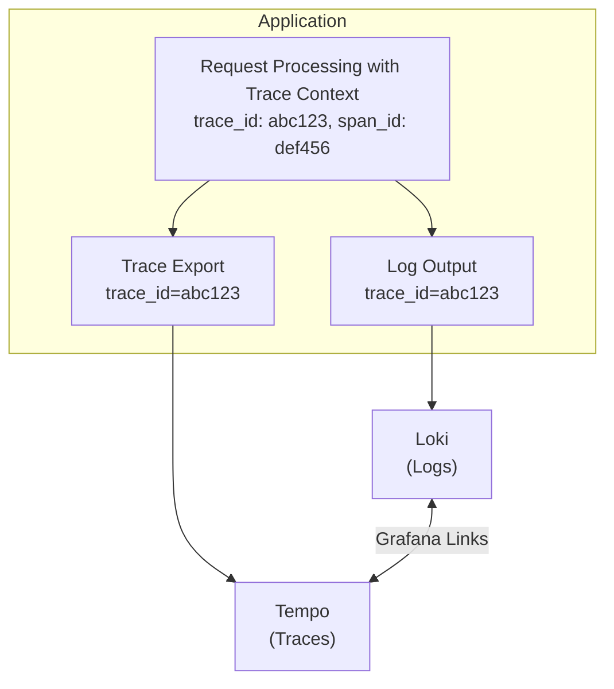

# How to Correlate Logs and Traces with Loki and Tempo

Author: [nawazdhandala](https://www.github.com/nawazdhandala)

Tags: Grafana Loki, Grafana Tempo, Distributed Tracing, Log Correlation, Observability, LogQL, TraceQL

Description: A comprehensive guide to correlating logs and traces using Grafana Loki and Tempo, enabling seamless navigation between log entries and distributed traces for faster debugging and root cause analysis.

---

Correlating logs and traces is essential for modern observability. When investigating an issue, you often start with a log entry showing an error and need to see the full request journey across services. By linking Grafana Loki logs with Grafana Tempo traces through trace IDs, you can seamlessly jump from a log line to its associated distributed trace. This guide shows you how to set up and use this powerful correlation.

## Prerequisites

Before starting, ensure you have:

- Grafana 9.0 or later (trace-to-logs and logs-to-traces features)
- Grafana Loki 2.4 or later
- Grafana Tempo 1.0 or later
- Applications instrumented with OpenTelemetry or similar tracing libraries
- Basic understanding of distributed tracing concepts

## Architecture Overview

The correlation between logs and traces works through a shared identifier - the trace ID:



## Deploying the Observability Stack

### Docker Compose Setup

Create a complete observability stack with Loki, Tempo, and Grafana:

```yaml
version: "3.8"

services:
  loki:
    image: grafana/loki:2.9.4
    container_name: loki
    ports:
      - "3100:3100"
    volumes:
      - ./loki-config.yaml:/etc/loki/config.yaml
      - loki-data:/loki
    command: -config.file=/etc/loki/config.yaml
    networks:
      - observability

  tempo:
    image: grafana/tempo:2.3.1
    container_name: tempo
    ports:
      - "3200:3200"   # Tempo API
      - "4317:4317"   # OTLP gRPC
      - "4318:4318"   # OTLP HTTP
      - "9411:9411"   # Zipkin
    volumes:
      - ./tempo-config.yaml:/etc/tempo/config.yaml
      - tempo-data:/var/tempo
    command: -config.file=/etc/tempo/config.yaml
    networks:
      - observability

  promtail:
    image: grafana/promtail:2.9.4
    container_name: promtail
    volumes:
      - ./promtail-config.yaml:/etc/promtail/config.yaml
      - /var/log:/var/log:ro
      - /var/lib/docker/containers:/var/lib/docker/containers:ro
    command: -config.file=/etc/promtail/config.yaml
    networks:
      - observability

  grafana:
    image: grafana/grafana:10.3.1
    container_name: grafana
    ports:
      - "3000:3000"
    environment:
      - GF_SECURITY_ADMIN_PASSWORD=admin
      - GF_FEATURE_TOGGLES_ENABLE=traceToLogs,lokiLogsDataplane
    volumes:
      - ./grafana-provisioning:/etc/grafana/provisioning
      - grafana-data:/var/lib/grafana
    networks:
      - observability
    depends_on:
      - loki
      - tempo

networks:
  observability:
    driver: bridge

volumes:
  loki-data:
  tempo-data:
  grafana-data:
```

### Loki Configuration

Create `loki-config.yaml`:

```yaml
auth_enabled: false

server:
  http_listen_port: 3100
  grpc_listen_port: 9096

common:
  instance_addr: 127.0.0.1
  path_prefix: /loki
  storage:
    filesystem:
      chunks_directory: /loki/chunks
      rules_directory: /loki/rules
  replication_factor: 1
  ring:
    kvstore:
      store: inmemory

schema_config:
  configs:
    - from: 2020-10-24
      store: tsdb
      object_store: filesystem
      schema: v13
      index:
        prefix: index_
        period: 24h

limits_config:
  reject_old_samples: true
  reject_old_samples_max_age: 168h
  allow_structured_metadata: true

ruler:
  alertmanager_url: http://localhost:9093
```

### Tempo Configuration

Create `tempo-config.yaml`:

```yaml
server:
  http_listen_port: 3200

distributor:
  receivers:
    otlp:
      protocols:
        grpc:
          endpoint: 0.0.0.0:4317
        http:
          endpoint: 0.0.0.0:4318
    zipkin:
      endpoint: 0.0.0.0:9411

ingester:
  max_block_duration: 5m

compactor:
  compaction:
    block_retention: 48h

storage:
  trace:
    backend: local
    local:
      path: /var/tempo/traces
    wal:
      path: /var/tempo/wal

querier:
  search:
    prefer_self: 50

metrics_generator:
  registry:
    external_labels:
      source: tempo
  storage:
    path: /var/tempo/generator/wal
    remote_write:
      - url: http://prometheus:9090/api/v1/write
        send_exemplars: true
```

## Configuring Grafana Data Sources

### Provisioning Data Sources

Create `grafana-provisioning/datasources/datasources.yaml`:

```yaml
apiVersion: 1

datasources:
  - name: Loki
    type: loki
    access: proxy
    url: http://loki:3100
    isDefault: false
    jsonData:
      derivedFields:
        - datasourceUid: tempo
          matcherRegex: "trace_id=(\\w+)"
          name: TraceID
          url: "$${__value.raw}"
        - datasourceUid: tempo
          matcherRegex: '"trace_id":\\s*"(\\w+)"'
          name: TraceID
          url: "$${__value.raw}"
      maxLines: 1000

  - name: Tempo
    type: tempo
    access: proxy
    url: http://tempo:3200
    uid: tempo
    isDefault: false
    jsonData:
      tracesToLogsV2:
        datasourceUid: loki
        spanStartTimeShift: "-1h"
        spanEndTimeShift: "1h"
        tags:
          - key: "service.name"
            value: "service_name"
          - key: "host.name"
            value: "host"
        filterByTraceID: true
        filterBySpanID: false
        customQuery: true
        query: '{$${__tags}} |= "$${__trace.traceId}"'
      serviceMap:
        datasourceUid: prometheus
      nodeGraph:
        enabled: true
      search:
        hide: false
      lokiSearch:
        datasourceUid: loki
```

## Instrumenting Applications for Correlation

### Python Application with OpenTelemetry

```python
import logging
import json
from flask import Flask, request
from opentelemetry import trace
from opentelemetry.sdk.trace import TracerProvider
from opentelemetry.sdk.trace.export import BatchSpanProcessor
from opentelemetry.exporter.otlp.proto.grpc.trace_exporter import OTLPSpanExporter
from opentelemetry.instrumentation.flask import FlaskInstrumentor
from opentelemetry.instrumentation.logging import LoggingInstrumentor

# Configure tracing
trace.set_tracer_provider(TracerProvider())
otlp_exporter = OTLPSpanExporter(endpoint="http://tempo:4317", insecure=True)
trace.get_tracer_provider().add_span_processor(BatchSpanProcessor(otlp_exporter))

# Configure logging to include trace context
class TraceContextFilter(logging.Filter):
    def filter(self, record):
        span = trace.get_current_span()
        if span.is_recording():
            ctx = span.get_span_context()
            record.trace_id = format(ctx.trace_id, '032x')
            record.span_id = format(ctx.span_id, '016x')
        else:
            record.trace_id = '0' * 32
            record.span_id = '0' * 16
        return True

# JSON log formatter for Loki
class JsonFormatter(logging.Formatter):
    def format(self, record):
        log_record = {
            "timestamp": self.formatTime(record),
            "level": record.levelname,
            "message": record.getMessage(),
            "logger": record.name,
            "trace_id": getattr(record, 'trace_id', ''),
            "span_id": getattr(record, 'span_id', ''),
        }
        if record.exc_info:
            log_record["exception"] = self.formatException(record.exc_info)
        return json.dumps(log_record)

# Setup logging
logger = logging.getLogger(__name__)
logger.setLevel(logging.INFO)
handler = logging.StreamHandler()
handler.setFormatter(JsonFormatter())
handler.addFilter(TraceContextFilter())
logger.addHandler(handler)

# Initialize Flask app
app = Flask(__name__)
FlaskInstrumentor().instrument_app(app)
LoggingInstrumentor().instrument(set_logging_format=True)

@app.route('/api/orders', methods=['POST'])
def create_order():
    tracer = trace.get_tracer(__name__)

    with tracer.start_as_current_span("process_order") as span:
        order_id = request.json.get('order_id')
        span.set_attribute("order.id", order_id)

        logger.info(f"Processing order {order_id}")

        # Simulate order processing
        try:
            validate_order(order_id)
            logger.info(f"Order {order_id} validated successfully")
            return {"status": "success", "order_id": order_id}
        except Exception as e:
            logger.error(f"Failed to process order {order_id}: {str(e)}")
            raise

def validate_order(order_id):
    tracer = trace.get_tracer(__name__)
    with tracer.start_as_current_span("validate_order") as span:
        span.set_attribute("order.id", order_id)
        logger.info(f"Validating order {order_id}")
        # Validation logic here

if __name__ == '__main__':
    app.run(host='0.0.0.0', port=8080)
```

### Node.js Application with OpenTelemetry

```javascript
const { NodeTracerProvider } = require('@opentelemetry/sdk-trace-node');
const { OTLPTraceExporter } = require('@opentelemetry/exporter-trace-otlp-grpc');
const { BatchSpanProcessor } = require('@opentelemetry/sdk-trace-base');
const { trace, context } = require('@opentelemetry/api');
const { getNodeAutoInstrumentations } = require('@opentelemetry/auto-instrumentations-node');
const { registerInstrumentations } = require('@opentelemetry/instrumentation');
const express = require('express');
const pino = require('pino');

// Initialize tracing
const provider = new NodeTracerProvider();
const exporter = new OTLPTraceExporter({
  url: 'http://tempo:4317',
});
provider.addSpanProcessor(new BatchSpanProcessor(exporter));
provider.register();

registerInstrumentations({
  instrumentations: [getNodeAutoInstrumentations()],
});

// Configure structured logging with trace context
const logger = pino({
  formatters: {
    log(object) {
      const span = trace.getSpan(context.active());
      if (span) {
        const spanContext = span.spanContext();
        return {
          ...object,
          trace_id: spanContext.traceId,
          span_id: spanContext.spanId,
        };
      }
      return object;
    },
  },
});

const app = express();
app.use(express.json());

app.post('/api/users', async (req, res) => {
  const tracer = trace.getTracer('user-service');

  return tracer.startActiveSpan('createUser', async (span) => {
    const { email } = req.body;
    span.setAttribute('user.email', email);

    logger.info({ email }, 'Creating new user');

    try {
      // Simulate user creation
      const userId = await createUser(email);
      logger.info({ userId, email }, 'User created successfully');

      span.setAttribute('user.id', userId);
      span.end();

      res.json({ userId, email });
    } catch (error) {
      logger.error({ error: error.message, email }, 'Failed to create user');
      span.recordException(error);
      span.end();
      res.status(500).json({ error: error.message });
    }
  });
});

async function createUser(email) {
  const tracer = trace.getTracer('user-service');

  return tracer.startActiveSpan('validateAndSaveUser', async (span) => {
    logger.info({ email }, 'Validating user email');
    // Validation and save logic
    span.end();
    return `user_${Date.now()}`;
  });
}

app.listen(8080, () => {
  logger.info('Server started on port 8080');
});
```

### Go Application with OpenTelemetry

```go
package main

import (
    "context"
    "encoding/json"
    "log/slog"
    "net/http"
    "os"

    "go.opentelemetry.io/otel"
    "go.opentelemetry.io/otel/exporters/otlp/otlptrace/otlptracegrpc"
    "go.opentelemetry.io/otel/sdk/resource"
    sdktrace "go.opentelemetry.io/otel/sdk/trace"
    semconv "go.opentelemetry.io/otel/semconv/v1.21.0"
    "go.opentelemetry.io/otel/trace"
)

// Custom log handler that includes trace context
type TraceContextHandler struct {
    slog.Handler
}

func (h *TraceContextHandler) Handle(ctx context.Context, r slog.Record) error {
    span := trace.SpanFromContext(ctx)
    if span.SpanContext().IsValid() {
        r.AddAttrs(
            slog.String("trace_id", span.SpanContext().TraceID().String()),
            slog.String("span_id", span.SpanContext().SpanID().String()),
        )
    }
    return h.Handler.Handle(ctx, r)
}

func initTracer() (*sdktrace.TracerProvider, error) {
    ctx := context.Background()

    exporter, err := otlptracegrpc.New(ctx,
        otlptracegrpc.WithEndpoint("tempo:4317"),
        otlptracegrpc.WithInsecure(),
    )
    if err != nil {
        return nil, err
    }

    tp := sdktrace.NewTracerProvider(
        sdktrace.WithBatcher(exporter),
        sdktrace.WithResource(resource.NewWithAttributes(
            semconv.SchemaURL,
            semconv.ServiceName("order-service"),
        )),
    )
    otel.SetTracerProvider(tp)
    return tp, nil
}

func main() {
    // Initialize tracing
    tp, err := initTracer()
    if err != nil {
        panic(err)
    }
    defer tp.Shutdown(context.Background())

    // Initialize structured logging with trace context
    baseHandler := slog.NewJSONHandler(os.Stdout, &slog.HandlerOptions{
        Level: slog.LevelInfo,
    })
    logger := slog.New(&TraceContextHandler{Handler: baseHandler})
    slog.SetDefault(logger)

    tracer := otel.Tracer("order-service")

    http.HandleFunc("/api/orders", func(w http.ResponseWriter, r *http.Request) {
        ctx, span := tracer.Start(r.Context(), "handleCreateOrder")
        defer span.End()

        orderID := r.URL.Query().Get("id")
        span.SetAttributes(
            semconv.HTTPMethod(r.Method),
            semconv.HTTPURL(r.URL.String()),
        )

        slog.InfoContext(ctx, "Processing order request",
            "order_id", orderID,
        )

        // Process order
        if err := processOrder(ctx, orderID); err != nil {
            slog.ErrorContext(ctx, "Failed to process order",
                "order_id", orderID,
                "error", err.Error(),
            )
            http.Error(w, err.Error(), http.StatusInternalServerError)
            return
        }

        slog.InfoContext(ctx, "Order processed successfully",
            "order_id", orderID,
        )

        json.NewEncoder(w).Encode(map[string]string{
            "status":   "success",
            "order_id": orderID,
        })
    })

    http.ListenAndServe(":8080", nil)
}

func processOrder(ctx context.Context, orderID string) error {
    tracer := otel.Tracer("order-service")
    ctx, span := tracer.Start(ctx, "processOrder")
    defer span.End()

    slog.InfoContext(ctx, "Validating order", "order_id", orderID)
    // Order processing logic
    return nil
}
```

## Configuring Promtail for Trace ID Extraction

Create `promtail-config.yaml` to extract trace IDs from logs:

```yaml
server:
  http_listen_port: 9080
  grpc_listen_port: 0

positions:
  filename: /tmp/positions.yaml

clients:
  - url: http://loki:3100/loki/api/v1/push

scrape_configs:
  - job_name: containers
    static_configs:
      - targets:
          - localhost
        labels:
          job: docker
          __path__: /var/lib/docker/containers/*/*-json.log
    pipeline_stages:
      # Parse Docker JSON log format
      - json:
          expressions:
            log: log
            stream: stream
            time: time

      # Parse application JSON logs
      - json:
          expressions:
            level: level
            message: message
            trace_id: trace_id
            span_id: span_id
            service: service
          source: log

      # Extract trace_id as a label for efficient querying
      - labels:
          level:
          service:

      # Store trace_id as structured metadata (Loki 2.7+)
      - structured_metadata:
          trace_id:
          span_id:

      # Set timestamp from log
      - timestamp:
          source: time
          format: RFC3339Nano

      # Output the message field
      - output:
          source: message

  - job_name: application-logs
    static_configs:
      - targets:
          - localhost
        labels:
          job: application
          __path__: /var/log/app/*.log
    pipeline_stages:
      - json:
          expressions:
            level: level
            msg: message
            trace_id: trace_id
            span_id: span_id

      - labels:
          level:

      - structured_metadata:
          trace_id:
          span_id:

      - output:
          source: msg
```

## Querying Correlated Data

### Finding Logs by Trace ID in LogQL

```logql
# Find all logs for a specific trace
{job="application"} | json | trace_id="abc123def456789"

# Using structured metadata (Loki 2.7+)
{job="application"} | trace_id="abc123def456789"

# Find error logs with trace context
{job="application"} | json | level="error" | line_format "{{.trace_id}}: {{.message}}"

# Aggregate errors by trace
{job="application"}
| json
| level="error"
| count_over_time({job="application"} | json | level="error" [5m]) by (trace_id)
```

### Finding Traces in Tempo by Service

```traceql
# Find traces for a specific service
{resource.service.name="order-service"}

# Find slow traces
{resource.service.name="order-service" && duration > 1s}

# Find traces with errors
{resource.service.name="order-service" && status = error}

# Find traces by span name
{name="processOrder" && duration > 500ms}
```

## Using Correlation in Grafana

### Navigating from Logs to Traces

1. Open Grafana and go to Explore
2. Select the Loki data source
3. Run a LogQL query:
   ```logql
   {job="application"} | json | level="error"
   ```
4. Expand a log line containing a trace_id
5. Click the "Tempo" link next to the TraceID field
6. View the complete distributed trace in Tempo

### Navigating from Traces to Logs

1. In Grafana Explore, select Tempo data source
2. Search for traces using TraceQL:
   ```traceql
   {resource.service.name="order-service" && status = error}
   ```
3. Select a trace to view its spans
4. Click "Logs for this span" button
5. View all related logs in Loki filtered by trace ID

### Creating a Correlation Dashboard

```json
{
  "dashboard": {
    "title": "Logs and Traces Correlation",
    "panels": [
      {
        "title": "Error Logs with Traces",
        "type": "logs",
        "datasource": "Loki",
        "targets": [
          {
            "expr": "{job=\"application\"} | json | level=\"error\"",
            "refId": "A"
          }
        ],
        "options": {
          "showLabels": true,
          "showTime": true,
          "wrapLogMessage": true,
          "enableLogDetails": true
        }
      },
      {
        "title": "Trace Service Graph",
        "type": "nodeGraph",
        "datasource": "Tempo",
        "targets": [
          {
            "queryType": "serviceMap",
            "refId": "A"
          }
        ]
      },
      {
        "title": "Request Latency by Service",
        "type": "timeseries",
        "datasource": "Tempo",
        "targets": [
          {
            "queryType": "traceql",
            "query": "{} | rate() by (resource.service.name)",
            "refId": "A"
          }
        ]
      }
    ]
  }
}
```

## Advanced Correlation Patterns

### Correlating with Exemplars

Enable exemplars in Tempo to link metrics with traces:

```yaml
# tempo-config.yaml addition
metrics_generator:
  registry:
    external_labels:
      source: tempo
  storage:
    path: /var/tempo/generator/wal
    remote_write:
      - url: http://prometheus:9090/api/v1/write
        send_exemplars: true
  processor:
    service_graphs:
      dimensions:
        - service.namespace
        - service.instance.id
    span_metrics:
      dimensions:
        - service.namespace
        - http.method
        - http.status_code
```

### Multi-Tenant Correlation

For multi-tenant setups, include tenant ID in correlation:

```yaml
# Promtail config for multi-tenant
clients:
  - url: http://loki:3100/loki/api/v1/push
    tenant_id: ${TENANT_ID}

# Grafana data source config
datasources:
  - name: Loki
    type: loki
    jsonData:
      httpHeaderName1: X-Scope-OrgID
    secureJsonData:
      httpHeaderValue1: ${TENANT_ID}
```

## Troubleshooting Correlation Issues

### Trace ID Not Showing as Link

Check your Loki data source derived fields configuration:

```yaml
jsonData:
  derivedFields:
    - datasourceUid: tempo
      matcherRegex: "trace_id=(\\w+)"
      name: TraceID
      url: "$${__value.raw}"
```

### Logs Not Found from Trace

Ensure time ranges overlap:

```yaml
# Tempo data source config
jsonData:
  tracesToLogsV2:
    spanStartTimeShift: "-1h"
    spanEndTimeShift: "1h"
```

### Verify Trace ID Format

Ensure trace IDs are formatted consistently:

```python
# Python - format as 32-character hex string
trace_id = format(ctx.trace_id, '032x')

# JavaScript - ensure hex format
const traceId = spanContext.traceId;  # Already hex string
```

## Best Practices

1. **Consistent Trace ID Format**: Use 32-character lowercase hex strings
2. **Structured Logging**: Use JSON format for easy parsing
3. **Include Both IDs**: Log both trace_id and span_id for precise correlation
4. **Time Synchronization**: Ensure all services use NTP
5. **Label Carefully**: Do not use trace_id as a Loki label (high cardinality)
6. **Use Structured Metadata**: Prefer structured metadata over labels for trace IDs

## Conclusion

Correlating logs and traces with Grafana Loki and Tempo provides powerful debugging capabilities. By embedding trace IDs in your logs and configuring Grafana data sources properly, you can seamlessly navigate between log entries and distributed traces. This integration significantly reduces the time needed to identify and resolve issues in distributed systems.

Key takeaways:
- Instrument applications to include trace context in logs
- Configure Promtail to extract and store trace IDs
- Set up Grafana data source derived fields for correlation
- Use LogQL and TraceQL together for comprehensive debugging
- Follow best practices to maintain efficient correlation at scale
