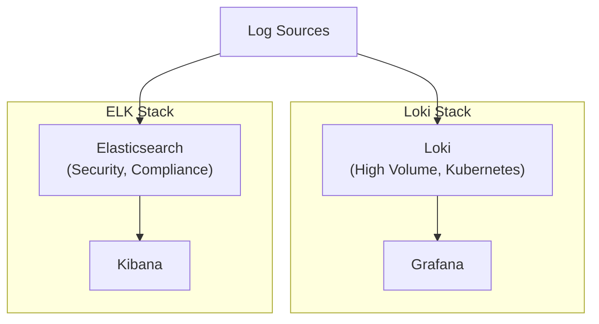

# Loki vs Elasticsearch: Log Management Comparison

Author: [nawazdhandala](https://www.github.com/nawazdhandala)

Tags: Grafana Loki, Elasticsearch, Log Management, Comparison, Cost Analysis, Architecture

Description: A comprehensive comparison of Grafana Loki and Elasticsearch for log management, covering architecture, performance, cost, query capabilities, and use case recommendations.

---

Choosing the right log management solution is critical for effective observability. Grafana Loki and Elasticsearch represent two fundamentally different approaches to log storage and querying. This guide provides an in-depth comparison to help you make an informed decision.

## Architecture Overview

### Elasticsearch Architecture

Elasticsearch indexes the full content of every log line:

```
Log Entry -> Tokenization -> Inverted Index -> Distributed Storage
```

Key components:
- **Master Nodes**: Cluster coordination
- **Data Nodes**: Store data and execute queries
- **Ingest Nodes**: Pre-process documents
- **Coordinating Nodes**: Route requests

### Loki Architecture

Loki indexes only metadata (labels), storing log content compressed:

```
Log Entry -> Label Extraction -> Chunk Storage -> Metadata Index
```

Key components:
- **Distributor**: Receives and validates logs
- **Ingester**: Writes to storage
- **Querier**: Executes queries
- **Compactor**: Manages retention

## Feature Comparison

| Feature | Loki | Elasticsearch |
|---------|------|---------------|
| Indexing | Labels only | Full-text |
| Query Language | LogQL | Query DSL / KQL |
| Storage Cost | Lower | Higher |
| Query Speed (indexed) | Slower | Faster |
| Query Speed (labels) | Fast | Fast |
| Setup Complexity | Lower | Higher |
| Resource Usage | Lower | Higher |
| Schema Management | Minimal | Required |
| Full-Text Search | Basic | Advanced |
| Aggregations | Basic | Advanced |
| Alerting | Native | Requires setup |
| Visualization | Grafana | Kibana |

## Storage and Cost Analysis

### Elasticsearch Storage

```
Storage = Raw Logs + Inverted Index + Replicas
```

Typical overhead: 1.5-3x raw log size

Example for 100GB/day raw logs:
- Index overhead: ~150GB
- Total with replication (1 replica): ~500GB/day
- Monthly storage: ~15TB

### Loki Storage

```
Storage = Compressed Logs + Label Index
```

Typical overhead: 0.2-0.5x raw log size (due to compression)

Example for 100GB/day raw logs:
- Compressed chunks: ~30GB
- Label index: ~5GB
- Monthly storage: ~1TB

### Cost Comparison Example

For 100GB/day ingestion over 30 days:

| Component | Elasticsearch | Loki |
|-----------|--------------|------|
| Storage | 15TB | 1TB |
| Compute (3 nodes) | 3x 16GB RAM | 3x 4GB RAM |
| Monthly Storage Cost (S3) | ~$350 | ~$25 |
| Monthly Compute Cost | ~$400 | ~$150 |
| **Total Monthly** | **~$750** | **~$175** |

## Query Capabilities

### Elasticsearch Query

Full-text search with relevance scoring:

```json
{
  "query": {
    "bool": {
      "must": [
        { "match": { "message": "error" } },
        { "match": { "level": "error" } }
      ],
      "filter": [
        { "range": { "@timestamp": { "gte": "now-1h" } } },
        { "term": { "service": "api-server" } }
      ]
    }
  },
  "aggs": {
    "errors_over_time": {
      "date_histogram": {
        "field": "@timestamp",
        "fixed_interval": "1m"
      }
    }
  }
}
```

### Loki LogQL Query

Label-based selection with content filtering:

```logql
{service="api-server", level="error"} |= "error"
| json
| line_format "{{.message}}"
```

Metric query:
```logql
sum(rate({service="api-server"} |= "error" [5m])) by (service)
```

### Query Performance Comparison

| Query Type | Elasticsearch | Loki |
|------------|--------------|------|
| Exact label match | Fast | Fast |
| Full-text search | Very Fast | Slower (scans) |
| Regex search | Fast | Slower |
| Time-range queries | Fast | Fast |
| Aggregations | Very Fast | Moderate |
| High cardinality | Handles well | Struggles |

## Use Case Recommendations

### Choose Loki When:

1. **Cost is a primary concern**
   - Lower storage costs
   - Fewer compute resources required

2. **You already use Grafana**
   - Native integration
   - Unified observability with metrics and traces

3. **Logs have consistent structure**
   - Kubernetes labels
   - Well-defined metadata

4. **Simple querying needs**
   - Label-based filtering
   - Basic text search
   - Time-range queries

5. **Cloud-native environment**
   - Kubernetes-friendly
   - Object storage backend

### Choose Elasticsearch When:

1. **Full-text search is critical**
   - Complex search queries
   - Fuzzy matching
   - Relevance scoring

2. **Advanced analytics needed**
   - Complex aggregations
   - Machine learning on logs
   - Anomaly detection

3. **High cardinality data**
   - Many unique values
   - Unpredictable fields

4. **Existing ELK investment**
   - Team familiarity
   - Existing dashboards

5. **Compliance requirements**
   - Audit logging
   - Forensic analysis

## Migration Considerations

### Migrating from ELK to Loki

1. **Index Mapping to Labels**
```yaml
# Elasticsearch field mapping
mappings:
  properties:
    kubernetes.namespace: { type: keyword }
    kubernetes.pod: { type: keyword }
    level: { type: keyword }
    message: { type: text }

# Equivalent Loki labels
labels:
  namespace: kubernetes.namespace
  pod: kubernetes.pod
  level: level
# message stored in log line, not indexed
```

2. **Query Translation**

Elasticsearch:
```json
{
  "query": {
    "bool": {
      "must": [
        { "term": { "kubernetes.namespace": "production" } },
        { "match": { "message": "error" } }
      ]
    }
  }
}
```

LogQL:
```logql
{namespace="production"} |= "error"
```

3. **Aggregation Translation**

Elasticsearch:
```json
{
  "aggs": {
    "error_count": {
      "date_histogram": {
        "field": "@timestamp",
        "fixed_interval": "5m"
      }
    }
  }
}
```

LogQL:
```logql
count_over_time({namespace="production"} |= "error" [5m])
```

## Hybrid Approach

Some organizations use both:



Use cases:
- **Loki**: Application logs, Kubernetes workloads
- **Elasticsearch**: Security logs, compliance, full-text search

## Performance Benchmarks

### Ingestion Performance

| Metric | Loki | Elasticsearch |
|--------|------|---------------|
| Lines/sec (3 nodes) | 500K | 200K |
| Bytes/sec | 250MB | 100MB |
| CPU usage | Lower | Higher |
| Memory usage | Lower | Higher |

### Query Performance

| Query Type | Loki | Elasticsearch |
|------------|------|---------------|
| Label filter (1hr) | 2s | 1s |
| Text search (1hr) | 10s | 2s |
| Regex (1hr) | 15s | 5s |
| Aggregation (1hr) | 5s | 2s |

*Note: Benchmarks vary significantly based on hardware, configuration, and query complexity.*

## Operational Comparison

### Loki Operations

Pros:
- Simple configuration
- Native Kubernetes integration
- Low maintenance
- Easy scaling

Cons:
- Limited schema validation
- Fewer optimization options

### Elasticsearch Operations

Pros:
- Mature ecosystem
- Extensive tuning options
- Rich monitoring

Cons:
- Complex cluster management
- Shard management required
- Memory-intensive
- Requires careful capacity planning

## Decision Matrix

| Requirement | Recommended |
|-------------|-------------|
| Kubernetes-native logging | Loki |
| Full-text search required | Elasticsearch |
| Cost-sensitive | Loki |
| Complex analytics | Elasticsearch |
| Small team / minimal ops | Loki |
| Large security/compliance needs | Elasticsearch |
| Grafana ecosystem | Loki |
| ELK ecosystem | Elasticsearch |
| Machine learning on logs | Elasticsearch |
| Simple label-based queries | Loki |

## Conclusion

Both Loki and Elasticsearch are excellent log management solutions, but they serve different needs:

**Choose Loki for:**
- Cost-effective logging
- Cloud-native environments
- Grafana-centric observability
- Label-based log organization

**Choose Elasticsearch for:**
- Full-text search requirements
- Complex analytics and aggregations
- High cardinality data
- Existing ELK investment

The best choice depends on your specific requirements, budget, and existing infrastructure. Many organizations successfully use both for different use cases.
