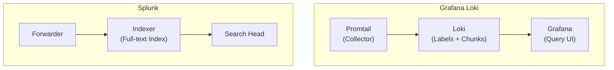

# Loki vs Splunk: Open Source vs Enterprise Logging

Author: [nawazdhandala](https://www.github.com/nawazdhandala)

Tags: Grafana Loki, Splunk, Comparison, Log Management, Open Source, Enterprise, Cost Analysis

Description: A comprehensive comparison of Grafana Loki and Splunk for log management, covering architecture differences, cost analysis, feature comparison, query languages, scalability, and guidance on choosing the right solution for your needs.

---

Choosing between Grafana Loki and Splunk represents a fundamental decision between open-source flexibility and enterprise-grade features. Both are powerful log management solutions, but they differ significantly in architecture, cost structure, and use cases. This guide provides an objective comparison to help you make the right choice for your organization.

## Overview Comparison

### Quick Comparison Table

| Aspect | Grafana Loki | Splunk |
|--------|--------------|--------|
| License | Open Source (AGPLv3) | Commercial |
| Pricing | Free (infrastructure costs) | Per GB ingested |
| Architecture | Index-free (labels only) | Full-text indexing |
| Query Language | LogQL | SPL |
| Learning Curve | Moderate | Steep |
| Setup Complexity | DIY/Self-managed | Managed options available |
| Ecosystem | Grafana stack | Splunk ecosystem |
| Best For | Cost-conscious, cloud-native | Enterprise, compliance-heavy |

### Architecture Comparison



**Loki**: Only indexes labels, stores compressed log chunks. Cheaper storage, slower arbitrary searches.

**Splunk**: Indexes every word. Faster arbitrary searches, higher storage costs.

## Cost Comparison

### Splunk Pricing Model

```
Splunk Pricing (Approximate):
- Splunk Cloud: $15-20+ per GB/day ingested
- Splunk Enterprise: License-based, roughly $1,800-2,000 per GB/day annually

Example - 100 GB/day:
- Splunk Cloud: ~$1,500-2,000/month
- Annual cost: ~$18,000-24,000/year
```

### Loki Cost Model

```
Loki Costs (Self-Hosted):
- Software: Free
- Infrastructure:
  - Compute: 3-5 nodes for HA
  - Storage: S3/GCS costs only
  - No per-GB licensing

Example - 100 GB/day (30-day retention):
- S3 storage (90% compression): ~300 GB = ~$7/month
- EC2/GKE compute: ~$200-500/month
- Total: ~$200-500/month vs $1,500-2,000/month

Annual savings: $15,000-20,000+
```

### Total Cost of Ownership

```yaml
# TCO Comparison - 100 GB/day, 30-day retention

Splunk Enterprise:
  license_annual: $180,000
  infrastructure: $24,000
  admin_fte: 0.5  # Easier management
  training: $5,000
  total_annual: ~$210,000

Loki Self-Hosted:
  license: $0
  infrastructure: $6,000  # Cloud costs
  admin_fte: 1.0  # More DIY work
  training: $2,000
  grafana_enterprise: $0  # Optional
  total_annual: ~$80,000

Savings with Loki: ~$130,000/year (62%)
```

## Query Language Comparison

### Basic Log Searches

**Loki (LogQL):**
```logql
# Find error logs
{job="application"} |= "error"

# Filter by level
{job="application"} | json | level="error"

# Regex search
{job="application"} |~ "failed.*connection"

# Multiple conditions
{job="application", env="production"} |= "error" != "timeout"
```

**Splunk (SPL):**
```spl
# Find error logs
index=application "error"

# Filter by level
index=application | where level="error"

# Regex search
index=application | regex _raw="failed.*connection"

# Multiple conditions
index=application sourcetype=app_logs "error" NOT "timeout"
```

### Aggregations

**Loki (LogQL):**
```logql
# Count errors per service
sum by (service) (
  count_over_time({job="application"} | json | level="error" [5m])
)

# Error rate
sum(rate({job="application"} |= "error" [5m]))

# Top endpoints by requests
topk(10, sum by (endpoint) (
  count_over_time({job="application"} | json [1h])
))
```

**Splunk (SPL):**
```spl
# Count errors per service
index=application level=error
| stats count by service

# Error rate over time
index=application "error"
| timechart span=5m count

# Top endpoints by requests
index=application
| top limit=10 endpoint
```

### Advanced Analytics

**Loki (LogQL):**
```logql
# P95 latency
quantile_over_time(0.95,
  {job="application"} | json | unwrap duration [5m]
) by (service)

# Bytes processed
sum(bytes_over_time({job="application"} [1h]))

# Log rate comparison
sum(rate({job="app", env="prod"} [5m]))
/
sum(rate({job="app", env="staging"} [5m]))
```

**Splunk (SPL):**
```spl
# P95 latency
index=application
| stats perc95(duration) by service

# Bytes processed
index=application
| stats sum(bytes) as total_bytes

# Advanced ML-based analysis
index=application
| anomalydetection field=response_time
```

## Feature Comparison

### Loki Strengths

```yaml
loki_advantages:
  cost:
    - No per-GB licensing
    - Efficient storage (label-only indexing)
    - Use existing object storage

  integration:
    - Native Grafana integration
    - Works with Prometheus labels
    - Part of LGTM stack (Loki, Grafana, Tempo, Mimir)
    - OpenTelemetry support

  simplicity:
    - Simpler architecture
    - Easier horizontal scaling
    - Kubernetes-native deployment

  flexibility:
    - Open source - no vendor lock-in
    - Self-hosted or Grafana Cloud
    - Customizable pipelines
```

### Splunk Strengths

```yaml
splunk_advantages:
  search_power:
    - Full-text indexing (faster arbitrary searches)
    - Advanced SPL analytics
    - Machine learning toolkit (MLTK)
    - Anomaly detection built-in

  enterprise_features:
    - Role-based access control
    - Compliance certifications (SOC2, HIPAA, FedRAMP)
    - Audit logging
    - Data retention policies

  ecosystem:
    - 1000+ apps and add-ons
    - SIEM capabilities (Splunk ES)
    - IT operations (ITSI)
    - Pre-built dashboards

  support:
    - Enterprise support
    - Professional services
    - Training and certification
    - Large community
```

## Performance Comparison

### Query Performance

```
Search Type                  | Loki          | Splunk
-----------------------------|---------------|----------------
Label-based queries          | Very Fast     | Fast
Full-text search (known)     | Fast          | Very Fast
Arbitrary text search        | Slower        | Fast
Aggregations                 | Fast          | Very Fast
Large time ranges            | Moderate      | Fast (indexed)
Real-time tail               | Excellent     | Good
```

### Scalability

**Loki Scaling:**
```yaml
# Horizontal scaling with microservices mode
loki_components:
  distributors: 3-10  # Handle ingestion
  ingesters: 6-20     # Process and store
  queriers: 5-15      # Handle queries
  query_frontend: 2-3 # Query optimization
  compactor: 1-2      # Background tasks

# Scale each independently based on load
```

**Splunk Scaling:**
```yaml
# Scale by adding indexers and search heads
splunk_components:
  indexers: 3-50+     # Store and index
  search_heads: 3-20  # Query processing
  forwarders: unlimited  # Collection
  cluster_master: 1   # Coordination
```

## Use Case Fit

### When to Choose Loki

```yaml
choose_loki_when:
  budget_constraints:
    - Limited budget for log management
    - High log volumes (100+ GB/day)
    - Cost is primary concern

  cloud_native:
    - Kubernetes-based infrastructure
    - Already using Prometheus
    - Grafana is your visualization tool

  simplicity:
    - Known search patterns (labels)
    - Don't need full-text search everywhere
    - Want to avoid vendor lock-in

  integration:
    - Need logs-metrics-traces correlation
    - Using OpenTelemetry
    - Part of observability modernization

example_scenarios:
  - Startup with limited budget
  - Cloud-native microservices
  - DevOps teams with Grafana expertise
  - High-volume, label-based log queries
```

### When to Choose Splunk

```yaml
choose_splunk_when:
  enterprise_requirements:
    - Compliance requirements (SOC2, HIPAA)
    - Need audit trails
    - Enterprise support required

  advanced_analytics:
    - Complex SPL queries
    - Machine learning on logs
    - Anomaly detection
    - Security use cases (SIEM)

  search_patterns:
    - Frequent arbitrary text searches
    - Unknown search patterns
    - Ad-hoc investigations

  ecosystem:
    - Need pre-built apps
    - Integration with other Splunk products
    - Existing Splunk investment

example_scenarios:
  - Enterprise with compliance needs
  - Security operations center (SOC)
  - IT operations (ITSI)
  - Organizations with Splunk expertise
```

## Migration Considerations

### Migrating from Splunk to Loki

```yaml
# Migration planning
migration_steps:
  1_assessment:
    - Inventory current Splunk usage
    - Identify top queries and dashboards
    - Calculate current ingestion volume
    - Map Splunk indexes to Loki labels

  2_pilot:
    - Start with non-critical logs
    - Run Loki parallel to Splunk
    - Validate query equivalents
    - Train team on LogQL

  3_migration:
    - Migrate by application/team
    - Keep Splunk for historical data
    - Gradual cutover over weeks/months

  4_optimization:
    - Tune label cardinality
    - Optimize retention policies
    - Build Grafana dashboards
```

### Query Translation Examples

```yaml
# Splunk to LogQL translations

# Basic search
splunk: 'index=app "error"'
logql: '{job="app"} |= "error"'

# Field extraction
splunk: 'index=app | rex "user=(?<user>\w+)"'
logql: '{job="app"} | regexp "user=(?P<user>\\w+)"'

# Stats
splunk: 'index=app | stats count by host'
logql: 'sum by (host) (count_over_time({job="app"} [1h]))'

# Timechart
splunk: 'index=app | timechart span=5m count'
logql: 'sum(count_over_time({job="app"} [5m]))'

# Top values
splunk: 'index=app | top limit=10 status'
logql: 'topk(10, sum by (status) (count_over_time({job="app"} | json [1h])))'
```

## Hybrid Approach

### Using Both Together

```yaml
# Hybrid architecture
hybrid_strategy:
  splunk_for:
    - Security logs (SIEM requirements)
    - Compliance-required data
    - Complex investigations
    - Historical analytics

  loki_for:
    - Application logs (high volume)
    - Kubernetes/container logs
    - Development environments
    - Cost-sensitive workloads

# Integration via forwarding
architecture:
  - Application logs -> Promtail -> Loki
  - Security logs -> Splunk Forwarder -> Splunk
  - Both visualized in Grafana (Splunk data source available)
```

## Decision Framework

### Scoring Matrix

```
Factor                    | Weight | Loki Score | Splunk Score
--------------------------|--------|------------|-------------
Total Cost of Ownership   | 25%    | 9          | 4
Search Performance        | 15%    | 6          | 9
Ease of Use              | 10%    | 7          | 8
Enterprise Features       | 15%    | 5          | 9
Kubernetes Integration    | 10%    | 9          | 6
Compliance/Security       | 10%    | 6          | 9
Community/Ecosystem       | 10%    | 7          | 8
Vendor Independence       | 5%     | 10         | 3

Weighted Score:                    | 7.1        | 6.8

Note: Scores vary based on specific requirements
```

## Conclusion

Grafana Loki and Splunk serve different market segments and use cases. Loki excels in cost-efficiency, cloud-native environments, and organizations already invested in the Grafana ecosystem. Splunk leads in enterprise features, compliance capabilities, and advanced analytics.

Key decision factors:
- **Budget**: Loki significantly cheaper at scale
- **Search patterns**: Splunk faster for arbitrary searches; Loki efficient for label-based queries
- **Compliance**: Splunk has more enterprise certifications
- **Ecosystem**: Splunk has richer app ecosystem; Loki integrates with LGTM stack
- **Skills**: Consider team expertise with each platform
- **Scale**: Both scale well, but Loki is more cost-effective at high volumes

Many organizations successfully run both - using Loki for high-volume application logs and Splunk for security and compliance workloads. The best choice depends on your specific requirements, budget, and technical environment.
