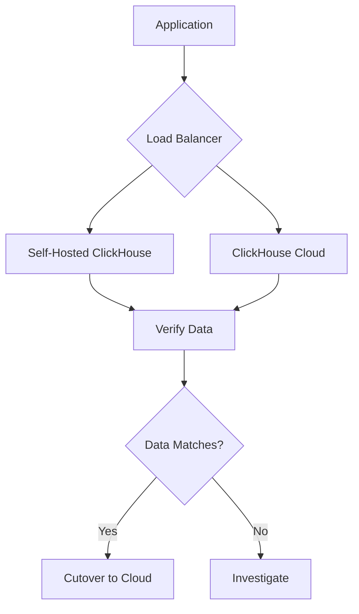

# How to Migrate from Self-Hosted ClickHouse to ClickHouse Cloud

Author: [nawazdhandala](https://www.github.com/nawazdhandala)

Tags: ClickHouse, ClickHouse Cloud, Migration, Self-Hosted, Managed Service

Description: A comprehensive guide to migrating from self-hosted ClickHouse to ClickHouse Cloud, covering data migration strategies, configuration differences, and best practices for a seamless transition.

---

Migrating from self-hosted ClickHouse to ClickHouse Cloud can reduce operational overhead while maintaining performance. This guide covers the complete migration process, from planning to cutover.

## Migration Planning

### Pre-Migration Assessment

```sql
-- Self-hosted: Assess current usage
SELECT
    database,
    table,
    formatReadableSize(sum(bytes_on_disk)) AS size,
    sum(rows) AS total_rows,
    count() AS parts
FROM system.parts
WHERE active
GROUP BY database, table
ORDER BY sum(bytes_on_disk) DESC;

-- Check total cluster size
SELECT
    formatReadableSize(sum(bytes_on_disk)) AS total_size,
    sum(rows) AS total_rows
FROM system.parts
WHERE active;
```

### Compatibility Check

```sql
-- Check ClickHouse version
SELECT version();

-- List table engines in use
SELECT
    engine,
    count() AS table_count
FROM system.tables
WHERE database NOT IN ('system', 'INFORMATION_SCHEMA')
GROUP BY engine;

-- Check for unsupported features
-- ClickHouse Cloud supports most features, but verify:
-- - Custom UDFs
-- - External dictionaries (external sources)
-- - Kafka/RabbitMQ engines (use ClickPipes instead)
```

## Migration Methods

### Method 1: Remote Table Copy

```sql
-- On ClickHouse Cloud: Create table structure
CREATE TABLE events AS remote(
    'self-hosted-host:9000',
    'default',
    'events',
    'user',
    'password'
) ENGINE = MergeTree()
ORDER BY (timestamp, event_id);

-- Copy data using remote() function
INSERT INTO events
SELECT * FROM remote(
    'self-hosted-host:9440',
    'default',
    'events',
    'user',
    'password'
)
SETTINGS max_execution_time = 0;
```

### Method 2: S3 Export/Import

```sql
-- Self-hosted: Export to S3
INSERT INTO FUNCTION s3(
    'https://bucket.s3.amazonaws.com/migration/events/',
    'access_key',
    'secret_key',
    'Parquet'
)
SELECT * FROM events;

-- ClickHouse Cloud: Import from S3
INSERT INTO events
SELECT * FROM s3(
    'https://bucket.s3.amazonaws.com/migration/events/*.parquet',
    'Parquet'
);
```

### Method 3: clickhouse-backup Tool

```bash
# Install clickhouse-backup on self-hosted
wget https://github.com/AlexAkulov/clickhouse-backup/releases/latest/download/clickhouse-backup-linux-amd64.tar.gz
tar -xzf clickhouse-backup-linux-amd64.tar.gz

# Configure for S3
cat > /etc/clickhouse-backup/config.yml << EOF
general:
  remote_storage: s3
s3:
  access_key: "your-access-key"
  secret_key: "your-secret-key"
  bucket: "migration-bucket"
  region: "us-east-1"
  path: "backups"
EOF

# Create backup
clickhouse-backup create backup_$(date +%Y%m%d)

# Upload to S3
clickhouse-backup upload backup_$(date +%Y%m%d)

# On ClickHouse Cloud: Restore using support team
# Contact ClickHouse Cloud support for restoration
```

## Schema Migration

### Table Definitions

```sql
-- Export table schemas from self-hosted
SELECT
    'CREATE TABLE ' || database || '.' || name || ' (' ||
    (SELECT groupConcat(name || ' ' || type, ', ')
     FROM system.columns
     WHERE database = t.database AND table = t.name) ||
    ') ENGINE = ' || engine_full
FROM system.tables t
WHERE database NOT IN ('system', 'INFORMATION_SCHEMA')
FORMAT TabSeparated;

-- Or use SHOW CREATE TABLE
SHOW CREATE TABLE events;
```

### Modify for Cloud Compatibility

```sql
-- Self-hosted table with Kafka engine
CREATE TABLE events_kafka (...)
ENGINE = Kafka
SETTINGS kafka_broker_list = 'kafka:9092', ...;

-- ClickHouse Cloud: Use ClickPipes for Kafka ingestion
-- Configure via UI: Settings > ClickPipes > Add Kafka Source

-- Self-hosted: Dictionary from external MySQL
CREATE DICTIONARY products_dict (...)
SOURCE(MYSQL(...))
...;

-- ClickHouse Cloud: Import dictionary data as a table
CREATE TABLE products (...)
ENGINE = MergeTree()
ORDER BY product_id;

-- Then create dictionary from table
CREATE DICTIONARY products_dict (...)
SOURCE(CLICKHOUSE(TABLE 'products'))
...;
```

## Data Migration Scripts

### Python Migration Script

```python
#!/usr/bin/env python3
"""ClickHouse Self-Hosted to Cloud Migration"""

import clickhouse_connect
from concurrent.futures import ThreadPoolExecutor
from datetime import datetime, timedelta

class ClickHouseMigrator:
    def __init__(self, source_config, target_config):
        self.source = clickhouse_connect.get_client(**source_config)
        self.target = clickhouse_connect.get_client(**target_config)

    def get_tables(self, database='default'):
        """List tables to migrate"""
        result = self.source.query(f"""
            SELECT name, engine
            FROM system.tables
            WHERE database = '{database}'
              AND engine LIKE '%MergeTree%'
        """)
        return result.result_rows

    def migrate_schema(self, database, table):
        """Migrate table schema"""
        ddl = self.source.query(f"SHOW CREATE TABLE {database}.{table}")
        create_stmt = ddl.result_rows[0][0]

        # Modify for cloud compatibility if needed
        self.target.command(create_stmt)
        print(f"Created table {database}.{table}")

    def migrate_data_chunked(self, database, table, date_column, chunk_days=1):
        """Migrate data in date chunks"""
        # Get date range
        date_range = self.source.query(f"""
            SELECT min({date_column}), max({date_column})
            FROM {database}.{table}
        """).result_rows[0]

        start_date, end_date = date_range
        current_date = start_date

        while current_date <= end_date:
            next_date = current_date + timedelta(days=chunk_days)

            # Export chunk
            self.source.command(f"""
                INSERT INTO FUNCTION s3(
                    'https://bucket.s3.amazonaws.com/migration/{table}/{current_date}/',
                    'key', 'secret', 'Parquet'
                )
                SELECT * FROM {database}.{table}
                WHERE {date_column} >= '{current_date}'
                  AND {date_column} < '{next_date}'
            """)

            # Import to cloud
            self.target.command(f"""
                INSERT INTO {database}.{table}
                SELECT * FROM s3(
                    'https://bucket.s3.amazonaws.com/migration/{table}/{current_date}/*.parquet',
                    'Parquet'
                )
            """)

            print(f"Migrated {table} for {current_date}")
            current_date = next_date

    def validate_migration(self, database, table):
        """Validate row counts match"""
        source_count = self.source.query(
            f"SELECT count() FROM {database}.{table}"
        ).result_rows[0][0]

        target_count = self.target.query(
            f"SELECT count() FROM {database}.{table}"
        ).result_rows[0][0]

        match = source_count == target_count
        print(f"{table}: Source={source_count}, Target={target_count}, Match={match}")
        return match

# Usage
migrator = ClickHouseMigrator(
    source_config={
        'host': 'self-hosted-server',
        'port': 8123,
        'username': 'default',
        'password': 'password'
    },
    target_config={
        'host': 'xxx.clickhouse.cloud',
        'port': 8443,
        'username': 'default',
        'password': 'cloud-password',
        'secure': True
    }
)

# Migrate
for table, engine in migrator.get_tables():
    migrator.migrate_schema('default', table)
    migrator.migrate_data_chunked('default', table, 'event_date')
    migrator.validate_migration('default', table)
```

## Configuration Differences

### Settings Comparison

| Setting | Self-Hosted | ClickHouse Cloud |
|---------|-------------|------------------|
| max_memory_usage | Configurable | Managed |
| max_execution_time | Configurable | Default limits |
| background_pool_size | Configurable | Auto-scaled |
| TLS | Optional | Always enabled |

### User Migration

```sql
-- Export users (self-hosted)
SHOW CREATE USER default;
SHOW GRANTS FOR default;

-- Create users in Cloud
CREATE USER analyst IDENTIFIED BY 'password';
GRANT SELECT ON default.* TO analyst;
```

## Cutover Strategy

### Dual-Write Period



### Cutover Steps

1. **Stop writes** to self-hosted
2. **Final sync** of remaining data
3. **Validate** row counts and checksums
4. **Update** connection strings
5. **Monitor** queries and performance
6. **Decommission** self-hosted after validation period

## Post-Migration

### Validate Performance

```sql
-- Compare query performance
-- Run same queries on both and compare:
SELECT
    query,
    query_duration_ms,
    read_rows,
    read_bytes
FROM system.query_log
WHERE type = 'QueryFinish'
  AND event_time >= now() - INTERVAL 1 HOUR
ORDER BY query_duration_ms DESC;
```

### Clean Up

```bash
# After successful migration:
# 1. Decommission self-hosted servers
# 2. Delete S3 migration data
# 3. Update documentation
# 4. Archive old configurations
```

## Conclusion

Migrating to ClickHouse Cloud involves:

1. **Assessment** - Evaluate current setup
2. **Schema migration** - Adapt for cloud compatibility
3. **Data transfer** - Use S3 or remote() function
4. **Validation** - Verify data integrity
5. **Cutover** - Switch traffic with minimal downtime

The result is reduced operational overhead with ClickHouse Cloud's managed infrastructure.
