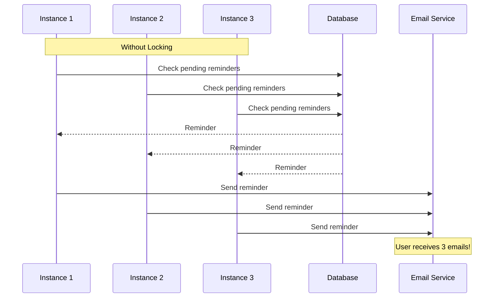
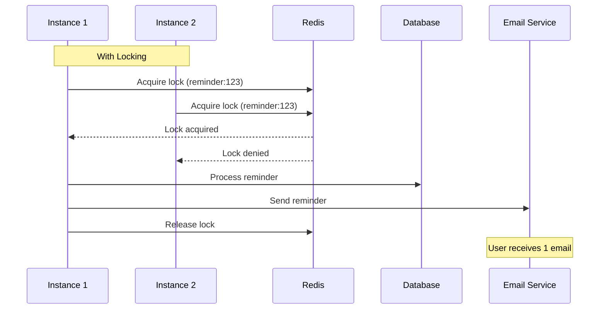

# How to Implement Distributed Locks with Redlock in Node.js

Author: [nawazdhandala](https://www.github.com/nawazdhandala)

Tags: Node.js, Redis, Distributed Systems, Redlock, Concurrency, TypeScript, Backend

Description: Learn how to implement distributed locks in Node.js using the Redlock algorithm. This guide covers lock acquisition, automatic extension, fault tolerance across multiple Redis instances, and practical patterns for preventing race conditions in distributed systems.

---

Distributed locks are essential when multiple instances of your application need to coordinate access to shared resources. Without proper locking, race conditions can lead to data corruption, duplicate processing, or inconsistent state. The Redlock algorithm, proposed by Redis creator Salvatore Sanfilippo, provides a way to implement distributed locks that remain reliable even when some Redis instances fail.

## Why Distributed Locks?

Consider a scheduled job that sends reminder emails. If you have three application instances, without coordination all three might send the same reminder:



With distributed locks, only one instance processes each reminder:



## Basic Redlock Implementation

The Redlock algorithm acquires locks across multiple independent Redis instances. A lock is considered acquired only when the majority of instances grant it:

```typescript
// redlock.ts
import Redis from 'ioredis';
import crypto from 'crypto';

interface Lock {
  resource: string;
  value: string;
  validity: number;
  attempts: number;
}

interface RedlockOptions {
  driftFactor?: number;  // Clock drift factor
  retryCount?: number;   // Number of retry attempts
  retryDelay?: number;   // Delay between retries in ms
  retryJitter?: number;  // Random jitter for retry delay
}

export class Redlock {
  private clients: Redis[];
  private options: Required<RedlockOptions>;
  private quorum: number;

  // Lua script for atomic unlock
  private unlockScript = `
    if redis.call("get", KEYS[1]) == ARGV[1] then
      return redis.call("del", KEYS[1])
    else
      return 0
    end
  `;

  // Lua script for atomic extend
  private extendScript = `
    if redis.call("get", KEYS[1]) == ARGV[1] then
      return redis.call("pexpire", KEYS[1], ARGV[2])
    else
      return 0
    end
  `;

  constructor(clients: Redis[], options: RedlockOptions = {}) {
    this.clients = clients;
    this.quorum = Math.floor(clients.length / 2) + 1;

    this.options = {
      driftFactor: options.driftFactor ?? 0.01,
      retryCount: options.retryCount ?? 10,
      retryDelay: options.retryDelay ?? 200,
      retryJitter: options.retryJitter ?? 100,
    };
  }

  async acquire(resource: string, ttl: number): Promise<Lock | null> {
    const value = crypto.randomBytes(16).toString('hex');

    for (let attempt = 0; attempt < this.options.retryCount; attempt++) {
      const startTime = Date.now();
      let successCount = 0;

      // Try to acquire lock on all instances
      const results = await Promise.all(
        this.clients.map((client) => this.tryLock(client, resource, value, ttl))
      );

      successCount = results.filter(Boolean).length;

      // Calculate validity time accounting for clock drift
      const elapsedTime = Date.now() - startTime;
      const drift = Math.round(ttl * this.options.driftFactor) + 2;
      const validity = ttl - elapsedTime - drift;

      // Check if we have quorum and lock is still valid
      if (successCount >= this.quorum && validity > 0) {
        return {
          resource,
          value,
          validity,
          attempts: attempt + 1,
        };
      }

      // Failed to acquire - release any locks we did get
      await this.releaseAll(resource, value);

      // Wait before retry with jitter
      const delay = this.options.retryDelay + Math.random() * this.options.retryJitter;
      await this.sleep(delay);
    }

    return null;
  }

  async release(lock: Lock): Promise<boolean> {
    return this.releaseAll(lock.resource, lock.value);
  }

  async extend(lock: Lock, ttl: number): Promise<Lock | null> {
    const startTime = Date.now();
    let successCount = 0;

    const results = await Promise.all(
      this.clients.map((client) => this.tryExtend(client, lock.resource, lock.value, ttl))
    );

    successCount = results.filter(Boolean).length;

    const elapsedTime = Date.now() - startTime;
    const drift = Math.round(ttl * this.options.driftFactor) + 2;
    const validity = ttl - elapsedTime - drift;

    if (successCount >= this.quorum && validity > 0) {
      return {
        ...lock,
        validity,
      };
    }

    return null;
  }

  private async tryLock(client: Redis, resource: string, value: string, ttl: number): Promise<boolean> {
    try {
      const result = await client.set(resource, value, 'PX', ttl, 'NX');
      return result === 'OK';
    } catch (error) {
      console.error('Lock acquisition error:', error);
      return false;
    }
  }

  private async tryExtend(client: Redis, resource: string, value: string, ttl: number): Promise<boolean> {
    try {
      const result = await client.eval(this.extendScript, 1, resource, value, ttl);
      return result === 1;
    } catch (error) {
      console.error('Lock extension error:', error);
      return false;
    }
  }

  private async releaseAll(resource: string, value: string): Promise<boolean> {
    const results = await Promise.all(
      this.clients.map(async (client) => {
        try {
          await client.eval(this.unlockScript, 1, resource, value);
          return true;
        } catch (error) {
          return false;
        }
      })
    );

    return results.filter(Boolean).length >= this.quorum;
  }

  private sleep(ms: number): Promise<void> {
    return new Promise((resolve) => setTimeout(resolve, ms));
  }
}
```

## Using the Redlock Implementation

```typescript
// usage.ts
import Redis from 'ioredis';
import { Redlock } from './redlock';

// Connect to multiple independent Redis instances
const redisClients = [
  new Redis({ host: 'redis1.example.com', port: 6379 }),
  new Redis({ host: 'redis2.example.com', port: 6379 }),
  new Redis({ host: 'redis3.example.com', port: 6379 }),
];

const redlock = new Redlock(redisClients, {
  retryCount: 5,
  retryDelay: 200,
});

// Example: Process a job with exclusive access
async function processJob(jobId: string): Promise<void> {
  const lock = await redlock.acquire(`job:${jobId}`, 30000); // 30 second TTL

  if (!lock) {
    console.log(`Could not acquire lock for job ${jobId}`);
    return;
  }

  try {
    console.log(`Processing job ${jobId}`);
    // Do your work here
    await doWork(jobId);
  } finally {
    await redlock.release(lock);
    console.log(`Released lock for job ${jobId}`);
  }
}
```

## Auto-Extending Locks

For long-running operations, automatically extend the lock before it expires:

```typescript
// auto-extend-lock.ts
import { Redlock, Lock } from './redlock';

export class AutoExtendingLock {
  private lock: Lock | null = null;
  private extendInterval: NodeJS.Timeout | null = null;
  private redlock: Redlock;
  private resource: string;
  private ttl: number;

  constructor(redlock: Redlock, resource: string, ttl: number) {
    this.redlock = redlock;
    this.resource = resource;
    this.ttl = ttl;
  }

  async acquire(): Promise<boolean> {
    this.lock = await this.redlock.acquire(this.resource, this.ttl);

    if (!this.lock) {
      return false;
    }

    // Start auto-extension at 2/3 of TTL
    const extendAt = Math.floor(this.ttl * 2 / 3);
    this.extendInterval = setInterval(() => this.extend(), extendAt);

    return true;
  }

  private async extend(): Promise<void> {
    if (!this.lock) return;

    const extended = await this.redlock.extend(this.lock, this.ttl);

    if (extended) {
      this.lock = extended;
    } else {
      console.error('Failed to extend lock - it may have expired');
      this.stop();
    }
  }

  async release(): Promise<void> {
    this.stop();

    if (this.lock) {
      await this.redlock.release(this.lock);
      this.lock = null;
    }
  }

  private stop(): void {
    if (this.extendInterval) {
      clearInterval(this.extendInterval);
      this.extendInterval = null;
    }
  }

  isHeld(): boolean {
    return this.lock !== null;
  }
}

// Usage
async function processLongRunningTask(taskId: string): Promise<void> {
  const lock = new AutoExtendingLock(redlock, `task:${taskId}`, 10000);

  if (!await lock.acquire()) {
    console.log('Could not acquire lock');
    return;
  }

  try {
    // This can run for minutes - lock auto-extends
    await veryLongOperation();
  } finally {
    await lock.release();
  }
}
```

## Lock Manager with Higher-Level API

```typescript
// lock-manager.ts
import { Redlock } from './redlock';

export class LockManager {
  private redlock: Redlock;
  private defaultTTL: number;

  constructor(redlock: Redlock, defaultTTL: number = 30000) {
    this.redlock = redlock;
    this.defaultTTL = defaultTTL;
  }

  // Execute callback with lock
  async withLock<T>(
    resource: string,
    callback: () => Promise<T>,
    options: { ttl?: number } = {}
  ): Promise<T> {
    const ttl = options.ttl ?? this.defaultTTL;
    const lock = await this.redlock.acquire(resource, ttl);

    if (!lock) {
      throw new Error(`Failed to acquire lock for resource: ${resource}`);
    }

    try {
      return await callback();
    } finally {
      await this.redlock.release(lock);
    }
  }

  // Try to execute with lock, return null if lock unavailable
  async tryWithLock<T>(
    resource: string,
    callback: () => Promise<T>,
    options: { ttl?: number } = {}
  ): Promise<T | null> {
    const ttl = options.ttl ?? this.defaultTTL;
    const lock = await this.redlock.acquire(resource, ttl);

    if (!lock) {
      return null;
    }

    try {
      return await callback();
    } finally {
      await this.redlock.release(lock);
    }
  }

  // Execute with multiple locks
  async withLocks<T>(
    resources: string[],
    callback: () => Promise<T>,
    options: { ttl?: number } = {}
  ): Promise<T> {
    const ttl = options.ttl ?? this.defaultTTL;
    const locks = [];

    try {
      // Acquire all locks (in sorted order to prevent deadlocks)
      for (const resource of resources.sort()) {
        const lock = await this.redlock.acquire(resource, ttl);
        if (!lock) {
          throw new Error(`Failed to acquire lock for: ${resource}`);
        }
        locks.push(lock);
      }

      return await callback();
    } finally {
      // Release all locks
      for (const lock of locks) {
        await this.redlock.release(lock);
      }
    }
  }
}

// Usage examples
const lockManager = new LockManager(redlock);

// Simple lock usage
await lockManager.withLock('user:123:profile', async () => {
  const user = await db.users.findById('123');
  user.lastLogin = new Date();
  await db.users.save(user);
});

// Multiple locks for transferring between accounts
await lockManager.withLocks(
  ['account:from:123', 'account:to:456'],
  async () => {
    await transferFunds('123', '456', 100);
  }
);
```

## Practical Patterns

### Idempotent Job Processing

```typescript
// job-processor.ts
async function processJobIdempotent(jobId: string): Promise<void> {
  const result = await lockManager.tryWithLock(
    `job:${jobId}`,
    async () => {
      // Check if already processed
      const job = await db.jobs.findById(jobId);

      if (job.status === 'completed') {
        console.log(`Job ${jobId} already processed`);
        return { skipped: true };
      }

      // Process job
      await executeJob(job);

      // Mark as completed
      await db.jobs.update(jobId, { status: 'completed' });

      return { skipped: false };
    },
    { ttl: 60000 }
  );

  if (result === null) {
    console.log(`Job ${jobId} is being processed by another instance`);
  }
}
```

### Singleton Scheduler

Ensure only one instance runs scheduled tasks:

```typescript
// scheduler.ts
class DistributedScheduler {
  private lockManager: LockManager;
  private isLeader: boolean = false;
  private leaderLock: AutoExtendingLock | null = null;

  constructor(lockManager: LockManager, private redlock: Redlock) {
    this.lockManager = lockManager;
  }

  async start(): Promise<void> {
    await this.tryBecomeLeader();

    // Retry becoming leader periodically
    setInterval(() => this.tryBecomeLeader(), 10000);
  }

  private async tryBecomeLeader(): Promise<void> {
    if (this.isLeader) return;

    this.leaderLock = new AutoExtendingLock(this.redlock, 'scheduler:leader', 15000);

    if (await this.leaderLock.acquire()) {
      this.isLeader = true;
      console.log('This instance is now the scheduler leader');
      this.runScheduledTasks();
    }
  }

  private runScheduledTasks(): void {
    if (!this.isLeader) return;

    // Run your scheduled tasks here
    setInterval(async () => {
      if (!this.isLeader) return;

      console.log('Running scheduled tasks...');
      await this.processReminders();
      await this.cleanupExpiredSessions();
    }, 60000);
  }

  private async processReminders(): Promise<void> {
    const reminders = await db.reminders.findPending();

    for (const reminder of reminders) {
      await lockManager.tryWithLock(
        `reminder:${reminder.id}`,
        async () => {
          await sendReminder(reminder);
          await db.reminders.markSent(reminder.id);
        }
      );
    }
  }

  private async cleanupExpiredSessions(): Promise<void> {
    await lockManager.withLock('cleanup:sessions', async () => {
      await db.sessions.deleteExpired();
    });
  }
}
```

### Rate-Limited Operations

```typescript
// rate-limiter.ts
async function rateLimitedOperation(
  userId: string,
  operation: () => Promise<void>
): Promise<boolean> {
  const key = `ratelimit:${userId}`;

  const result = await lockManager.tryWithLock(
    key,
    async () => {
      // Check rate limit
      const count = await redis.incr(`${key}:count`);

      if (count === 1) {
        await redis.expire(`${key}:count`, 60); // 60 second window
      }

      if (count > 10) {
        throw new Error('Rate limit exceeded');
      }

      await operation();
      return true;
    },
    { ttl: 5000 }
  );

  return result !== null;
}
```

## Error Handling and Monitoring

```typescript
// monitored-lock.ts
import { EventEmitter } from 'events';

class MonitoredLockManager extends EventEmitter {
  private lockManager: LockManager;
  private metrics = {
    acquired: 0,
    released: 0,
    failed: 0,
    timeouts: 0,
  };

  constructor(lockManager: LockManager) {
    super();
    this.lockManager = lockManager;
  }

  async withLock<T>(
    resource: string,
    callback: () => Promise<T>,
    options: { ttl?: number; timeout?: number } = {}
  ): Promise<T> {
    const startTime = Date.now();

    try {
      const result = await this.lockManager.withLock(resource, callback, options);

      this.metrics.acquired++;
      this.metrics.released++;

      this.emit('lock:success', {
        resource,
        duration: Date.now() - startTime,
      });

      return result;
    } catch (error) {
      this.metrics.failed++;

      this.emit('lock:failure', {
        resource,
        error: (error as Error).message,
        duration: Date.now() - startTime,
      });

      throw error;
    }
  }

  getMetrics() {
    return { ...this.metrics };
  }
}

// Usage with monitoring
const monitoredLocks = new MonitoredLockManager(lockManager);

monitoredLocks.on('lock:failure', ({ resource, error }) => {
  console.error(`Lock failure for ${resource}: ${error}`);
  // Send to monitoring system
});

// Expose metrics endpoint
app.get('/metrics/locks', (req, res) => {
  res.json(monitoredLocks.getMetrics());
});
```

## Summary

| Aspect | Implementation |
|--------|---------------|
| **Quorum** | Majority of Redis instances must grant lock |
| **TTL** | Locks auto-expire to prevent deadlocks |
| **Clock Drift** | Account for time differences between servers |
| **Auto-Extension** | Extend locks for long-running operations |
| **Fencing** | Use lock value to verify ownership |

Distributed locks with Redlock provide a reliable way to coordinate access to shared resources across multiple application instances. The algorithm tolerates Redis instance failures while preventing split-brain scenarios. Use distributed locks for job processing, scheduled tasks, rate limiting, and any operation that must run exclusively across your cluster. Remember that locks should be held for the minimum time necessary and always have proper error handling to release locks when operations fail.
