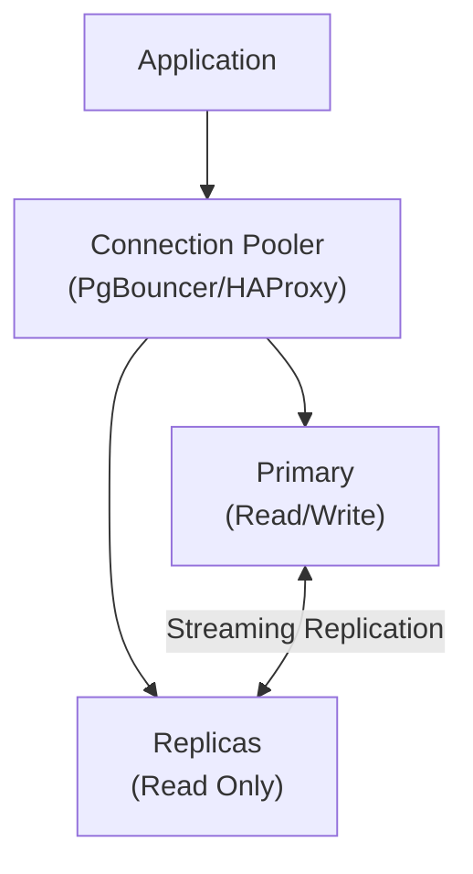

# How to Implement PostgreSQL Read Replicas

Author: [nawazdhandala](https://www.github.com/nawazdhandala)

Tags: PostgreSQL, Read Replicas, Replication, Scaling, Load Balancing, High Availability

Description: A comprehensive guide to implementing PostgreSQL read replicas for horizontal read scaling, covering streaming replication setup, connection routing, load balancing, and application integration patterns.

---

Read replicas allow you to scale PostgreSQL read capacity by distributing queries across multiple servers. This guide covers setting up read replicas using streaming replication and routing read traffic effectively.

## Prerequisites

- PostgreSQL 14+ installed
- Multiple servers (primary and replicas)
- Network connectivity between servers
- Basic understanding of PostgreSQL replication

## Architecture Overview



## Setting Up the Primary Server

### Configure postgresql.conf

```conf
# /etc/postgresql/16/main/postgresql.conf

# Enable replication
wal_level = replica
max_wal_senders = 10
max_replication_slots = 10

# Keep WAL for replicas
wal_keep_size = 1GB

# Enable hot standby for replicas to accept queries
hot_standby = on

# Optional: Enable feedback from standby
hot_standby_feedback = on
```

### Create Replication User

```sql
-- Create dedicated replication user
CREATE USER replicator WITH REPLICATION ENCRYPTED PASSWORD 'secure_password';

-- Grant necessary permissions
GRANT pg_read_all_data TO replicator;
```

### Configure pg_hba.conf

```conf
# /etc/postgresql/16/main/pg_hba.conf

# Allow replication connections from replica servers
host    replication     replicator      10.0.0.0/24     scram-sha-256

# Specific replica IPs
host    replication     replicator      10.0.0.12/32    scram-sha-256
host    replication     replicator      10.0.0.13/32    scram-sha-256
```

### Restart Primary

```bash
sudo systemctl restart postgresql
```

### Create Replication Slots (Optional but Recommended)

```sql
-- On primary: Create slot for each replica
SELECT pg_create_physical_replication_slot('replica1');
SELECT pg_create_physical_replication_slot('replica2');

-- List slots
SELECT * FROM pg_replication_slots;
```

## Setting Up Read Replicas

### Method 1: pg_basebackup

On each replica server:

```bash
# Stop PostgreSQL if running
sudo systemctl stop postgresql

# Remove existing data
sudo rm -rf /var/lib/postgresql/16/main/*

# Take base backup from primary
sudo -u postgres pg_basebackup \
    -h primary.example.com \
    -D /var/lib/postgresql/16/main \
    -U replicator \
    -P \
    -v \
    -R \
    -X stream \
    -S replica1

# -R creates standby.signal and postgresql.auto.conf
# -S specifies replication slot
```

### Configure Replica

The `-R` flag creates the necessary configuration. Verify:

```bash
# Check standby.signal exists
ls -la /var/lib/postgresql/16/main/standby.signal

# Check postgresql.auto.conf has connection info
cat /var/lib/postgresql/16/main/postgresql.auto.conf
```

Should contain:

```conf
primary_conninfo = 'host=primary.example.com port=5432 user=replicator password=secure_password'
primary_slot_name = 'replica1'
```

### Additional Replica Configuration

```conf
# /etc/postgresql/16/main/postgresql.conf on replica

# Hot standby (allow read queries)
hot_standby = on

# Feedback to primary
hot_standby_feedback = on

# Performance tuning for read replica
max_connections = 200
shared_buffers = 4GB
effective_cache_size = 12GB
```

### Start Replica

```bash
sudo systemctl start postgresql

# Verify replica is running and streaming
sudo -u postgres psql -c "SELECT pg_is_in_recovery();"
# Should return: t (true)
```

## Verify Replication

### On Primary

```sql
-- Check replication status
SELECT
    client_addr,
    state,
    sent_lsn,
    write_lsn,
    flush_lsn,
    replay_lsn,
    pg_size_pretty(pg_wal_lsn_diff(sent_lsn, replay_lsn)) AS lag
FROM pg_stat_replication;

-- Check replication slots
SELECT
    slot_name,
    active,
    pg_size_pretty(pg_wal_lsn_diff(pg_current_wal_lsn(), restart_lsn)) AS slot_lag
FROM pg_replication_slots;
```

### On Replica

```sql
-- Confirm replica mode
SELECT pg_is_in_recovery();

-- Check replication lag
SELECT
    CASE
        WHEN pg_last_wal_receive_lsn() = pg_last_wal_replay_lsn() THEN 0
        ELSE EXTRACT(EPOCH FROM NOW() - pg_last_xact_replay_timestamp())
    END AS lag_seconds;

-- Check replication status
SELECT * FROM pg_stat_wal_receiver;
```

## Connection Routing

### Option 1: HAProxy

```haproxy
# /etc/haproxy/haproxy.cfg

global
    maxconn 4096

defaults
    mode tcp
    timeout connect 5s
    timeout client 30s
    timeout server 30s

# Primary - Read/Write
frontend pg_frontend_rw
    bind *:5432
    default_backend pg_backend_rw

backend pg_backend_rw
    option pgsql-check user haproxy
    server primary 10.0.0.11:5432 check

# Replicas - Read Only
frontend pg_frontend_ro
    bind *:5433
    default_backend pg_backend_ro

backend pg_backend_ro
    balance roundrobin
    option pgsql-check user haproxy
    server replica1 10.0.0.12:5432 check
    server replica2 10.0.0.13:5432 check
    server primary 10.0.0.11:5432 check backup  # Fallback to primary

listen stats
    bind *:7000
    stats enable
    stats uri /
```

### Option 2: PgBouncer with Target Session Attrs

```ini
# /etc/pgbouncer/pgbouncer.ini

[databases]
# Read-write connection (primary)
myapp = host=10.0.0.11 port=5432 dbname=myapp

# Read-only connection (replicas)
myapp_ro = host=10.0.0.12,10.0.0.13 port=5432 dbname=myapp

[pgbouncer]
listen_port = 6432
listen_addr = *
auth_type = scram-sha-256
auth_file = /etc/pgbouncer/userlist.txt
pool_mode = transaction
max_client_conn = 1000
default_pool_size = 25
```

### Option 3: Application-Level Routing

```python
# Python with psycopg
import psycopg

# Read-write connection
write_conn = psycopg.connect(
    "host=primary.example.com dbname=myapp user=myuser password=mypass"
)

# Read-only connection
read_conn = psycopg.connect(
    "host=replica1.example.com,replica2.example.com dbname=myapp "
    "user=myuser password=mypass target_session_attrs=prefer-standby"
)
```

```javascript
// Node.js with pg
const { Pool } = require('pg');

// Primary pool for writes
const writePool = new Pool({
  host: 'primary.example.com',
  database: 'myapp',
  user: 'myuser',
  password: 'mypass',
});

// Replica pool for reads
const readPool = new Pool({
  host: 'replica1.example.com,replica2.example.com',
  database: 'myapp',
  user: 'myuser',
  password: 'mypass',
  target_session_attrs: 'prefer-standby',
});

// Usage
async function getUser(id) {
  // Read from replica
  const result = await readPool.query('SELECT * FROM users WHERE id = $1', [id]);
  return result.rows[0];
}

async function createUser(data) {
  // Write to primary
  const result = await writePool.query(
    'INSERT INTO users (name, email) VALUES ($1, $2) RETURNING *',
    [data.name, data.email]
  );
  return result.rows[0];
}
```

## Handling Replication Lag

### Check Lag Before Reading

```sql
-- Create function to check lag
CREATE OR REPLACE FUNCTION check_replica_lag()
RETURNS INTERVAL AS $$
BEGIN
    RETURN NOW() - pg_last_xact_replay_timestamp();
END;
$$ LANGUAGE plpgsql;

-- Application can check before querying
SELECT check_replica_lag() < INTERVAL '5 seconds' AS acceptable_lag;
```

### Application Pattern for Lag-Sensitive Reads

```python
import psycopg

def get_data(id, max_lag_seconds=5, require_current=False):
    if require_current:
        # Always read from primary for current data
        return read_from_primary(id)

    # Check replica lag
    with read_conn.cursor() as cur:
        cur.execute("""
            SELECT EXTRACT(EPOCH FROM
                NOW() - pg_last_xact_replay_timestamp()
            ) AS lag_seconds
        """)
        lag = cur.fetchone()[0]

        if lag is not None and lag <= max_lag_seconds:
            # Replica is current enough
            cur.execute("SELECT * FROM mytable WHERE id = %s", (id,))
            return cur.fetchone()

    # Fallback to primary
    return read_from_primary(id)
```

### Read-Your-Writes Consistency

```python
# Track last write timestamp per user session
import time

class DatabaseConnection:
    def __init__(self, write_conn, read_conn):
        self.write_conn = write_conn
        self.read_conn = read_conn
        self.last_write_time = {}

    def write(self, session_id, query, params):
        result = self.write_conn.execute(query, params)
        self.last_write_time[session_id] = time.time()
        return result

    def read(self, session_id, query, params, max_lag=2.0):
        # If recent write, read from primary
        if session_id in self.last_write_time:
            if time.time() - self.last_write_time[session_id] < max_lag:
                return self.write_conn.execute(query, params)

        # Otherwise read from replica
        return self.read_conn.execute(query, params)
```

## Adding More Replicas

### Create New Replica

```bash
# On new replica server
sudo systemctl stop postgresql
sudo rm -rf /var/lib/postgresql/16/main/*

# Create slot on primary first
# psql on primary: SELECT pg_create_physical_replication_slot('replica3');

# Take base backup
sudo -u postgres pg_basebackup \
    -h primary.example.com \
    -D /var/lib/postgresql/16/main \
    -U replicator \
    -R \
    -S replica3

# Start replica
sudo systemctl start postgresql
```

### Update Load Balancer

```haproxy
# Add new replica to HAProxy
backend pg_backend_ro
    balance roundrobin
    server replica1 10.0.0.12:5432 check
    server replica2 10.0.0.13:5432 check
    server replica3 10.0.0.14:5432 check  # New replica
```

## Monitoring Replicas

### Replication Lag Alert

```sql
-- On primary: Check all replica lag
SELECT
    application_name,
    client_addr,
    state,
    pg_size_pretty(pg_wal_lsn_diff(pg_current_wal_lsn(), replay_lsn)) AS lag
FROM pg_stat_replication
WHERE state = 'streaming';
```

### Prometheus Metrics

```yaml
# postgres_exporter queries
pg_replication_lag_bytes:
  query: |
    SELECT
      client_addr,
      pg_wal_lsn_diff(pg_current_wal_lsn(), replay_lsn) AS lag_bytes
    FROM pg_stat_replication
  metrics:
    - client_addr:
        usage: "LABEL"
    - lag_bytes:
        usage: "GAUGE"
```

### Alert Rule

```yaml
groups:
  - name: postgresql_replication
    rules:
      - alert: PostgreSQLReplicationLag
        expr: pg_replication_lag_bytes > 100000000  # 100MB
        for: 5m
        labels:
          severity: warning
        annotations:
          summary: "High replication lag"
```

## Promoting a Replica

### Manual Promotion

```bash
# On replica to promote
sudo -u postgres pg_ctl promote -D /var/lib/postgresql/16/main

# Or using SQL (PostgreSQL 12+)
sudo -u postgres psql -c "SELECT pg_promote();"
```

### Verify Promotion

```sql
-- Should return false after promotion
SELECT pg_is_in_recovery();

-- Can now accept writes
INSERT INTO test_table VALUES (1);
```

## Best Practices

1. **Use replication slots** - Prevent WAL removal before replica catches up
2. **Monitor lag** - Alert on excessive replication delay
3. **Use connection pooling** - Reduce connection overhead
4. **Route appropriately** - Writes to primary, reads to replicas
5. **Handle lag in application** - For consistency-sensitive operations
6. **Test failover** - Regularly verify promotion procedures
7. **Keep replicas close** - Network latency affects lag

## Conclusion

PostgreSQL read replicas provide:

1. **Read scalability** - Distribute read load across servers
2. **High availability** - Replicas can be promoted
3. **Geographic distribution** - Place replicas near users
4. **Reporting isolation** - Heavy queries don't impact primary

Combine with proper connection routing and lag monitoring for effective read scaling.
