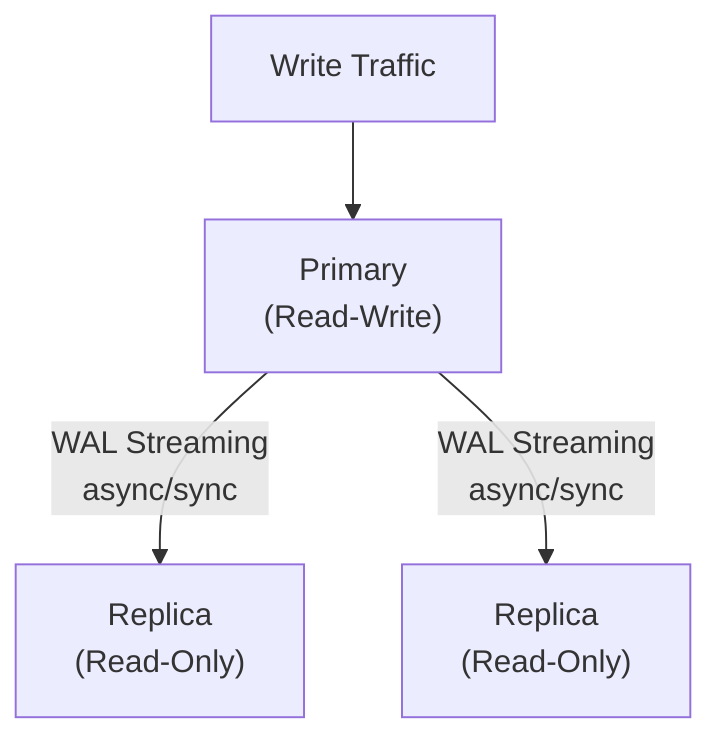

# How to Set Up PostgreSQL Streaming Replication

Author: [nawazdhandala](https://www.github.com/nawazdhandala)

Tags: PostgreSQL, Replication, High Availability, Streaming Replication, Database

Description: A comprehensive guide to setting up PostgreSQL streaming replication for high availability and read scaling, covering primary-replica configuration, monitoring, and failover procedures.

---

Streaming replication provides real-time data replication from a primary PostgreSQL server to one or more replicas. This enables high availability, disaster recovery, and read scaling. This guide covers complete setup and management of streaming replication.

## Prerequisites

- Two or more PostgreSQL servers (same version)
- Network connectivity between servers
- Sufficient disk space for WAL files
- Understanding of your HA requirements

## Architecture Overview



## Primary Server Configuration

### Configure postgresql.conf

```conf
# Connection settings
listen_addresses = '*'
port = 5432

# Replication settings
wal_level = replica                 # Minimum for streaming replication
max_wal_senders = 10                # Max replication connections
max_replication_slots = 10          # Max replication slots
wal_keep_size = 1GB                 # WAL retained for replicas

# Optional: Synchronous replication
# synchronous_standby_names = 'replica1,replica2'
# synchronous_commit = on

# Archive settings (recommended for PITR)
archive_mode = on
archive_command = 'cp %p /var/lib/postgresql/archive/%f'
```

### Configure pg_hba.conf

```conf
# Allow replication connections
host    replication     replicator      10.0.0.0/8              scram-sha-256
host    replication     replicator      192.168.0.0/16          scram-sha-256

# Or specific replica IPs
host    replication     replicator      192.168.1.10/32         scram-sha-256
host    replication     replicator      192.168.1.11/32         scram-sha-256
```

### Create Replication User

```sql
-- Create replication user
CREATE USER replicator WITH REPLICATION ENCRYPTED PASSWORD 'secure_password';

-- Grant additional permissions if needed
GRANT pg_read_all_data TO replicator;
```

### Create Replication Slot (Recommended)

```sql
-- Create physical replication slot
SELECT pg_create_physical_replication_slot('replica1_slot');
SELECT pg_create_physical_replication_slot('replica2_slot');

-- Verify slots
SELECT slot_name, slot_type, active FROM pg_replication_slots;
```

### Restart Primary

```bash
sudo systemctl restart postgresql
```

## Replica Server Setup

### Take Base Backup from Primary

```bash
# Stop PostgreSQL on replica
sudo systemctl stop postgresql

# Remove existing data directory
sudo rm -rf /var/lib/postgresql/16/main/*

# Take base backup
sudo -u postgres pg_basebackup \
    -h primary.example.com \
    -D /var/lib/postgresql/16/main \
    -U replicator \
    -P \
    -v \
    -R \
    -X stream \
    -C -S replica1_slot
```

Options explained:
- `-h`: Primary hostname
- `-D`: Data directory
- `-U`: Replication user
- `-P`: Show progress
- `-v`: Verbose
- `-R`: Create standby.signal and postgresql.auto.conf
- `-X stream`: Stream WAL during backup
- `-C -S`: Create replication slot

### Verify Configuration

Check `postgresql.auto.conf` was created:

```bash
cat /var/lib/postgresql/16/main/postgresql.auto.conf
```

Expected content:
```conf
primary_conninfo = 'host=primary.example.com port=5432 user=replicator password=secure_password'
primary_slot_name = 'replica1_slot'
```

### Configure Replica postgresql.conf

```conf
# Hot standby (allows read queries)
hot_standby = on
hot_standby_feedback = on

# Recovery settings
max_standby_streaming_delay = 30s
max_standby_archive_delay = 30s

# Resource settings (can differ from primary)
shared_buffers = 4GB
effective_cache_size = 12GB
```

### Start Replica

```bash
sudo systemctl start postgresql
```

## Verify Replication

### On Primary

```sql
-- Check replication status
SELECT
    client_addr,
    state,
    sent_lsn,
    write_lsn,
    flush_lsn,
    replay_lsn,
    sync_state
FROM pg_stat_replication;

-- Check replication slots
SELECT
    slot_name,
    active,
    restart_lsn,
    confirmed_flush_lsn
FROM pg_replication_slots;

-- Check WAL positions
SELECT pg_current_wal_lsn();
```

### On Replica

```sql
-- Check recovery status
SELECT
    pg_is_in_recovery(),
    pg_last_wal_receive_lsn(),
    pg_last_wal_replay_lsn(),
    pg_last_xact_replay_timestamp();

-- Check replication lag
SELECT
    CASE
        WHEN pg_last_wal_receive_lsn() = pg_last_wal_replay_lsn()
        THEN 0
        ELSE EXTRACT(EPOCH FROM NOW() - pg_last_xact_replay_timestamp())
    END AS replication_lag_seconds;
```

## Synchronous Replication

### Enable on Primary

```conf
# postgresql.conf
synchronous_standby_names = 'FIRST 1 (replica1, replica2)'
synchronous_commit = on
```

Options for synchronous_standby_names:
- `'replica1'` - Single sync replica
- `'FIRST 1 (replica1, replica2)'` - First available from list
- `'ANY 1 (replica1, replica2)'` - Any one replica
- `'ANY 2 (replica1, replica2, replica3)'` - Any two replicas

### Set Application Name on Replica

```conf
# postgresql.auto.conf on replica
primary_conninfo = 'host=primary.example.com user=replicator password=xxx application_name=replica1'
```

### Verify Sync Status

```sql
-- On primary
SELECT
    application_name,
    client_addr,
    sync_state,
    sync_priority
FROM pg_stat_replication;
```

## Failover Procedures

### Manual Failover

On replica to be promoted:

```bash
# Promote replica to primary
sudo -u postgres pg_ctl promote -D /var/lib/postgresql/16/main

# Or using SQL
SELECT pg_promote();
```

### Reconfigure Old Primary as Replica

After failover, convert old primary to replica:

```bash
# On old primary
sudo systemctl stop postgresql

# Create standby.signal
sudo -u postgres touch /var/lib/postgresql/16/main/standby.signal

# Update postgresql.auto.conf
echo "primary_conninfo = 'host=new_primary.example.com port=5432 user=replicator password=xxx'" | \
    sudo -u postgres tee /var/lib/postgresql/16/main/postgresql.auto.conf

# Start as replica
sudo systemctl start postgresql
```

### Using pg_rewind (Faster)

```bash
# On old primary (after it's stopped)
sudo -u postgres pg_rewind \
    --target-pgdata=/var/lib/postgresql/16/main \
    --source-server="host=new_primary.example.com user=replicator dbname=postgres"

# Create standby.signal and start
```

## Cascading Replication

Replicas can stream from other replicas:

```
Primary -> Replica1 -> Replica2
                    -> Replica3
```

### Configure Intermediate Replica

```conf
# On Replica1
hot_standby = on
max_wal_senders = 5  # Allow downstream replicas
```

### Configure Downstream Replica

```conf
# On Replica2/3
primary_conninfo = 'host=replica1.example.com port=5432 user=replicator password=xxx'
```

## Monitoring

### Key Metrics

```sql
-- Replication lag (bytes)
SELECT
    client_addr,
    pg_wal_lsn_diff(pg_current_wal_lsn(), replay_lsn) AS lag_bytes
FROM pg_stat_replication;

-- Replication lag (seconds)
SELECT
    client_addr,
    EXTRACT(EPOCH FROM (NOW() - replay_lag)) AS lag_seconds
FROM pg_stat_replication;

-- Slot lag (bytes)
SELECT
    slot_name,
    pg_wal_lsn_diff(pg_current_wal_lsn(), restart_lsn) AS slot_lag_bytes
FROM pg_replication_slots;
```

### Prometheus Queries

```yaml
# Replication lag
pg_replication_lag

# Slots behind
pg_replication_slots_pg_wal_lsn_diff
```

### Alert Rules

```yaml
groups:
  - name: postgresql-replication
    rules:
      - alert: PostgreSQLReplicationLag
        expr: pg_replication_lag > 30
        for: 5m
        labels:
          severity: warning
        annotations:
          summary: "High replication lag"

      - alert: PostgreSQLReplicationDown
        expr: pg_stat_replication_pg_current_wal_lsn == 0
        for: 2m
        labels:
          severity: critical
        annotations:
          summary: "Replication is down"
```

## Troubleshooting

### Replica Not Connecting

```bash
# Check connectivity
pg_isready -h primary.example.com -p 5432 -U replicator

# Check pg_hba.conf on primary
# Check firewall rules
# Verify credentials
```

### Large Replication Lag

```sql
-- On primary, check if slot is holding WAL
SELECT
    slot_name,
    pg_size_pretty(pg_wal_lsn_diff(pg_current_wal_lsn(), restart_lsn)) AS slot_lag
FROM pg_replication_slots;

-- Check replica activity
SELECT * FROM pg_stat_activity WHERE backend_type = 'walreceiver';
```

### Replica Conflict Errors

```sql
-- Increase standby delay
ALTER SYSTEM SET max_standby_streaming_delay = '60s';
SELECT pg_reload_conf();

-- Or enable hot_standby_feedback
ALTER SYSTEM SET hot_standby_feedback = on;
SELECT pg_reload_conf();
```

## Best Practices

### Configuration Checklist

1. Use replication slots to prevent WAL removal
2. Enable archive mode for recovery options
3. Use hot_standby_feedback to prevent conflicts
4. Monitor replication lag continuously
5. Test failover procedures regularly

### Security

1. Use strong passwords for replication user
2. Restrict pg_hba.conf to specific IPs
3. Use SSL for replication connections
4. Use separate user for replication only

### High Availability

1. Minimum 2 replicas for HA
2. Place replicas in different availability zones
3. Use synchronous replication for zero data loss
4. Implement automated failover with Patroni

## Conclusion

Streaming replication provides the foundation for PostgreSQL high availability:

1. **Configure primary** with appropriate wal_level and pg_hba.conf
2. **Create replicas** using pg_basebackup
3. **Use replication slots** to prevent WAL cleanup issues
4. **Monitor lag** and set up alerts
5. **Practice failover** before you need it

For production environments, consider using tools like Patroni or CloudNativePG that automate failover and provide additional management capabilities.
