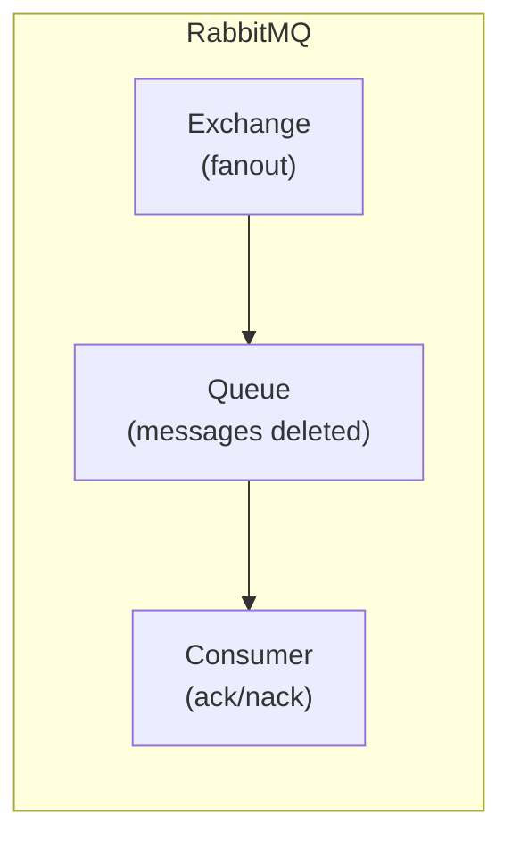
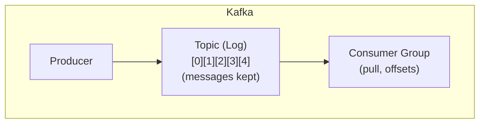

# How to Migrate from RabbitMQ to Kafka

Author: [nawazdhandala](https://www.github.com/nawazdhandala)

Tags: Apache Kafka, RabbitMQ, Migration, Message Queue, Event Streaming, Architecture

Description: A comprehensive guide to migrating from RabbitMQ to Apache Kafka, covering architectural differences, migration strategies, and implementation patterns for a smooth transition.

---

Migrating from RabbitMQ to Kafka requires understanding the fundamental differences between traditional message queues and event streaming platforms. This guide covers migration strategies and implementation patterns.

## Architectural Differences

### RabbitMQ Model



- Push-based delivery
- Messages deleted after ack
- Per-message routing

### Kafka Model



- Pull-based consumption
- Messages retained (configurable)
- Partition-based ordering

## Key Differences

| Aspect | RabbitMQ | Kafka |
|--------|----------|-------|
| Model | Message queue | Event log |
| Delivery | Push | Pull |
| Retention | Until consumed | Time/size based |
| Ordering | Per queue | Per partition |
| Replay | Not possible | Possible |
| Routing | Exchange-based | Topic/partition |
| Acknowledgment | Per message | Offset commit |

## Migration Strategies

### Strategy 1: Parallel Run (Bridge Pattern)

Run both systems simultaneously during migration.

```java
// Bridge: RabbitMQ to Kafka
import com.rabbitmq.client.*;
import org.apache.kafka.clients.producer.*;

public class RabbitToKafkaBridge {

    private final Connection rabbitConnection;
    private final KafkaProducer<String, String> kafkaProducer;

    public RabbitToKafkaBridge(String rabbitHost, String kafkaBootstrap)
            throws Exception {
        // RabbitMQ connection
        ConnectionFactory factory = new ConnectionFactory();
        factory.setHost(rabbitHost);
        this.rabbitConnection = factory.newConnection();

        // Kafka producer
        Properties props = new Properties();
        props.put(ProducerConfig.BOOTSTRAP_SERVERS_CONFIG, kafkaBootstrap);
        props.put(ProducerConfig.KEY_SERIALIZER_CLASS_CONFIG,
            "org.apache.kafka.common.serialization.StringSerializer");
        props.put(ProducerConfig.VALUE_SERIALIZER_CLASS_CONFIG,
            "org.apache.kafka.common.serialization.StringSerializer");
        this.kafkaProducer = new KafkaProducer<>(props);
    }

    public void bridgeQueue(String rabbitQueue, String kafkaTopic) throws Exception {
        Channel channel = rabbitConnection.createChannel();

        // Declare queue
        channel.queueDeclare(rabbitQueue, true, false, false, null);

        // Consume from RabbitMQ, produce to Kafka
        DeliverCallback deliverCallback = (consumerTag, delivery) -> {
            String message = new String(delivery.getBody(), "UTF-8");
            String routingKey = delivery.getEnvelope().getRoutingKey();

            // Use routing key as Kafka key for partitioning
            ProducerRecord<String, String> record =
                new ProducerRecord<>(kafkaTopic, routingKey, message);

            kafkaProducer.send(record, (metadata, exception) -> {
                if (exception == null) {
                    // Ack RabbitMQ message after Kafka confirms
                    try {
                        channel.basicAck(delivery.getEnvelope().getDeliveryTag(), false);
                    } catch (Exception e) {
                        e.printStackTrace();
                    }
                } else {
                    // Nack and requeue on failure
                    try {
                        channel.basicNack(delivery.getEnvelope().getDeliveryTag(),
                            false, true);
                    } catch (Exception e) {
                        e.printStackTrace();
                    }
                }
            });
        };

        channel.basicConsume(rabbitQueue, false, deliverCallback, consumerTag -> {});
    }

    public void close() throws Exception {
        kafkaProducer.close();
        rabbitConnection.close();
    }
}
```

### Strategy 2: Dual Write

Producers write to both systems during transition.

```java
public class DualWriteProducer {

    private final Channel rabbitChannel;
    private final KafkaProducer<String, String> kafkaProducer;
    private final boolean rabbitEnabled;
    private final boolean kafkaEnabled;

    public DualWriteProducer(Channel rabbitChannel,
                            KafkaProducer<String, String> kafkaProducer,
                            boolean rabbitEnabled,
                            boolean kafkaEnabled) {
        this.rabbitChannel = rabbitChannel;
        this.kafkaProducer = kafkaProducer;
        this.rabbitEnabled = rabbitEnabled;
        this.kafkaEnabled = kafkaEnabled;
    }

    public void publish(String exchange, String routingKey,
                       String kafkaTopic, String message) throws Exception {

        // Write to RabbitMQ if enabled
        if (rabbitEnabled) {
            rabbitChannel.basicPublish(exchange, routingKey, null, message.getBytes());
        }

        // Write to Kafka if enabled
        if (kafkaEnabled) {
            ProducerRecord<String, String> record =
                new ProducerRecord<>(kafkaTopic, routingKey, message);
            kafkaProducer.send(record).get(); // Sync for consistency
        }
    }
}
```

### Strategy 3: Strangler Fig Pattern

Gradually migrate topic by topic.

```java
public class TopicRouter {

    private final Channel rabbitChannel;
    private final KafkaProducer<String, String> kafkaProducer;
    private final Set<String> migratedTopics;

    public TopicRouter(Channel rabbitChannel,
                      KafkaProducer<String, String> kafkaProducer,
                      Set<String> migratedTopics) {
        this.rabbitChannel = rabbitChannel;
        this.kafkaProducer = kafkaProducer;
        this.migratedTopics = migratedTopics;
    }

    public void publish(String topic, String key, String message) throws Exception {
        if (migratedTopics.contains(topic)) {
            // Use Kafka for migrated topics
            ProducerRecord<String, String> record =
                new ProducerRecord<>(topic, key, message);
            kafkaProducer.send(record);
        } else {
            // Use RabbitMQ for non-migrated topics
            rabbitChannel.basicPublish("", topic, null, message.getBytes());
        }
    }

    public void migrateTopic(String topic) {
        migratedTopics.add(topic);
        System.out.println("Topic migrated to Kafka: " + topic);
    }
}
```

## Pattern Mappings

### Direct Exchange to Topic

```java
// RabbitMQ: Direct exchange
// channel.basicPublish("orders", "order.created", props, message);

// Kafka equivalent: Single topic with key
public void migrateDirectExchange() {
    // RabbitMQ routing key becomes Kafka message key
    kafkaProducer.send(new ProducerRecord<>(
        "orders",           // topic
        "order.created",    // key (was routing key)
        message
    ));
}
```

### Fanout Exchange to Topic

```java
// RabbitMQ: Fanout exchange with multiple queues
// channel.basicPublish("notifications", "", props, message);

// Kafka equivalent: Topic with consumer groups
public void migrateFanoutExchange() {
    // Each RabbitMQ queue becomes a consumer group
    kafkaProducer.send(new ProducerRecord<>(
        "notifications",    // single topic
        null,               // no key needed
        message
    ));
    // Multiple consumer groups subscribe to same topic
}
```

### Topic Exchange to Multiple Topics

```java
// RabbitMQ: Topic exchange with wildcards
// Binding: "events.#" to queue1
// Binding: "events.orders.*" to queue2

// Kafka: Use multiple topics or consumer filtering
public void migrateTopicExchange(String routingKey, String message) {
    // Option 1: Map to specific Kafka topics
    if (routingKey.startsWith("events.orders.")) {
        kafkaProducer.send(new ProducerRecord<>("events-orders", routingKey, message));
    } else {
        kafkaProducer.send(new ProducerRecord<>("events-other", routingKey, message));
    }

    // Option 2: Single topic, filter in consumer
    kafkaProducer.send(new ProducerRecord<>("events", routingKey, message));
}
```

## Consumer Migration

### RabbitMQ Consumer

```java
// Original RabbitMQ consumer
public class RabbitConsumer {

    public void consume(Channel channel, String queue) throws Exception {
        DeliverCallback callback = (consumerTag, delivery) -> {
            String message = new String(delivery.getBody());
            processMessage(message);
            channel.basicAck(delivery.getEnvelope().getDeliveryTag(), false);
        };

        channel.basicConsume(queue, false, callback, consumerTag -> {});
    }

    private void processMessage(String message) {
        // Business logic
    }
}
```

### Equivalent Kafka Consumer

```java
// Migrated Kafka consumer
public class KafkaConsumerMigrated {

    public void consume(String bootstrapServers, String topic, String groupId) {
        Properties props = new Properties();
        props.put(ConsumerConfig.BOOTSTRAP_SERVERS_CONFIG, bootstrapServers);
        props.put(ConsumerConfig.GROUP_ID_CONFIG, groupId);
        props.put(ConsumerConfig.KEY_DESERIALIZER_CLASS_CONFIG,
            "org.apache.kafka.common.serialization.StringDeserializer");
        props.put(ConsumerConfig.VALUE_DESERIALIZER_CLASS_CONFIG,
            "org.apache.kafka.common.serialization.StringDeserializer");
        props.put(ConsumerConfig.ENABLE_AUTO_COMMIT_CONFIG, "false");

        try (KafkaConsumer<String, String> consumer = new KafkaConsumer<>(props)) {
            consumer.subscribe(Collections.singletonList(topic));

            while (true) {
                ConsumerRecords<String, String> records =
                    consumer.poll(Duration.ofMillis(100));

                for (ConsumerRecord<String, String> record : records) {
                    processMessage(record.value());
                }

                // Commit after processing (like RabbitMQ ack)
                consumer.commitSync();
            }
        }
    }

    private void processMessage(String message) {
        // Same business logic
    }
}
```

## Python Migration

### RabbitMQ to Kafka Bridge

```python
import pika
from confluent_kafka import Producer
import json
import threading
from typing import Dict, Set

class RabbitToKafkaBridge:
    """Bridge messages from RabbitMQ to Kafka"""

    def __init__(self, rabbit_host: str, kafka_bootstrap: str):
        # RabbitMQ connection
        self.rabbit_connection = pika.BlockingConnection(
            pika.ConnectionParameters(host=rabbit_host)
        )
        self.rabbit_channel = self.rabbit_connection.channel()

        # Kafka producer
        self.kafka_producer = Producer({
            'bootstrap.servers': kafka_bootstrap,
            'acks': 'all'
        })

    def bridge_queue(self, rabbit_queue: str, kafka_topic: str):
        """Bridge a RabbitMQ queue to a Kafka topic"""

        self.rabbit_channel.queue_declare(queue=rabbit_queue, durable=True)

        def callback(ch, method, properties, body):
            message = body.decode('utf-8')
            routing_key = method.routing_key

            def delivery_callback(err, msg):
                if err:
                    # Nack on failure
                    ch.basic_nack(delivery_tag=method.delivery_tag, requeue=True)
                else:
                    # Ack on success
                    ch.basic_ack(delivery_tag=method.delivery_tag)

            self.kafka_producer.produce(
                topic=kafka_topic,
                key=routing_key,
                value=message,
                callback=delivery_callback
            )
            self.kafka_producer.poll(0)

        self.rabbit_channel.basic_consume(
            queue=rabbit_queue,
            on_message_callback=callback,
            auto_ack=False
        )

        print(f"Bridging {rabbit_queue} -> {kafka_topic}")
        self.rabbit_channel.start_consuming()

    def close(self):
        self.kafka_producer.flush()
        self.rabbit_connection.close()


class DualWriteProducer:
    """Producer that writes to both RabbitMQ and Kafka"""

    def __init__(self, rabbit_channel, kafka_producer,
                 rabbit_enabled: bool = True, kafka_enabled: bool = True):
        self.rabbit_channel = rabbit_channel
        self.kafka_producer = kafka_producer
        self.rabbit_enabled = rabbit_enabled
        self.kafka_enabled = kafka_enabled

    def publish(self, exchange: str, routing_key: str,
                kafka_topic: str, message: str):
        """Publish to both systems"""

        if self.rabbit_enabled:
            self.rabbit_channel.basic_publish(
                exchange=exchange,
                routing_key=routing_key,
                body=message.encode('utf-8')
            )

        if self.kafka_enabled:
            self.kafka_producer.produce(
                topic=kafka_topic,
                key=routing_key,
                value=message
            )
            self.kafka_producer.poll(0)


class TopicRouter:
    """Routes messages to RabbitMQ or Kafka based on migration status"""

    def __init__(self, rabbit_channel, kafka_producer):
        self.rabbit_channel = rabbit_channel
        self.kafka_producer = kafka_producer
        self.migrated_topics: Set[str] = set()

    def publish(self, topic: str, key: str, message: str):
        """Route to appropriate system"""

        if topic in self.migrated_topics:
            self.kafka_producer.produce(
                topic=topic,
                key=key,
                value=message
            )
            self.kafka_producer.poll(0)
        else:
            self.rabbit_channel.basic_publish(
                exchange='',
                routing_key=topic,
                body=message.encode('utf-8')
            )

    def migrate_topic(self, topic: str):
        """Mark a topic as migrated to Kafka"""
        self.migrated_topics.add(topic)
        print(f"Topic migrated to Kafka: {topic}")


class ConsumerMigrator:
    """Helps migrate RabbitMQ consumers to Kafka"""

    @staticmethod
    def create_kafka_consumer(bootstrap_servers: str, topic: str, group_id: str):
        """Create Kafka consumer equivalent to RabbitMQ consumer"""
        from confluent_kafka import Consumer

        consumer = Consumer({
            'bootstrap.servers': bootstrap_servers,
            'group.id': group_id,
            'auto.offset.reset': 'earliest',
            'enable.auto.commit': False
        })

        consumer.subscribe([topic])
        return consumer

    @staticmethod
    def consume_like_rabbit(consumer, process_message_fn):
        """Consume with RabbitMQ-like semantics (ack after process)"""
        while True:
            msg = consumer.poll(0.1)

            if msg is None:
                continue

            if msg.error():
                print(f"Error: {msg.error()}")
                continue

            try:
                # Process message (like RabbitMQ callback)
                process_message_fn(msg.value().decode('utf-8'))

                # Commit offset (like RabbitMQ ack)
                consumer.commit(asynchronous=False)

            except Exception as e:
                print(f"Processing failed: {e}")
                # Don't commit - message will be redelivered


# Exchange pattern mappings
class ExchangePatternMapper:
    """Maps RabbitMQ exchange patterns to Kafka"""

    @staticmethod
    def direct_to_kafka(kafka_producer, topic: str, routing_key: str, message: str):
        """Direct exchange: routing key becomes message key"""
        kafka_producer.produce(topic=topic, key=routing_key, value=message)

    @staticmethod
    def fanout_to_kafka(kafka_producer, topic: str, message: str):
        """Fanout exchange: single topic, multiple consumer groups"""
        kafka_producer.produce(topic=topic, value=message)

    @staticmethod
    def topic_to_kafka(kafka_producer, routing_key: str, message: str,
                       topic_mapping: Dict[str, str]):
        """Topic exchange: map patterns to Kafka topics"""
        for pattern, kafka_topic in topic_mapping.items():
            if routing_key.startswith(pattern.replace('*', '').replace('#', '')):
                kafka_producer.produce(
                    topic=kafka_topic,
                    key=routing_key,
                    value=message
                )
                return


# Example usage
def main():
    # Bridge example
    bridge = RabbitToKafkaBridge('localhost', 'localhost:9092')

    # Run bridge in background
    thread = threading.Thread(
        target=bridge.bridge_queue,
        args=('orders-queue', 'orders-topic')
    )
    thread.start()

    # Consumer migration example
    def process_message(message):
        print(f"Processing: {message}")

    consumer = ConsumerMigrator.create_kafka_consumer(
        'localhost:9092',
        'orders-topic',
        'orders-consumer-group'
    )

    ConsumerMigrator.consume_like_rabbit(consumer, process_message)


if __name__ == '__main__':
    main()
```

## Migration Checklist

### Pre-Migration

- [ ] Document all RabbitMQ exchanges, queues, and bindings
- [ ] Map RabbitMQ patterns to Kafka topics
- [ ] Design partition strategy
- [ ] Set up Kafka cluster
- [ ] Create Kafka topics with appropriate configuration
- [ ] Test bridge/dual-write in staging

### During Migration

- [ ] Deploy bridge or dual-write producers
- [ ] Monitor message flow in both systems
- [ ] Gradually migrate consumers
- [ ] Verify message delivery and ordering
- [ ] Monitor consumer lag

### Post-Migration

- [ ] Disable RabbitMQ writes
- [ ] Decommission RabbitMQ consumers
- [ ] Archive RabbitMQ queues
- [ ] Update monitoring and alerts
- [ ] Document new architecture

## Best Practices

1. **Start with low-risk queues**: Migrate non-critical queues first
2. **Use feature flags**: Toggle between systems easily
3. **Monitor both systems**: Track message counts and latency
4. **Plan for rollback**: Keep RabbitMQ running until migration is proven
5. **Update consumer semantics**: Adapt to pull-based, offset-based model

## Conclusion

Migrating from RabbitMQ to Kafka requires understanding the architectural differences and choosing the right migration strategy. The bridge pattern provides the safest path, while dual-write enables gradual migration. Plan carefully, test thoroughly, and migrate incrementally for success.
