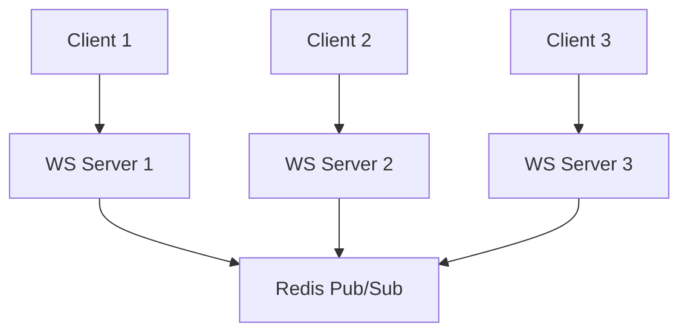

# How to Build a Real-Time Chat Application with Redis Pub/Sub

Author: [nawazdhandala](https://www.github.com/nawazdhandala)

Tags: Redis, Pub/Sub, Chat, WebSocket, Real-time, Node.js, Python

Description: A comprehensive guide to building a real-time chat application using Redis Pub/Sub for message broadcasting, WebSocket integration, and scalable multi-server architectures.

---

Building a real-time chat application requires efficient message broadcasting across connected clients. Redis Pub/Sub provides the perfect backbone for this, enabling instant message delivery with minimal latency. This guide walks through building a complete chat system with user presence, rooms, and scalable WebSocket integration.

## Architecture Overview

A Redis-backed chat system typically consists of:

1. **WebSocket Server**: Handles client connections
2. **Redis Pub/Sub**: Broadcasts messages across server instances
3. **Redis Data Structures**: Stores user state, room membership, and message history
4. **Application Logic**: Message routing, user management, and moderation



## Node.js Chat Server Implementation

Here is a complete Node.js chat server using Socket.IO and Redis:

```javascript
const express = require('express');
const http = require('http');
const { Server } = require('socket.io');
const { createClient } = require('redis');
const { createAdapter } = require('@socket.io/redis-adapter');

class ChatServer {
    constructor(config = {}) {
        this.app = express();
        this.server = http.createServer(this.app);
        this.io = new Server(this.server, {
            cors: {
                origin: config.corsOrigin || '*',
                methods: ['GET', 'POST']
            }
        });

        this.redisConfig = {
            host: config.redisHost || 'localhost',
            port: config.redisPort || 6379,
            password: config.redisPassword
        };

        this.pubClient = null;
        this.subClient = null;
        this.redisClient = null;
    }

    async initialize() {
        // Create Redis clients
        this.pubClient = createClient({
            socket: {
                host: this.redisConfig.host,
                port: this.redisConfig.port
            },
            password: this.redisConfig.password
        });

        this.subClient = this.pubClient.duplicate();
        this.redisClient = this.pubClient.duplicate();

        await Promise.all([
            this.pubClient.connect(),
            this.subClient.connect(),
            this.redisClient.connect()
        ]);

        // Use Redis adapter for Socket.IO (enables multi-server scaling)
        this.io.adapter(createAdapter(this.pubClient, this.subClient));

        console.log('Redis connected');
    }

    setupEventHandlers() {
        this.io.on('connection', (socket) => {
            console.log(`Client connected: ${socket.id}`);

            // User authentication/registration
            socket.on('register', async (data) => {
                await this.handleRegister(socket, data);
            });

            // Join a chat room
            socket.on('join_room', async (data) => {
                await this.handleJoinRoom(socket, data);
            });

            // Leave a chat room
            socket.on('leave_room', async (data) => {
                await this.handleLeaveRoom(socket, data);
            });

            // Send a message
            socket.on('send_message', async (data) => {
                await this.handleSendMessage(socket, data);
            });

            // Typing indicator
            socket.on('typing', (data) => {
                this.handleTyping(socket, data);
            });

            // Get room history
            socket.on('get_history', async (data) => {
                await this.handleGetHistory(socket, data);
            });

            // Get online users
            socket.on('get_online_users', async (data) => {
                await this.handleGetOnlineUsers(socket, data);
            });

            // Disconnect
            socket.on('disconnect', async () => {
                await this.handleDisconnect(socket);
            });
        });
    }

    async handleRegister(socket, data) {
        const { userId, username } = data;

        socket.userId = userId;
        socket.username = username;

        // Store user info in Redis
        const userKey = `user:${userId}`;
        await this.redisClient.hSet(userKey, {
            id: userId,
            username: username,
            socketId: socket.id,
            status: 'online',
            lastSeen: Date.now().toString()
        });

        // Set expiration (auto-cleanup if server crashes)
        await this.redisClient.expire(userKey, 86400); // 24 hours

        // Add to online users set
        await this.redisClient.sAdd('online_users', userId);

        socket.emit('registered', { success: true, userId, username });
        console.log(`User registered: ${username} (${userId})`);
    }

    async handleJoinRoom(socket, data) {
        const { roomId } = data;
        const userId = socket.userId;
        const username = socket.username;

        if (!userId) {
            socket.emit('error', { message: 'Not registered' });
            return;
        }

        // Join Socket.IO room
        socket.join(roomId);

        // Add user to room members in Redis
        await this.redisClient.sAdd(`room:${roomId}:members`, userId);

        // Track which rooms the user is in
        await this.redisClient.sAdd(`user:${userId}:rooms`, roomId);

        // Notify room members
        const joinMessage = {
            type: 'system',
            roomId,
            content: `${username} joined the room`,
            timestamp: Date.now()
        };

        this.io.to(roomId).emit('user_joined', {
            userId,
            username,
            roomId
        });

        socket.emit('room_joined', { roomId, success: true });
        console.log(`${username} joined room: ${roomId}`);
    }

    async handleLeaveRoom(socket, data) {
        const { roomId } = data;
        const userId = socket.userId;
        const username = socket.username;

        // Leave Socket.IO room
        socket.leave(roomId);

        // Remove from Redis
        await this.redisClient.sRem(`room:${roomId}:members`, userId);
        await this.redisClient.sRem(`user:${userId}:rooms`, roomId);

        // Notify room members
        this.io.to(roomId).emit('user_left', {
            userId,
            username,
            roomId
        });

        socket.emit('room_left', { roomId, success: true });
    }

    async handleSendMessage(socket, data) {
        const { roomId, content, type = 'text' } = data;
        const userId = socket.userId;
        const username = socket.username;

        if (!userId) {
            socket.emit('error', { message: 'Not registered' });
            return;
        }

        const message = {
            id: `msg_${Date.now()}_${Math.random().toString(36).substr(2, 9)}`,
            roomId,
            userId,
            username,
            content,
            type,
            timestamp: Date.now()
        };

        // Store message in Redis (keep last 100 messages per room)
        const historyKey = `room:${roomId}:messages`;
        await this.redisClient.lPush(historyKey, JSON.stringify(message));
        await this.redisClient.lTrim(historyKey, 0, 99);

        // Broadcast to room
        this.io.to(roomId).emit('new_message', message);
    }

    handleTyping(socket, data) {
        const { roomId, isTyping } = data;
        const username = socket.username;

        // Broadcast typing status to room (except sender)
        socket.to(roomId).emit('typing_status', {
            userId: socket.userId,
            username,
            roomId,
            isTyping
        });
    }

    async handleGetHistory(socket, data) {
        const { roomId, limit = 50 } = data;

        const historyKey = `room:${roomId}:messages`;
        const messages = await this.redisClient.lRange(historyKey, 0, limit - 1);

        const parsedMessages = messages.map(m => JSON.parse(m)).reverse();

        socket.emit('room_history', {
            roomId,
            messages: parsedMessages
        });
    }

    async handleGetOnlineUsers(socket, data) {
        const { roomId } = data;

        let userIds;
        if (roomId) {
            userIds = await this.redisClient.sMembers(`room:${roomId}:members`);
        } else {
            userIds = await this.redisClient.sMembers('online_users');
        }

        const users = [];
        for (const id of userIds) {
            const userData = await this.redisClient.hGetAll(`user:${id}`);
            if (userData && userData.username) {
                users.push({
                    id: userData.id,
                    username: userData.username,
                    status: userData.status
                });
            }
        }

        socket.emit('online_users', { roomId, users });
    }

    async handleDisconnect(socket) {
        const userId = socket.userId;
        const username = socket.username;

        if (!userId) return;

        console.log(`Client disconnected: ${username} (${userId})`);

        // Update user status
        await this.redisClient.hSet(`user:${userId}`, {
            status: 'offline',
            lastSeen: Date.now().toString()
        });

        // Remove from online users
        await this.redisClient.sRem('online_users', userId);

        // Get user's rooms and notify
        const rooms = await this.redisClient.sMembers(`user:${userId}:rooms`);
        for (const roomId of rooms) {
            this.io.to(roomId).emit('user_offline', {
                userId,
                username,
                roomId
            });
        }
    }

    start(port = 3000) {
        this.setupEventHandlers();
        this.server.listen(port, () => {
            console.log(`Chat server running on port ${port}`);
        });
    }
}

// Direct message support
class DirectMessageHandler {
    constructor(chatServer) {
        this.io = chatServer.io;
        this.redis = chatServer.redisClient;
    }

    setup() {
        this.io.on('connection', (socket) => {
            socket.on('send_dm', async (data) => {
                await this.handleDirectMessage(socket, data);
            });

            socket.on('get_dm_history', async (data) => {
                await this.handleGetDMHistory(socket, data);
            });
        });
    }

    async handleDirectMessage(socket, data) {
        const { toUserId, content } = data;
        const fromUserId = socket.userId;
        const fromUsername = socket.username;

        const message = {
            id: `dm_${Date.now()}_${Math.random().toString(36).substr(2, 9)}`,
            fromUserId,
            fromUsername,
            toUserId,
            content,
            timestamp: Date.now()
        };

        // Store in conversation history
        const conversationKey = this.getConversationKey(fromUserId, toUserId);
        await this.redis.lPush(conversationKey, JSON.stringify(message));
        await this.redis.lTrim(conversationKey, 0, 99);

        // Find recipient's socket and send
        const recipientData = await this.redis.hGetAll(`user:${toUserId}`);
        if (recipientData && recipientData.socketId) {
            this.io.to(recipientData.socketId).emit('direct_message', message);
        }

        // Confirm to sender
        socket.emit('dm_sent', { success: true, message });
    }

    getConversationKey(userId1, userId2) {
        const sorted = [userId1, userId2].sort();
        return `dm:${sorted[0]}:${sorted[1]}`;
    }

    async handleGetDMHistory(socket, data) {
        const { otherUserId, limit = 50 } = data;
        const userId = socket.userId;

        const conversationKey = this.getConversationKey(userId, otherUserId);
        const messages = await this.redis.lRange(conversationKey, 0, limit - 1);

        socket.emit('dm_history', {
            otherUserId,
            messages: messages.map(m => JSON.parse(m)).reverse()
        });
    }
}

// Start the server
async function main() {
    const chatServer = new ChatServer({
        redisHost: process.env.REDIS_HOST || 'localhost',
        redisPort: parseInt(process.env.REDIS_PORT || '6379'),
        redisPassword: process.env.REDIS_PASSWORD
    });

    await chatServer.initialize();

    // Add direct message support
    const dmHandler = new DirectMessageHandler(chatServer);
    dmHandler.setup();

    chatServer.start(process.env.PORT || 3000);
}

main().catch(console.error);
```

## Python Chat Server Implementation

Here is a Python implementation using FastAPI and WebSockets:

```python
import asyncio
import json
import uuid
from datetime import datetime
from typing import Dict, Set, Optional
from dataclasses import dataclass, asdict

from fastapi import FastAPI, WebSocket, WebSocketDisconnect
from fastapi.middleware.cors import CORSMiddleware
import redis.asyncio as redis

app = FastAPI(title="Redis Chat Server")

app.add_middleware(
    CORSMiddleware,
    allow_origins=["*"],
    allow_credentials=True,
    allow_methods=["*"],
    allow_headers=["*"],
)

@dataclass
class Message:
    id: str
    room_id: str
    user_id: str
    username: str
    content: str
    type: str
    timestamp: int

    @classmethod
    def create(cls, room_id: str, user_id: str, username: str,
               content: str, msg_type: str = 'text'):
        return cls(
            id=f"msg_{datetime.now().timestamp()}_{uuid.uuid4().hex[:8]}",
            room_id=room_id,
            user_id=user_id,
            username=username,
            content=content,
            type=msg_type,
            timestamp=int(datetime.now().timestamp() * 1000)
        )

    def to_json(self):
        return json.dumps(asdict(self))


class ConnectionManager:
    """Manages WebSocket connections and Redis Pub/Sub."""

    def __init__(self):
        self.active_connections: Dict[str, WebSocket] = {}  # user_id -> WebSocket
        self.user_rooms: Dict[str, Set[str]] = {}  # user_id -> set of room_ids
        self.redis: Optional[redis.Redis] = None
        self.pubsub: Optional[redis.client.PubSub] = None

    async def initialize(self, redis_url: str = "redis://localhost:6379"):
        self.redis = await redis.from_url(redis_url, decode_responses=True)
        self.pubsub = self.redis.pubsub()
        asyncio.create_task(self._listen_to_redis())

    async def _listen_to_redis(self):
        """Listen for messages from Redis Pub/Sub."""
        while True:
            try:
                message = await self.pubsub.get_message(
                    ignore_subscribe_messages=True,
                    timeout=1.0
                )
                if message:
                    await self._handle_redis_message(message)
            except Exception as e:
                print(f"Redis listener error: {e}")
                await asyncio.sleep(1)

    async def _handle_redis_message(self, message):
        """Process messages from Redis."""
        channel = message.get('channel', '')
        data = message.get('data', '')

        if channel.startswith('room:') and channel.endswith(':messages'):
            room_id = channel.split(':')[1]
            await self._broadcast_to_room(room_id, data)

    async def _broadcast_to_room(self, room_id: str, message: str):
        """Send message to all users in a room."""
        for user_id, rooms in self.user_rooms.items():
            if room_id in rooms:
                websocket = self.active_connections.get(user_id)
                if websocket:
                    try:
                        await websocket.send_text(message)
                    except Exception:
                        pass

    async def connect(self, websocket: WebSocket, user_id: str, username: str):
        """Handle new WebSocket connection."""
        await websocket.accept()
        self.active_connections[user_id] = websocket
        self.user_rooms[user_id] = set()

        # Store user info in Redis
        await self.redis.hset(f"user:{user_id}", mapping={
            'id': user_id,
            'username': username,
            'status': 'online',
            'last_seen': str(int(datetime.now().timestamp() * 1000))
        })
        await self.redis.sadd('online_users', user_id)

        print(f"User connected: {username} ({user_id})")

    async def disconnect(self, user_id: str):
        """Handle WebSocket disconnection."""
        if user_id in self.active_connections:
            del self.active_connections[user_id]

        # Update user status
        await self.redis.hset(f"user:{user_id}", mapping={
            'status': 'offline',
            'last_seen': str(int(datetime.now().timestamp() * 1000))
        })
        await self.redis.srem('online_users', user_id)

        # Notify rooms
        rooms = self.user_rooms.get(user_id, set())
        for room_id in rooms:
            await self.redis.srem(f"room:{room_id}:members", user_id)

        if user_id in self.user_rooms:
            del self.user_rooms[user_id]

        print(f"User disconnected: {user_id}")

    async def join_room(self, user_id: str, username: str, room_id: str):
        """Add user to a room."""
        if user_id not in self.user_rooms:
            self.user_rooms[user_id] = set()

        self.user_rooms[user_id].add(room_id)

        # Subscribe to room channel
        await self.pubsub.subscribe(f"room:{room_id}:messages")

        # Add to Redis sets
        await self.redis.sadd(f"room:{room_id}:members", user_id)
        await self.redis.sadd(f"user:{user_id}:rooms", room_id)

        # Notify room
        system_msg = Message.create(
            room_id=room_id,
            user_id='system',
            username='System',
            content=f"{username} joined the room",
            msg_type='system'
        )
        await self.send_to_room(room_id, system_msg)

        print(f"User {username} joined room {room_id}")

    async def leave_room(self, user_id: str, username: str, room_id: str):
        """Remove user from a room."""
        if user_id in self.user_rooms and room_id in self.user_rooms[user_id]:
            self.user_rooms[user_id].remove(room_id)

        # Remove from Redis
        await self.redis.srem(f"room:{room_id}:members", user_id)
        await self.redis.srem(f"user:{user_id}:rooms", room_id)

        # Notify room
        system_msg = Message.create(
            room_id=room_id,
            user_id='system',
            username='System',
            content=f"{username} left the room",
            msg_type='system'
        )
        await self.send_to_room(room_id, system_msg)

    async def send_to_room(self, room_id: str, message: Message):
        """Send message to a room via Redis Pub/Sub."""
        msg_json = message.to_json()

        # Store in history
        await self.redis.lpush(f"room:{room_id}:history", msg_json)
        await self.redis.ltrim(f"room:{room_id}:history", 0, 99)

        # Publish to channel
        await self.redis.publish(f"room:{room_id}:messages", msg_json)

    async def send_to_user(self, user_id: str, data: dict):
        """Send message directly to a user."""
        websocket = self.active_connections.get(user_id)
        if websocket:
            await websocket.send_json(data)

    async def get_room_history(self, room_id: str, limit: int = 50) -> list:
        """Get message history for a room."""
        messages = await self.redis.lrange(f"room:{room_id}:history", 0, limit - 1)
        return [json.loads(m) for m in messages][::-1]

    async def get_room_members(self, room_id: str) -> list:
        """Get list of users in a room."""
        member_ids = await self.redis.smembers(f"room:{room_id}:members")
        members = []
        for user_id in member_ids:
            user_data = await self.redis.hgetall(f"user:{user_id}")
            if user_data:
                members.append({
                    'id': user_data.get('id'),
                    'username': user_data.get('username'),
                    'status': user_data.get('status')
                })
        return members


manager = ConnectionManager()


@app.on_event("startup")
async def startup():
    await manager.initialize()


@app.websocket("/ws/{user_id}/{username}")
async def websocket_endpoint(websocket: WebSocket, user_id: str, username: str):
    await manager.connect(websocket, user_id, username)

    try:
        while True:
            data = await websocket.receive_json()
            action = data.get('action')

            if action == 'join_room':
                room_id = data.get('room_id')
                await manager.join_room(user_id, username, room_id)
                history = await manager.get_room_history(room_id)
                await manager.send_to_user(user_id, {
                    'type': 'room_joined',
                    'room_id': room_id,
                    'history': history
                })

            elif action == 'leave_room':
                room_id = data.get('room_id')
                await manager.leave_room(user_id, username, room_id)
                await manager.send_to_user(user_id, {
                    'type': 'room_left',
                    'room_id': room_id
                })

            elif action == 'send_message':
                room_id = data.get('room_id')
                content = data.get('content')
                message = Message.create(
                    room_id=room_id,
                    user_id=user_id,
                    username=username,
                    content=content
                )
                await manager.send_to_room(room_id, message)

            elif action == 'typing':
                room_id = data.get('room_id')
                is_typing = data.get('is_typing', False)
                # Broadcast typing status (implement as needed)

            elif action == 'get_members':
                room_id = data.get('room_id')
                members = await manager.get_room_members(room_id)
                await manager.send_to_user(user_id, {
                    'type': 'room_members',
                    'room_id': room_id,
                    'members': members
                })

    except WebSocketDisconnect:
        await manager.disconnect(user_id)


# REST endpoints
@app.get("/rooms/{room_id}/history")
async def get_room_history(room_id: str, limit: int = 50):
    history = await manager.get_room_history(room_id, limit)
    return {"room_id": room_id, "messages": history}


@app.get("/rooms/{room_id}/members")
async def get_room_members(room_id: str):
    members = await manager.get_room_members(room_id)
    return {"room_id": room_id, "members": members}


if __name__ == "__main__":
    import uvicorn
    uvicorn.run(app, host="0.0.0.0", port=8000)
```

## Frontend Client Example

Here is a simple JavaScript client:

```html
<!DOCTYPE html>
<html>
<head>
    <title>Redis Chat</title>
    <style>
        #messages { height: 400px; overflow-y: scroll; border: 1px solid #ccc; padding: 10px; }
        .message { margin: 5px 0; }
        .system { color: gray; font-style: italic; }
        .typing { color: blue; font-size: 0.9em; }
    </style>
</head>
<body>
    <div id="chat-container">
        <h2>Chat Room: <span id="room-name"></span></h2>
        <div id="messages"></div>
        <div id="typing-indicator" class="typing"></div>
        <input type="text" id="message-input" placeholder="Type a message...">
        <button onclick="sendMessage()">Send</button>
    </div>

    <script src="/socket.io/socket.io.js"></script>
    <script>
        const userId = 'user_' + Math.random().toString(36).substr(2, 9);
        const username = prompt('Enter your username:') || 'Anonymous';
        const roomId = 'general';

        const socket = io('http://localhost:3000');

        // Register user
        socket.emit('register', { userId, username });

        socket.on('registered', (data) => {
            console.log('Registered:', data);
            // Join room after registration
            socket.emit('join_room', { roomId });
        });

        socket.on('room_joined', (data) => {
            console.log('Joined room:', data);
            document.getElementById('room-name').textContent = roomId;
            // Get history
            socket.emit('get_history', { roomId });
        });

        socket.on('room_history', (data) => {
            const messagesDiv = document.getElementById('messages');
            data.messages.forEach(msg => {
                appendMessage(msg);
            });
            messagesDiv.scrollTop = messagesDiv.scrollHeight;
        });

        socket.on('new_message', (message) => {
            appendMessage(message);
            const messagesDiv = document.getElementById('messages');
            messagesDiv.scrollTop = messagesDiv.scrollHeight;
        });

        socket.on('user_joined', (data) => {
            appendMessage({
                type: 'system',
                content: `${data.username} joined the room`
            });
        });

        socket.on('user_left', (data) => {
            appendMessage({
                type: 'system',
                content: `${data.username} left the room`
            });
        });

        socket.on('typing_status', (data) => {
            const indicator = document.getElementById('typing-indicator');
            if (data.isTyping) {
                indicator.textContent = `${data.username} is typing...`;
            } else {
                indicator.textContent = '';
            }
        });

        function appendMessage(message) {
            const messagesDiv = document.getElementById('messages');
            const msgElement = document.createElement('div');
            msgElement.className = 'message' + (message.type === 'system' ? ' system' : '');

            if (message.type === 'system') {
                msgElement.textContent = message.content;
            } else {
                const time = new Date(message.timestamp).toLocaleTimeString();
                msgElement.innerHTML = `<strong>${message.username}</strong> (${time}): ${message.content}`;
            }

            messagesDiv.appendChild(msgElement);
        }

        function sendMessage() {
            const input = document.getElementById('message-input');
            const content = input.value.trim();

            if (content) {
                socket.emit('send_message', { roomId, content });
                input.value = '';
            }
        }

        // Handle Enter key
        document.getElementById('message-input').addEventListener('keypress', (e) => {
            if (e.key === 'Enter') {
                sendMessage();
            }
        });

        // Typing indicator
        let typingTimeout;
        document.getElementById('message-input').addEventListener('input', () => {
            socket.emit('typing', { roomId, isTyping: true });

            clearTimeout(typingTimeout);
            typingTimeout = setTimeout(() => {
                socket.emit('typing', { roomId, isTyping: false });
            }, 1000);
        });
    </script>
</body>
</html>
```

## Scaling with Multiple Servers

The Redis adapter for Socket.IO enables horizontal scaling:

```javascript
// server.js - each server instance uses the same Redis
const { createAdapter } = require('@socket.io/redis-adapter');

const pubClient = createClient({ url: 'redis://redis-server:6379' });
const subClient = pubClient.duplicate();

io.adapter(createAdapter(pubClient, subClient));

// Now multiple server instances can communicate via Redis
```

Docker Compose for scaling:

```yaml
version: '3.8'

services:
  redis:
    image: redis:7-alpine
    ports:
      - "6379:6379"

  chat-server:
    build: .
    environment:
      - REDIS_HOST=redis
      - PORT=3000
    depends_on:
      - redis
    deploy:
      replicas: 3

  nginx:
    image: nginx:alpine
    ports:
      - "80:80"
    volumes:
      - ./nginx.conf:/etc/nginx/nginx.conf
    depends_on:
      - chat-server
```

## Best Practices

1. **Use Redis adapter**: Enable horizontal scaling with Socket.IO Redis adapter

2. **Implement reconnection**: Handle client disconnects gracefully

3. **Limit message history**: Keep only recent messages in Redis

4. **Use presence channels**: Track user online status efficiently

5. **Implement rate limiting**: Prevent message flooding

6. **Add message validation**: Sanitize and validate all input

7. **Consider message persistence**: Use Redis Streams for durable messages

8. **Monitor connections**: Track active users and room sizes

## Conclusion

Redis Pub/Sub provides an excellent foundation for building real-time chat applications. Combined with WebSocket servers like Socket.IO or FastAPI, you can create scalable chat systems that handle thousands of concurrent users. The key advantages are low latency message delivery, simple horizontal scaling through Redis adapters, and flexible room management using Redis data structures.
