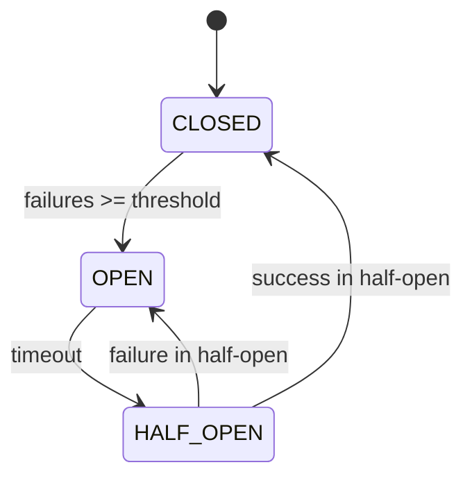

# How to Implement Circuit Breakers with Redis

Author: [nawazdhandala](https://www.github.com/nawazdhandala)

Tags: Redis, Circuit Breaker, Microservices, Fault Tolerance, Resilience, Distributed Systems

Description: A comprehensive guide to implementing distributed circuit breakers with Redis for fault tolerance and automatic recovery in microservices architectures.

---

Circuit breakers prevent cascading failures in distributed systems by stopping requests to failing services. Using Redis for circuit breaker state enables consistent behavior across multiple service instances.

## Why Distributed Circuit Breakers?

In microservices architectures, you need circuit breakers that:

- **Share state**: All instances see the same circuit state
- **Detect failures quickly**: Aggregate errors across instances
- **Recover automatically**: Transition from open to closed when service recovers
- **Provide visibility**: Monitor circuit states centrally

## Circuit Breaker States



## Basic Circuit Breaker Implementation

```python
import redis
import time
import json
from enum import Enum
from typing import Callable, Any, Optional
from dataclasses import dataclass
from functools import wraps
import logging

logger = logging.getLogger(__name__)

class CircuitState(Enum):
    CLOSED = "closed"
    OPEN = "open"
    HALF_OPEN = "half_open"

@dataclass
class CircuitConfig:
    failure_threshold: int = 5
    success_threshold: int = 3
    timeout: int = 30  # seconds
    half_open_max_calls: int = 3

class CircuitBreaker:
    def __init__(self, redis_client: redis.Redis, name: str,
                 config: Optional[CircuitConfig] = None):
        self.redis = redis_client
        self.name = name
        self.config = config or CircuitConfig()
        self._key_prefix = f"circuit:{name}"

    @property
    def _state_key(self) -> str:
        return f"{self._key_prefix}:state"

    @property
    def _failures_key(self) -> str:
        return f"{self._key_prefix}:failures"

    @property
    def _successes_key(self) -> str:
        return f"{self._key_prefix}:successes"

    @property
    def _last_failure_key(self) -> str:
        return f"{self._key_prefix}:last_failure"

    @property
    def _half_open_calls_key(self) -> str:
        return f"{self._key_prefix}:half_open_calls"

    def get_state(self) -> CircuitState:
        """Get current circuit state."""
        state = self.redis.get(self._state_key)
        if state:
            return CircuitState(state.decode())

        return CircuitState.CLOSED

    def _set_state(self, state: CircuitState):
        """Set circuit state."""
        self.redis.set(self._state_key, state.value)

        # Publish state change
        self.redis.publish(
            f"circuit:{self.name}:state_change",
            json.dumps({
                "circuit": self.name,
                "state": state.value,
                "timestamp": time.time()
            })
        )

        logger.info(f"Circuit {self.name} state changed to {state.value}")

    def record_success(self):
        """Record a successful call."""
        state = self.get_state()

        if state == CircuitState.HALF_OPEN:
            # Increment success count
            successes = self.redis.incr(self._successes_key)

            if successes >= self.config.success_threshold:
                # Enough successes, close the circuit
                self._close_circuit()
        elif state == CircuitState.CLOSED:
            # Reset failure count on success
            self.redis.set(self._failures_key, 0)

    def record_failure(self):
        """Record a failed call."""
        state = self.get_state()

        if state == CircuitState.HALF_OPEN:
            # Any failure in half-open reopens the circuit
            self._open_circuit()
        elif state == CircuitState.CLOSED:
            failures = self.redis.incr(self._failures_key)
            self.redis.set(self._last_failure_key, time.time())

            if failures >= self.config.failure_threshold:
                self._open_circuit()

    def _open_circuit(self):
        """Open the circuit."""
        pipe = self.redis.pipeline()
        pipe.set(self._state_key, CircuitState.OPEN.value)
        pipe.set(self._last_failure_key, time.time())
        pipe.delete(self._successes_key)
        pipe.delete(self._half_open_calls_key)
        pipe.execute()

        logger.warning(f"Circuit {self.name} opened")

    def _close_circuit(self):
        """Close the circuit."""
        pipe = self.redis.pipeline()
        pipe.set(self._state_key, CircuitState.CLOSED.value)
        pipe.set(self._failures_key, 0)
        pipe.delete(self._successes_key)
        pipe.delete(self._half_open_calls_key)
        pipe.execute()

        logger.info(f"Circuit {self.name} closed")

    def _try_half_open(self) -> bool:
        """Try to transition to half-open state."""
        last_failure = self.redis.get(self._last_failure_key)
        if not last_failure:
            return True

        last_failure_time = float(last_failure)
        if time.time() - last_failure_time >= self.config.timeout:
            # Timeout expired, try half-open
            current_state = self.get_state()
            if current_state == CircuitState.OPEN:
                self._set_state(CircuitState.HALF_OPEN)
                self.redis.set(self._half_open_calls_key, 0)
            return True

        return False

    def allow_request(self) -> bool:
        """Check if a request should be allowed."""
        state = self.get_state()

        if state == CircuitState.CLOSED:
            return True

        if state == CircuitState.OPEN:
            return self._try_half_open()

        if state == CircuitState.HALF_OPEN:
            # Limit concurrent calls in half-open
            calls = self.redis.incr(self._half_open_calls_key)
            return calls <= self.config.half_open_max_calls

        return False

    def call(self, func: Callable, *args, **kwargs) -> Any:
        """Execute function through circuit breaker."""
        if not self.allow_request():
            raise CircuitOpenError(f"Circuit {self.name} is open")

        try:
            result = func(*args, **kwargs)
            self.record_success()
            return result
        except Exception as e:
            self.record_failure()
            raise

    def __call__(self, func: Callable) -> Callable:
        """Decorator for circuit breaker."""
        @wraps(func)
        def wrapper(*args, **kwargs):
            return self.call(func, *args, **kwargs)
        return wrapper

class CircuitOpenError(Exception):
    """Raised when circuit is open."""
    pass

# Usage
r = redis.Redis()
circuit = CircuitBreaker(r, "user-service")

@circuit
def call_user_service(user_id: int):
    # Make API call
    response = requests.get(f"http://user-service/users/{user_id}")
    response.raise_for_status()
    return response.json()
```

## Circuit Breaker with Sliding Window

Use a sliding window for more accurate failure rate calculation:

```python
import redis
import time
import json
from typing import Optional
from dataclasses import dataclass
import logging

logger = logging.getLogger(__name__)

@dataclass
class SlidingWindowConfig:
    window_size: int = 60  # seconds
    failure_rate_threshold: float = 0.5  # 50%
    minimum_calls: int = 10
    timeout: int = 30
    half_open_calls: int = 3

class SlidingWindowCircuitBreaker:
    def __init__(self, redis_client: redis.Redis, name: str,
                 config: Optional[SlidingWindowConfig] = None):
        self.redis = redis_client
        self.name = name
        self.config = config or SlidingWindowConfig()
        self._prefix = f"circuit_sw:{name}"

    @property
    def _calls_key(self) -> str:
        return f"{self._prefix}:calls"

    @property
    def _state_key(self) -> str:
        return f"{self._prefix}:state"

    @property
    def _opened_at_key(self) -> str:
        return f"{self._prefix}:opened_at"

    def _record_call(self, success: bool):
        """Record a call outcome in the sliding window."""
        now = time.time()
        call_data = json.dumps({
            "success": success,
            "timestamp": now
        })

        pipe = self.redis.pipeline()

        # Add to sorted set with timestamp as score
        pipe.zadd(self._calls_key, {call_data: now})

        # Remove old entries outside window
        pipe.zremrangebyscore(
            self._calls_key,
            "-inf",
            now - self.config.window_size
        )

        pipe.execute()

    def _calculate_failure_rate(self) -> tuple:
        """Calculate failure rate from sliding window."""
        now = time.time()
        window_start = now - self.config.window_size

        # Get all calls in window
        calls = self.redis.zrangebyscore(self._calls_key, window_start, now)

        if not calls:
            return 0.0, 0

        total = len(calls)
        failures = sum(
            1 for call in calls
            if not json.loads(call)["success"]
        )

        failure_rate = failures / total if total > 0 else 0.0
        return failure_rate, total

    def get_state(self) -> CircuitState:
        """Get current circuit state."""
        state = self.redis.get(self._state_key)
        if state:
            return CircuitState(state.decode())
        return CircuitState.CLOSED

    def record_success(self):
        """Record successful call."""
        state = self.get_state()
        self._record_call(success=True)

        if state == CircuitState.HALF_OPEN:
            # Check if we can close
            failure_rate, total = self._calculate_failure_rate()
            if total >= self.config.half_open_calls and failure_rate == 0:
                self._close()

    def record_failure(self):
        """Record failed call."""
        state = self.get_state()
        self._record_call(success=False)

        if state == CircuitState.HALF_OPEN:
            self._open()
        elif state == CircuitState.CLOSED:
            failure_rate, total = self._calculate_failure_rate()

            if total >= self.config.minimum_calls:
                if failure_rate >= self.config.failure_rate_threshold:
                    self._open()

    def _open(self):
        """Open the circuit."""
        pipe = self.redis.pipeline()
        pipe.set(self._state_key, CircuitState.OPEN.value)
        pipe.set(self._opened_at_key, time.time())
        pipe.execute()

        logger.warning(f"Circuit {self.name} opened (sliding window)")

    def _close(self):
        """Close the circuit."""
        pipe = self.redis.pipeline()
        pipe.set(self._state_key, CircuitState.CLOSED.value)
        pipe.delete(self._opened_at_key)
        pipe.execute()

        logger.info(f"Circuit {self.name} closed")

    def _check_timeout(self) -> bool:
        """Check if timeout has expired."""
        opened_at = self.redis.get(self._opened_at_key)
        if not opened_at:
            return True

        return time.time() - float(opened_at) >= self.config.timeout

    def allow_request(self) -> bool:
        """Check if request should be allowed."""
        state = self.get_state()

        if state == CircuitState.CLOSED:
            return True

        if state == CircuitState.OPEN:
            if self._check_timeout():
                self.redis.set(self._state_key, CircuitState.HALF_OPEN.value)
                return True
            return False

        if state == CircuitState.HALF_OPEN:
            # Allow limited requests
            return True

        return False

    def get_metrics(self) -> dict:
        """Get circuit breaker metrics."""
        failure_rate, total_calls = self._calculate_failure_rate()
        state = self.get_state()

        return {
            "name": self.name,
            "state": state.value,
            "failure_rate": failure_rate,
            "total_calls": total_calls,
            "window_size": self.config.window_size
        }
```

## Circuit Breaker Registry

Manage multiple circuit breakers:

```python
import redis
import json
from typing import Dict, Optional, List
from dataclasses import dataclass
import logging

logger = logging.getLogger(__name__)

class CircuitBreakerRegistry:
    def __init__(self, redis_client: redis.Redis):
        self.redis = redis_client
        self._circuits: Dict[str, CircuitBreaker] = {}
        self._registry_key = "circuits:registry"

    def get_or_create(self, name: str,
                      config: Optional[CircuitConfig] = None) -> CircuitBreaker:
        """Get existing circuit breaker or create new one."""
        if name not in self._circuits:
            circuit = CircuitBreaker(self.redis, name, config)
            self._circuits[name] = circuit

            # Register in Redis
            self.redis.sadd(self._registry_key, name)

        return self._circuits[name]

    def get(self, name: str) -> Optional[CircuitBreaker]:
        """Get circuit breaker by name."""
        return self._circuits.get(name)

    def list_all(self) -> List[str]:
        """List all registered circuit breakers."""
        names = self.redis.smembers(self._registry_key)
        return [name.decode() for name in names]

    def get_all_states(self) -> Dict[str, str]:
        """Get states of all circuit breakers."""
        states = {}
        for name in self.list_all():
            circuit = self.get_or_create(name)
            states[name] = circuit.get_state().value
        return states

    def reset(self, name: str):
        """Reset a circuit breaker to closed state."""
        circuit = self.get_or_create(name)
        circuit._close_circuit()
        logger.info(f"Reset circuit breaker: {name}")

    def reset_all(self):
        """Reset all circuit breakers."""
        for name in self.list_all():
            self.reset(name)

# Global registry
def get_registry(redis_client: redis.Redis) -> CircuitBreakerRegistry:
    return CircuitBreakerRegistry(redis_client)
```

## Circuit Breaker with Fallback

Implement fallback behavior when circuit is open:

```python
import redis
from typing import Callable, Any, Optional, TypeVar
from functools import wraps
import logging

logger = logging.getLogger(__name__)

T = TypeVar('T')

class CircuitBreakerWithFallback:
    def __init__(self, redis_client: redis.Redis, name: str,
                 config: Optional[CircuitConfig] = None):
        self.circuit = CircuitBreaker(redis_client, name, config)
        self._fallbacks: Dict[str, Callable] = {}
        self._cache_key = f"circuit:{name}:cache"
        self.redis = redis_client

    def with_fallback(self, fallback: Callable[[], T]) -> 'CircuitBreakerWithFallback':
        """Configure fallback function."""
        self._fallback = fallback
        return self

    def with_cache_fallback(self, cache_ttl: int = 300) -> 'CircuitBreakerWithFallback':
        """Use cached result as fallback."""
        self._cache_ttl = cache_ttl
        self._use_cache_fallback = True
        return self

    def call(self, func: Callable[[], T], cache_key: Optional[str] = None) -> T:
        """Execute with circuit breaker and fallback."""
        try:
            if not self.circuit.allow_request():
                return self._execute_fallback(cache_key)

            result = func()
            self.circuit.record_success()

            # Cache successful result
            if cache_key and hasattr(self, '_use_cache_fallback'):
                self.redis.setex(
                    f"{self._cache_key}:{cache_key}",
                    self._cache_ttl,
                    json.dumps(result)
                )

            return result

        except CircuitOpenError:
            return self._execute_fallback(cache_key)

        except Exception as e:
            self.circuit.record_failure()
            return self._execute_fallback(cache_key, original_error=e)

    def _execute_fallback(self, cache_key: Optional[str] = None,
                          original_error: Optional[Exception] = None) -> T:
        """Execute fallback strategy."""
        # Try cache fallback first
        if cache_key and hasattr(self, '_use_cache_fallback'):
            cached = self.redis.get(f"{self._cache_key}:{cache_key}")
            if cached:
                logger.info(f"Using cached fallback for {self.circuit.name}")
                return json.loads(cached)

        # Try configured fallback
        if hasattr(self, '_fallback'):
            logger.info(f"Using fallback for {self.circuit.name}")
            return self._fallback()

        # No fallback available
        if original_error:
            raise original_error
        raise CircuitOpenError(f"Circuit {self.circuit.name} is open")

# Decorator version
def circuit_breaker_with_fallback(
    redis_client: redis.Redis,
    name: str,
    fallback: Optional[Callable] = None,
    config: Optional[CircuitConfig] = None
):
    """Decorator for circuit breaker with fallback."""
    circuit = CircuitBreaker(redis_client, name, config)

    def decorator(func: Callable) -> Callable:
        @wraps(func)
        def wrapper(*args, **kwargs):
            try:
                if not circuit.allow_request():
                    if fallback:
                        return fallback(*args, **kwargs)
                    raise CircuitOpenError(f"Circuit {name} is open")

                result = func(*args, **kwargs)
                circuit.record_success()
                return result

            except CircuitOpenError:
                raise

            except Exception as e:
                circuit.record_failure()
                if fallback:
                    return fallback(*args, **kwargs)
                raise

        return wrapper
    return decorator

# Usage
r = redis.Redis()

def get_user_fallback(user_id: int):
    return {"id": user_id, "name": "Unknown", "cached": True}

@circuit_breaker_with_fallback(
    r,
    "user-service",
    fallback=get_user_fallback
)
def get_user(user_id: int):
    response = requests.get(f"http://user-service/users/{user_id}")
    response.raise_for_status()
    return response.json()
```

## Monitoring Circuit Breakers

Create a monitoring dashboard endpoint:

```python
import redis
import json
from typing import Dict, List
from dataclasses import dataclass, asdict

@dataclass
class CircuitStats:
    name: str
    state: str
    failure_count: int
    success_count: int
    last_failure_time: Optional[float]
    last_state_change: Optional[float]

class CircuitMonitor:
    def __init__(self, redis_client: redis.Redis):
        self.redis = redis_client
        self.registry = CircuitBreakerRegistry(redis_client)

    def get_circuit_stats(self, name: str) -> CircuitStats:
        """Get detailed stats for a circuit breaker."""
        prefix = f"circuit:{name}"

        state = self.redis.get(f"{prefix}:state")
        failures = self.redis.get(f"{prefix}:failures")
        successes = self.redis.get(f"{prefix}:successes")
        last_failure = self.redis.get(f"{prefix}:last_failure")

        return CircuitStats(
            name=name,
            state=state.decode() if state else "closed",
            failure_count=int(failures) if failures else 0,
            success_count=int(successes) if successes else 0,
            last_failure_time=float(last_failure) if last_failure else None,
            last_state_change=None
        )

    def get_all_stats(self) -> List[CircuitStats]:
        """Get stats for all circuit breakers."""
        stats = []
        for name in self.registry.list_all():
            stats.append(self.get_circuit_stats(name))
        return stats

    def get_open_circuits(self) -> List[str]:
        """Get list of currently open circuits."""
        open_circuits = []
        for name in self.registry.list_all():
            circuit = self.registry.get_or_create(name)
            if circuit.get_state() == CircuitState.OPEN:
                open_circuits.append(name)
        return open_circuits

    def export_metrics(self) -> Dict:
        """Export metrics for Prometheus or similar."""
        metrics = {
            "circuits_total": 0,
            "circuits_open": 0,
            "circuits_closed": 0,
            "circuits_half_open": 0,
            "circuit_states": {}
        }

        for name in self.registry.list_all():
            circuit = self.registry.get_or_create(name)
            state = circuit.get_state()

            metrics["circuits_total"] += 1
            metrics["circuit_states"][name] = state.value

            if state == CircuitState.OPEN:
                metrics["circuits_open"] += 1
            elif state == CircuitState.CLOSED:
                metrics["circuits_closed"] += 1
            else:
                metrics["circuits_half_open"] += 1

        return metrics

# Flask endpoint example
from flask import Flask, jsonify

app = Flask(__name__)
redis_client = redis.Redis()
monitor = CircuitMonitor(redis_client)

@app.route('/circuits/health')
def circuits_health():
    """Health check for all circuits."""
    open_circuits = monitor.get_open_circuits()

    if open_circuits:
        return jsonify({
            "status": "degraded",
            "open_circuits": open_circuits
        }), 503

    return jsonify({"status": "healthy"})

@app.route('/circuits/stats')
def circuits_stats():
    """Get all circuit breaker stats."""
    stats = monitor.get_all_stats()
    return jsonify([asdict(s) for s in stats])

@app.route('/circuits/metrics')
def circuits_metrics():
    """Prometheus-compatible metrics."""
    return jsonify(monitor.export_metrics())
```

## Best Practices

1. **Share state across instances** - Use Redis for consistent circuit state
2. **Configure appropriate thresholds** - Based on service SLOs
3. **Implement fallbacks** - Graceful degradation when circuits open
4. **Monitor circuit states** - Alert when circuits open
5. **Use sliding windows** - More accurate failure rate calculation
6. **Test circuit behavior** - Verify open/close transitions
7. **Document circuit configurations** - Track thresholds per service

## Conclusion

Redis-based circuit breakers provide distributed fault tolerance for microservices architectures. The shared state ensures consistent behavior across service instances, and Redis's atomic operations make it safe for concurrent updates. Combine circuit breakers with fallbacks and proper monitoring for resilient systems that degrade gracefully under failure conditions.
