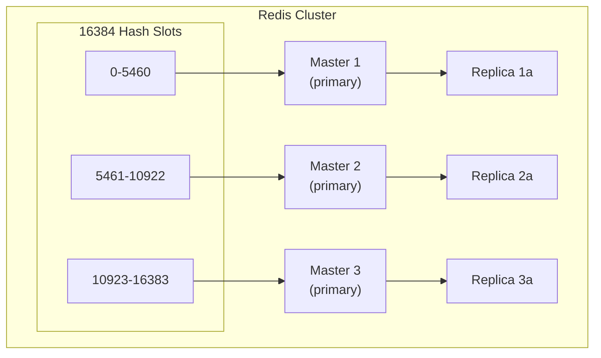

# How to Set Up Redis Cluster for Horizontal Scaling

Author: [nawazdhandala](https://www.github.com/nawazdhandala)

Tags: Redis, Cluster, Sharding, Horizontal Scaling, High Availability, DevOps, Production, Distributed Systems

Description: A comprehensive guide to setting up Redis Cluster for horizontal scaling. Learn about sharding, hash slots, cluster management, and client configuration for distributed Redis deployments.

---

> Redis Cluster provides automatic sharding across multiple Redis nodes, enabling horizontal scaling beyond single-node memory limits. With built-in replication and automatic failover, Redis Cluster offers both scalability and high availability.

Unlike Redis Sentinel (which provides HA for a single dataset), Redis Cluster distributes data across multiple masters, each handling a subset of the keyspace.

---

## Understanding Redis Cluster

### Architecture



### Hash Slots

Redis Cluster uses hash slots to distribute keys:

```
Total slots: 16384 (0 to 16383)
Key to slot: CRC16(key) mod 16384

Example:
- "user:1000" -> CRC16("user:1000") mod 16384 = 7186
- Key goes to node holding slots 5461-10922 (Master 2)
```

### Hash Tags for Multi-Key Operations

```bash
# Keys with same hash tag go to same slot
{user:1000}.profile    # All these keys
{user:1000}.orders     # go to the same
{user:1000}.cart       # hash slot

# Hash tag is content between first { and first }
```

---

## Setting Up Redis Cluster

### Prerequisites

Minimum cluster: 3 master nodes (6 nodes with replicas)

### Node Configuration

```bash
# /etc/redis/redis.conf for each node
port 7000  # Different port for each node (7000-7005)
bind 0.0.0.0
daemonize yes
pidfile /var/run/redis/redis-7000.pid
logfile /var/log/redis/redis-7000.log
dir /var/lib/redis/7000

# Cluster configuration
cluster-enabled yes
cluster-config-file nodes-7000.conf
cluster-node-timeout 5000

# Security
requirepass your-cluster-password
masterauth your-cluster-password

# Persistence
appendonly yes
appendfilename "appendonly-7000.aof"

# Memory
maxmemory 4gb
maxmemory-policy allkeys-lru
```

### Creating the Cluster

```bash
# Start all nodes
redis-server /etc/redis/redis-7000.conf
redis-server /etc/redis/redis-7001.conf
redis-server /etc/redis/redis-7002.conf
redis-server /etc/redis/redis-7003.conf
redis-server /etc/redis/redis-7004.conf
redis-server /etc/redis/redis-7005.conf

# Create cluster (3 masters, 3 replicas)
redis-cli --cluster create \
    127.0.0.1:7000 127.0.0.1:7001 127.0.0.1:7002 \
    127.0.0.1:7003 127.0.0.1:7004 127.0.0.1:7005 \
    --cluster-replicas 1 \
    -a your-cluster-password

# Verify cluster
redis-cli -c -p 7000 -a your-cluster-password cluster info
redis-cli -c -p 7000 -a your-cluster-password cluster nodes
```

---

## Docker Compose Setup

### docker-compose.yml

```yaml
version: '3.8'

services:
  redis-node-1:
    image: redis:7-alpine
    container_name: redis-node-1
    command: redis-server /etc/redis/redis.conf
    volumes:
      - ./redis-cluster.conf:/etc/redis/redis.conf
      - redis-data-1:/data
    environment:
      - REDIS_PORT=7000
    networks:
      redis-cluster:
        ipv4_address: 172.20.0.11
    ports:
      - "7000:7000"
      - "17000:17000"

  redis-node-2:
    image: redis:7-alpine
    container_name: redis-node-2
    command: redis-server /etc/redis/redis.conf
    volumes:
      - ./redis-cluster.conf:/etc/redis/redis.conf
      - redis-data-2:/data
    environment:
      - REDIS_PORT=7001
    networks:
      redis-cluster:
        ipv4_address: 172.20.0.12
    ports:
      - "7001:7001"
      - "17001:17001"

  redis-node-3:
    image: redis:7-alpine
    container_name: redis-node-3
    command: redis-server /etc/redis/redis.conf
    volumes:
      - ./redis-cluster.conf:/etc/redis/redis.conf
      - redis-data-3:/data
    environment:
      - REDIS_PORT=7002
    networks:
      redis-cluster:
        ipv4_address: 172.20.0.13
    ports:
      - "7002:7002"
      - "17002:17002"

  redis-node-4:
    image: redis:7-alpine
    container_name: redis-node-4
    command: redis-server /etc/redis/redis.conf
    volumes:
      - ./redis-cluster.conf:/etc/redis/redis.conf
      - redis-data-4:/data
    environment:
      - REDIS_PORT=7003
    networks:
      redis-cluster:
        ipv4_address: 172.20.0.14
    ports:
      - "7003:7003"
      - "17003:17003"

  redis-node-5:
    image: redis:7-alpine
    container_name: redis-node-5
    command: redis-server /etc/redis/redis.conf
    volumes:
      - ./redis-cluster.conf:/etc/redis/redis.conf
      - redis-data-5:/data
    environment:
      - REDIS_PORT=7004
    networks:
      redis-cluster:
        ipv4_address: 172.20.0.15
    ports:
      - "7004:7004"
      - "17004:17004"

  redis-node-6:
    image: redis:7-alpine
    container_name: redis-node-6
    command: redis-server /etc/redis/redis.conf
    volumes:
      - ./redis-cluster.conf:/etc/redis/redis.conf
      - redis-data-6:/data
    environment:
      - REDIS_PORT=7005
    networks:
      redis-cluster:
        ipv4_address: 172.20.0.16
    ports:
      - "7005:7005"
      - "17005:17005"

  redis-cluster-init:
    image: redis:7-alpine
    container_name: redis-cluster-init
    depends_on:
      - redis-node-1
      - redis-node-2
      - redis-node-3
      - redis-node-4
      - redis-node-5
      - redis-node-6
    command: >
      sh -c "sleep 5 && redis-cli --cluster create
      172.20.0.11:7000 172.20.0.12:7001 172.20.0.13:7002
      172.20.0.14:7003 172.20.0.15:7004 172.20.0.16:7005
      --cluster-replicas 1 --cluster-yes"
    networks:
      - redis-cluster

networks:
  redis-cluster:
    driver: bridge
    ipam:
      config:
        - subnet: 172.20.0.0/16

volumes:
  redis-data-1:
  redis-data-2:
  redis-data-3:
  redis-data-4:
  redis-data-5:
  redis-data-6:
```

### redis-cluster.conf

```bash
port 7000
bind 0.0.0.0
cluster-enabled yes
cluster-config-file nodes.conf
cluster-node-timeout 5000
appendonly yes
```

---

## Client Configuration

### Python with redis-py-cluster

```python
from redis.cluster import RedisCluster

# Connect to cluster
rc = RedisCluster(
    host='localhost',
    port=7000,
    password='your-cluster-password',
    decode_responses=True
)

# Basic operations
rc.set('key', 'value')
value = rc.get('key')

# Use hash tags for multi-key operations
rc.set('{user:1000}.name', 'John')
rc.set('{user:1000}.email', 'john@example.com')

# MGET works with hash tags
values = rc.mget('{user:1000}.name', '{user:1000}.email')

# Pipeline (must use hash tags for multiple keys)
pipe = rc.pipeline()
pipe.set('{order:123}.status', 'pending')
pipe.set('{order:123}.total', '99.99')
pipe.execute()
```

### Python with Connection Pool

```python
from redis.cluster import RedisCluster, ClusterNode

# Define startup nodes
startup_nodes = [
    ClusterNode('node1.example.com', 7000),
    ClusterNode('node2.example.com', 7001),
    ClusterNode('node3.example.com', 7002),
]

# Create cluster with connection pool
rc = RedisCluster(
    startup_nodes=startup_nodes,
    password='your-password',
    decode_responses=True,

    # Connection pool settings
    max_connections=50,

    # Retry settings
    retry_on_timeout=True,
    cluster_error_retry_attempts=3,

    # Read from replicas
    read_from_replicas=True
)

# Check cluster info
print(rc.cluster_info())
print(rc.cluster_slots())
```

### Node.js with ioredis

```javascript
const Redis = require('ioredis');

// Create cluster client
const cluster = new Redis.Cluster([
    { host: 'node1.example.com', port: 7000 },
    { host: 'node2.example.com', port: 7001 },
    { host: 'node3.example.com', port: 7002 }
], {
    redisOptions: {
        password: 'your-password'
    },

    // Scale reads to replicas
    scaleReads: 'slave',  // or 'all' to include masters

    // Retry strategy
    clusterRetryStrategy(times) {
        const delay = Math.min(100 * times, 3000);
        return delay;
    },

    // Natural key routing (use hash tags)
    enableReadyCheck: true,
    enableOfflineQueue: true
});

cluster.on('connect', () => console.log('Connected to cluster'));
cluster.on('error', (err) => console.error('Cluster error:', err));
cluster.on('+node', (node) => console.log('Node added:', node.options.host));
cluster.on('-node', (node) => console.log('Node removed:', node.options.host));

// Basic operations
await cluster.set('key', 'value');
const value = await cluster.get('key');

// Multi-key with hash tags
await cluster.mset('{user:1}.name', 'John', '{user:1}.age', '30');
const [name, age] = await cluster.mget('{user:1}.name', '{user:1}.age');

// Pipeline
const pipeline = cluster.pipeline();
pipeline.set('{order:1}.status', 'pending');
pipeline.set('{order:1}.total', 100);
pipeline.incr('{order:1}.items');
await pipeline.exec();
```

### Go with go-redis

```go
package main

import (
    "context"
    "fmt"
    "github.com/redis/go-redis/v9"
)

func main() {
    ctx := context.Background()

    // Create cluster client
    rdb := redis.NewClusterClient(&redis.ClusterOptions{
        Addrs: []string{
            "node1.example.com:7000",
            "node2.example.com:7001",
            "node3.example.com:7002",
        },
        Password: "your-password",

        // Pool settings
        PoolSize:     50,
        MinIdleConns: 10,

        // Read from replicas
        ReadOnly: true,
        RouteByLatency: true,  // Route to lowest latency node
        // RouteRandomly: true, // Or route randomly
    })

    // Basic operations
    err := rdb.Set(ctx, "key", "value", 0).Err()
    if err != nil {
        panic(err)
    }

    val, err := rdb.Get(ctx, "key").Result()
    if err != nil {
        panic(err)
    }
    fmt.Println(val)

    // Multi-key with hash tags
    pipe := rdb.Pipeline()
    pipe.Set(ctx, "{user:1}.name", "John", 0)
    pipe.Set(ctx, "{user:1}.email", "john@example.com", 0)
    _, err = pipe.Exec(ctx)

    // Get cluster info
    info := rdb.ClusterInfo(ctx)
    fmt.Println(info.Val())
}
```

---

## Cluster Operations

### Adding Nodes

```bash
# Add a new master node
redis-cli --cluster add-node \
    new-node:7006 existing-node:7000 \
    -a your-password

# Add a new replica
redis-cli --cluster add-node \
    new-node:7006 existing-node:7000 \
    --cluster-slave \
    --cluster-master-id <master-node-id> \
    -a your-password

# Reshard slots to new master
redis-cli --cluster reshard \
    existing-node:7000 \
    --cluster-from all \
    --cluster-to <new-master-id> \
    --cluster-slots 1000 \
    --cluster-yes \
    -a your-password
```

### Removing Nodes

```bash
# Reshard slots away from node first
redis-cli --cluster reshard \
    node-to-remove:7006 \
    --cluster-from <node-to-remove-id> \
    --cluster-to <destination-node-id> \
    --cluster-slots <all-slots> \
    --cluster-yes \
    -a your-password

# Remove the node
redis-cli --cluster del-node \
    existing-node:7000 \
    <node-to-remove-id> \
    -a your-password
```

### Resharding

```bash
# Interactive resharding
redis-cli --cluster reshard node:7000 -a your-password

# Automated resharding
redis-cli --cluster reshard node:7000 \
    --cluster-from <source-id> \
    --cluster-to <destination-id> \
    --cluster-slots 1000 \
    --cluster-yes \
    -a your-password

# Rebalance slots evenly
redis-cli --cluster rebalance node:7000 \
    --cluster-use-empty-masters \
    -a your-password
```

### Failover

```bash
# Manual failover (from replica)
redis-cli -p 7003 -a your-password CLUSTER FAILOVER

# Force failover (when master is down)
redis-cli -p 7003 -a your-password CLUSTER FAILOVER FORCE

# Takeover (ignore master, force immediate promotion)
redis-cli -p 7003 -a your-password CLUSTER FAILOVER TAKEOVER
```

---

## Monitoring

### Cluster Commands

```bash
# Cluster state
redis-cli -c -p 7000 -a password CLUSTER INFO

# Node list
redis-cli -c -p 7000 -a password CLUSTER NODES

# Slot mapping
redis-cli -c -p 7000 -a password CLUSTER SLOTS

# Key slot
redis-cli -c -p 7000 -a password CLUSTER KEYSLOT mykey

# Keys in slot
redis-cli -c -p 7000 -a password CLUSTER GETKEYSINSLOT 1000 10
```

### Monitoring Script

```python
import redis
from prometheus_client import Gauge, Counter, start_http_server
import time

# Metrics
cluster_state = Gauge('redis_cluster_state', 'Cluster state (1=ok, 0=fail)')
cluster_slots_assigned = Gauge('redis_cluster_slots_assigned', 'Assigned slots')
cluster_slots_ok = Gauge('redis_cluster_slots_ok', 'OK slots')
cluster_known_nodes = Gauge('redis_cluster_known_nodes', 'Known nodes')
cluster_size = Gauge('redis_cluster_size', 'Cluster size')
node_connected = Gauge('redis_cluster_node_connected', 'Node connected', ['node'])

def monitor_cluster():
    rc = redis.RedisCluster(
        host='localhost',
        port=7000,
        decode_responses=True
    )

    while True:
        try:
            info = rc.cluster_info()

            cluster_state.set(1 if info['cluster_state'] == 'ok' else 0)
            cluster_slots_assigned.set(info['cluster_slots_assigned'])
            cluster_slots_ok.set(info['cluster_slots_ok'])
            cluster_known_nodes.set(info['cluster_known_nodes'])
            cluster_size.set(info['cluster_size'])

            # Check individual nodes
            nodes = rc.cluster_nodes()
            for node_id, node_info in nodes.items():
                host_port = f"{node_info['host']}:{node_info['port']}"
                is_connected = 1 if 'fail' not in node_info['flags'] else 0
                node_connected.labels(node=host_port).set(is_connected)

        except Exception as e:
            print(f"Error: {e}")
            cluster_state.set(0)

        time.sleep(10)

if __name__ == '__main__':
    start_http_server(8000)
    monitor_cluster()
```

---

## Best Practices

### 1. Data Modeling with Hash Tags

```python
# Good: Related data in same slot
user_id = "1000"
rc.set(f"{{user:{user_id}}}.profile", profile_data)
rc.set(f"{{user:{user_id}}}.settings", settings_data)
rc.set(f"{{user:{user_id}}}.orders", orders_data)

# Can use MGET/MSET and transactions
rc.mget(
    f"{{user:{user_id}}}.profile",
    f"{{user:{user_id}}}.settings"
)

# Bad: Related data in different slots
rc.set(f"user:{user_id}:profile", profile_data)  # Different slot
rc.set(f"user:{user_id}:settings", settings_data)  # Different slot
```

### 2. Avoid Cross-Slot Operations

```python
# This will fail without hash tags
try:
    rc.mget('key1', 'key2', 'key3')  # CROSSSLOT error if different slots
except redis.exceptions.RedisClusterException:
    pass

# Solution 1: Hash tags
rc.mget('{app}.key1', '{app}.key2', '{app}.key3')

# Solution 2: Individual gets
keys = ['key1', 'key2', 'key3']
values = [rc.get(key) for key in keys]
```

### 3. Cluster Sizing

```bash
# Minimum production cluster
- 3 masters (for quorum)
- 3 replicas (one per master)
- Total: 6 nodes

# Recommended for high availability
- 3+ masters
- 2 replicas per master
- Total: 9+ nodes

# Memory planning
# Total cluster memory = sum of all master memory
# Each master should have similar memory allocation
```

---

## Troubleshooting

### Common Issues

```bash
# Check cluster health
redis-cli --cluster check node:7000 -a password

# Fix cluster (repair slot assignments)
redis-cli --cluster fix node:7000 -a password

# Fix with migration timeout
redis-cli --cluster fix node:7000 --cluster-fix-with-unreachable-masters -a password
```

### CROSSSLOT Errors

```python
# Error: CROSSSLOT Keys in request don't hash to the same slot

# Solution: Use hash tags
# Before:
rc.mset({'key1': 'val1', 'key2': 'val2'})  # Error

# After:
rc.mset({'{myapp}.key1': 'val1', '{myapp}.key2': 'val2'})  # Works
```

### MOVED/ASK Redirections

```python
# Clients handle this automatically, but you may see in logs:
# MOVED 1234 192.168.1.1:7001 - Key moved to different node
# ASK 1234 192.168.1.1:7001 - Slot being migrated

# Ensure client handles redirections
rc = RedisCluster(
    host='localhost',
    port=7000,
    cluster_error_retry_attempts=3  # Retry on redirect
)
```

---

## Conclusion

Redis Cluster enables horizontal scaling:

- **Automatic sharding**: Data distributed across masters
- **High availability**: Built-in replication and failover
- **Linear scalability**: Add nodes to increase capacity

Key takeaways:
- Use hash tags for multi-key operations
- Plan data model around slot distribution
- Minimum 6 nodes for production (3 masters + 3 replicas)
- Monitor cluster health continuously

---

*Need to monitor your Redis Cluster? [OneUptime](https://oneuptime.com) provides comprehensive cluster monitoring with slot distribution visualization, node health tracking, and automatic failover alerts.*
