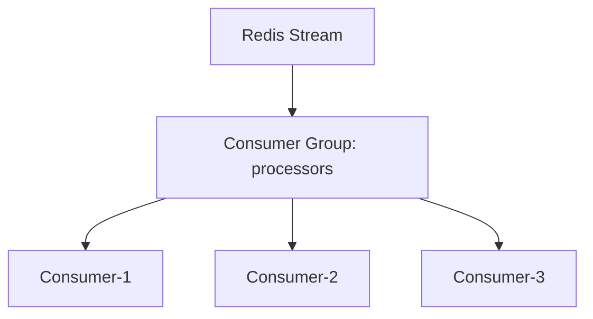

# How to Scale Event Consumers with Redis Consumer Groups

Author: [nawazdhandala](https://www.github.com/nawazdhandala)

Tags: Redis, Consumer Groups, Event Processing, Scaling, Load Balancing, Redis Streams, Parallel Processing

Description: A comprehensive guide to scaling event consumers with Redis Consumer Groups for parallel processing, load balancing, and fault-tolerant event consumption.

---

Redis Consumer Groups enable horizontal scaling of event consumers while ensuring each message is processed exactly once. This guide covers practical patterns for scaling event processing across multiple consumers.

## Why Consumer Groups?

Consumer Groups provide essential capabilities for scalable event processing:

- **Parallel processing**: Multiple consumers process different messages simultaneously
- **Load balancing**: Redis automatically distributes messages across consumers
- **Acknowledgment tracking**: Track which messages have been processed
- **Failure recovery**: Reassign messages from failed consumers
- **Exactly-once semantics**: Each message is delivered to only one consumer

## Consumer Group Architecture



## Basic Consumer Group Setup

```python
import redis
import json
import time
import uuid
import threading
from typing import Dict, Any, Callable, Optional, List
import logging

logger = logging.getLogger(__name__)

class ConsumerGroupManager:
    def __init__(self, redis_client: redis.Redis, stream_key: str,
                 group_name: str):
        self.redis = redis_client
        self.stream_key = stream_key
        self.group_name = group_name

    def create_group(self, start_id: str = "$"):
        """
        Create consumer group.
        start_id: '$' for new messages only, '0' for all messages
        """
        try:
            self.redis.xgroup_create(
                self.stream_key,
                self.group_name,
                id=start_id,
                mkstream=True
            )
            logger.info(f"Created consumer group: {self.group_name}")
        except redis.ResponseError as e:
            if "BUSYGROUP" in str(e):
                logger.debug(f"Consumer group already exists: {self.group_name}")
            else:
                raise

    def delete_group(self):
        """Delete consumer group."""
        self.redis.xgroup_destroy(self.stream_key, self.group_name)
        logger.info(f"Deleted consumer group: {self.group_name}")

    def get_group_info(self) -> Dict:
        """Get consumer group information."""
        groups = self.redis.xinfo_groups(self.stream_key)
        for group in groups:
            name = group.get("name")
            if isinstance(name, bytes):
                name = name.decode()
            if name == self.group_name:
                return {
                    "name": name,
                    "consumers": group.get("consumers", 0),
                    "pending": group.get("pending", 0),
                    "last_delivered_id": group.get("last-delivered-id")
                }
        return {}

    def get_consumers(self) -> List[Dict]:
        """Get list of consumers in the group."""
        consumers = self.redis.xinfo_consumers(
            self.stream_key,
            self.group_name
        )
        return [
            {
                "name": c.get("name").decode() if isinstance(c.get("name"), bytes) else c.get("name"),
                "pending": c.get("pending", 0),
                "idle": c.get("idle", 0)
            }
            for c in consumers
        ]

    def remove_consumer(self, consumer_name: str):
        """Remove a consumer from the group."""
        self.redis.xgroup_delconsumer(
            self.stream_key,
            self.group_name,
            consumer_name
        )
        logger.info(f"Removed consumer: {consumer_name}")

class GroupConsumer:
    def __init__(self, redis_client: redis.Redis, stream_key: str,
                 group_name: str, consumer_name: str = None):
        self.redis = redis_client
        self.stream_key = stream_key
        self.group_name = group_name
        self.consumer_name = consumer_name or f"consumer-{uuid.uuid4().hex[:8]}"
        self._running = False
        self._handler: Optional[Callable] = None

    def consume(self, handler: Callable[[str, Dict], None],
                batch_size: int = 10, block_ms: int = 5000):
        """Start consuming messages."""
        self._handler = handler
        self._running = True

        logger.info(f"Consumer {self.consumer_name} started")

        while self._running:
            try:
                # Read new messages
                messages = self.redis.xreadgroup(
                    self.group_name,
                    self.consumer_name,
                    {self.stream_key: ">"},
                    count=batch_size,
                    block=block_ms
                )

                if messages:
                    self._process_messages(messages)

            except redis.RedisError as e:
                logger.error(f"Redis error: {e}")
                time.sleep(1)

    def _process_messages(self, messages: List):
        """Process a batch of messages."""
        for stream, entries in messages:
            for message_id, data in entries:
                message_id_str = message_id.decode() if isinstance(message_id, bytes) else message_id

                decoded = {
                    k.decode() if isinstance(k, bytes) else k:
                    v.decode() if isinstance(v, bytes) else v
                    for k, v in data.items()
                }

                try:
                    self._handler(message_id_str, decoded)

                    # Acknowledge successful processing
                    self.redis.xack(
                        self.stream_key,
                        self.group_name,
                        message_id
                    )
                    logger.debug(f"Processed: {message_id_str}")

                except Exception as e:
                    logger.error(f"Error processing {message_id_str}: {e}")
                    # Message remains in pending list for retry

    def stop(self):
        """Stop the consumer."""
        self._running = False
        logger.info(f"Consumer {self.consumer_name} stopped")

# Usage
r = redis.Redis()

# Create group
manager = ConsumerGroupManager(r, "events:orders", "order-processors")
manager.create_group(start_id="0")  # Process all existing messages

# Start consumer
consumer = GroupConsumer(r, "events:orders", "order-processors")

def process_order(message_id: str, data: Dict):
    print(f"Processing {message_id}: {data}")

consumer.consume(process_order, batch_size=10)
```

## Scaling with Multiple Consumers

Run multiple consumers for parallel processing:

```python
import redis
import threading
import time
from typing import Dict, Callable
import logging

logger = logging.getLogger(__name__)

class ScalableConsumerPool:
    def __init__(self, redis_client: redis.Redis, stream_key: str,
                 group_name: str, num_consumers: int = 4):
        self.redis = redis_client
        self.stream_key = stream_key
        self.group_name = group_name
        self.num_consumers = num_consumers
        self._consumers: List[GroupConsumer] = []
        self._threads: List[threading.Thread] = []
        self._running = False

    def start(self, handler: Callable[[str, Dict], None]):
        """Start consumer pool."""
        # Ensure group exists
        manager = ConsumerGroupManager(
            self.redis, self.stream_key, self.group_name
        )
        manager.create_group()

        self._running = True

        for i in range(self.num_consumers):
            consumer = GroupConsumer(
                self.redis,
                self.stream_key,
                self.group_name,
                consumer_name=f"worker-{i}"
            )
            self._consumers.append(consumer)

            thread = threading.Thread(
                target=consumer.consume,
                args=(handler,)
            )
            thread.daemon = True
            thread.start()
            self._threads.append(thread)

        logger.info(f"Started {self.num_consumers} consumers")

    def stop(self):
        """Stop all consumers."""
        self._running = False
        for consumer in self._consumers:
            consumer.stop()

        for thread in self._threads:
            thread.join(timeout=5)

        logger.info("Consumer pool stopped")

    def scale(self, new_count: int, handler: Callable):
        """Scale consumer count up or down."""
        current = len(self._consumers)

        if new_count > current:
            # Scale up
            for i in range(current, new_count):
                consumer = GroupConsumer(
                    self.redis,
                    self.stream_key,
                    self.group_name,
                    consumer_name=f"worker-{i}"
                )
                self._consumers.append(consumer)

                thread = threading.Thread(
                    target=consumer.consume,
                    args=(handler,)
                )
                thread.daemon = True
                thread.start()
                self._threads.append(thread)

            logger.info(f"Scaled up to {new_count} consumers")

        elif new_count < current:
            # Scale down
            for i in range(current - 1, new_count - 1, -1):
                consumer = self._consumers.pop()
                consumer.stop()
                thread = self._threads.pop()

            logger.info(f"Scaled down to {new_count} consumers")

# Usage
pool = ScalableConsumerPool(
    redis.Redis(),
    "events:orders",
    "order-processors",
    num_consumers=4
)

def process_order(message_id: str, data: Dict):
    print(f"Worker processing {message_id}")
    time.sleep(0.1)  # Simulate work

pool.start(process_order)

# Scale up during peak hours
pool.scale(8, process_order)

# Scale down during off-peak
pool.scale(2, process_order)
```

## Handling Pending Messages

Recover and reprocess messages from failed consumers:

```python
import redis
import time
from typing import Dict, Any, List, Optional, Callable
import logging

logger = logging.getLogger(__name__)

class PendingMessageHandler:
    def __init__(self, redis_client: redis.Redis, stream_key: str,
                 group_name: str, consumer_name: str):
        self.redis = redis_client
        self.stream_key = stream_key
        self.group_name = group_name
        self.consumer_name = consumer_name

    def get_pending_messages(self, min_idle_time: int = 60000,
                             count: int = 100) -> List[Dict]:
        """Get pending messages that have been idle."""
        pending = self.redis.xpending_range(
            self.stream_key,
            self.group_name,
            min="-",
            max="+",
            count=count
        )

        idle_messages = []
        for entry in pending:
            message_id = entry.get("message_id")
            if isinstance(message_id, bytes):
                message_id = message_id.decode()

            idle_time = entry.get("time_since_delivered", 0)

            if idle_time >= min_idle_time:
                idle_messages.append({
                    "message_id": message_id,
                    "consumer": entry.get("consumer"),
                    "idle_time": idle_time,
                    "delivery_count": entry.get("times_delivered", 1)
                })

        return idle_messages

    def claim_pending_messages(self, min_idle_time: int = 60000,
                               count: int = 10) -> List[tuple]:
        """Claim and return pending messages."""
        pending = self.get_pending_messages(min_idle_time, count)

        if not pending:
            return []

        message_ids = [p["message_id"] for p in pending]

        # Claim messages
        claimed = self.redis.xclaim(
            self.stream_key,
            self.group_name,
            self.consumer_name,
            min_idle_time=min_idle_time,
            message_ids=message_ids
        )

        return claimed

    def process_pending(self, handler: Callable[[str, Dict], None],
                        min_idle_time: int = 60000,
                        max_retries: int = 3):
        """Process pending messages with retry limit."""
        pending = self.get_pending_messages(min_idle_time)

        for entry in pending:
            message_id = entry["message_id"]
            delivery_count = entry["delivery_count"]

            if delivery_count > max_retries:
                # Move to dead letter queue
                logger.warning(
                    f"Message {message_id} exceeded max retries, "
                    f"moving to DLQ"
                )
                self._move_to_dlq(message_id)
                continue

            # Claim and process
            claimed = self.redis.xclaim(
                self.stream_key,
                self.group_name,
                self.consumer_name,
                min_idle_time=min_idle_time,
                message_ids=[message_id]
            )

            for msg_id, data in claimed:
                msg_id_str = msg_id.decode() if isinstance(msg_id, bytes) else msg_id
                decoded = {
                    k.decode() if isinstance(k, bytes) else k:
                    v.decode() if isinstance(v, bytes) else v
                    for k, v in data.items()
                }

                try:
                    handler(msg_id_str, decoded)
                    self.redis.xack(
                        self.stream_key,
                        self.group_name,
                        msg_id
                    )
                    logger.info(f"Recovered message: {msg_id_str}")
                except Exception as e:
                    logger.error(f"Failed to recover {msg_id_str}: {e}")

    def _move_to_dlq(self, message_id: str):
        """Move message to dead letter queue."""
        # Get message data
        entries = self.redis.xrange(
            self.stream_key,
            min=message_id,
            max=message_id
        )

        if entries:
            _, data = entries[0]
            dlq_stream = f"{self.stream_key}:dlq"
            self.redis.xadd(dlq_stream, data, maxlen=10000)

        # Acknowledge to remove from pending
        self.redis.xack(self.stream_key, self.group_name, message_id)

class ResilientGroupConsumer(GroupConsumer):
    """Consumer with automatic pending message recovery."""

    def __init__(self, redis_client: redis.Redis, stream_key: str,
                 group_name: str, consumer_name: str = None,
                 recovery_interval: int = 30):
        super().__init__(redis_client, stream_key, group_name, consumer_name)
        self.recovery_interval = recovery_interval
        self.pending_handler = PendingMessageHandler(
            redis_client, stream_key, group_name, self.consumer_name
        )

    def consume(self, handler: Callable[[str, Dict], None],
                batch_size: int = 10, block_ms: int = 5000):
        """Start consuming with automatic recovery."""
        self._handler = handler
        self._running = True

        # Start recovery thread
        recovery_thread = threading.Thread(
            target=self._recovery_loop,
            args=(handler,)
        )
        recovery_thread.daemon = True
        recovery_thread.start()

        # Main consumption loop
        super().consume(handler, batch_size, block_ms)

    def _recovery_loop(self, handler: Callable):
        """Periodically recover pending messages."""
        while self._running:
            try:
                self.pending_handler.process_pending(
                    handler,
                    min_idle_time=60000,  # 1 minute
                    max_retries=3
                )
            except Exception as e:
                logger.error(f"Recovery error: {e}")

            time.sleep(self.recovery_interval)
```

## Auto-Scaling Based on Lag

Scale consumers based on processing lag:

```python
import redis
import time
import threading
from typing import Dict, Callable
import logging

logger = logging.getLogger(__name__)

class AutoScalingConsumerPool:
    def __init__(self, redis_client: redis.Redis, stream_key: str,
                 group_name: str, min_consumers: int = 1,
                 max_consumers: int = 10):
        self.redis = redis_client
        self.stream_key = stream_key
        self.group_name = group_name
        self.min_consumers = min_consumers
        self.max_consumers = max_consumers
        self.pool = ScalableConsumerPool(
            redis_client, stream_key, group_name, min_consumers
        )
        self._running = False
        self._handler: Callable = None

        # Scaling thresholds
        self.scale_up_lag = 1000  # Scale up if lag > 1000
        self.scale_down_lag = 100  # Scale down if lag < 100
        self.check_interval = 10  # Check every 10 seconds

    def start(self, handler: Callable[[str, Dict], None]):
        """Start with auto-scaling."""
        self._handler = handler
        self._running = True

        self.pool.start(handler)

        # Start auto-scaling thread
        scaling_thread = threading.Thread(target=self._auto_scale_loop)
        scaling_thread.daemon = True
        scaling_thread.start()

        logger.info("Auto-scaling consumer pool started")

    def stop(self):
        """Stop the pool."""
        self._running = False
        self.pool.stop()

    def _get_lag(self) -> int:
        """Get current processing lag."""
        # Get stream length
        stream_length = self.redis.xlen(self.stream_key)

        # Get last delivered ID
        groups = self.redis.xinfo_groups(self.stream_key)
        for group in groups:
            name = group.get("name")
            if isinstance(name, bytes):
                name = name.decode()
            if name == self.group_name:
                last_delivered = group.get("last-delivered-id")
                if last_delivered:
                    if isinstance(last_delivered, bytes):
                        last_delivered = last_delivered.decode()
                    # Count messages after last delivered
                    pending_count = self.redis.xlen(self.stream_key)
                    # This is approximate - for accurate count, use XRANGE
                    return max(0, stream_length - group.get("pending", 0))

        return stream_length

    def _auto_scale_loop(self):
        """Auto-scaling decision loop."""
        while self._running:
            try:
                current_consumers = len(self.pool._consumers)
                lag = self._get_lag()

                logger.debug(f"Current lag: {lag}, consumers: {current_consumers}")

                if lag > self.scale_up_lag and current_consumers < self.max_consumers:
                    # Scale up
                    new_count = min(
                        self.max_consumers,
                        current_consumers + max(1, current_consumers // 2)
                    )
                    self.pool.scale(new_count, self._handler)
                    logger.info(f"Scaled up to {new_count} consumers (lag: {lag})")

                elif lag < self.scale_down_lag and current_consumers > self.min_consumers:
                    # Scale down
                    new_count = max(
                        self.min_consumers,
                        current_consumers - 1
                    )
                    self.pool.scale(new_count, self._handler)
                    logger.info(f"Scaled down to {new_count} consumers (lag: {lag})")

            except Exception as e:
                logger.error(f"Auto-scaling error: {e}")

            time.sleep(self.check_interval)

# Usage
auto_pool = AutoScalingConsumerPool(
    redis.Redis(),
    "events:orders",
    "order-processors",
    min_consumers=2,
    max_consumers=10
)

def process_order(message_id: str, data: Dict):
    time.sleep(0.1)  # Simulate processing
    print(f"Processed: {message_id}")

auto_pool.start(process_order)
```

## Monitoring Consumer Groups

Track consumer group health:

```python
import redis
import time
from typing import Dict, List
from dataclasses import dataclass
import logging

logger = logging.getLogger(__name__)

@dataclass
class ConsumerGroupMetrics:
    group_name: str
    stream_length: int
    pending_messages: int
    consumer_count: int
    lag: int
    oldest_pending_age: float
    consumers: List[Dict]

class ConsumerGroupMonitor:
    def __init__(self, redis_client: redis.Redis, stream_key: str,
                 group_name: str):
        self.redis = redis_client
        self.stream_key = stream_key
        self.group_name = group_name

    def get_metrics(self) -> ConsumerGroupMetrics:
        """Get comprehensive consumer group metrics."""
        # Stream info
        stream_length = self.redis.xlen(self.stream_key)

        # Group info
        groups = self.redis.xinfo_groups(self.stream_key)
        group_info = None
        for group in groups:
            name = group.get("name")
            if isinstance(name, bytes):
                name = name.decode()
            if name == self.group_name:
                group_info = group
                break

        if not group_info:
            raise ValueError(f"Group {self.group_name} not found")

        # Consumers
        consumers = self.redis.xinfo_consumers(
            self.stream_key, self.group_name
        )
        consumer_list = [
            {
                "name": c.get("name").decode() if isinstance(c.get("name"), bytes) else c.get("name"),
                "pending": c.get("pending", 0),
                "idle_ms": c.get("idle", 0)
            }
            for c in consumers
        ]

        # Pending info
        pending = group_info.get("pending", 0)
        oldest_pending_age = 0

        if pending > 0:
            pending_entries = self.redis.xpending_range(
                self.stream_key,
                self.group_name,
                min="-",
                max="+",
                count=1
            )
            if pending_entries:
                oldest_pending_age = pending_entries[0].get(
                    "time_since_delivered", 0
                ) / 1000  # Convert to seconds

        # Calculate lag
        lag = stream_length - pending  # Approximate

        return ConsumerGroupMetrics(
            group_name=self.group_name,
            stream_length=stream_length,
            pending_messages=pending,
            consumer_count=len(consumer_list),
            lag=lag,
            oldest_pending_age=oldest_pending_age,
            consumers=consumer_list
        )

    def export_prometheus_metrics(self) -> str:
        """Export metrics in Prometheus format."""
        metrics = self.get_metrics()

        lines = [
            f'redis_stream_length{{stream="{self.stream_key}"}} {metrics.stream_length}',
            f'redis_consumer_group_pending{{group="{self.group_name}"}} {metrics.pending_messages}',
            f'redis_consumer_group_consumers{{group="{self.group_name}"}} {metrics.consumer_count}',
            f'redis_consumer_group_lag{{group="{self.group_name}"}} {metrics.lag}',
            f'redis_consumer_group_oldest_pending_seconds{{group="{self.group_name}"}} {metrics.oldest_pending_age}'
        ]

        for consumer in metrics.consumers:
            lines.append(
                f'redis_consumer_pending{{group="{self.group_name}",consumer="{consumer["name"]}"}} '
                f'{consumer["pending"]}'
            )
            lines.append(
                f'redis_consumer_idle_ms{{group="{self.group_name}",consumer="{consumer["name"]}"}} '
                f'{consumer["idle_ms"]}'
            )

        return '\n'.join(lines)

    def check_health(self) -> Dict:
        """Check consumer group health."""
        metrics = self.get_metrics()
        issues = []

        # Check for idle consumers
        for consumer in metrics.consumers:
            if consumer["idle_ms"] > 60000:  # Idle for > 1 minute
                issues.append(
                    f"Consumer {consumer['name']} idle for "
                    f"{consumer['idle_ms'] / 1000:.1f}s"
                )

        # Check for old pending messages
        if metrics.oldest_pending_age > 300:  # Older than 5 minutes
            issues.append(
                f"Oldest pending message is {metrics.oldest_pending_age:.1f}s old"
            )

        # Check lag
        if metrics.lag > 10000:
            issues.append(f"High lag: {metrics.lag} messages")

        return {
            "healthy": len(issues) == 0,
            "issues": issues,
            "metrics": metrics
        }

# Usage
monitor = ConsumerGroupMonitor(
    redis.Redis(),
    "events:orders",
    "order-processors"
)

# Get metrics
metrics = monitor.get_metrics()
print(f"Pending: {metrics.pending_messages}, Lag: {metrics.lag}")

# Export for Prometheus
print(monitor.export_prometheus_metrics())

# Health check
health = monitor.check_health()
if not health["healthy"]:
    for issue in health["issues"]:
        logger.warning(f"Consumer group issue: {issue}")
```

## Best Practices

1. **Use meaningful consumer names** - Helps with debugging and monitoring
2. **Implement graceful shutdown** - Process in-flight messages before stopping
3. **Handle pending messages** - Recover messages from failed consumers
4. **Monitor lag and latency** - Alert on processing delays
5. **Set appropriate batch sizes** - Balance throughput and latency
6. **Implement auto-scaling** - Scale based on workload
7. **Test failure scenarios** - Verify recovery mechanisms

## Conclusion

Redis Consumer Groups provide powerful primitives for building scalable event processing systems. The combination of automatic load balancing, acknowledgment tracking, and pending message recovery enables reliable horizontal scaling. Implement proper monitoring and auto-scaling to handle varying workloads effectively.
