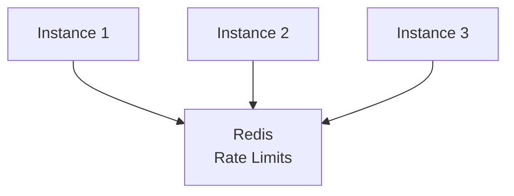

# How to Build a Distributed Rate Limiter with Redis

Author: [nawazdhandala](https://www.github.com/nawazdhandala)

Tags: Redis, Rate Limiting, Distributed Systems, API Gateway, Microservices, Scaling

Description: A comprehensive guide to building a distributed rate limiter with Redis for multi-instance deployments, including synchronization strategies, failover handling, and production-ready patterns.

---

Building a rate limiter for a single server is straightforward, but when your application runs across multiple instances, you need a centralized solution. Redis provides the perfect foundation for distributed rate limiting with its atomic operations and high performance. This guide covers building production-ready distributed rate limiters.

## Why Distributed Rate Limiting?

In a distributed system:

- Multiple application instances serve requests
- Each instance needs consistent rate limit state
- Local counters would allow limit bypass
- Redis provides shared state across all instances



## Atomic Rate Limiting with Lua Scripts

Use Lua scripts for atomic operations:

```python
import redis
import time
from typing import Tuple, Dict, Optional
import hashlib

class DistributedRateLimiter:
    """Distributed rate limiter using Redis Lua scripts."""

    def __init__(self, redis_url='redis://localhost:6379',
                 cluster_mode=False):
        if cluster_mode:
            from redis.cluster import RedisCluster
            self.redis = RedisCluster.from_url(redis_url, decode_responses=True)
        else:
            self.redis = redis.from_url(redis_url, decode_responses=True)

        # Sliding window Lua script
        self.sliding_window_script = """
        local key = KEYS[1]
        local limit = tonumber(ARGV[1])
        local window = tonumber(ARGV[2])
        local now = tonumber(ARGV[3])
        local clearBefore = now - window

        -- Remove old entries
        redis.call('ZREMRANGEBYSCORE', key, '-inf', clearBefore)

        -- Count current entries
        local count = redis.call('ZCARD', key)

        if count < limit then
            -- Add new entry
            redis.call('ZADD', key, now, now .. ':' .. math.random())
            redis.call('EXPIRE', key, window)
            return {1, limit - count - 1, 0}
        else
            -- Get oldest entry for retry-after
            local oldest = redis.call('ZRANGE', key, 0, 0, 'WITHSCORES')
            local retryAfter = 0
            if oldest[2] then
                retryAfter = math.ceil(oldest[2] + window - now)
            end
            return {0, 0, retryAfter}
        end
        """

        # Token bucket Lua script
        self.token_bucket_script = """
        local key = KEYS[1]
        local capacity = tonumber(ARGV[1])
        local rate = tonumber(ARGV[2])
        local now = tonumber(ARGV[3])
        local requested = tonumber(ARGV[4])

        local data = redis.call('HMGET', key, 'tokens', 'timestamp')
        local tokens = tonumber(data[1]) or capacity
        local timestamp = tonumber(data[2]) or now

        -- Calculate token refill
        local elapsed = math.max(0, now - timestamp)
        tokens = math.min(capacity, tokens + elapsed * rate)

        local allowed = 0
        local remaining = tokens

        if tokens >= requested then
            tokens = tokens - requested
            allowed = 1
            remaining = tokens
        end

        redis.call('HMSET', key, 'tokens', tokens, 'timestamp', now)
        redis.call('EXPIRE', key, math.ceil(capacity / rate) + 1)

        local retryAfter = 0
        if allowed == 0 then
            retryAfter = math.ceil((requested - tokens) / rate)
        end

        return {allowed, math.floor(remaining), retryAfter}
        """

        self.sliding_window = self.redis.register_script(self.sliding_window_script)
        self.token_bucket = self.redis.register_script(self.token_bucket_script)

    def check_sliding_window(self, key: str, limit: int,
                              window_seconds: int) -> Tuple[bool, Dict]:
        """Check rate limit using sliding window algorithm."""
        redis_key = f"ratelimit:sw:{key}"
        now = time.time()

        result = self.sliding_window(
            keys=[redis_key],
            args=[limit, window_seconds, now]
        )

        allowed = bool(result[0])
        remaining = int(result[1])
        retry_after = int(result[2])

        return allowed, {
            'limit': limit,
            'remaining': remaining,
            'reset': int(now + window_seconds),
            'retry_after': retry_after if not allowed else 0
        }

    def check_token_bucket(self, key: str, capacity: int,
                           rate: float, tokens: int = 1) -> Tuple[bool, Dict]:
        """Check rate limit using token bucket algorithm."""
        redis_key = f"ratelimit:tb:{key}"
        now = time.time()

        result = self.token_bucket(
            keys=[redis_key],
            args=[capacity, rate, now, tokens]
        )

        allowed = bool(result[0])
        remaining = int(result[1])
        retry_after = int(result[2])

        return allowed, {
            'limit': capacity,
            'remaining': remaining,
            'rate': rate,
            'retry_after': retry_after if not allowed else 0
        }


class MultiKeyRateLimiter:
    """Rate limiter with multiple keys (e.g., user + IP + API key)."""

    def __init__(self, redis_url='redis://localhost:6379'):
        self.limiter = DistributedRateLimiter(redis_url)

    def check_multiple(self, keys: Dict[str, Dict]) -> Tuple[bool, Dict]:
        """
        Check multiple rate limit keys.

        Args:
            keys: Dict of key -> {limit, window} pairs

        Returns:
            (allowed, info) where info contains per-key results
        """
        results = {}
        all_allowed = True
        min_remaining = float('inf')
        min_retry = 0

        for key, config in keys.items():
            allowed, info = self.limiter.check_sliding_window(
                key,
                config['limit'],
                config['window']
            )
            results[key] = info

            if not allowed:
                all_allowed = False
                min_retry = max(min_retry, info.get('retry_after', 0))

            min_remaining = min(min_remaining, info['remaining'])

        return all_allowed, {
            'allowed': all_allowed,
            'remaining': int(min_remaining),
            'retry_after': min_retry,
            'details': results
        }


# FastAPI middleware example
from fastapi import FastAPI, Request, HTTPException
from fastapi.responses import JSONResponse
import asyncio

class RateLimitMiddleware:
    """FastAPI middleware for distributed rate limiting."""

    def __init__(self, app: FastAPI, limiter: DistributedRateLimiter,
                 limit: int = 100, window: int = 60):
        self.app = app
        self.limiter = limiter
        self.limit = limit
        self.window = window

    async def __call__(self, request: Request, call_next):
        # Extract rate limit key
        key = self._get_key(request)

        # Check rate limit (run in thread pool for sync Redis)
        loop = asyncio.get_event_loop()
        allowed, info = await loop.run_in_executor(
            None,
            lambda: self.limiter.check_sliding_window(key, self.limit, self.window)
        )

        # Add headers to response
        if allowed:
            response = await call_next(request)
        else:
            response = JSONResponse(
                status_code=429,
                content={
                    'error': 'Too Many Requests',
                    'retry_after': info['retry_after']
                }
            )

        response.headers['X-RateLimit-Limit'] = str(info['limit'])
        response.headers['X-RateLimit-Remaining'] = str(info['remaining'])
        response.headers['X-RateLimit-Reset'] = str(info['reset'])

        if not allowed:
            response.headers['Retry-After'] = str(info['retry_after'])

        return response

    def _get_key(self, request: Request) -> str:
        """Extract rate limit key from request."""
        # Try API key first
        api_key = request.headers.get('X-API-Key')
        if api_key:
            return f"api:{api_key}"

        # Fall back to IP
        forwarded = request.headers.get('X-Forwarded-For')
        if forwarded:
            ip = forwarded.split(',')[0].strip()
        else:
            ip = request.client.host

        return f"ip:{ip}"
```

## Node.js Distributed Rate Limiter

```javascript
const Redis = require('ioredis');
const crypto = require('crypto');

class DistributedRateLimiter {
    constructor(options = {}) {
        this.redis = new Redis(options.redisUrl || 'redis://localhost:6379');

        // Sliding window script
        this.slidingWindowScript = `
        local key = KEYS[1]
        local limit = tonumber(ARGV[1])
        local window = tonumber(ARGV[2])
        local now = tonumber(ARGV[3])
        local clearBefore = now - window

        redis.call('ZREMRANGEBYSCORE', key, '-inf', clearBefore)
        local count = redis.call('ZCARD', key)

        if count < limit then
            redis.call('ZADD', key, now, now .. ':' .. math.random())
            redis.call('EXPIRE', key, window)
            return {1, limit - count - 1, 0}
        else
            local oldest = redis.call('ZRANGE', key, 0, 0, 'WITHSCORES')
            local retryAfter = 0
            if oldest[2] then
                retryAfter = math.ceil(oldest[2] + window - now)
            end
            return {0, 0, retryAfter}
        end
        `;

        // Token bucket script
        this.tokenBucketScript = `
        local key = KEYS[1]
        local capacity = tonumber(ARGV[1])
        local rate = tonumber(ARGV[2])
        local now = tonumber(ARGV[3])
        local requested = tonumber(ARGV[4])

        local data = redis.call('HMGET', key, 'tokens', 'timestamp')
        local tokens = tonumber(data[1]) or capacity
        local timestamp = tonumber(data[2]) or now

        local elapsed = math.max(0, now - timestamp)
        tokens = math.min(capacity, tokens + elapsed * rate)

        local allowed = 0
        local remaining = tokens

        if tokens >= requested then
            tokens = tokens - requested
            allowed = 1
            remaining = tokens
        end

        redis.call('HMSET', key, 'tokens', tokens, 'timestamp', now)
        redis.call('EXPIRE', key, math.ceil(capacity / rate) + 1)

        local retryAfter = 0
        if allowed == 0 then
            retryAfter = math.ceil((requested - tokens) / rate)
        end

        return {allowed, math.floor(remaining), retryAfter}
        `;
    }

    async checkSlidingWindow(key, limit, windowSeconds) {
        const redisKey = `ratelimit:sw:${key}`;
        const now = Date.now() / 1000;

        const result = await this.redis.eval(
            this.slidingWindowScript,
            1,
            redisKey,
            limit,
            windowSeconds,
            now
        );

        return {
            allowed: result[0] === 1,
            limit,
            remaining: result[1],
            reset: Math.floor(now + windowSeconds),
            retryAfter: result[2]
        };
    }

    async checkTokenBucket(key, capacity, rate, tokens = 1) {
        const redisKey = `ratelimit:tb:${key}`;
        const now = Date.now() / 1000;

        const result = await this.redis.eval(
            this.tokenBucketScript,
            1,
            redisKey,
            capacity,
            rate,
            now,
            tokens
        );

        return {
            allowed: result[0] === 1,
            limit: capacity,
            remaining: result[1],
            rate,
            retryAfter: result[2]
        };
    }

    async close() {
        await this.redis.quit();
    }
}

// Express middleware
function createRateLimitMiddleware(limiter, options = {}) {
    const { limit = 100, window = 60, keyExtractor } = options;

    return async (req, res, next) => {
        const key = keyExtractor ? keyExtractor(req) : getDefaultKey(req);

        try {
            const result = await limiter.checkSlidingWindow(key, limit, window);

            res.set({
                'X-RateLimit-Limit': result.limit,
                'X-RateLimit-Remaining': result.remaining,
                'X-RateLimit-Reset': result.reset
            });

            if (!result.allowed) {
                res.set('Retry-After', result.retryAfter);
                return res.status(429).json({
                    error: 'Too Many Requests',
                    retryAfter: result.retryAfter
                });
            }

            next();
        } catch (error) {
            console.error('Rate limit error:', error);
            // Fail open or closed based on preference
            next();
        }
    };
}

function getDefaultKey(req) {
    const apiKey = req.headers['x-api-key'];
    if (apiKey) return `api:${apiKey}`;

    const forwarded = req.headers['x-forwarded-for'];
    const ip = forwarded ? forwarded.split(',')[0].trim() : req.ip;
    return `ip:${ip}`;
}

// Usage
const express = require('express');
const app = express();

const limiter = new DistributedRateLimiter();

// Global rate limit
app.use(createRateLimitMiddleware(limiter, {
    limit: 100,
    window: 60
}));

// Per-endpoint rate limit
app.post('/api/expensive', createRateLimitMiddleware(limiter, {
    limit: 10,
    window: 60,
    keyExtractor: (req) => `expensive:${getDefaultKey(req)}`
}), (req, res) => {
    res.json({ success: true });
});
```

## Redis Cluster Support

For high availability, use Redis Cluster with hash tags:

```python
class ClusterAwareRateLimiter:
    """Rate limiter compatible with Redis Cluster."""

    def __init__(self, redis_urls: list):
        from redis.cluster import RedisCluster
        self.redis = RedisCluster(startup_nodes=[
            {'host': url.split(':')[0], 'port': int(url.split(':')[1])}
            for url in redis_urls
        ], decode_responses=True)

    def get_key(self, base_key: str) -> str:
        """Generate cluster-compatible key with hash tag."""
        # Use hash tag to ensure related keys go to same slot
        # This allows Lua scripts to work across multiple keys
        return f"ratelimit:{{{base_key}}}"

    def check_limit(self, user_id: str, limit: int, window: int) -> Tuple[bool, Dict]:
        # Keys with same hash tag go to same slot
        key = self.get_key(user_id)
        # ... rest of implementation
```

## Graceful Degradation

Handle Redis failures gracefully:

```python
import logging
from contextlib import contextmanager

logger = logging.getLogger(__name__)

class ResilientRateLimiter:
    """Rate limiter with graceful degradation."""

    def __init__(self, redis_url='redis://localhost:6379',
                 fail_open=True, fallback_limit=10):
        self.redis = redis.from_url(redis_url, decode_responses=True)
        self.fail_open = fail_open
        self.fallback_limit = fallback_limit
        self.local_counts = {}  # In-memory fallback

    @contextmanager
    def redis_operation(self):
        """Context manager for Redis operations with fallback."""
        try:
            yield self.redis
        except redis.RedisError as e:
            logger.error(f"Redis error: {e}")
            raise

    def check_limit(self, key: str, limit: int, window: int) -> Tuple[bool, Dict]:
        """Check rate limit with fallback."""
        try:
            with self.redis_operation():
                return self._check_redis(key, limit, window)
        except redis.RedisError:
            return self._check_fallback(key)

    def _check_redis(self, key: str, limit: int, window: int) -> Tuple[bool, Dict]:
        """Normal Redis-based check."""
        # ... implementation
        pass

    def _check_fallback(self, key: str) -> Tuple[bool, Dict]:
        """In-memory fallback when Redis is unavailable."""
        now = time.time()

        # Clean old entries
        self.local_counts = {
            k: v for k, v in self.local_counts.items()
            if now - v['timestamp'] < 60
        }

        # Check local limit
        if key not in self.local_counts:
            self.local_counts[key] = {'count': 0, 'timestamp': now}

        entry = self.local_counts[key]

        if self.fail_open:
            # Allow with reduced limit
            if entry['count'] < self.fallback_limit:
                entry['count'] += 1
                return True, {
                    'limit': self.fallback_limit,
                    'remaining': self.fallback_limit - entry['count'],
                    'degraded': True
                }
            return False, {
                'limit': self.fallback_limit,
                'remaining': 0,
                'degraded': True
            }
        else:
            # Fail closed - deny all
            return False, {
                'limit': 0,
                'remaining': 0,
                'degraded': True,
                'error': 'Rate limiter unavailable'
            }
```

## Monitoring and Metrics

```python
from prometheus_client import Counter, Histogram, Gauge

# Metrics
rate_limit_checks = Counter(
    'rate_limit_checks_total',
    'Total rate limit checks',
    ['key_type', 'result']
)

rate_limit_latency = Histogram(
    'rate_limit_check_duration_seconds',
    'Rate limit check latency'
)

rate_limit_remaining = Gauge(
    'rate_limit_remaining',
    'Remaining requests in current window',
    ['key']
)

class InstrumentedRateLimiter:
    """Rate limiter with Prometheus metrics."""

    def __init__(self, limiter: DistributedRateLimiter):
        self.limiter = limiter

    def check_limit(self, key: str, limit: int, window: int) -> Tuple[bool, Dict]:
        key_type = key.split(':')[0] if ':' in key else 'unknown'

        with rate_limit_latency.time():
            allowed, info = self.limiter.check_sliding_window(key, limit, window)

        result = 'allowed' if allowed else 'denied'
        rate_limit_checks.labels(key_type=key_type, result=result).inc()
        rate_limit_remaining.labels(key=key).set(info['remaining'])

        return allowed, info
```

## Best Practices

1. **Use Lua scripts**: Ensure atomicity across all operations

2. **Handle Redis failures**: Implement fallback strategies

3. **Monitor hit rates**: Track rate limit effectiveness

4. **Use appropriate keys**: Include enough context for debugging

5. **Set reasonable limits**: Balance protection with user experience

6. **Implement headers**: Return standard rate limit headers

7. **Consider burst handling**: Token bucket allows controlled bursts

8. **Test under load**: Verify behavior with concurrent requests

## Conclusion

A distributed rate limiter with Redis enables consistent rate limiting across multiple application instances. By using atomic Lua scripts, proper key design, and graceful degradation, you can build a reliable rate limiting system that protects your services while maintaining high availability. The combination of Redis's performance and atomic operations makes it ideal for this critical infrastructure component.
