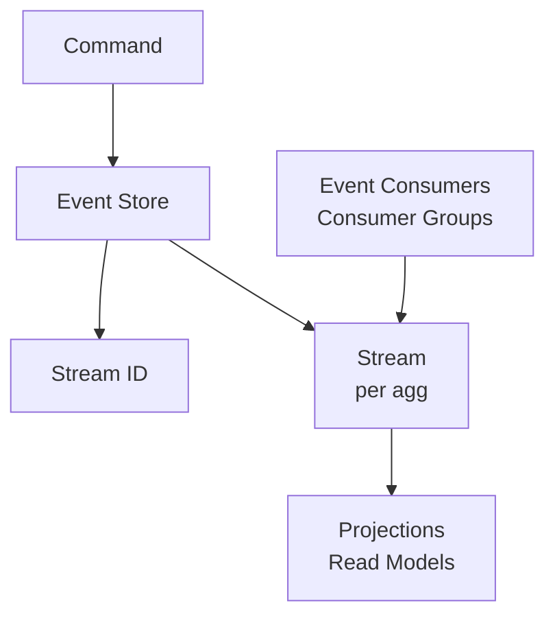

# How to Build an Event Store with Redis Streams

Author: [nawazdhandala](https://www.github.com/nawazdhandala)

Tags: Redis, Event Store, Redis Streams, Event Sourcing, CQRS, Distributed Systems

Description: A comprehensive guide to building an event store with Redis Streams for event sourcing and CQRS patterns, including event persistence, replay, and aggregate reconstruction.

---

An event store is the foundation of event sourcing architectures, recording all state changes as immutable events. Redis Streams provide excellent primitives for building high-performance event stores with features like automatic IDs, consumer groups, and range queries.

## Why Redis Streams for Event Stores?

Redis Streams offer unique advantages:

- **Immutable append-only log**: Perfect for event sourcing semantics
- **Automatic ordering**: Guaranteed event sequence with auto-generated IDs
- **Consumer groups**: Reliable event processing with acknowledgments
- **Range queries**: Efficient event replay from any point
- **High performance**: Sub-millisecond writes and reads

## Event Store Architecture



## Basic Event Store Implementation

```python
import redis
import json
import time
import uuid
from typing import Dict, Any, List, Optional, Type
from dataclasses import dataclass, asdict, field
from abc import ABC, abstractmethod
import logging

logger = logging.getLogger(__name__)

@dataclass
class Event:
    """Base event class."""
    event_id: str
    event_type: str
    aggregate_id: str
    aggregate_type: str
    timestamp: float
    version: int
    data: Dict[str, Any]
    metadata: Dict[str, Any] = field(default_factory=dict)

    def to_dict(self) -> Dict[str, Any]:
        return asdict(self)

    @classmethod
    def from_dict(cls, data: Dict[str, Any]) -> 'Event':
        return cls(**data)

class EventStore:
    def __init__(self, redis_client: redis.Redis, namespace: str = "events"):
        self.redis = redis_client
        self.namespace = namespace

    def _stream_key(self, aggregate_type: str, aggregate_id: str) -> str:
        """Stream per aggregate instance."""
        return f"{self.namespace}:{aggregate_type}:{aggregate_id}"

    def _global_stream_key(self) -> str:
        """Global stream for all events."""
        return f"{self.namespace}:all"

    def _version_key(self, aggregate_type: str, aggregate_id: str) -> str:
        """Version tracking key."""
        return f"{self.namespace}:version:{aggregate_type}:{aggregate_id}"

    def append(self, events: List[Event],
               expected_version: Optional[int] = None) -> List[str]:
        """
        Append events to the store with optimistic concurrency.
        Returns list of stream IDs for appended events.
        """
        if not events:
            return []

        # All events should be for same aggregate
        aggregate_type = events[0].aggregate_type
        aggregate_id = events[0].aggregate_id

        stream_key = self._stream_key(aggregate_type, aggregate_id)
        version_key = self._version_key(aggregate_type, aggregate_id)
        global_stream = self._global_stream_key()

        # Optimistic concurrency check
        if expected_version is not None:
            current_version = self.redis.get(version_key)
            current_version = int(current_version) if current_version else 0

            if current_version != expected_version:
                raise ConcurrencyError(
                    f"Expected version {expected_version}, "
                    f"but found {current_version}"
                )

        stream_ids = []
        pipe = self.redis.pipeline(True)

        try:
            # Watch version key for optimistic locking
            if expected_version is not None:
                pipe.watch(version_key)
                pipe.multi()

            for event in events:
                event_data = {
                    "event_id": event.event_id,
                    "event_type": event.event_type,
                    "aggregate_id": event.aggregate_id,
                    "aggregate_type": event.aggregate_type,
                    "version": str(event.version),
                    "timestamp": str(event.timestamp),
                    "data": json.dumps(event.data),
                    "metadata": json.dumps(event.metadata)
                }

                # Append to aggregate stream
                pipe.xadd(stream_key, event_data)

                # Append to global stream
                pipe.xadd(global_stream, {
                    **event_data,
                    "stream_key": stream_key
                }, maxlen=1000000)

            # Update version
            new_version = events[-1].version
            pipe.set(version_key, new_version)

            results = pipe.execute()

            # Extract stream IDs from results
            for i in range(0, len(events) * 2, 2):
                stream_id = results[i]
                if isinstance(stream_id, bytes):
                    stream_id = stream_id.decode()
                stream_ids.append(stream_id)

            logger.debug(
                f"Appended {len(events)} events to {aggregate_type}:{aggregate_id}"
            )

            return stream_ids

        except redis.WatchError:
            raise ConcurrencyError("Concurrent modification detected")

    def load(self, aggregate_type: str, aggregate_id: str,
             from_version: int = 0) -> List[Event]:
        """Load events for an aggregate."""
        stream_key = self._stream_key(aggregate_type, aggregate_id)

        # Read all entries from stream
        entries = self.redis.xrange(stream_key, "-", "+")

        events = []
        for stream_id, data in entries:
            event = self._decode_event(stream_id, data)

            if event.version > from_version:
                events.append(event)

        return events

    def load_range(self, aggregate_type: str, aggregate_id: str,
                   from_version: int, to_version: int) -> List[Event]:
        """Load events within version range."""
        all_events = self.load(aggregate_type, aggregate_id, from_version - 1)
        return [e for e in all_events if e.version <= to_version]

    def _decode_event(self, stream_id: bytes, data: Dict) -> Event:
        """Decode event from Redis data."""
        if isinstance(stream_id, bytes):
            stream_id = stream_id.decode()

        decoded = {
            k.decode() if isinstance(k, bytes) else k:
            v.decode() if isinstance(v, bytes) else v
            for k, v in data.items()
        }

        return Event(
            event_id=decoded["event_id"],
            event_type=decoded["event_type"],
            aggregate_id=decoded["aggregate_id"],
            aggregate_type=decoded["aggregate_type"],
            version=int(decoded["version"]),
            timestamp=float(decoded["timestamp"]),
            data=json.loads(decoded["data"]),
            metadata=json.loads(decoded["metadata"])
        )

    def get_current_version(self, aggregate_type: str,
                            aggregate_id: str) -> int:
        """Get current version of an aggregate."""
        version_key = self._version_key(aggregate_type, aggregate_id)
        version = self.redis.get(version_key)
        return int(version) if version else 0

    def exists(self, aggregate_type: str, aggregate_id: str) -> bool:
        """Check if aggregate exists."""
        stream_key = self._stream_key(aggregate_type, aggregate_id)
        return self.redis.exists(stream_key) > 0

class ConcurrencyError(Exception):
    """Raised when concurrent modification is detected."""
    pass
```

## Aggregate Base Class

```python
from abc import ABC, abstractmethod
from typing import List, Dict, Any

class Aggregate(ABC):
    """Base class for event-sourced aggregates."""

    def __init__(self, aggregate_id: str):
        self.id = aggregate_id
        self.version = 0
        self._uncommitted_events: List[Event] = []

    @property
    @abstractmethod
    def aggregate_type(self) -> str:
        """Return the aggregate type name."""
        pass

    @abstractmethod
    def apply(self, event: Event):
        """Apply an event to update aggregate state."""
        pass

    def load_from_history(self, events: List[Event]):
        """Rebuild state from event history."""
        for event in events:
            self.apply(event)
            self.version = event.version

    def raise_event(self, event_type: str, data: Dict[str, Any],
                    metadata: Dict[str, Any] = None):
        """Raise a new event."""
        self.version += 1

        event = Event(
            event_id=str(uuid.uuid4()),
            event_type=event_type,
            aggregate_id=self.id,
            aggregate_type=self.aggregate_type,
            timestamp=time.time(),
            version=self.version,
            data=data,
            metadata=metadata or {}
        )

        self.apply(event)
        self._uncommitted_events.append(event)

    def get_uncommitted_events(self) -> List[Event]:
        """Get events that haven't been committed."""
        return self._uncommitted_events.copy()

    def clear_uncommitted_events(self):
        """Clear uncommitted events after save."""
        self._uncommitted_events.clear()

# Example: Order Aggregate
class OrderAggregate(Aggregate):
    @property
    def aggregate_type(self) -> str:
        return "Order"

    def __init__(self, order_id: str):
        super().__init__(order_id)
        self.status = None
        self.items: List[Dict] = []
        self.total = 0.0
        self.customer_id = None

    def apply(self, event: Event):
        if event.event_type == "OrderCreated":
            self.customer_id = event.data["customer_id"]
            self.items = event.data["items"]
            self.total = event.data["total"]
            self.status = "created"

        elif event.event_type == "OrderConfirmed":
            self.status = "confirmed"

        elif event.event_type == "OrderShipped":
            self.status = "shipped"
            self.tracking_number = event.data.get("tracking_number")

        elif event.event_type == "OrderCancelled":
            self.status = "cancelled"
            self.cancellation_reason = event.data.get("reason")

    # Command handlers
    def create(self, customer_id: str, items: List[Dict]):
        if self.status is not None:
            raise ValueError("Order already exists")

        total = sum(item["price"] * item["quantity"] for item in items)

        self.raise_event("OrderCreated", {
            "customer_id": customer_id,
            "items": items,
            "total": total
        })

    def confirm(self):
        if self.status != "created":
            raise ValueError(f"Cannot confirm order in status: {self.status}")

        self.raise_event("OrderConfirmed", {})

    def ship(self, tracking_number: str):
        if self.status != "confirmed":
            raise ValueError(f"Cannot ship order in status: {self.status}")

        self.raise_event("OrderShipped", {
            "tracking_number": tracking_number
        })

    def cancel(self, reason: str):
        if self.status in ("shipped", "cancelled"):
            raise ValueError(f"Cannot cancel order in status: {self.status}")

        self.raise_event("OrderCancelled", {
            "reason": reason
        })
```

## Repository Pattern

```python
from typing import TypeVar, Generic, Type, Optional

T = TypeVar('T', bound=Aggregate)

class Repository(Generic[T]):
    """Generic repository for aggregates."""

    def __init__(self, event_store: EventStore, aggregate_class: Type[T]):
        self.event_store = event_store
        self.aggregate_class = aggregate_class

    def get(self, aggregate_id: str) -> Optional[T]:
        """Load aggregate from event store."""
        # Create new instance
        aggregate = self.aggregate_class(aggregate_id)

        # Load events
        events = self.event_store.load(
            aggregate.aggregate_type,
            aggregate_id
        )

        if not events:
            return None

        # Replay events
        aggregate.load_from_history(events)

        return aggregate

    def save(self, aggregate: T):
        """Save aggregate changes to event store."""
        events = aggregate.get_uncommitted_events()

        if not events:
            return

        expected_version = aggregate.version - len(events)

        self.event_store.append(events, expected_version)
        aggregate.clear_uncommitted_events()

    def exists(self, aggregate_id: str) -> bool:
        """Check if aggregate exists."""
        aggregate = self.aggregate_class(aggregate_id)
        return self.event_store.exists(
            aggregate.aggregate_type,
            aggregate_id
        )

# Usage
r = redis.Redis()
event_store = EventStore(r)
order_repo = Repository(event_store, OrderAggregate)

# Create order
order = OrderAggregate(str(uuid.uuid4()))
order.create(
    customer_id="cust_123",
    items=[
        {"product_id": "prod_1", "price": 29.99, "quantity": 2},
        {"product_id": "prod_2", "price": 49.99, "quantity": 1}
    ]
)
order_repo.save(order)

# Load and update
order = order_repo.get(order.id)
order.confirm()
order_repo.save(order)
```

## Event Subscriptions

```python
import threading
from typing import Callable, Dict, List

class EventSubscription:
    """Subscribe to events from the event store."""

    def __init__(self, redis_client: redis.Redis, event_store: EventStore):
        self.redis = redis_client
        self.event_store = event_store
        self._handlers: Dict[str, List[Callable]] = {}
        self._running = False
        self._consumer_group = "projections"

    def subscribe(self, event_type: str, handler: Callable[[Event], None]):
        """Subscribe to an event type."""
        if event_type not in self._handlers:
            self._handlers[event_type] = []
        self._handlers[event_type].append(handler)

    def subscribe_all(self, handler: Callable[[Event], None]):
        """Subscribe to all events."""
        if "*" not in self._handlers:
            self._handlers["*"] = []
        self._handlers["*"].append(handler)

    def start(self, from_beginning: bool = False):
        """Start processing events."""
        global_stream = self.event_store._global_stream_key()

        # Create consumer group
        try:
            start_id = "0" if from_beginning else "$"
            self.redis.xgroup_create(
                global_stream,
                self._consumer_group,
                id=start_id,
                mkstream=True
            )
        except redis.ResponseError:
            pass  # Group exists

        self._running = True
        thread = threading.Thread(target=self._process_loop)
        thread.daemon = True
        thread.start()
        logger.info("Event subscription started")

    def stop(self):
        """Stop processing events."""
        self._running = False

    def _process_loop(self):
        """Main processing loop."""
        global_stream = self.event_store._global_stream_key()
        consumer_name = f"consumer-{uuid.uuid4().hex[:8]}"

        while self._running:
            try:
                messages = self.redis.xreadgroup(
                    self._consumer_group,
                    consumer_name,
                    {global_stream: ">"},
                    count=100,
                    block=5000
                )

                if not messages:
                    continue

                for stream, entries in messages:
                    for message_id, data in entries:
                        event = self.event_store._decode_event(message_id, data)
                        self._dispatch_event(event)
                        self.redis.xack(
                            global_stream,
                            self._consumer_group,
                            message_id
                        )

            except redis.RedisError as e:
                logger.error(f"Redis error: {e}")
                time.sleep(1)

    def _dispatch_event(self, event: Event):
        """Dispatch event to handlers."""
        # Specific handlers
        handlers = self._handlers.get(event.event_type, [])
        for handler in handlers:
            try:
                handler(event)
            except Exception as e:
                logger.error(f"Handler error for {event.event_type}: {e}")

        # Wildcard handlers
        wildcard_handlers = self._handlers.get("*", [])
        for handler in wildcard_handlers:
            try:
                handler(event)
            except Exception as e:
                logger.error(f"Wildcard handler error: {e}")

# Usage - Build projections
subscription = EventSubscription(r, event_store)

def update_order_summary(event: Event):
    """Update order summary projection."""
    # Update read model in Redis or other database
    pass

def send_order_notification(event: Event):
    """Send notification on order events."""
    pass

subscription.subscribe("OrderCreated", update_order_summary)
subscription.subscribe("OrderCreated", send_order_notification)
subscription.subscribe("OrderConfirmed", update_order_summary)
subscription.start()
```

## Snapshots for Performance

```python
class SnapshotStore:
    """Store aggregate snapshots for faster loading."""

    def __init__(self, redis_client: redis.Redis, snapshot_frequency: int = 100):
        self.redis = redis_client
        self.snapshot_frequency = snapshot_frequency
        self._prefix = "snapshots"

    def _snapshot_key(self, aggregate_type: str, aggregate_id: str) -> str:
        return f"{self._prefix}:{aggregate_type}:{aggregate_id}"

    def should_snapshot(self, version: int) -> bool:
        """Check if snapshot should be taken."""
        return version > 0 and version % self.snapshot_frequency == 0

    def save_snapshot(self, aggregate: Aggregate):
        """Save aggregate snapshot."""
        key = self._snapshot_key(aggregate.aggregate_type, aggregate.id)

        snapshot_data = {
            "aggregate_id": aggregate.id,
            "aggregate_type": aggregate.aggregate_type,
            "version": aggregate.version,
            "state": json.dumps(aggregate.__dict__, default=str),
            "timestamp": time.time()
        }

        self.redis.set(key, json.dumps(snapshot_data))
        logger.debug(f"Saved snapshot for {aggregate.aggregate_type}:{aggregate.id}")

    def load_snapshot(self, aggregate_type: str,
                      aggregate_id: str) -> Optional[Dict]:
        """Load latest snapshot."""
        key = self._snapshot_key(aggregate_type, aggregate_id)
        data = self.redis.get(key)

        if data:
            return json.loads(data)
        return None

class SnapshotRepository(Repository[T]):
    """Repository with snapshot support."""

    def __init__(self, event_store: EventStore, aggregate_class: Type[T],
                 snapshot_store: SnapshotStore):
        super().__init__(event_store, aggregate_class)
        self.snapshot_store = snapshot_store

    def get(self, aggregate_id: str) -> Optional[T]:
        """Load aggregate with snapshot optimization."""
        aggregate = self.aggregate_class(aggregate_id)

        # Try to load snapshot
        snapshot = self.snapshot_store.load_snapshot(
            aggregate.aggregate_type,
            aggregate_id
        )

        from_version = 0
        if snapshot:
            # Restore from snapshot
            state = json.loads(snapshot["state"])
            aggregate.__dict__.update(state)
            from_version = snapshot["version"]
            aggregate.version = from_version

        # Load events since snapshot
        events = self.event_store.load(
            aggregate.aggregate_type,
            aggregate_id,
            from_version
        )

        if not events and from_version == 0:
            return None

        # Apply events
        for event in events:
            aggregate.apply(event)
            aggregate.version = event.version

        return aggregate

    def save(self, aggregate: T):
        """Save with automatic snapshotting."""
        super().save(aggregate)

        # Check if snapshot needed
        if self.snapshot_store.should_snapshot(aggregate.version):
            self.snapshot_store.save_snapshot(aggregate)
```

## Best Practices

1. **Use optimistic concurrency** - Prevent lost updates with version checking
2. **Stream per aggregate** - Enables efficient loading and partitioning
3. **Global stream for projections** - Single stream for all event consumers
4. **Implement snapshots** - For aggregates with many events
5. **Use consumer groups** - For reliable event processing
6. **Keep events small** - Store minimal data needed to reconstruct state
7. **Version events** - Plan for schema evolution

## Conclusion

Redis Streams provide an excellent foundation for building event stores. The combination of append-only semantics, automatic ordering, and consumer groups makes it ideal for event sourcing and CQRS architectures. Use optimistic concurrency for consistency, snapshots for performance, and consumer groups for reliable projection building.
